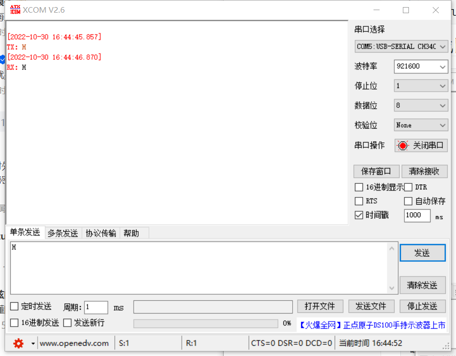

> 因为上次做的板子是将FPGA和一块MCU芯片集成在一块的，他们之间就需要通信，当然最容易实现的就是UART串口通信；
> 下面的代码是一个Demo代码，实现的功能是，RX接收到什么，TX就发送相同的数据；
> FPGA芯片
> AG1280Q48
> 时钟频率
> 48MHZ
> 波特率
> 921600
> RX引脚
> PIN_16
> TX引脚
> PIN_14
> LED引脚
> PIN_48
> 时钟输入引脚
> PIN_15
> 复位引脚
> PIN_17

具体代码如下：

## 顶层模块

```verilog
module connect_mcu (input clk,
                    input rst_n,
                    input wire uart_rx,
                    output wire uart_tx,
                    output wire led);

    wire clk_pll_o; //PLL时钟

    inpll pll_inst (
    .clkin(clk),		// PLL.clkin MUST connect to PIN_XX_GB
    .clkfb(clk_pll_o),
    .pllen(1'b1),
    .resetn(rst_n),
    .clkout0en(1'b1),
    .clkout1en(1'b0),
    .clkout2en(1'b0),
    .clkout3en(1'b0),
    .clkout0(clk_pll_o),
    .clkout1(),
    .clkout2(),
    .clkout3(),
    .lock()
    );

    parameter  SYSTERM_CLK = 26'd48_000_000;               //系统时钟频率
    parameter  UART_BPS    = 20'd921600;                   //串口波特率

    wire       flag;
    wire [7:0] data;
    // assign led = data[0];

    uart_receive
    #(
    .SYSTERM_CLK   (SYSTERM_CLK),
    .UART_BPS      (UART_BPS)
    )

    u_uart_receive(
    .clk          (clk_pll_o),
    .rst_n        (rst_n),
    .uart_rx      (uart_rx),
    .receive_done (flag),
    .uart_data    (data)
    );

    uart_send
    #(
    .SYSTERM_CLK   (SYSTERM_CLK),
    .UART_BPS      (UART_BPS)
    )

    u_uart_send(
    .clk          (clk_pll_o),
    .rst_n        (rst_n),
    .uart_in_data (data),
    .uart_in_flag (flag),
    .uart_tx      (uart_tx)
    );

    reg [1:0] led_counter;
    assign led = led_counter[0];

    // parameter SEC_TIME = 32'd48_000_000;//48M
    reg	[31:0] cnt;

    always @ (posedge clk_pll_o or negedge rst_n)begin
        if (rst_n == 0)
            cnt = 4'd1)) begin
            reg_data


