> AG1280是一款国产的CPLD芯片，我准备将这个芯片和MCU配合起来，来做一些定制化的接口和功能，例如扩展UART接口，外接一些高速的AD/DA芯片；

### 芯片资源：

AG1280资源：

LUTs
1280

Distributed RAM (Kbits)
10

EBR SRAM (Kbits)
68

Maximum User I/O pins
40

Number of PLLs
1

Package
48-Pin QFN

价格很便宜，每颗单价大概是7元；

我画了一个评估板，除了这颗CPLD芯片外，还加了一颗STM32F103C6T6芯片，他们之间有六个IO口互相连接来进行通信或者时钟输入；

STM32F103C6T6资源：

封装 / 箱体
LQFP-48

核心
ARM Cortex M3

程序存储器大小
32 kB

数据总线宽度
32 bit

ADC分辨率
12 bit

最大时钟频率
72 MHz

输入/输出端数量
48 I/O

数据 RAM 大小
10 kB

### 评估板设计：

板子原理图如下：

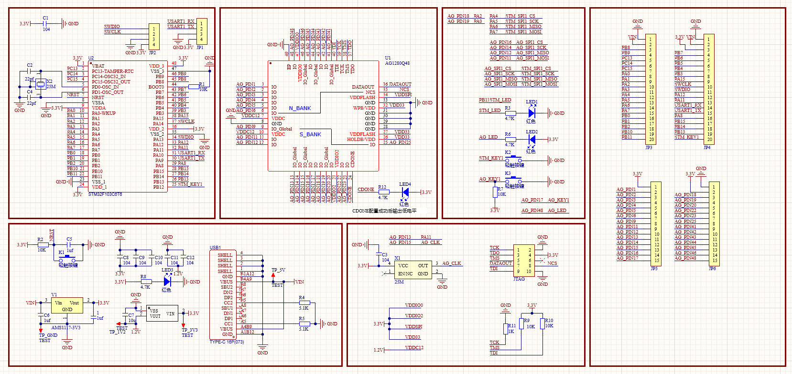

PCB视图如下：
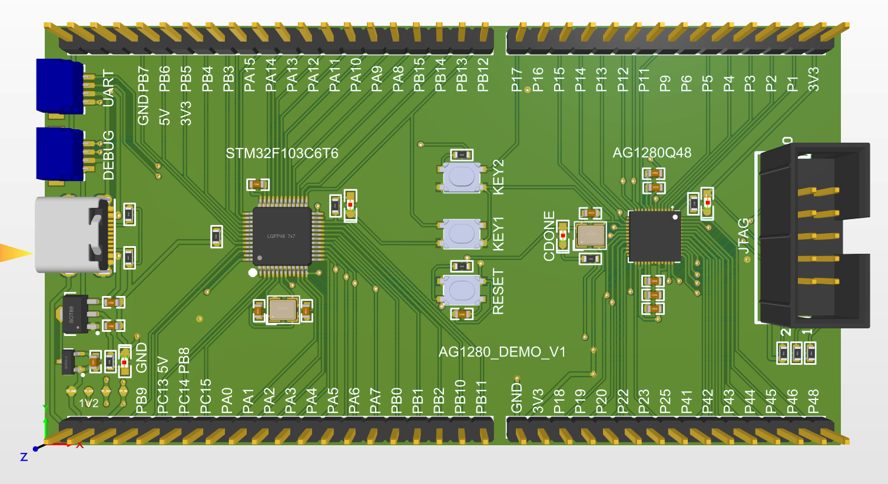

### 硬件设计注意：

AG1280硬件设计中有几个需要特别注意的点：

1、IO_GLOBE_S1(位于第9脚)、IO_GLOBE_S2(位于第13脚)、IO_GLOBE_S3(位于第15脚)、IO_GLOBE_S4(位于第19脚)、IO_GLOBE_N1(位于第41脚) 、IO_GLOBE_N2(位于第44脚) 、IO_GLOBE_N3(位于第46脚)可以作为全局时钟输入管脚，可用于输入全局时钟。**但若要使用PLL，则只能从13、15和19管脚输入。**

2、电路板载一个24MHz有源晶振，另外还可以通过PMOD接口从STM32的MCO时钟输出管脚获得时钟，它们被连接到具有PLL输入功能的管脚13、15上。

3、AG1280的GPIO分为North和South两组，可以使用不同IO电平，以实现不同电平逻辑的转换。另外AG1280还需要3.3V电源作为片上Flash电源，且该电源域North组的IO电源共用，因此**North组也只能使用3.3V的IO电源电压。South组却可以任选电源电压**。

4、**AG1280还需要1.2V内核电源电压，且该电源应略迟于Flash电源上电，以方便Flash加载程序**。我的图2电路通过PMOD接口从STM32开发板获得3.3V电源，再用LDO芯片XC6206P122MR从3.3V向下稳压到1.2V内核电源，LDO后带有100uF电容,1.2V上电时间自然要落后于3.3V上电。

板子已经发出去打样了，估计今天就能到，我到时候焊接测试下；

### 软件：

#### 环境配置：

AG1280的开发EDA软件Supera还不具备分析和综合电路的能力，但能实现其特有的PLL和片上RAM的IP核打包、综合后的布局布线、下载文件打包及下载等功能。

到百度网盘[http://pan.baidu.com/s/1eQxc6XG](http://pan.baidu.com/s/1eQxc6XG) 提取密码:q59e下载AGM公司EDA开发软件Supra（网盘上有多个版本的Supra，选择需要的一种即可）。Supra无需安装，下载后将其放置在不含中文的路径下，直接运行Bin目录下的Supra.exe即可。

目前版本的Supra还无法进行硬件描述语言及原理框图的开发和电路综合，用户只能在Supra下创建工程并完成AGM公司特有IP（包括PLL和RAM）的配置，再通过Supra创建Quartus-II工程文件，在转到Quartus-II下完成硬件描述语言和原理框图开发和电路综合，最后再回到Supra中完成器件内部的布局布线、下载文件的打包和器件烧写（具体流程在后续会详细介绍）。

综上，进行AG1280的开发一定需要安装一个顺手的Quartus-II。这里特别提醒网友注意，**Supra只支持Quartus-II 13.0以上，且不支持Web与Lite版本，必须安装Full或Standard版本（本人掉到过坑里，因此特别提醒大家注意）。**至于Quartus-II的安装方法，网上资料较多，这里不再赘述。

AG1280可以使用Intel的USB-Blaster进行下载和软件调试，但淘宝网上USB-Blaster版本较多，价格差异较大。据网传，有的版本USB-Blaster不支持AG1280的Flash下载，大家可自行注意避坑。

#### 开发流程：

具体操作参考：[https://www.cnblogs.com/helesheng/p/16692320.html](https://www.cnblogs.com/helesheng/p/16692320.html)

##### 在 Supra 中新建工程

运行 Supra，选择 File - Project - New Project：

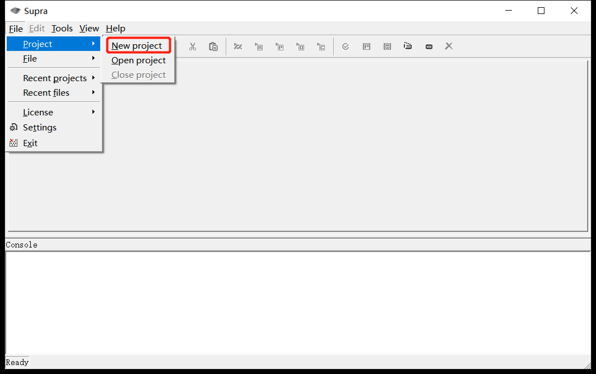

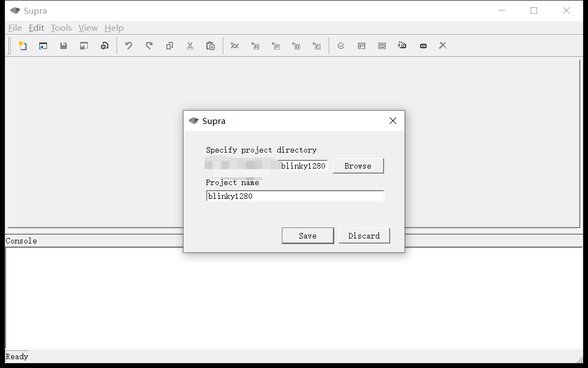

新建一个叫做 blinky1280 的工程，按图填写好工程目录和工程名称，点击 Save。

##### 在 Supra 中使用 PLL

由于我们需要使用内部的 PLL，所以需要先创建 IP。
在 Supra 中创建 IP 的步骤如下，选择 Tools - Create IP - Create PLL :

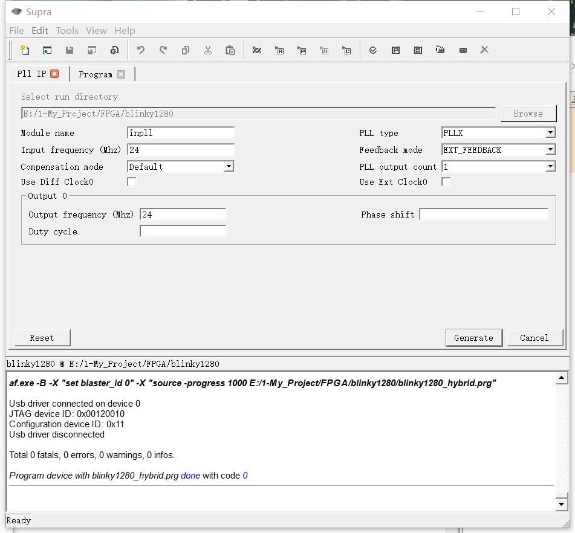

分别配置模块名称、输入频率、PLL类型、反馈模式、输出时钟路数、输出频率后，单击Generate按钮产生IP和顶层封装HDL文件（模块名称.v和模块名称.ip）。

> 其中值得注意的是：AG1280有两种时钟源模式：片内RC振荡器模式和片外有源振荡器模式。可以在反馈模式（Feedback mode）选项中选择EXT_FEEDBACK，以选择外部有源振荡器模式；选择NO_REFERENCE，以选择片上RC振荡器模式。片上RC振荡器振荡频率不会太准确，供不需要精确定时的系统使用。若选择片上振荡器则应在输入频率（Input frequency）处输入8MHz，否则真实输出频率将与你输入的频率成比例变化。
>   另外，Supra中AG1280的PLL配置中的PLL类型（PLL type），只能选择PLLX。而输出路数（PLL output count），相位移动（Phase shift）等配置参照字面意思理解即可。

下面会打印出实际的频率：

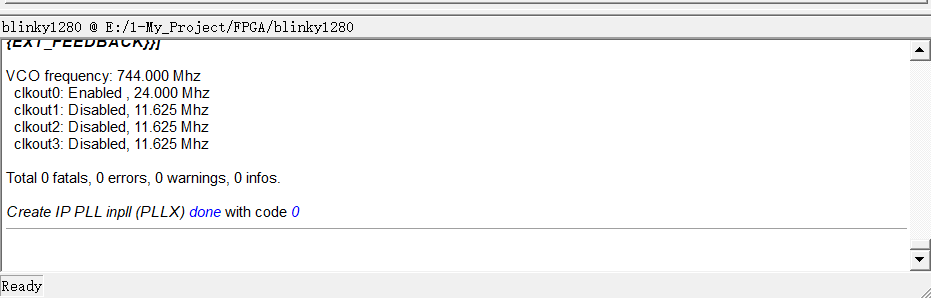

然后在工程目录下会生成 inpll.ip 和 inpll.v 两个文件，前者需要在编译时在 Supra 中引入，后者则是点灯代码中需要例化的 PLL 模块原型。

##### 建立 Quartus II 工程并完成逻辑综合

点击 Tools - Migrate，按照图中填写工程细节：

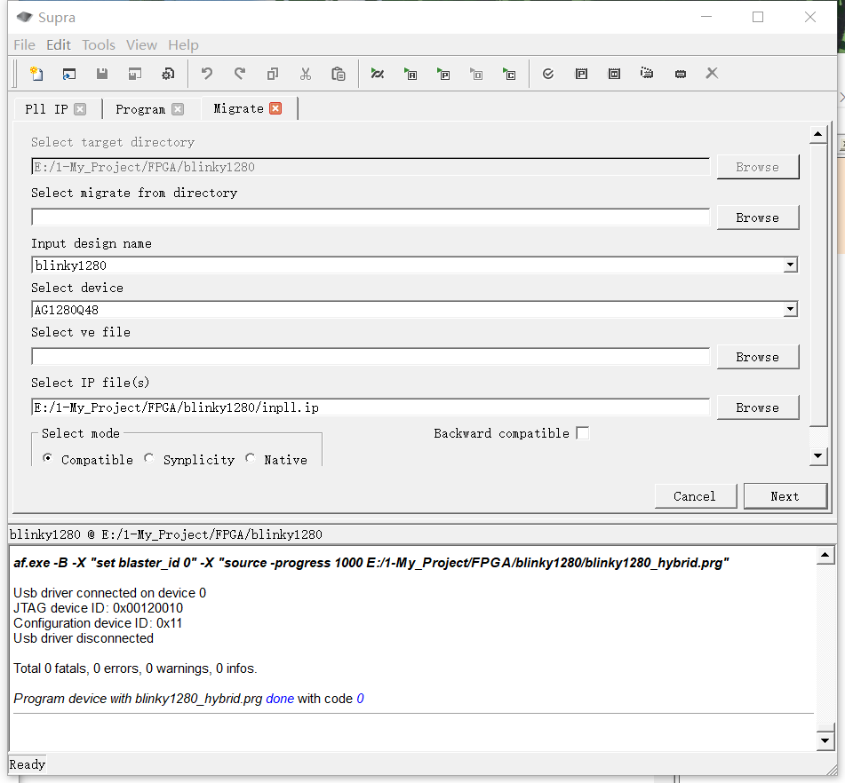

点击 Next 后，运行 Quartus II，打开工程（目录下的 blinky1280.qpf），该工程中自动包含了一个 blinky1280.v。
打开该文件，并编写点灯代码：

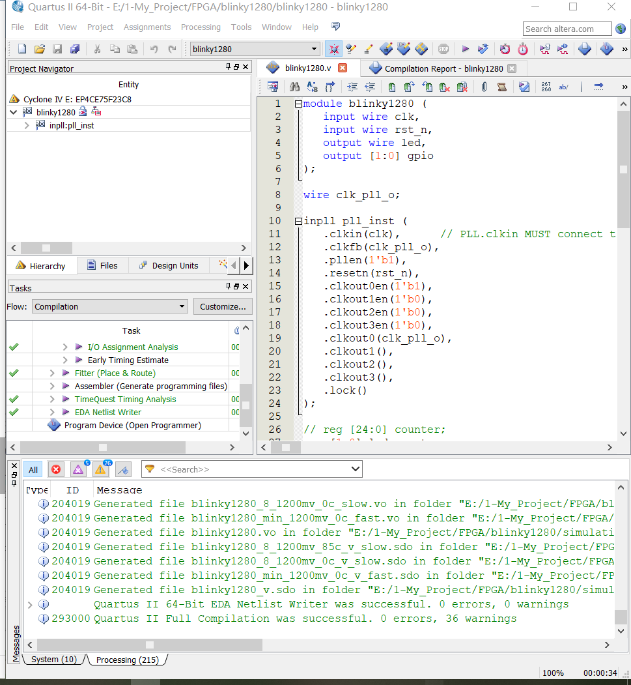

```verilog
module blinky1280 (
	input wire clk,
	input wire rst_n,
	output wire led,
	output [1:0] gpio
);

wire clk_pll_o;

inpll pll_inst (
	.clkin(clk),		// PLL.clkin MUST connect to PIN_XX_GB
	.clkfb(clk_pll_o),
	.pllen(1'b1),
	.resetn(rst_n),
	.clkout0en(1'b1),
	.clkout1en(1'b0),
	.clkout2en(1'b0),
	.clkout3en(1'b0),
	.clkout0(clk_pll_o),
	.clkout1(),
	.clkout2(),
	.clkout3(),
	.lock()
);

reg [1:0] led_counter;
reg [1:0] gpio_counter;
assign led = led_counter[0];
assign gpio = gpio_counter[0];

// parameter SEC_TIME = 32'd24_000_000;//24M
reg	[31:0] cnt;

always @ (posedge clk or negedge rst_n)begin
    if(rst_n==0)
        cnt

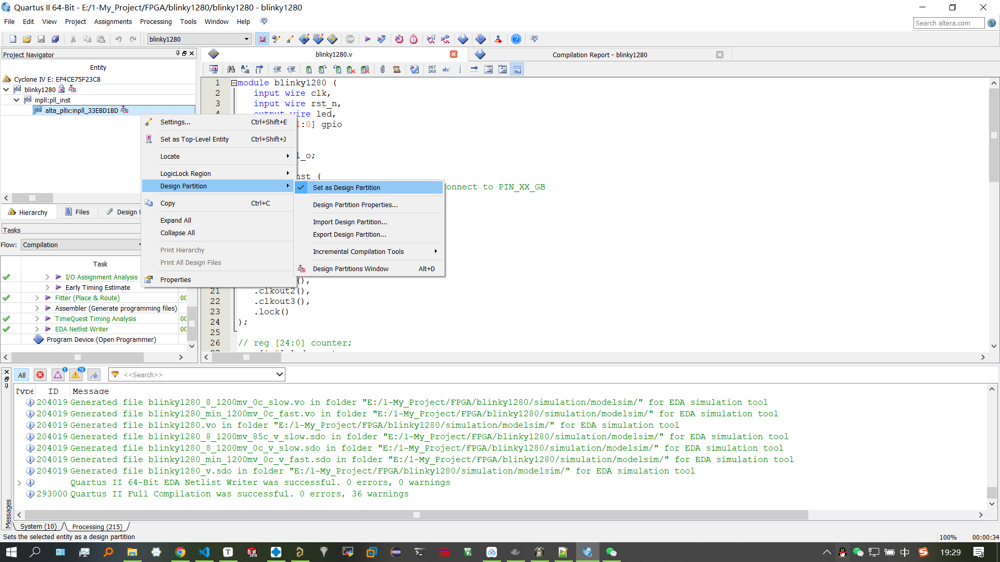

选择 Quartus II 中的 Tools - Tcl Scripts，选择目录下的 af_quartus.tcl 并运行：

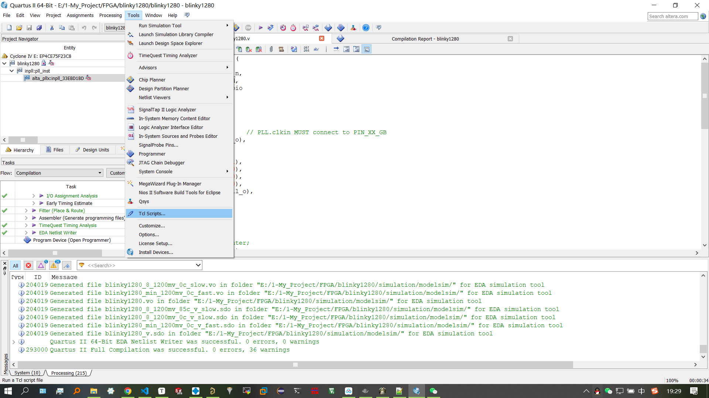

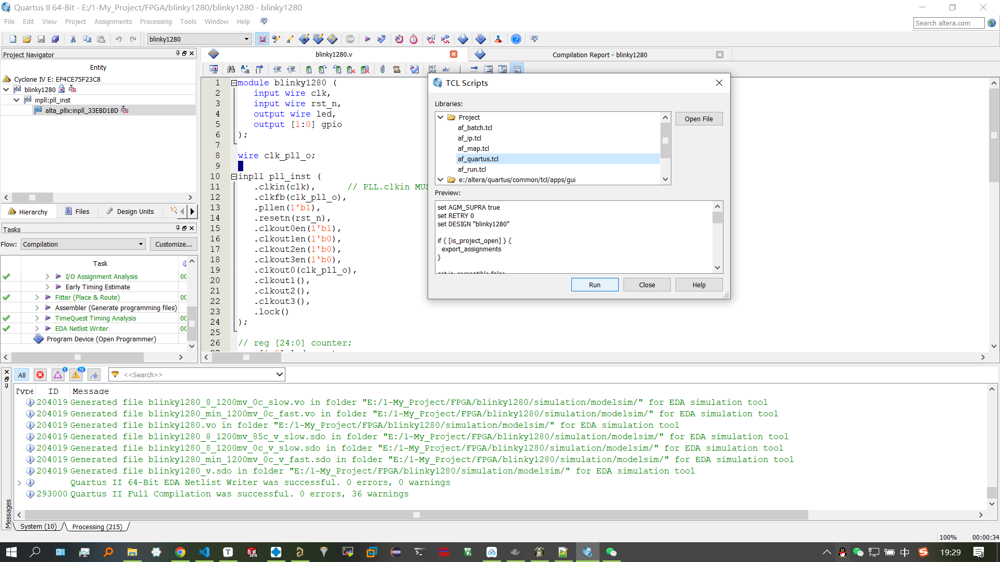

##### Place & Route

> 以后修改原设计， Quartus 里只需执行正常的编译（ Start Compilation），不用再运行af_quartus.tcl 文件。然后在 Supra 中运行 Compile，完成编译即可；

当 Quartus II 完成逻辑综合后，回到 Supra，点击 Next：

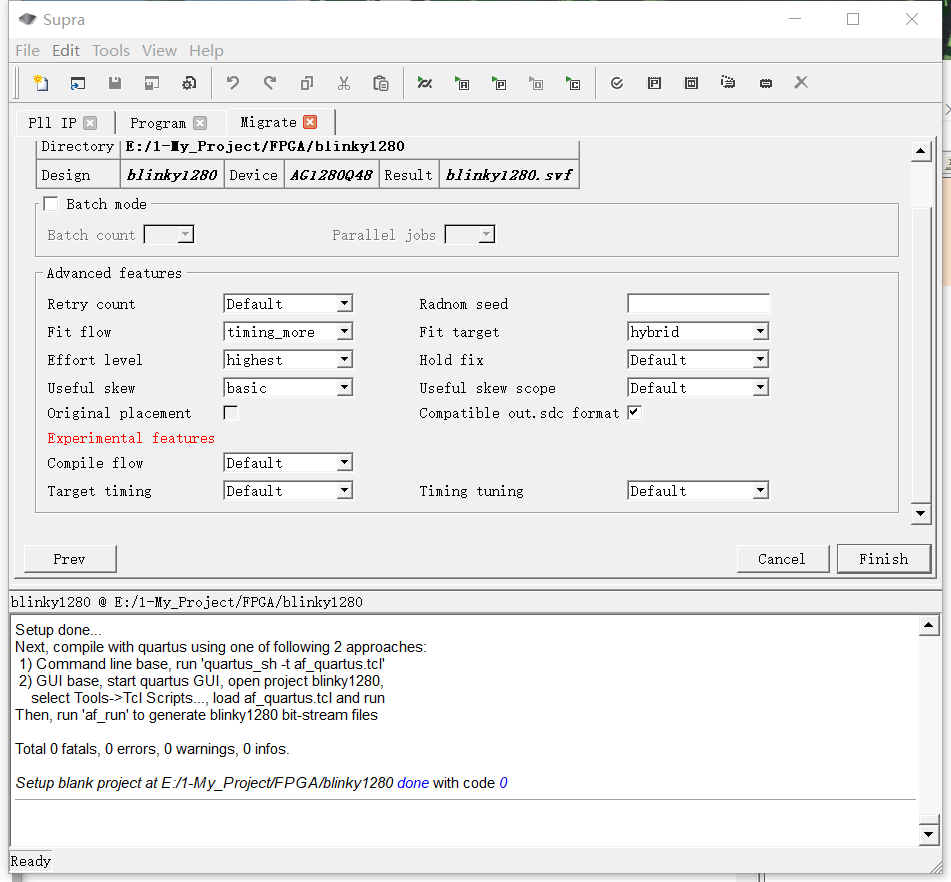

在这里先不要点 Finish，先打开工程目录下的 blinky1280.asf 分配引脚：

```verilog
set_location_assignment PIN_15 -to clk
set_location_assignment PIN_48 -to led
set_location_assignment PIN_17 -to rst_n

set_location_assignment PIN_1 -to gpio[0]

set_global_assignment -name RESERVE_ALL_UNUSED_PINS "AS INPUT TRI-STATED"
```

保存，其他参数默认就行，点击 Finish，Supra 就会开始 Place & Route。
一切顺利会输出这样：

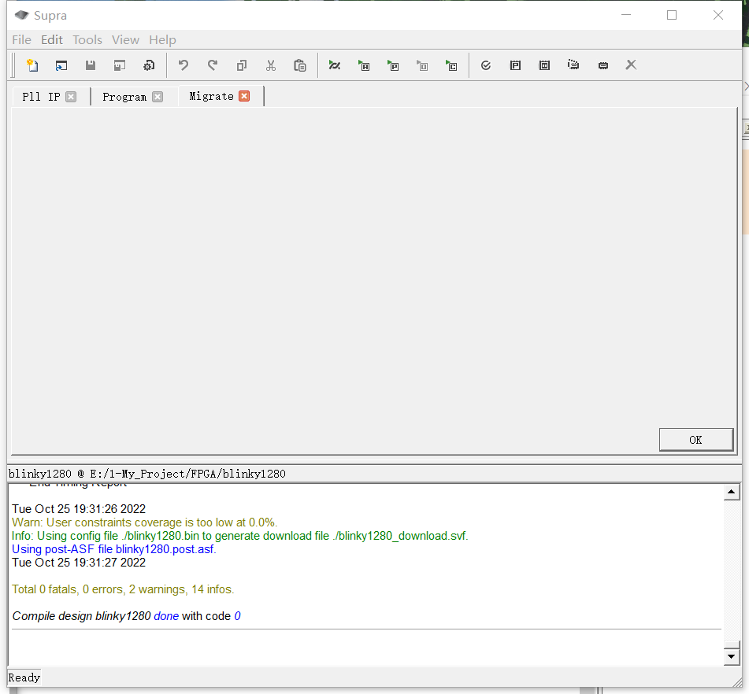

如果不顺利，那就自己多试试，解决不了建议换回 Altera。

##### 烧写

准备一个 USB Blaster，我试过淘宝十几块的和正点原子的，都可以用，区别是便宜的慢。
先将 USB Blaster 按照引脚定义对应连接到板子上，然后板子上电，将 USB Blaster 接入电脑。
在 Supra 中打开 Tool - Program，点击 Query Device ID；
AG1280Q48 的 Device ID 是 0x00120010，如果正确连接会读到这个数值。
选择刚刚生成的烧录文件，其中：

- blinky1280_sram.prg 是烧写到内部 SRAM 的，掉电后丢失

- 需要掉电保存的话选择 blinky1280_hybird.prg

这里以 SRAM 为例。烧写成功如下图，这时板子上的灯应该就会闪了。

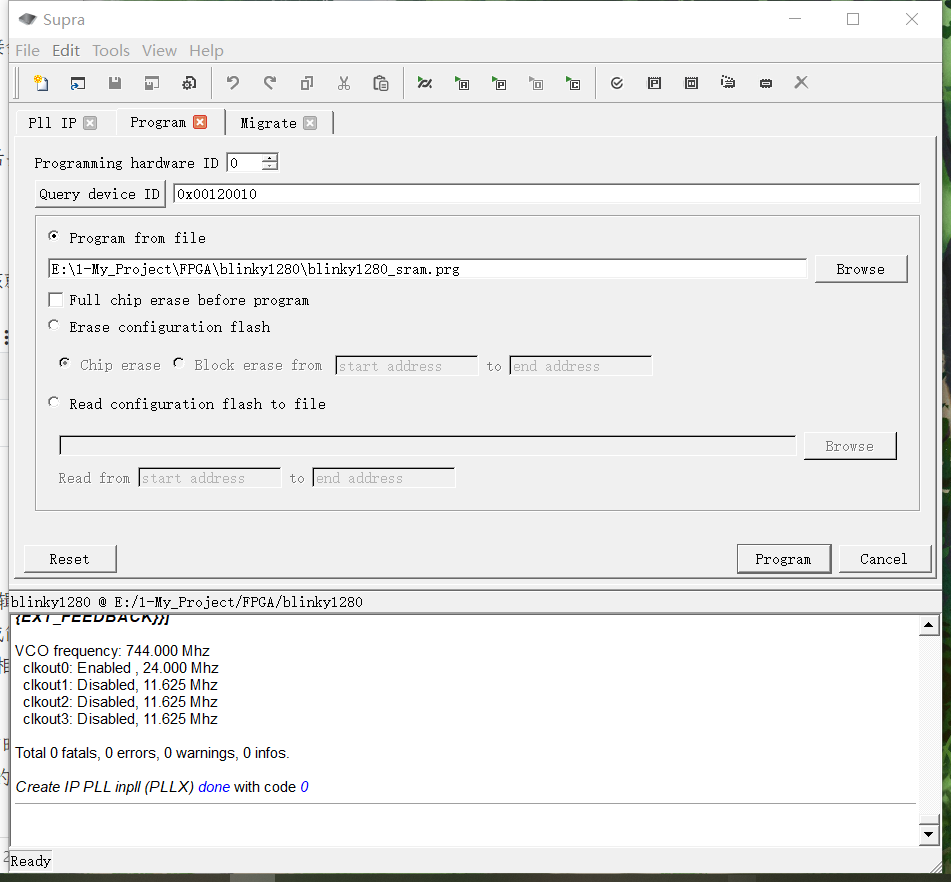

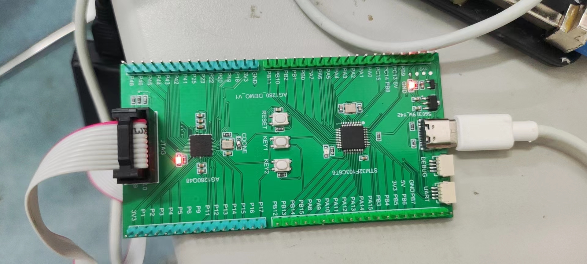

用示波器测量PIN_1引脚，能看到方波输出：

### 自己的想法：

如果是小规模FPGA（几个K的LUT），一般是用来做胶合逻辑（glue logic，将不同数字电路拼接起来，涉及到协议转换或简单计算）或是简单的数字信号处理（例如语音唤醒等传感器相关处理）会多一些；

我感觉还是这种`MCU+FPGA/CPLD`的方案是很有用的，比如有时候MCU的UART接口不够用，就需要外扩，一般是购买专用的芯片，但是如果有了FPGA，就可以自己写一个逻辑用来外扩UART接口，而且通用性高，成本也很低；

等板子测试过了再看具体要做什么应用吧；
