> 记录AT32开发中遇到的问题；

## 硬件部分：

硬件部分我是参考官方开发板来做的；

经过测试，硬件部分没有任何问题；

原理图
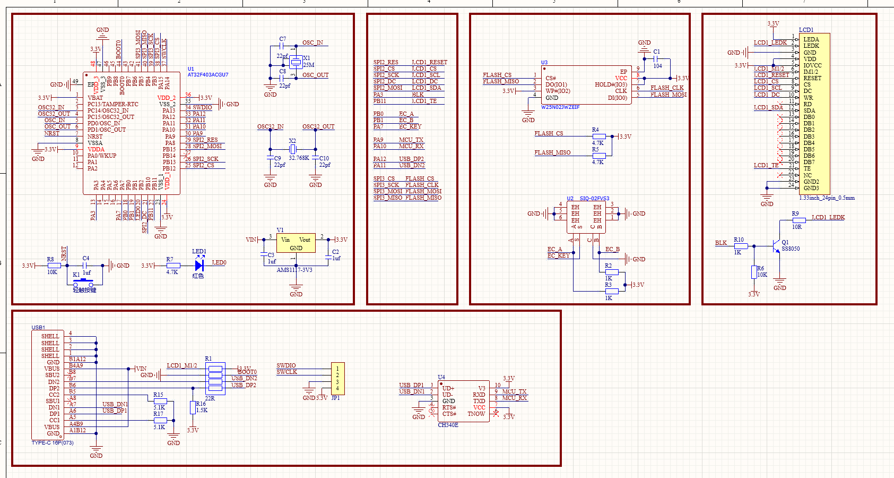

PCB仿真图
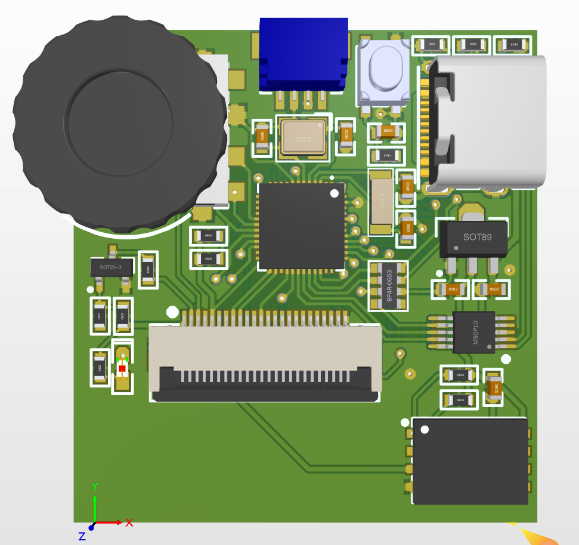

实物图
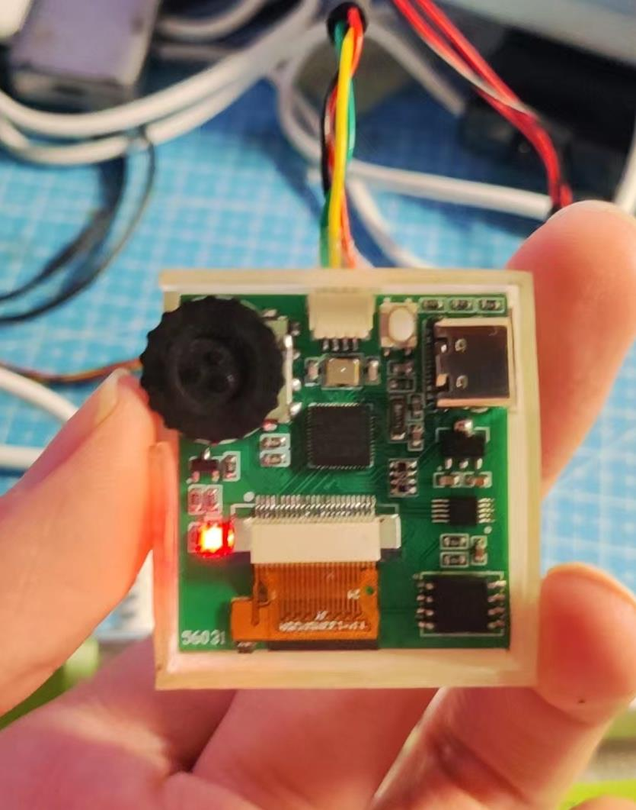

显示效果
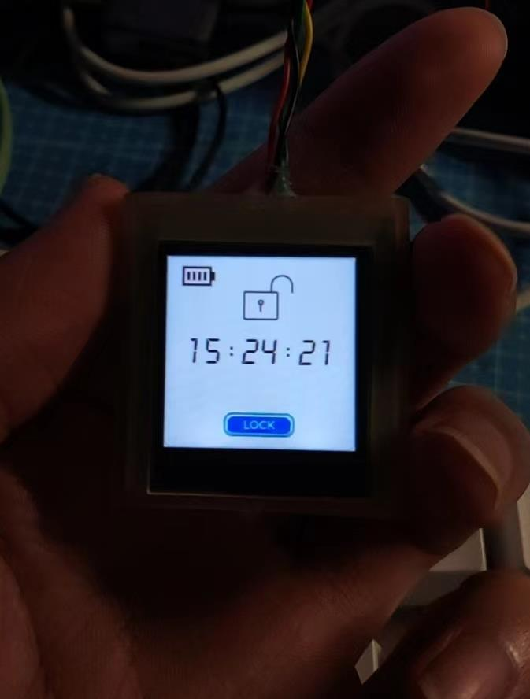

有几个值得关注的地方，我将在下面列出：

**使用编码器开关作为输入设备；**

**使用CH340E芯片作为串口转USB；**

**通过TYPE-C接口的正反插实现不同的功能（连接CH340E芯片和AT32的USB引脚）：**

**屏幕接口采用的是FPC0.5mm接口，方便安装；**

硬件部分的测试很快就结束了，主要就是测试各个外设是否能正常使用；

经测试，主控芯片、屏幕、spiflash、USB接口、CH340E、编码器开关、RTC时钟均能正常使用；

## 软件开发：

### 参考资料：

主控芯片使用的是雅特力的AT32F403ACGU7，其特性如下所示：

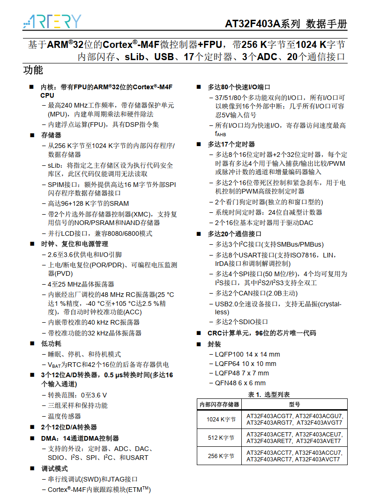

参考资料网站：[https://www.arterytek.com/cn/product/AT32F403A.jsp](https://www.arterytek.com/cn/product/AT32F403A.jsp)

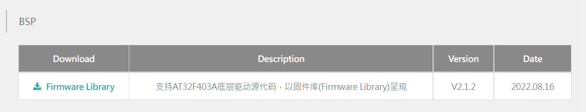

下载固件库源码，经解压后，可以在目录:

```bash
.\AT32F403A_407_Firmware_Library_V2.1.2\project\at_start_f403a\examples
```

找到各个外设的例子：

```bash
$ ls
acc/        crm/    gpio/  spi/         wwdt/
adc/        dac/    i2c/   sram/        xmc/
bpr/        debug/  i2s/   tmr/
can/        dma/    pwc/   usart/
cortex_m4/  exint/  rtc/   usb_device/
crc/        flash/  sdio/  wdt/
```

首先当然是串口打印和点灯，这样能测试时钟配置是否正常，以及判断芯片好坏与否；

### 具体开发：

关键代码如下：

#### 点灯：

```c
void at32_led_init(void)
{
    gpio_init_type gpio_init_struct;

    /* enable the led clock */
    crm_periph_clock_enable(USER_LED_GPIO_CRM_CLK, TRUE);

    /* set default parameter */
    gpio_default_para_init(&gpio_init_struct);

    /* configure the led gpio */
    gpio_init_struct.gpio_pins = USER_LED_PIN;
    gpio_init_struct.gpio_mode = GPIO_MODE_OUTPUT;
    gpio_init_struct.gpio_out_type = GPIO_OUTPUT_PUSH_PULL;
    gpio_init_struct.gpio_pull = GPIO_PULL_NONE;
    gpio_init_struct.gpio_drive_strength = GPIO_DRIVE_STRENGTH_STRONGER;

    gpio_init(USER_LED_GPIO, &gpio_init_struct);
}

void at32_led_on(void)
{
    USER_LED_GPIO->clr = USER_LED_PIN;
}

void at32_led_off(void)
{
    USER_LED_GPIO->scr = USER_LED_PIN;
}

void at32_led_toggle(void)
{
    USER_LED_GPIO->odt ^= USER_LED_PIN;
}
```

#### 串口：

```c
void uart_print_init(uint32_t baudrate)
{
    gpio_init_type gpio_init_struct;

    /* enable the uart and gpio clock */
    crm_periph_clock_enable(PRINT_UART_CRM_CLK, TRUE);
    crm_periph_clock_enable(PRINT_UART_TX_GPIO_CRM_CLK, TRUE);
    gpio_default_para_init(&gpio_init_struct);

    /* configure the uart tx pin */
    gpio_init_struct.gpio_drive_strength = GPIO_DRIVE_STRENGTH_STRONGER;
    gpio_init_struct.gpio_out_type = GPIO_OUTPUT_PUSH_PULL;
    gpio_init_struct.gpio_mode = GPIO_MODE_MUX;
    gpio_init_struct.gpio_pins = PRINT_UART_TX_PIN;
    gpio_init_struct.gpio_pull = GPIO_PULL_NONE;
    gpio_init(PRINT_UART_TX_GPIO, &gpio_init_struct);

    /* configure uart param */
    usart_init(PRINT_UART, baudrate, USART_DATA_8BITS, USART_STOP_1_BIT);
    usart_transmitter_enable(PRINT_UART, TRUE);
    usart_enable(PRINT_UART, TRUE);
}
```

**串口重定向**：

```c
#define PUTCHAR_PROTOTYPE int fputc(int ch, FILE *f)
PUTCHAR_PROTOTYPE
{
    while (usart_flag_get(PRINT_UART, USART_TDBE_FLAG) == RESET)
        ;
    usart_data_transmit(PRINT_UART, ch);
    return ch;
}
```

然后在main函数中分别初始化后即可：

```c
at32_led_init();
uart_print_init(115200);
```

通过USB线将板子连接在电脑上，即可通过串口助手收到板子发送的信息，并且板子上的LED开始闪烁；

#### LCD屏幕：

然后便是测试LCD屏幕，LCD的接口使用的是SPI串行通信接口，使用AT32的硬件SPI接口，初始方案使用的是中景园的例子，成功点亮，后续为了提高帧率，优化了下，并且使用DMA传输，刷屏速度大大加快；

下表是引脚配置：

LCD引脚
AT32引脚

RST
PA8

DC
PB10

CS
PB12

BLK
PA3

MOSI
PB15(SPI2)

CLK
PB13(SPI2)

下边是屏幕驱动的关键代码：

```c
/*
 * @Author       : fan-pengfei 2253770787@qq.com
 * @Date         : 2022-10-16 18:55:05
 * @LastEditors  : fan-pengfei 2253770787@qq.com
 * @LastEditTime : 2022-10-19 13:09:13
 * @FilePath     : \Core\Src\lcd.c
 * @Description  :
 * Copyright (c) 2022 by fan-pengfei 2253770787@qq.com, All Rights Reserved.
 */

#include "lcd.h"
#include "at32f403a_407_board.h"

uint16_t BACK_COLOR; //背景色
/**
 * @brief 设置LCD亮度
 * @param BLK_NUM 亮度百分比
 * @return 无
 */
void LCD_BLK_SET(uint16_t BLK_NUM)
{
    if (BLK_NUM > 100)
    {
        BLK_NUM = 100;
    }
    tmr_channel_value_set(TMR2, TMR_SELECT_CHANNEL_4, 10 * BLK_NUM);
}

static volatile uint8_t dma_trans_done_flag = 1;

/**
 * @brief DMA1 5通道中断
 * @return 无
 */
void DMA1_Channel5_IRQHandler(void)
{
    if (dma_flag_get(DMA1_FDT5_FLAG) != RESET)
    {
        dma_trans_done_flag = 1;
        dma_reset(DMA1_CHANNEL5); //复位DMA通道
    }
}

/**
 * @brief LCD控制引脚初始化
 * @return 无
 */
static void lcd_bus_init()
{
    /* GPIO外设 */
    crm_periph_clock_enable(CRM_GPIOA_PERIPH_CLOCK, TRUE); //使能GPIOA外设时钟
    crm_periph_clock_enable(CRM_GPIOB_PERIPH_CLOCK, TRUE); //使能GPIOA外设时钟
    gpio_init_type gpio_initstructure;
    gpio_default_para_init(&gpio_initstructure);

    gpio_initstructure.gpio_out_type = GPIO_OUTPUT_PUSH_PULL;
    gpio_initstructure.gpio_drive_strength = GPIO_DRIVE_STRENGTH_STRONGER;
    gpio_initstructure.gpio_mode = GPIO_MODE_MUX;
    gpio_initstructure.gpio_pins = GPIO_PINS_13 | GPIO_PINS_15; // PB13=SPI2_CLK  PB15=SPI2_MOSI
    gpio_init(GPIOB, &gpio_initstructure);

    gpio_initstructure.gpio_mode = GPIO_MODE_OUTPUT;
    gpio_initstructure.gpio_pins = GPIO_PINS_12; // PB12=SPI2_CS
    gpio_init(GPIOB, &gpio_initstructure);

    gpio_initstructure.gpio_mode = GPIO_MODE_OUTPUT;
    gpio_initstructure.gpio_pins = GPIO_PINS_10; // PB10=LCD_DC
    gpio_init(GPIOB, &gpio_initstructure);

    gpio_initstructure.gpio_mode = GPIO_MODE_OUTPUT;
    gpio_initstructure.gpio_pins = GPIO_PINS_8; // PA8=LCD_RES
    gpio_init(GPIOA, &gpio_initstructure);

    /* SPI外设 */
    crm_periph_clock_enable(CRM_SPI2_PERIPH_CLOCK, TRUE); //使能SPI2外设时钟

    spi_init_type spi_init_struct;
    spi_default_para_init(&spi_init_struct);

    spi_init_struct.transmission_mode = SPI_TRANSMIT_HALF_DUPLEX_TX; //仅发送
    spi_init_struct.master_slave_mode = SPI_MODE_MASTER;
    spi_init_struct.mclk_freq_division = SPI_MCLK_DIV_2; // 120/2=60Mhz
    spi_init_struct.first_bit_transmission = SPI_FIRST_BIT_MSB;
    spi_init_struct.frame_bit_num = SPI_FRAME_8BIT;
    spi_init_struct.clock_polarity = SPI_CLOCK_POLARITY_HIGH;
    spi_init_struct.clock_phase = SPI_CLOCK_PHASE_2EDGE;
    spi_init_struct.cs_mode_selection = SPI_CS_SOFTWARE_MODE;
    spi_init(SPI2, &spi_init_struct);

    spi_i2s_dma_transmitter_enable(SPI2, TRUE); //使能SPI发送DMA请求

    spi_enable(SPI2, TRUE);

    /* DMA外设 */
    crm_periph_clock_enable(CRM_DMA1_PERIPH_CLOCK, TRUE);

    nvic_irq_enable(DMA1_Channel5_IRQn, 1, 0); //使能DMA中断请求
}

/**
 * @brief LCD 发送命令
 * @param cmd 具体命令
 * @return 无
 */
static void lcd_send_cmd(uint8_t cmd)
{
    OLED_DC_Clr(); // D/C=0, 指令
    OLED_CS_Clr(); // CS=0

    spi_frame_bit_num_set(SPI2, SPI_FRAME_8BIT);

    spi_i2s_data_transmit(SPI2, cmd);
    while (spi_i2s_flag_get(SPI2, SPI_I2S_BF_FLAG) == SET)
        ; //等待传输完成

    OLED_CS_Set(); // CS=1
    OLED_DC_Set(); // D/C=1, 数据
}

/**
 * @brief LCD发送数据
 * @param *data 数据指针
 * @param len 数据长度
 * @return 无
 */
static void lcd_send_data(const uint8_t *data, uint8_t len)
{
    OLED_CS_Clr(); // CS=0

    spi_frame_bit_num_set(SPI2, SPI_FRAME_8BIT);

    for (uint8_t i = 0; i dt);
    dma_init_struct.peripheral_data_width = DMA_PERIPHERAL_DATA_WIDTH_HALFWORD;
    dma_init_struct.peripheral_inc_enable = FALSE;
    dma_init_struct.priority = DMA_PRIORITY_MEDIUM;
    dma_init_struct.loop_mode_enable = FALSE;

    dma_init(DMA1_CHANNEL5, &dma_init_struct);

    dma_interrupt_enable(DMA1_CHANNEL5, DMA_FDT_INT, TRUE); //开启DMA传输完成中断

    OLED_CS_Clr();                           // CS=0
    dma_channel_enable(DMA1_CHANNEL5, TRUE); //启动传输
}

/**
 * @brief LCD初始化
 * @return 无
 */
static void lcd_reg_init_st7789v()
{
    OLED_RST_Clr();
    delay_ms(20);
    OLED_RST_Set();
    delay_ms(20);
    /* 退出睡眠模式 */
    lcd_send_cmd(0x11);
    /* IPS屏幕需要设置屏幕反显才能显示正确的颜色 */
    lcd_send_cmd(0x21); //开启反显
    // lcd_send_cmd(0x20); //关闭反显
    /* 显存访问控制 */
    lcd_send_cmd(0x36);
    // lcd_send_data((uint8_t[]){0x60}, 1); //MX=MV=1, MY=ML=MH=0, RGB=0 横屏, 芯片在右
    // lcd_send_data((uint8_t[]){0xA0}, 1); //MY=MV=1, MX=ML=MH=0, RGB=0 横屏，芯片在左
    lcd_send_data((uint8_t[]){0x00}, 1); // MX=MV=MY=ML=MH=0, RGB=0 竖屏，芯片在下
    /* 像素格式 */
    lcd_send_cmd(0x3A);
    lcd_send_data((uint8_t[]){0x05}, 1); // MCU mode, 16bit/pixel
    /* Porch设置 */
    lcd_send_cmd(0xB2);
    lcd_send_data((uint8_t[]){0x0C, 0x0C, 0x00, 0x33, 0x33}, 5);
    /* Gate设置 */
    lcd_send_cmd(0xB7);
    lcd_send_data((uint8_t[]){0x35}, 1); // Vgh=13.26V, Vgl=-10.43V
    /* VCOM设置 */
    lcd_send_cmd(0xBB);
    lcd_send_data((uint8_t[]){0x19}, 1); // VCOM=0.725V
    /* LCN设置 */
    lcd_send_cmd(0xC0);
    lcd_send_data((uint8_t[]){0x2C}, 1); // XOR: BGR, MX, MH
    /* VDV与VRH写使能 */
    lcd_send_cmd(0xC2);
    lcd_send_data((uint8_t[]){0x01, 0xFF}, 2); // CMDEN=1
    /* VRH设置 */
    lcd_send_cmd(0xC3);
    lcd_send_data((uint8_t[]){0x12}, 1); // Vrh=4.45+
    /* VDV设置 */
    lcd_send_cmd(0xC4);
    lcd_send_data((uint8_t[]){0x20}, 1); // Vdv=0
    /* 刷新率设置 */
    lcd_send_cmd(0xC6);
    lcd_send_data((uint8_t[]){0x0F}, 1); // 60Hz, no column inversion
    /* 电源控制1 */
    lcd_send_cmd(0xD0);
    lcd_send_data((uint8_t[]){0xA4, 0xA1}, 2); // AVDD=6.8V, AVCL=-4.8V, VDDS=2.3V
    /* 正电压伽马控制 */
    lcd_send_cmd(0xE0);
    lcd_send_data((uint8_t[]){0xD0, 0x0D, 0x14, 0x0B, 0x0B, 0x07, 0x3A, 0x44, 0x50,
                              0x08, 0x13, 0x13, 0x2D, 0x32},
                  14);
    /* 负电压伽马控制 */
    lcd_send_cmd(0xE1);
    lcd_send_data((uint8_t[]){0xD0, 0x0D, 0x14, 0x0B, 0x0B, 0x07, 0x3A, 0x44, 0x50,
                              0x08, 0x13, 0x13, 0x2D, 0x32},
                  14);
}

/**
 * @brief LCD发送某个区域的颜色数据
 * @param x0 横轴起始坐标
 * @param y0 纵轴起始坐标
 * @param x1 横轴结束坐标
 * @param y1 纵轴结束坐标
 * @param *pix_data 发送的数据指针
 * @return 无
 */
void bsp_lcd_draw_rect(uint16_t x0, uint16_t y0, uint16_t x1, uint16_t y1, const uint8_t *pix_data)
{
    uint8_t tx_data[4];

    /* 设置Column地址 */
    tx_data[0] = x0 >> 8;   //起始地址高8位
    tx_data[1] = x0 & 0xFF; //起始地址高8位
    tx_data[2] = x1 >> 8;   //结束地址高8位
    tx_data[3] = x1 & 0xFF; //结束地址高8位
    lcd_send_cmd(0x2A);
    lcd_send_data(tx_data, 4);

    /* 设置Page地址 */
    tx_data[0] = y0 >> 8;
    tx_data[1] = y0 & 0xFF;
    tx_data[2] = y1 >> 8;
    tx_data[3] = y1 & 0xFF;
    lcd_send_cmd(0x2B);
    lcd_send_data(tx_data, 4);

    /* 写入图像数据 */
    lcd_send_cmd(0x2C);
    lcd_send_color(pix_data, (x1 - x0 + 1) * (y1 - y0 + 1));
}

/**
 * @brief 等待数据传输完毕
 * @return 无
 */
void bsp_lcd_draw_rect_wait(void)
{
    while (dma_trans_done_flag == 0)
        ; //等待传输完毕
    dma_trans_done_flag = 0;

    while (spi_i2s_flag_get(SPI2, SPI_I2S_BF_FLAG) == SET)
        ;          // DMA传输完成中断产生时，SPI的最后一个字节仍在传输中，不能提前释放CS
    OLED_CS_Set(); // CS=1
}

/**
 * @brief 控制LCD开关
 * @param status 1->开 0->关
 * @return 无
 */
void bsp_lcd_display_switch(uint8_t status)
{
    if (status)
    {
        lcd_send_cmd(0x29); //开显示
    }
    else
    {
        lcd_send_cmd(0x28); //关显示
    }
}

/**
 * @brief LCD初始化
 * @return 无
 */
void bsp_lcd_init(void)
{
    lcd_bus_init();
    lcd_reg_init_st7789v();
}
//下面是头文件
#ifndef __LCD_H
#define __LCD_H
#include "at32f403a_407_board.h"
#include "at32f403a_407_clock.h"
#include "stdlib.h"

#define OLED_RST_Clr() gpio_bits_reset(GPIOA, GPIO_PINS_8) // RES
#define OLED_RST_Set() gpio_bits_set(GPIOA, GPIO_PINS_8)

#define OLED_DC_Clr() gpio_bits_reset(GPIOB, GPIO_PINS_10) // DC
#define OLED_DC_Set() gpio_bits_set(GPIOB, GPIO_PINS_10)

#define OLED_CS_Clr() gpio_bits_reset(GPIOB, GPIO_PINS_12) // CS
#define OLED_CS_Set() gpio_bits_set(GPIOB, GPIO_PINS_12)

#define OLED_BLK_Clr() gpio_bits_reset(GPIOA, GPIO_PINS_3) // BLK
#define OLED_BLK_Set() gpio_bits_set(GPIOA, GPIO_PINS_3)

/* 屏幕分辨率 */
#define BSP_LCD_X_PIXELS 240
#define BSP_LCD_Y_PIXELS 240

void bsp_lcd_init(void);
void bsp_lcd_display_switch(uint8_t status);
void bsp_lcd_draw_rect(uint16_t x0, uint16_t y0, uint16_t x1, uint16_t y1, const uint8_t *dat);
void bsp_lcd_draw_rect_wait(void);
void LCD_BLK_SET(uint16_t BLK_NUM);
#endif
```

#### 编码器开关：

接下来是测试编码器开关，编码器型号为：`SIQ-02FVS3`，

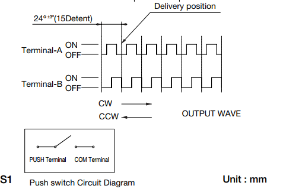
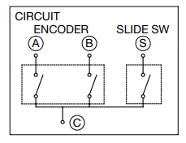

根据上述原理图可以发现这其实跟光电编码器很相似；

因而我使用外部中断来检测编码器的转动方向和转动角度以及按键状态：

```c
static uint8_t flag_exit = 0;
static uint8_t int_nu = 0;
int32_t cnt_encode = 0;
void EXINT0_IRQHandler(void)
{
    int i = 0;
    if (exint_flag_get(EXINT_LINE_0) != RESET)
    {
        i = 2000;
        while (i--)
            ;
        if (int_nu == 0 && gpio_input_data_bit_read(GPIOB, GPIO_PINS_0) == 0) //第一次中断，并且A相是下降沿
        {
            flag_exit = 0;
            if (gpio_input_data_bit_read(GPIOB, GPIO_PINS_1))
                flag_exit = 1; //根据B相，设定标志
            int_nu = 1;        //中断计数
        }
        if (int_nu && gpio_input_data_bit_read(GPIOB, GPIO_PINS_0) == 1) //第二次中断，并且A相是上升沿
        {
            if (gpio_input_data_bit_read(GPIOB, GPIO_PINS_1) == 0 && flag_exit == 1)
            {
                cnt_encode--;
            }
            if (gpio_input_data_bit_read(GPIOB, GPIO_PINS_1) && flag_exit == 0)
            {
                cnt_encode++;
            }
            int_nu = 0; //中断计数复位，准备下一次
        }
        exint_flag_clear(EXINT_LINE_0);
    }
}
```

> `cnt_encode`中存放旋转次数（24°为1单位），至于按键的按动状态检测则放在了1ms的定时器中；

经测试，该检测算法可以很好的消除拨码开关转动时的抖动，最后得到的结果是比较准确的；

### 中间件移植：

外设都测试完毕，接下来就是各种中间件的移植：LVGL移植、FATFS移植、USB Device等；

#### LVGL-8.3移植：

##### 文件夹创建：

下载以后打开文件可以看见下面四个文件：

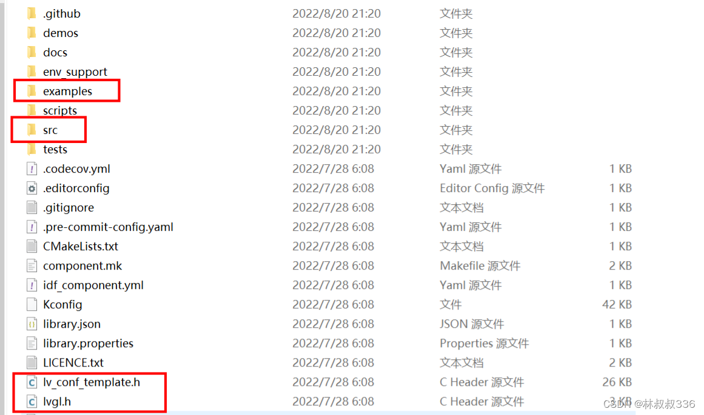

###### 第一步：

在`stm32`工程下面创建一个文件夹，名称为`lvgl`；

将上图中的四个文件加入到lvgl文件夹中；

把`lv_conf_template.h`文件重命名为`lv_conf.h`；

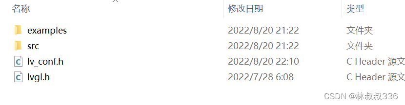

###### 第二步：

在`lvgl/examples/porting`文件夹中把三个.h文件开头的`#if 0`改为`#if 1`；

打开你原本的stm32工程（就是那个正常驱动屏幕的工程），使能`c99`；

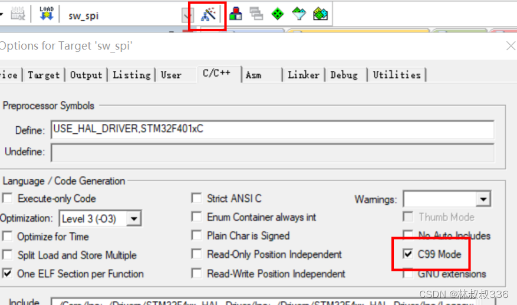

###### 第三步：

在左侧栏中添加两个文件夹

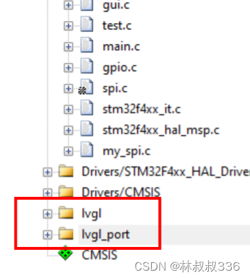

添加两个`port`文件，位于`lvgl/examples/porting`，因为没有用到文件系统，故没有添加fs：

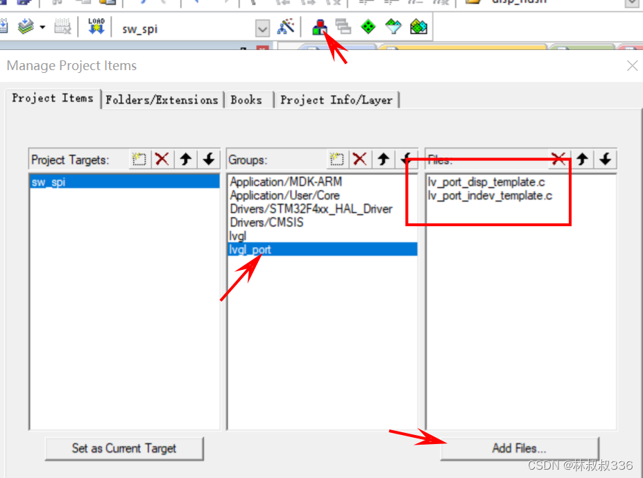

添加`lvgl`源文件，将`lvgl/src`目录下的`core draw font hal misc widgets`文件夹下的所有文件全部添加进`lvgl`组

> 注：文件夹中还有子文件夹要一层一层打开并加入；

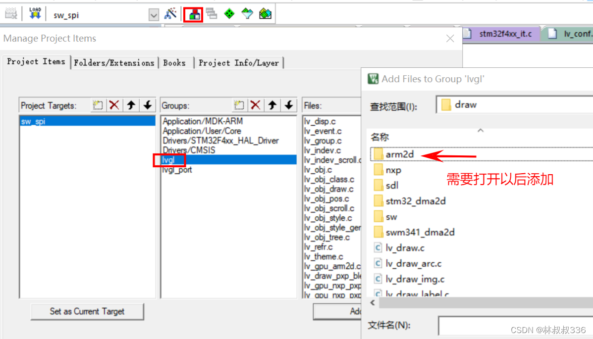

将`lvgl/src/extra/`目录下的文件添加进`lvgl`组。具体为：

> `layouts`目录下所有子目录文件；  `themes`目录下所有子目录文件；  `widgets`目录下所有子目录文件；  `lv_extra.c`；

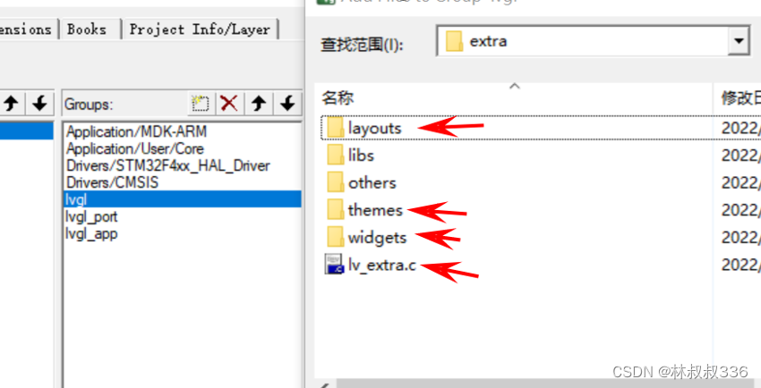

加入路径，将`lvgl` ，`src`，`porting`文件夹添加到源路径下。

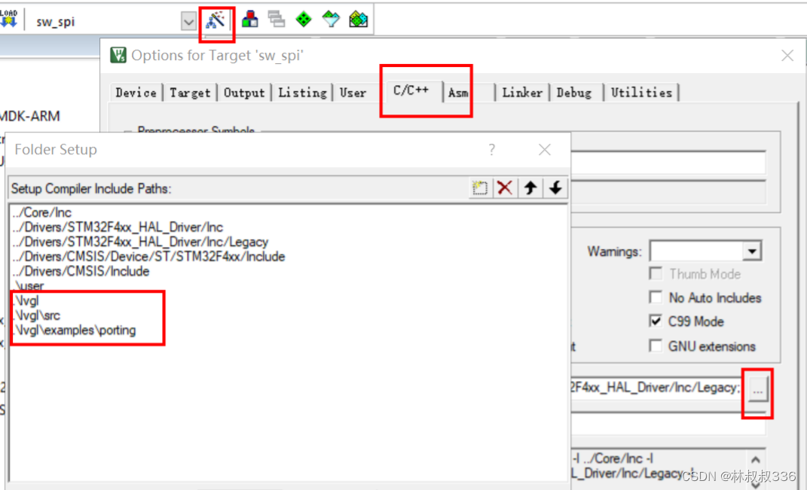

##### 修改配置文件：

修改`lv_port_disp_template.h`：

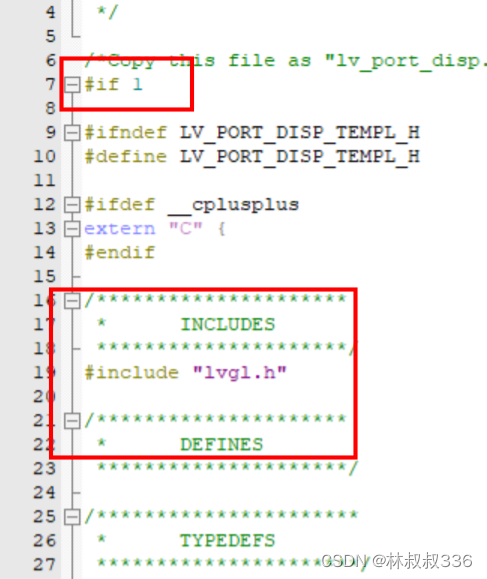

修改`lv_port_disp_template.c`：
将开头的`#if 0`改成`#if 1`

修改`lv_conf.h`：

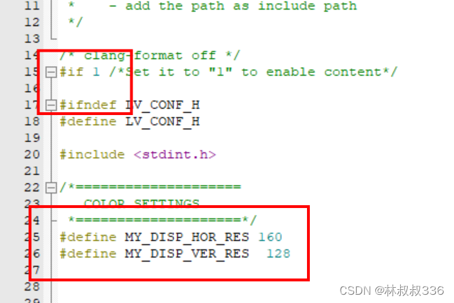

这两句是修改你屏幕大小的，直接粘贴在那里就可以了。

```c
#define MY_DISP_HOR_RES 240
#define MY_DISP_VER_RES  240
```

##### 修改显示的必要文件：

在`lv_port_disp_template.c`中包含着显示的重要文件，这里我们只需要修改两处：

###### 第一处：

把框选的地方注释掉，

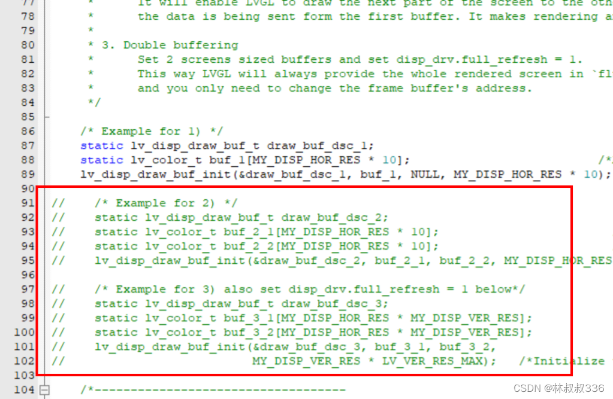

去除`warning`；
此时编译应该没有`error`，但是有`warning`这个`warning`无伤大雅可以直接屏蔽；

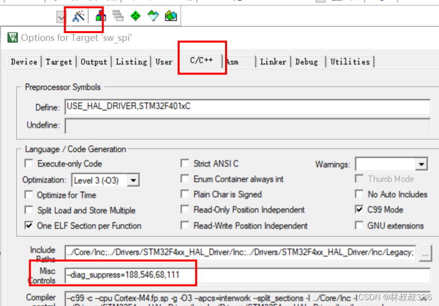

`--diag_suppress=188,546,68,111`
当完成这一步的时候就已经说明你已经把显示的移植了99%了，可以编译看一下是否有报错；

###### 第二处：

这是刷新函数，用于图形填充的，这里介绍两种方法，第一种是不断画点，只需要把红色部分写成你原来工程中的画点的函数就可以了，如果你的画点函数传入的形参中颜色的定义并不是指针的方式的话，一定要写成图中`color_p->full`的形式，不然会报错的。

> 不要把`#include“lcd.h”`遗忘

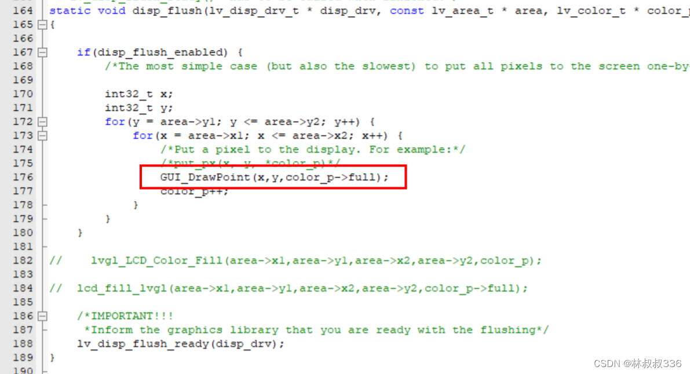

第二种方法是通过区域填充来实现的如果你是使用中景园的代码，你直接调用他的区域填充函数基本上会花屏，所以需要对他的函数进行一下改良。
可在你本来工程下面的`lcd.c`中添加一段代码：

```c
void lvgl_LCD_Color_Fill(u16 sx, u16 sy, u16 ex, u16 ey, lv_color_t *color)
{
    uint32_t y=0;
    u16 height, width;
    width = ex - sx + 1;            //得到填充的宽度
    height = ey - sy + 1;           //高度
    LCD_SetWindows(sx,sy,ex,ey);
    for(y = 0; y full);
        color++;
    }
}
```

也许他会报错说找不到`lv_color_t`这是以为我们没有在文件开头添加`#include "lvgl.h"`添加以后还需要在`lcd.h`文件中进行声明，不出意外还会报错，需要你在文件开头加入`#include "lvgl.h"`，我们就可以把第一种的描点换成画图：

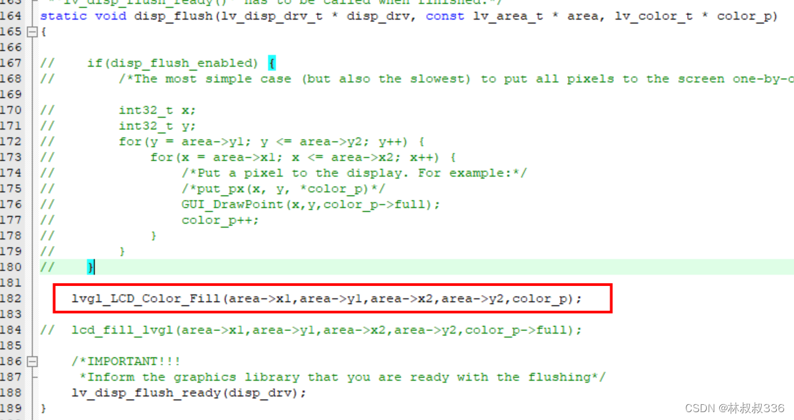

##### 显示测试：

在`main.c`中``#include "lvgl.h"` `#include "lv_port_disp_template.h"` 随后在屏幕初始化后面加上代码：

```c
lv_init();
lv_port_disp_init();
```

还需要一个在嘀嗒定时器里加一个跳动的“心脏”进行刷新；

> `lv_tick_inc(1)`;//在中断里面进行刷新；
>   如果这个对你而言比较难实现你也可以把这个放到主函数的循环里面；

并在主函数中创建一个测试函数：

```c
void lv_ex_label(void)
{
    char* github_addr = "https://gitee.com/W23";
    lv_obj_t * label = lv_label_create(lv_scr_act());
    lv_label_set_recolor(label, true);
    lv_label_set_long_mode(label, LV_LABEL_LONG_SCROLL_CIRCULAR); /*Circular scroll*/
    lv_obj_set_width(label, 120);
    lv_label_set_text_fmt(label, "#ff0000 Gitee: %s#", github_addr);
    lv_obj_align(label, LV_ALIGN_CENTER, 0, 10);
    lv_obj_t * label2 = lv_label_create(lv_scr_act());
    lv_label_set_recolor(label2, true);
    lv_label_set_long_mode(label2, LV_LABEL_LONG_SCROLL_CIRCULAR); /*Circular scroll*/
    lv_obj_set_width(label2, 120);
    lv_label_set_text_fmt(label2, "#ff0000 Hello# #0000ff world !123456789#");
    lv_obj_align(label2, LV_ALIGN_CENTER, 0, -10);
}
```

将测试函数写在`lv_port_disp_init();`的后面

```c
LCD_Init();
lv_init();
lv_port_disp_init();
lv_ex_label();
```

在主函数中写：

```c
lv_task_handler();
delay_ms(10);
```

##### lv_port_disp.c示例代码：

```c
#include "lv_port_disp.h"
#include
#include "lcd.h"

#define MY_DISP_HOR_RES 240
#define  MY_DISP_VER_RES 240
#define LVGL_BUFF_SIZE (BSP_LCD_X_PIXELS * BSP_LCD_Y_PIXELS / 4) // 1/6屏幕分辨率

static lv_color_t lvgl_draw_buff1[LVGL_BUFF_SIZE];
static lv_color_t lvgl_draw_buff2[LVGL_BUFF_SIZE];
static void disp_flush(lv_disp_drv_t *disp_drv, const lv_area_t *area, lv_color_t *color_p);

void lv_port_disp_init(void)
{
    /* 向lvgl注册缓冲区 */
    static lv_disp_draw_buf_t draw_buf_dsc; //需要全程生命周期，设置为静态变量
    lv_disp_draw_buf_init(&draw_buf_dsc, lvgl_draw_buff1, lvgl_draw_buff2, sizeof(lvgl_draw_buff1) / sizeof(lv_color_t));

    /* 创建并初始化用于在lvgl中注册显示设备的结构 */
    static lv_disp_drv_t disp_drv;
    lv_disp_drv_init(&disp_drv); //使用默认值初始化该结构
    /* 设置屏幕分辨率 */
    disp_drv.hor_res = BSP_LCD_X_PIXELS;
    disp_drv.ver_res = BSP_LCD_Y_PIXELS;
    /* 初始化LCD总线 */
    bsp_lcd_init();
    /* 设置显示矩形函数，用于将矩形缓冲区刷新到屏幕上 */
    disp_drv.flush_cb = disp_flush;
    /* 设置缓冲区 */
    disp_drv.draw_buf = &draw_buf_dsc;
    /* 注册显示设备 */
    lv_disp_drv_register(&disp_drv);

    /* 开启显示 */
    bsp_lcd_display_switch(1);
}
static void disp_flush(lv_disp_drv_t *disp_drv, const lv_area_t *area, lv_color_t *color_p)
{
    /* 等待上次传输完成 */
    bsp_lcd_draw_rect_wait();
    /* 通知lvgl传输已完成 */
    lv_disp_flush_ready(disp_drv);
    /* 启动新的传输 */
    bsp_lcd_draw_rect(area->x1, area->y1, area->x2, area->y2, (const uint8_t *)color_p);
}
```

> 这里的数据传输部分的代码直接使用的是DMA传输，在该分辨率下，lvgl的benchmark加权平均帧率甚至能达到200FPS；
