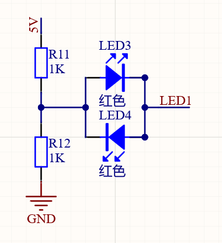

> 最近做项目用到了Arduino的板子，在此记录一下开发过程中遇到的一些问题，其实我之前是很不情愿用Arduino，觉得底层都被封装起来了，而且那个IDE用起来真的是一言难尽。不过最近客户要求用Arduino进行开发，就硬着头皮上了，结果发现用VScode+Platformio开发Arduino还是顶好用的，而且有太多可以用的封装好的函数了，真香！

- ### 一个IO引脚驱动两个不同颜色的LED

> 用一个IO引脚驱动两个led灯

> 这个电路可以实现，一个IO引脚驱动两个不同颜色的LED，不过自己只测试过红色和绿色的LED，其他颜色的并没有验证，因为似乎红色和绿色对电压的要求较低。
