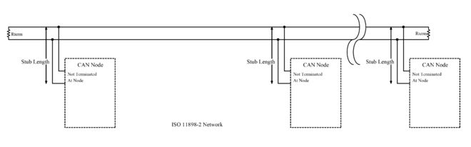
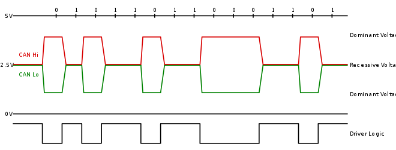
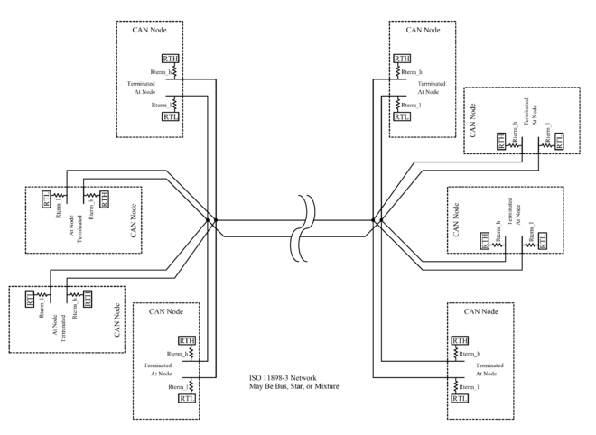
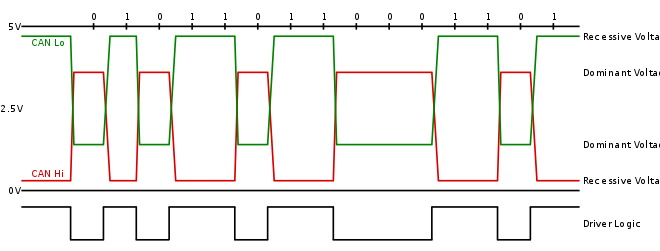
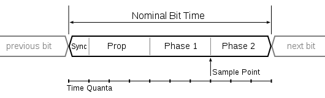
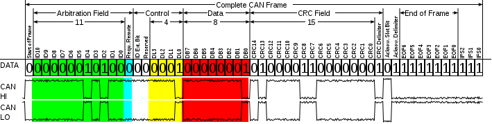
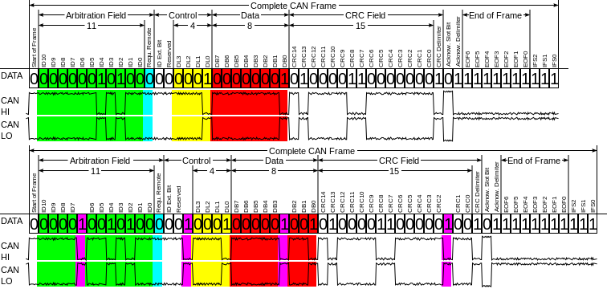

> CAN通讯解析；

**控制器局域网** (**Controller Area Network**，简称**CAN**或者**CAN bus**) 是一种功能丰富的车用总线标准。被设计用于在不需要主机（Host）的情况下，允许网络上的单片机和仪器相互通信。 它基于[消息传递协议，设计之初在车辆上采用复用通信线缆，以降低铜线使用量，后来也被其他行业所使用。

CAN创建在基于信息导向传输协定的广播机制（Broadcast Communication Mechanism）上。其根据信息的内容，利用信息标志符（Message Identifier，每个标志符在整个网络中独一无二）来定义内容和消息的优先顺序进行传递，而并非指派特定站点地址（Station Address）的方式。

因此，CAN拥有了良好的弹性调整能力，可以在现有网络中增加节点而不用在软、硬件上做出调整。除此之外，消息的传递不基于特殊种类的节点，增加了升级网络的便利性。

## 架构：

CAN是一个用于连接电子控制单元（ECU）的多主机串行总线标准。电子控制单元有时也被称作节点。CAN网络上需要至少两个节点才可进行通信。节点的复杂程度可以只是简单的输入输出设备，也可以是包含有CAN交互器并搭载了软件的嵌入式组件。节点还可能是一个网关，允许普通计算机通过USB或以太网端口与CAN网络上的设备通信。

所有节点通过两根平行的总线连接在一起。两条电线组成一条双绞线，并且接有120Ω的特性阻抗。

**ISO 11898-2**，也称为高速度CAN。它在总线的两端均接有120Ω电阻。

高速CAN网络 ISO 11898-2

高速CAN总线在传输显性（0）信号时，会将CAN_H端抬向5V高电平，将CAN_L拉向0V低电平。当传输隐性（1)信号时，并不会驱动CAN_H或者CAN_L端。 显性信号CAN_H和CAN_L两端差分标称电压为2V。 终端电阻在没有驱动时，将差分标称电压降回0V。显性信号（0）的共模电压需要在1.5V到3.5V之间。隐性信号（1）的共模电压需要在+/-12V。

高速CAN信令 ISO 11898-2

**ISO 11898-3**，也被称作低速或者容错CAN。它使用线性主线，星形主线或者连接到一个线性主线上的多星结构主线著称。每个节点都有终端电阻作为全局终端电阻的一部分。全局终端电阻不应低于100 Ω。

低速容错CAN网络 ISO 11898-3

低速/容错CAN信号在传输显性信号（0）时，驱动CANH端抬向5V，将CANL端降向0V。在传输隐性信号（1）时并不驱动CAN 总线的任何一端。在电源电压Vcc为5V时，显性信号差分电压需要大于2.3V，隐性信号的差分电压需要小于0.6V。CAN总线两端未被驱动时，终端电阻使CANL端回归到RTH电压（当电源电压Vcc为5V时，RTH电压至少为Vcc-0.3V=4.7V），同时使CANH端回归至RTL电压（RTL电压最大为0.3V）。两根线需要能够承受-27V至40V的电压而不被损坏。

低速CAN信令 ISO 11898-3

在高速和低速CAN中,从隐性信号向显性信号过渡的速度更快，因为此时CAN线缆被主动积极地驱动。显性向隐性的过渡速度主要取决于CAN网络的长度和导线的电容。

高速CAN通常被用于汽车和工业应用，在这些应用环境中，总线通常从一端横跨至另一端。容错CAN总线则经常被用在需要连接在一起的一组节点。

ISO规格只要求总线共模电压必须保持在最小和最大范围内，但不定义如何将总线电压保持在这个范围。

CAN总线必须使用终端电阻。终端电阻可以用来抑制信号反射，同时可以使总线电压回到隐性状态或者闲置状态。

高速CAN在总线两端使用120Ω电阻。低速CAN在每个节点均使用电阻。也有其他类型的终端，例如ISO 11783中定义了终端偏压电路。

终端偏压电路使用由4条导线组成的线缆，除了CAN信号线以外还有电源线和地线。这在每段总线两端提供自动偏压和终端功能。ISO11783网络是专为热拔插总线段和电子控制单元设计的。

## CAN通信节点：

每个节点需要:

- 中央处理器、微处理器或主处理器
处理主机决定收到的信息的意思以及想要传输的信息。

- 传感器、驱动器和控制设备可以与主处理器连接。

- CAN控制器；通常是集成单片机的一部分
接收：CAN控制器将从总线上接收的串位字节存储直到整个消息可用，之后主处理器可以获取这个消息（通常由于CAN控制器触发一个中断）。

- 发送：主处理器发送传递信息到CAN控制器，之后当总线空闲时将串位信息传递至总线。

- 收发器；由ISO11898-2/3介质访问单元（MAU）标准定义
接收：把数据流从CAN总线层转换成CAN控制器可以使用的标准。 CAN控制器通常配有保护电路。

- 传输：把来自CAN控制器的数据流转换至CAN总线层。

每个节点能够发送和接收信息，但不是同时进行的。 一个消息或帧主要包括标识符(ID)，它表示信息的优先级，最多八个数据字节。CRC、ACK和其他帧部分也是消息的一部分。改进了的CAN FD将每个帧拓展至最多64字节。 消息采用不归零(NRZ)格式串联传送到主线并可被所有节点接收。

被CAN网络连接的设备通常是传感器，驱动器和其他控制设备。 这些设备通过一个中央处理器、一个CAN控制器和一个CAN接收器连接至总线。

## 数据传输：

CAN数据传输如果出现争执，将会使用无损位仲裁解决办法。该仲裁法要求CAN网络上的所有节点同步，对每一位的采样都在同一时间。这就是为什么有人称之为CAN同步。然而，同步这个术语在此并不精确，因为数据以异步格式传输而不包含时钟信号。

CAN规范中使用术语”显性”位和”隐性”位来表示逻辑高低。显性是逻辑0(由发信器积极驱动通过电压)而隐性是逻辑1(被动地通过电阻返回到一个电压)。 闲置状态代表隐性的水平，也就是逻辑1。如果一个节点发送了显性位而另一个节点发送一个隐性位，那么总线上就有冲突，最终结果是显性位“获胜”。这意味着，更高优先级的信息没有延迟。较低优先级的节点信息自动在显性位传输结束，6个时钟位之后尝试重新传输。这使得CAN适合成为一个实时优先通讯系统。

逻辑0或1的确切电压取决于所使用的物理层，但CAN的基本原则要求每个节点监听CAN网络上的数据，包括发信节点本身。如果所有节点都在同时发送逻辑1，所有节点都会看到这个逻辑1信号，包括发信节点个接受节点。如果所有发信节点同时发送逻辑0信号，那么所有节点都会看到这个逻辑0信号。当一个或多个发信节点发送逻辑0信号，但是有一个或多个发信节点发送了逻辑1信号，所有节点包括发送逻辑1信号的节点也会看到逻辑0信号。当一个节点发送逻辑1信号但是看到一个逻辑0信号，它会意识到线上有争执并退出发射。通过这个过程，任何传送逻辑1的节点在其他节点传送逻辑0时退出或者失去仲裁。失去仲裁的节点会在稍后把信息重新加入队列，CAN帧的比特流保持没有故障继续进行直到只剩下一个发信节点。这意味着传送第一个逻辑1的节点丧失仲裁。由于所有节点在开始CAN帧时传输11位(或CAN 2.0B中是29位)标识符，拥有最低标识符的发信节点在起始处拥有更多0。那个节点赢得仲裁并且拥有最高优先级。

例如，一个11位标识符的CAN网络，有两个节点，他们的ID分别为15（二进制表示为00000001111）和16（二进制表示为00000010000）。如果这两个节点同时传输，每个都会优先传输它们标识符中的前6个0而不触发仲裁。

起始位
ID位
ID位
ID位
ID位
ID位
ID位
ID位
ID位
ID位
ID位
ID位
剩下的部分

10
9
8
7
6
5
4
3
2
1
0

节点15
0
0
0
0
0
0
0
0
1
1
1
1

节点16
0
0
0
0
0
0
0
1
停止传输

CAN数据
0
0
0
0
0
0
0
0
1
1
1
1

当ID中的第7位传输时，节点16为其ID发送1(隐性)，而节点15为其ID发送0（显性）。当这种情况发生时，该节点16知道自己发送了1，但在总线上看到了0，意识到有冲突发生并且自己失去仲裁。节点16停止传送而节点15继续传输自己的ID，没有丢失任何数据。拥有最低ID的节点总是赢得仲裁，因此具有最高优先级。

长度小于40m的网络最高支持的比特率高达1百万比特/秒。降低比特率可以允许使用更长的网络距离（例如，125千比特/秒支持最大500米）。改进的CAN FD标准允许仲裁后升高比特率，可以将数据区块速度增加至仲裁位速率的八倍。

## ID分配：

信息ID在单条CAN总线上必须是唯一的，否则两个节点将在仲裁位(ID)传送结束后继续传输，造成错误。

1990年代早期，为信息选择标志符（ID）的准则仅仅基于数据的种类和发信节点。但是，当标志符同样代表着信息的优先级时，这会带来不好的实时响应。在这种情况下，通常要求CAN总线只能使用大概30%才能保证信息可以在截止时间之前到达。然而，如果信息的标志符根据信息的优先级决定，更低标志符的信息获得更高优先级，那么在不损失数据的前提下，总线的使用率可以达到70%到80%。

## 位时序

CAN网络上的所有节点必须运行在相同的标称比特率下，但噪音、相移、振荡频率容差和振荡频率漂移导致实际的比特率可能与标称比特率不同。由于没有使用一个单独的时钟信号，需要一个同步节点方法。同步在仲裁机制中十分重要，因为仲裁中的节点需要能够同时看到它们传输数据的数据和其他节点的传输数据。 同步在确保节点间震荡时间不同时不发生错误上十分重要。

总线闲置一段时间后，在第一个隐性信号向显性信号转换时（起始位） 进行硬同步。再次同步发生在传输帧期间的每次从隐性向显性转换时。CAN控制器期望在标称位时间内发生多次转换。如果并没有在期望的确定时间发生，控制器将根据这调整标称位时间。

调整是通过将每一位划分成多个称为量子的时间段,并分配一定数量的量子到位中的四个阶段完成的。这四个阶段分别为：同步、传播、相位段1和相位段2。

每位10个量子的CAN位时序的例子

位被分成的量子数量会因控制器的不同而不同，每一个阶段分配的量子数会因比特率和网络状况的不同而改变。

在预期时刻之前或之后发生的过渡会促使控制器计算时间差，并根据计算所得的时间差延长相位段1或者缩短相位段2。这有效地改变接收器到发信器的时序，将它们同步在一起。这个重新同步过程不断地在每次隐性向显性过渡时进行已确保发信器和接收器保持同步。不断地重新同步降低了噪声产生的错误，让同步至已经失去仲裁的节点的接收节点重新同步到赢得仲裁的节点。

## 层级：

CAN协议与很多网络协议相似，可以被分解为下列抽象层：

### 应用层

### 对象层

- 信息过滤

- 消息和状态处理

### 传输层

大多数CAN标准应用在传输层。传输层从物理层接收消息并将这些信息传递给对象层。传输层负责特定时序、同步、信息位构架、仲裁、确认、错误检测及发信和故障约束。它的职责为：

- 故障约束

- 错误监测

- 消息验证

- 信息确认

- 仲裁

- 信息帧

- 传输速率和时间

- 路由信息

### 物理层

## 帧：

CAN网络可以配置为使用两种不同的消息（或“帧”）格式：标准或基本帧格式（在CAN 2.0 A和CAN 2.0 B中描述）和扩展帧格式（仅由CAN 2.0 B描述）。两种格式之间的唯一区别是，“CAN基本帧”支持标识符长度为11位，“CAN扩展帧”支持标识符长度为29位，由11位标识符（“基本标识符”）和一个18位扩展（“标识符扩展”）组成。CAN基本帧格式和CAN扩展帧格式之间的是通过使用IDE位进行区分的，该位在传输显性时为11位帧，而在传输隐性时使用29位帧。支持扩展帧格式消息的CAN控制器也能够发送和接收CAN基本帧格式信息。所有的帧都以开始位（SOF）作为信息传输的起始。

CAN有4种帧类型：

- 数据帧：包含用于传输的节点数据的帧

- 远程帧：请求传输特定标识符的帧

- 错误帧：由任何检测到错误的节点发送的帧

- 过载帧：在数据帧或远程帧之间插入延迟的帧

### 数据帧

数据帧是唯一用于实际数据传输的帧。它有两种信息结构：

- 基本帧格式：有11个标识符位

- 扩展帧格式：有29个标识符位

CAN标准要求必须接受基本帧格式并可能接受扩展帧格式，但必须能承受扩展帧格式。

#### 基本帧格式：

带有电平信息的CAN基础帧格式（不包含填充位）

帧格式如下：位值是用于描述CAN-LO信号的.

字段名
字长 （位）
作用

起始位（SOF）
1
表示帧的传输开始

识别码（ID\green）
11
唯一识别码，同样代表了优先级

远程传输请求（RTR\蓝色）
1
数据帧时一定是显性（0），远程请求帧时一定是隐性（1）

标志码拓展位（IDE）
1
对于只有11位标志码的基本帧格式，此段一定为显性（0）

预留位（R0）
1
预留位一定是显性（0），但是隐性（1）同样是可接受的

数据长度代码（DLC\黄色）
4
数据的字节数（0-8字节）

数据段（Data field\红色）
0–64 (0-8 字节)
待传输数据（长度由数据长度码DLC指定）

循环冗余校验（CRC）
15
循环冗余校验

循环冗余校验定界码
1
一定是隐性（1）

确认槽（ACK）
1
发信器发送隐性（1）但是任何接收器可以宣示显性（0）

确认定界码（ACK delimiter）
1
一定是隐性（1）

结束位(EOF)
7
一定是隐性（1）

#### 拓展帧格式：

帧的格式如下表所示：

字段名
字长 （位）
作用

起始位（SOF）
1
表示帧的传输开始

标志符A（ID A\green）
11
唯一识别码的第一部分，同样代表了优先级

替代远程请求（SRR）
1
数据帧时一定是显性（0），远程请求帧时一定是隐性（1）

标志符拓展位（IDE）
1
对于有29位标志符的拓展帧格式，此段一定为隐性（1）

标志符B（ID B\green）
18
唯一识别码的第二部分，同样代表了优先级

远程传输请求（RTR\蓝色）
1
数据帧时一定是显性（0），远程请求帧时一定是隐性（1）

预留位（r1，r0）
2
预留位一定是显性（0），但是隐性（1）同样是可接受的

数据长度代码（DLC\黄色）
4
数据的字节数（0-8字节）

数据段（Data field\红色）
0–64 (0-8 字节)
待传输数据（长度由数据长度码DLC指定）

循环冗余校验（CRC）
15
循环冗余校验

循环冗余校验定界符
1
一定是隐性（1）

确认槽（ACK）
1
发送器发送隐性（1），任何接收器都可以发送显性（0）

确认定界符（ACK delimiter）
1
一定是隐性（1）

结束位(EOF)
7
一定是隐性（1）

两个定位符区域A和B共同组成29位定位符。

### 远程帧

- 通常数据传输是在数据源节点（例如传感器）发出数据帧的情况下自主执行的。但是，目标节点也可以通过发送远程帧来从信息源请求数据。

- 数据帧和远程帧之间有两个区别。首先，RTR位在数据帧中作为显性位传输，其次在远程帧中没有数据段。DLC字段表示所请求的消息的数据长度，而不是发送的数据长度。

也就是说：

在数据帧和具有相同标识符的远程帧同时发送的情况下，由于数据帧标识符之后的RTR位是显性，它将赢得仲裁。

### 错误帧

错误帧由两个不同的字段组成：

- 第一段由不同站点提供的错误标志（6-12个显性位/隐性位）的叠加给出。

- 接下来的第二段是错误帧定界符（ERROR DELIMITER，8个隐性位）。

错误标志也有两种：

#### 主动错误标志

> 六个显性位 - 由网络上错误状态为“主动错误”的出错的节点传送。

#### 被动错误标志

> 六个隐性位 - 由网络上错误状态为“被动错误”的出错的节点传送。

CAN有两种错误计数器：

> 1.传输错误计数器（Transmit error counter，简称TEC）  2.接受错误计数器（Receive error counter，简称REC）

- 当传输错误计数器TEC或接受错误计数器REC大于127且小于255时，将在总线上传输被动错误帧。

- 当传输错误计数器TEC或接受错误计数器REC小于128时，将在总线上传输主动错误帧。

- 当传输错误计数器TEC或接受错误计数器REC大于255时，节点进入主线离线状态，不会传输帧。

### 过载帧

过载帧包含两个位字段：过载标志（Overload Flag）和过载定界符（Overload Delimiter）。有两种过载条件可导致过载标志的传输：

- 接收器的内部条件，要求延迟下一个数据帧或远程帧。

- 中断检测到一个显性位。

由于情况1引起的过载帧只允许在预期中断的第一位时间开始，而由情况2引起的过载帧在检测到显性位后一位开始。过载标志由六个显性位组成，其整体形式与主动错误标志的形式相对应。过载标志的形式破坏了中断区的固定形式。因此，所有其他站点也会检测到过载情况，并在它们自己的部分开始传输过载标志。过载定界符由8个隐性位组成，与错误分隔符的形式相同。

## 调试机制

CAN提供了五种调试机制，使其错误发生率低于4.7×10-11。当一个以上的上述错误发生时，发送中的传输将会失败中止并且产生错误数据包，发讯端则会试着重新发送消息数据包。各个节点将会重新争取优先权。

CAN的五种侦测错误机制：

循环冗余校验（CRC）
CRC在消息结尾处加上一个FCS（frame check sequence）来确保消息的正确。接收消息端会将其FCS重新演算并与所接收到的FCS比对，如果不相符，表示有CRC错误。

Frame check
检查数据包中几个固定值的字段以验证该数据包是否有被信号干扰导致内容错误。

ACK errors
接收端在收到数据包后会告知发讯端，发讯端若没有收到确认消息，ACK错误便发生。

Monitoring
传输一位到网络上，再从网络读取来检查是否一致。

Bit stuffing
用于消息同步。

## 确认槽（ACK）

确认插槽用于确认收到的CAN帧有效。接收到帧而没有发现错误的每个节点在ACK槽中发送显性水平，来覆盖发射机的隐性水平。如果发射机在ACK时隙中只检测到隐性电平，它就知道没有任何接收器获得有效的帧。接收节点可以发送隐性信号来指示它没有接收到有效帧，但是确实接收到有效帧的其它节点可以用显性信号覆盖它。发送节点无法知道CAN网络上的是否所有节点都收到了该消息。

## 帧间内容

数据帧和远程帧通过称为帧间空间的区域与前面的帧分开。帧间空间由至少三个连续的隐性（1）位组成。之后，如果检测到一个显性位，它将被视为下一帧的“起始位”。 过载帧和错误帧不比帧间空间重要，并且多个过载帧也不由帧间空间分隔。帧间空间包含了字段中断和总线空闲，并且如果前一消息的发送器是被动错误站点，会将总线暂挂。

## 位填充

[

CAN帧在填充位之前和之后（紫色）

传输器会在相同极性的五个连续位之后插入一个相反的极性的位，以确保足够的转换来保持同步。这种做法被称为位填充，并且对于CAN这样的不归零（NRZ）编码是必要的。填充的数据帧由接收器去掉填充。

除了CRC定界符，ACK字段和结束位这样固定字长的区域之外，帧中其他所有字段都会被填充，这些字段是固定大小且未被填充。在使用位填充的字段中，具有相同极性的六个连续位（111111或000000）被视为错误。 当检测到错误时，节点可以发送主动错误标志。主动错误标志由六个连续的显性位组成，违反了位填充规则。

位填充意味着数据帧可能比上述表中列举的预期的要长。CAN帧（基本格式下）的最大尺寸的情况是

11111000011110000…

被填充为：（填充位用粗体显示）

11111**0**0000**1**1111**0**0000**1**…

填充位本身可能成为五个连续相同位中的第一个，所以在最坏的情况下，每四个原始位有一个填充位。

长度由下面公式给出：

8n+47+[\frac{34+8n-1}{4}]\tag{1}
其中`8n+47`是填充前帧的长度，在最坏情况下，原数据除了第一个4位后，在每个4位后增加一位（所以分子减去1），同时由于位的结构，固有的47位中只有34位能够被填充。
