> 之前经常用CRC校验，今天解释一下其原理；

## 简单介绍：

> Cyclic Redundancy Check循环冗余检验，是基于数据计算一组效验码，用于核对数据传输过程中是否被更改或传输错误。

**循环冗余校验检错方案（CRC）：**

> CRC校验原理看起来比较复杂，好难懂，因为大多数书上基本上是以二进制的多项式形式来说明的。其实很简单的问题，其根本思想就是先在要发送的帧后面附加一个数（这个就是用来校验的校验码，但要注意，这里的数也是二进制序列的，下同），生成一个新帧发送给接收端。当然，这个附加的数不是随意的，它  要使所生成的新帧能与发送端和接收端共同选定的某个特定数整除（注意，这里不是直接采用二进制除法，而是采用一种称之为“模2除法”）。到达接收端后，再把接收到的新帧除以（同样采用“模2除法”）这个选定的除数。因为在发送端发送数据帧之前就已通过附加一个数，做了“去余”处理（也就已经能整除了），所以结果应该是没有余数。如果有余数，则表明该帧在传输过程中出现了差错。

**【说明】**：“模2除法”与“算术除法”类似，但它既不向上位借位，也不比较除数和被除数的相同位数值的大小，只要以相同位数进行相除即可。模2加法运算为：1+1=0，0+1=1，0+0=0，无进位，也无借位；模2减法6运算为：1-1=0，0-1=1，1-0=1，0-0=0，也无进位，无借位。相当于二进制中的逻辑异或运算。也就是比较后，两者对应位相同则结果为“0”，不同则结果为“1”。如100101除以1110，结果得到商为11，余数为1，如图5-9左图所示。如11×11=101，如右图所示。

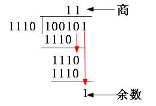
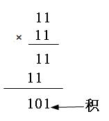

“模2除法”和“模2乘法”示例

> 具体来说，CRC校验原理就是以下几个步骤：

- 先选择（可以随机选择，也可按标准选择，具体在后面介绍）一个用于在接收端进行校验时，对接收的帧进行除法运算的除数（是二进制比较特串，通常是以多项方式表示，所以CRC又称多项式编码方法，这个多项式也称之为“生成多项式”）。

- 看所选定的除数二进制位数（假设为k位），然后在要发送的数据帧（假设为m位）后面加上k-1位“0”，然后以这个加了k-1个“0“的新帧（一共是m+k-1位）以“模2除法”方式除以上面这个除数，所得到的余数（也是二进制的比特串）就是该帧的CRC校验码，也称之为FCS（帧校验序列）。但要注意的是，余数的位数一定要是比除数位数只能少一位，哪怕前面位是0，甚至是全为0（附带好整除时）也都不能省略。

- 再把这个校验码附加在原数据帧（就是m位的帧，注意不是在后面形成的m+k-1位的帧）后面，构建一个新帧发送到接收端；最后在接收端再把这个新帧以“模2除法”方式除以前面选择的除数，如果没有余数，则表明该帧在传输过程中没出错，否则出现了差错。

> 通过以上介绍，大家一定可以理解CRC校验的原理，并且不再认为很复杂吧。  从上面可以看出，CRC校验中有两个关键点：一是要预先确定一个发送端和接收端都用来作为除数的二进制比特串（或多项式）；二是把原始帧与上面选定的除进行二进制除法运算，计算出FCS。前者可以随机选择，也可按国际上通行的标准选择，但最高位和最低位必须均为“1”，如在IBM的SDLC（同步数据链路控制）规程中使用的CRC-16（也就是这个除数一共是17位）生成多项式g（x）= x^16 + x^15 + x^2 +1（对应二进制比特串为：11000000000000101）；而在ISO HDLC（高级数据链路控制）规程、ITU的SDLC、X.25、V.34、V.41、V.42等中使用CCITT-16生成多项式g（x）= x^16+ x^15 + x^5 +1（对应二进制比特串为：11000000000100001）。

**CRC校验码的计算示例**

> 由以上分析可知，既然除数是随机，或者按标准选定的，所以CRC校验的关键是如何求出余数，也就是校验码（CRC校验码）。下面以一个例子来具体说明整个过程。现假设选择的CRC生成多项式为G（X） = X^4 + X^3 + 1，要求出二进制序列10110011的CRC校验码。下面是具体的计算过程：

- 首先把生成多项式转换成二进制数，由G（X） = X^4+ X^3 + 1可以知道，它一共是5位（总位数等于最高位的幂次加1，即4+1=5），然后根据多项式各项的含义（多项式只列出二进制值为1的位，也就是这个二进制的第4位、第3位、第0位的二进制均为1，其它位均为0）很快就可得到它的二进制比特串为11001。

- 因为生成多项式的位数为5，根据前面的介绍，得知CRC校验码的位数为4（校验码的位数比生成多项式的位数少1）。因为原数据帧10110011，在它后面再加4个0，得到101100110000，然后把这个数以“模2除法”方式除以生成多项式，得到的余数（即CRC码）为0100，如图所示。注意参考前面介绍的“模2除法”运算法则。
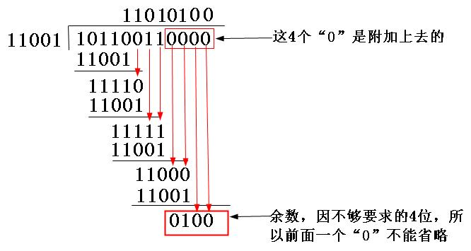

CRC校验码计算示例

- 把上步计算得到的CRC校验0100替换原始帧101100110000后面的四个“0”，得到新帧101100110100。再把这个新帧发送到接收端。

- 当以上新帧到达接收端后，接收端会把这个新帧再用上面选定的除数11001以“模2除法”方式去除，验证余数是否为0，如果为0，则证明该帧数据在传输过程中没有出现差错，否则出现了差错。

> 通过以上CRC校验原理的剖析和CRC校验码的计算示例的介绍，大家应该对这种看似很复杂的CRC校验原理和计算方法应该比较清楚了。

## 算法原理：

假设数据传输过程中需要发送15位的二进制信息g=101001110100001，这串二进制码可表示为代数多项式g(x) = x^14 + x^12 + x^9 + x^8 + x^7 + x^5+ 1，其中g中第k位的值，对应g(x)中x^k 的系数。将g(x)乘以x^m，既将g后加m个0，然后除以m阶多项式h(x)，得到的(m-1)阶余项r(x)对应的二进制码r就是CRC编码。

h(x)可以自由选择或者使用国际通行标准，一般按照h(x)的阶数m，将CRC算法称为CRC-m，比如CRC-32、CRC-64等。国际通行标准可以参看[标准](http://en.wikipedia.org/wiki/Cyclic_redundancy_check)；

g(x)和h(x)的除运算，可以通过g和h做xor（异或）运算。比如将11001与10101做xor运算：

   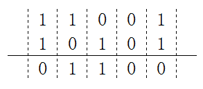

明白了xor运算法则后，举一个例子使用CRC-8算法求101001110100001的效验码。CRC-8标准的h(x) = x^8 + x^7 + x^6 + x^4 + x^2 + 1，既h是9位的二进制串111010101。

   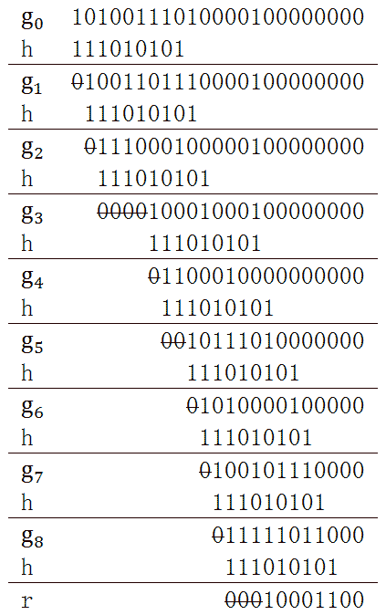

经过迭代运算后，最终得到的r是10001100，这就是CRC效验码。

通过示例，可以发现一些规律，依据这些规律调整算法：

- 每次迭代，根据g~k~的首位决定b，b是与g~k~进行运算的二进制码。若g~k~的首位是1，则b=h；若g~k~的首位是0，则b=0，或者跳过此次迭代，上面的例子中就是碰到0后直接跳到后面的非零位。

​        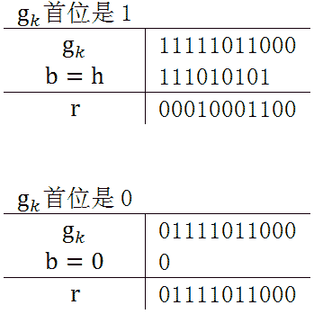

- 每次迭代，g~k~的首位将会被移出，所以只需考虑第2位后计算即可。这样就可以舍弃h的首位，将b取h的后m位。比如CRC-8的h是111010101，b只需是11010101。
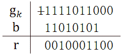

- 每次迭代，受到影响的是g~k~的前m位，所以构建一个m位的寄存器S，此寄存器储存g~k~的前m位。每次迭代计算前先将S的首位抛弃，将寄存器左移一位，同时将g的后一位加入寄存器。若使用此种方法，计算步骤如下：
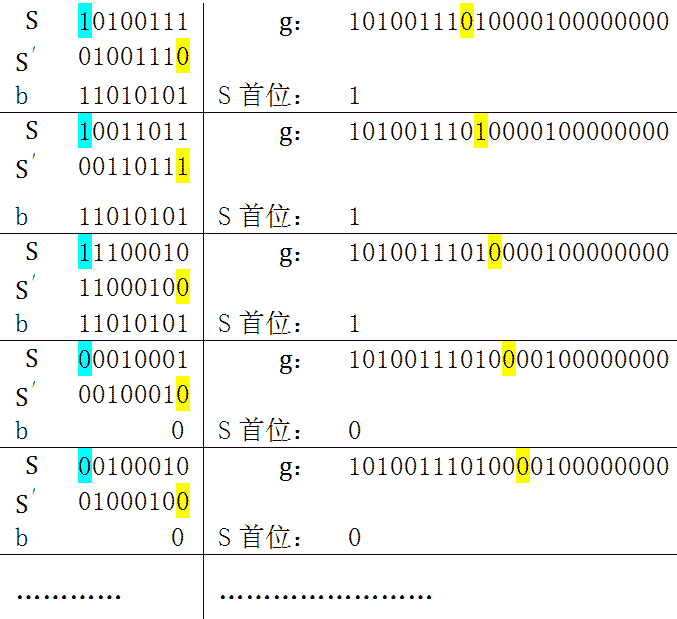

> 蓝色表示寄存器S的首位，是需要移出的，b根据S的首位选择0或者h。黄色是需要移入寄存器的位。S’是经过位移后的S。

## 查表法：

同样是上面的那个例子，将数据按每4位组成1个block，这样g就被分成6个block。

   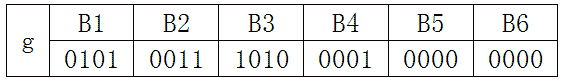

下面的表展示了4次迭代计算步骤，灰色背景的位是保存在寄存器中的。

   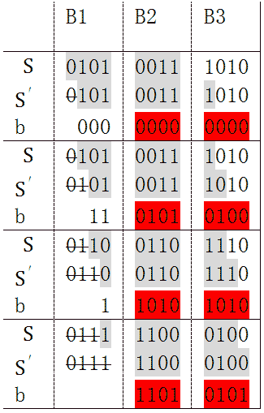

经4次迭代，B1被移出寄存器。被移出的部分，不是我们关心的，我们关心的是这4次迭代对B2和B3产生了什么影响。注意表中红色的部分，先作如下定义：

> B23 = 00111010    b1 = 00000000    b2 = 01010100    b3 = 10101010    b4 = 11010101    b’ = b1 xor b2 xor b3 xor b4

4次迭代对B2和B3来说,实际上就是让它们与b1,b2,b3,b4做了xor计算，既：

> B23 xor b1 xor b2 xor b3 xor b4

可以证明xor运算满足交换律和结合律，于是：

> B23 xor b1 xor b2 xor b3 xor b4 = B23 xor (b1 xor b2 xor b3 xor b4) = B23 xor b’

b1是由B1的第1位决定的，b2是由B1迭代1次后的第2位决定（既是由B1的第1和第2位决定），同理，b3和b4都是由B1决定。通过B1就可以计算出b’。另外，B1由4位组成，其一共2^4有种可能值。于是我们就可以想到一种更快捷的算法，事先将b’所有可能的值，16个值可以看成一个表；这样就可以不必进行那4次迭代，而是用B1查表得到b’值，将B1移出，B3移入，与b’计算，然后是下一次迭代。

   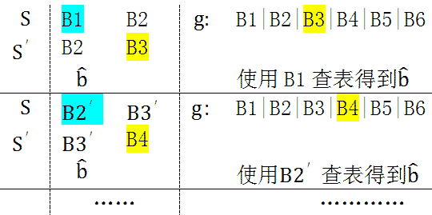

可看到每次迭代，寄存器中的数据以4位为单位移入和移出，关键是通过寄存器前4位查表获得，这样的算法可以大大提高运算速度。

上面的方法是半字节查表法，另外还有单字节和双字节查表法，原理都是一样的——事先计算出2^8或2^16个b’的可能值，迭代中使用寄存器前8位或16位查表获得b’。

## 反向算法：

之前讨论的算法可以称为正向CRC算法，意思是将g左边的位看作是高位，右边的位看作低位。G的右边加m个0，然后迭代计算是从高位开始，逐步将低位加入到寄存器中。在实际的数据传送过程中，是一边接收数据，一边计算CRC码，正向算法将新接收的数据看作低位。

逆向算法顾名思义就是将左边的数据看作低位，右边的数据看作高位。这样的话需要在g的左边加m个0，h也要逆向，例如正向CRC-16算法h=0x4c11db8，逆向CRC-16算法h=0xedb88320。b的选择0还是h，由寄存器中右边第1位决定，而不是左边第1位。寄存器仍旧是向左位移，就是说迭代变成从低位到高位。

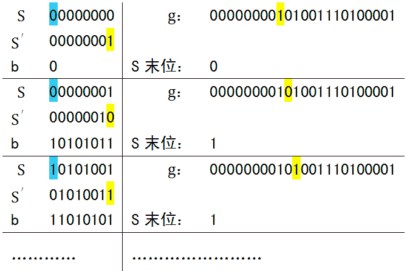

**要搞清楚的是：**

- 模2除法到底是怎么除的。（只关心当前阶段的最高位，这里要特别注意。因此我们在模2除法中不存在“不够减”的情况。）

- 查表法是啥意思。（我们不关心商，只需要余数。因为模2除法的特殊性，我们并不存在“不够减 ”的情况。所以根据前面几位我们就能知道后面几位该“减去”什么。）

- 正向反向的那个可以看看，看不懂也暂时没关系。

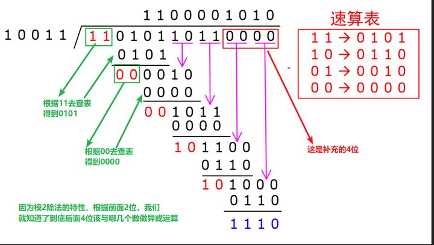

查表法示意

## CRC 校验的基本过程：

采用 CRC 校验时，发送方和接收方用同一个生成多项式 g(x) ， g(x) 是一个 GF(2) 多项式，并且 g(x) 的首位和最后一位的系数必须为 1 。

CRC 的处理方法是：发送方用发送数据的二进制多项式 t(x) 除以 g(x) ，得到余数 y(x) 作为 CRC 校验码。校验时，以计算的校正结果是否为 0 为据，判断数据帧是否出错。设生成多项式是 r 阶的（最高位是 x^r ）具体步骤如下面的描述。

> **发送方：**

- **在发送的 m 位数据的二进制多项式 t(x) 后添加 r 个 0 ，扩张到 m+ r 位，以容纳 r 位的校验码，追加 0 后的二进制多项式为 T(x) ；**

- **用 T(x) 除以生成多项式 g(x) ，得到 r 位的余数 y(x) ，它就是 CRC 校验码；**

- **把 y(x) 追加到 t(x) 后面，此时的数据 s(x) 就是包含了 CRC 校验码的待发送字符串；由于 s(x) = t(x) y(x) ，因此 s(x) 肯定能被 g(x) 除尽。**

> **接收方：**

- **接收数据 n(x) ，这个 n(x) 就是包含了 CRC 校验码的 m+r 位数据；**

- **计算 n(x) 除以 g(x) ，如果余数为 0 则表示传输过程没有错误，否则表示有错误。从 n(x) 去掉尾部的 r 位数据，得到的就是原始数据。**

## 软件计算：

如果你看了我之前第二部分提到的原理，那么下面这行代码，应该还是挺显然的（记作版本1）：

```c
r=0; while (len--) r = ((r > 24) & 0xFF];//版本1
```

（请注意，这个是4字节的版本，即余数长度为32比特，与之前我们原理部分提到的不一样。r的长度是32比特。p是char类型，自加的时候移动一个字节。）

还是解释一下：r是存储我们结果的寄存器（叫做寄存器，其实这里不是。这么称呼只是因为实际做CRC的时候可能是用硬件 移位寄存器做的。这么称呼比较…自然？），初始值为0（注意现在还是正向计算）。每次迭代，我们将r左移8位，空出来的部分自动补0.然后将移位得到的数字与一个字节的数据做或运算（这一套复杂的操作，只是为了让下一个字节的数据进入寄存器。）。另外，取出r的高8位，通过它来查表获得应该异或的数字（也就是t[(r >>24)&0xFF]）。在这里，“异或”在模2除法里就是“做减法”。

但是真正计算的时候，数据流是需要补0的（也就是Augmented message）。（不理解的话请看看第二部分的那张图，在第一部分我也略有提及。）所以上面那行代码还要加一段：

```c
for (i=0; i> 24) & 0xFF];//版本1
```

其中W是生成多项式的长度。

如何省掉这行代码呢？

或者说，如何把上面这两行代码变成下面这个玩意（记作版本2）：

```c
r=0; while (len--) r = (r> 24) ^ *p++];//版本2
```

（这行代码与我开头提到的那个几乎是一个意思，只不过计算方向有所不同）;

在解释之前，我们先看一下版本1的代码：

在最开始的阶段，寄存器r向右移位的4次，相应的移出了4个字节的0.而取表的时候，也是拿最高位的0去取。也就是说最开始的4次只是在“装填”，将数据比特装填进寄存器。

在最末尾的时候，由于我们补了0，所以最后4次移位，实际上相当于把装填进寄存器的数据流最后那4个字节全部移出。当它们全部移出时，寄存器r剩下的值就是我们需要的余数了。

也就是说…正式的流程从第一个数据字节移出开始，到最后一个数据字节移出结束。当然，这个表述有些问题，移出的不是原来的数据字节，而是它与多次查表得到的值异或得到的东西。

现在我们转头来看版本2的代码。如果比较难理解的话，我们先跟着代码迭代一次。版本2的第一次迭代：取出r的前8位（此时是0x00），与数据流的第一个字节异或（也就是得到数据流这个字节本身），根据异或结果去取表。

注意到了吗，版本2的第一次迭代，实际上就是省去了版本1的4次装填，而直接将它拿出来异或。

但好像现在只是第一次迭代看上去是对的。因为在版本2里，第一次迭代是数据流与0异或。那第二次迭代呢？第二次迭代异或的对象就不是0了呀。

其实版本1和版本2的算法是有等价性的，具体证明请参考：[https://zhuanlan.zhihu.com/p/61636624](https://zhuanlan.zhihu.com/p/61636624)

## 应用范围：

> CRC具有线性的性质。它适合用来“对抗自然”，即排除随机干扰，但并不适合防御恶意的人为修改。所以CRC被用于通信，而不是网络安全领域。

常见的CRC算法（参考[维基百科](https://zh.m.wikipedia.org/zh-my/%E5%BE%AA%E7%92%B0%E5%86%97%E9%A4%98%E6%A0%A1%E9%A9%97)）：

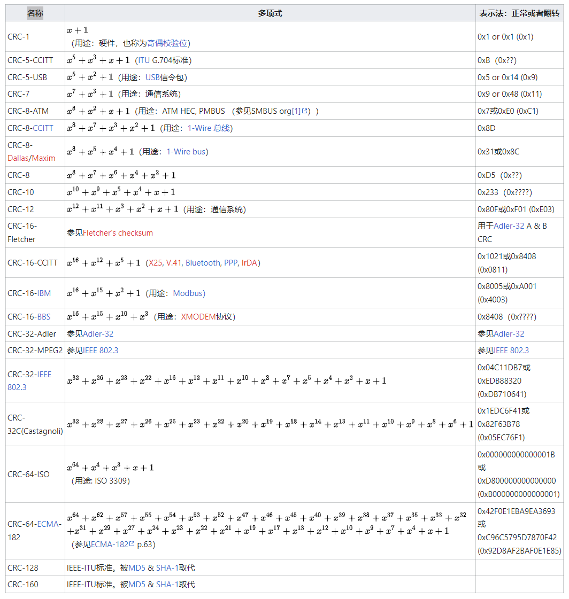

## 参考：

1、[https://liuweiqiang.win/2019/08/06/CRC%E6%A0%A1%E9%AA%8C%E5%8E%9F%E7%90%86/](https://liuweiqiang.win/2019/08/06/CRC%E6%A0%A1%E9%AA%8C%E5%8E%9F%E7%90%86/)

2、[https://blog.51cto.com/winda/1063951](https://blog.51cto.com/winda/1063951)

**3、[https://zhuanlan.zhihu.com/p/61636624](https://zhuanlan.zhihu.com/p/61636624)**

**4、[https://www.cnblogs.com/esestt/archive/2007/08/09/848856.html](https://www.cnblogs.com/esestt/archive/2007/08/09/848856.html)**
