> 我这两天又翻出来了之前做的一个ESP32-Pico-D4的板子，之前测是发现会无限重启，结果现在再试，下进去一个新的程序就能用了，这里记录一下开发中遇到的问题；

## Pico D4介绍

这个芯片资源挺多的，最主要的是内嵌了晶振和Flash，在板子布线方面容易了许多；

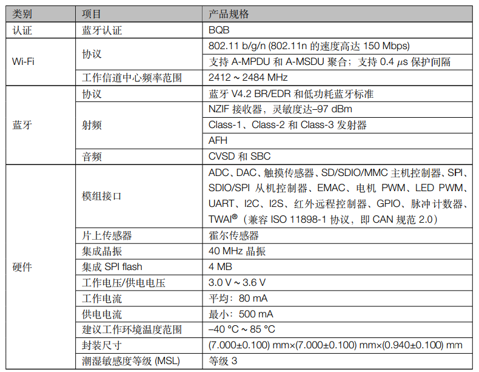

**芯片特性**

## 原理图设计

### 原理图设计参考

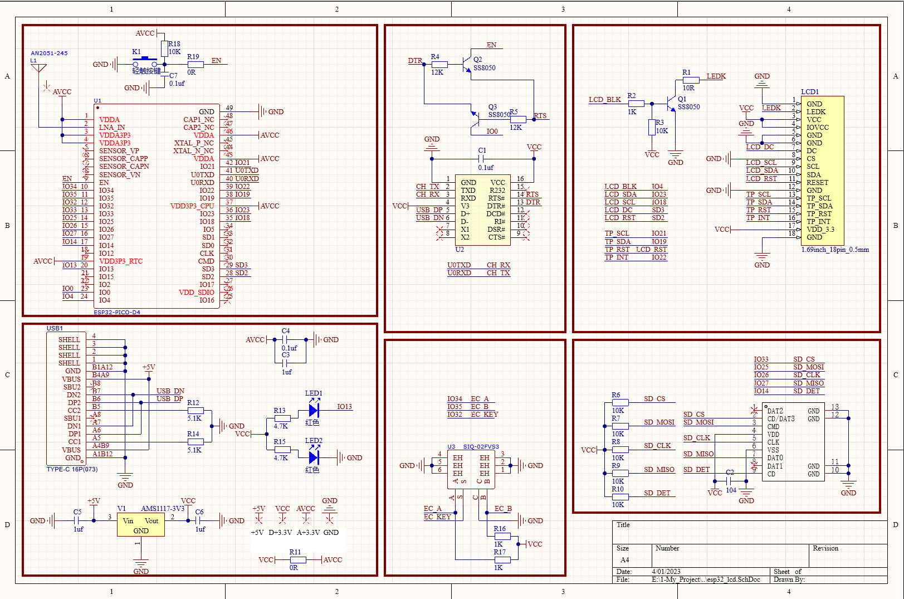

**原理图参考**

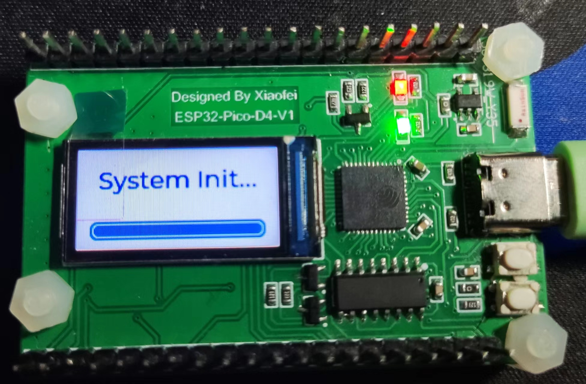

**实物图片**

### 重启问题

 `ESP32` 启动时会有如下打印:

```plaintext
rst:0x1 (POWERON_RESET),boot:0x13 (SPI_FAST_FLASH_BOOT)
```

其中 `rst` 简单说明如下:

PRO
APP
源
复位方式
注释

0x01
0x01
芯片上电复位
系统复位
-

0x10
0x10
RWDT 系统复位
系统复位
详见 ESP32 技术参考手册 WDT 章节

0x0F
0x0F
欠压复位
系统复位
详见 ESP32 技术参考手册 Power Management 章节

0x03
0x03
软件系统复位
内核复位
配置 RTC_CNTL_SW_SYS_RST 寄存器

0x05
0x05
Deep Sleep Reset
内核复位
详见 ESP32 技术参考手册 Power Management 章节

0x07
0x07
MWDT0 全局复位
内核复位
详见 ESP32 技术参考手册 WDT 章节

0x08
0x08
MWDT1 全局复位
内核复位
详见 ESP32 技术参考手册 WDT 章节

0x09
0x09
RWDT 内核复位
内核复位
详见 ESP32 技术参考手册 WDT 章节

0x0B
-
MWDT0 CPU 复位
CPU 复位
详见 ESP32 技术参考手册 WDT 章节

0x0C
-
软件 CPU 复位
CPU 复位
配置 RTC_CNTL_SW_APPCPU_RST 寄存器

-
0x0B
MWDT1 CPU 复位
CPU 复位
详见 ESP32 技术参考手册 WDT 章节

-
0x0C
软件 CPU 复位
CPU 复位
配置 RTC_CNTL_SW_APPCPU_RST 寄存器

0x0D
0x0D
RWDT CPU 复位
CPU 复位
详见 ESP32 技术参考手册 WDT 章节

-
0xE
PRO CPU 复位
CPU 复位
表明 PRO CPU 能够通过配置 DPORT_APPCPU_RESETTING 寄存器单独复位 APP CPU

`boot mode`说明如下：

ESP32 上电时会判断 strapping 管脚的状态, 并决定 boot mode；

例如常见的两种上电打印:

**下载固件模式：**

```plaintext
rst:0x1 (POWERON_RESET),boot:0x3 (DOWNLOAD_BOOT(UART0/UART1/SDIO_REI_REO_V2))
```

**芯片运行模式：**

```plaintext
rst:0x1 (POWERON_RESET),boot:0x13 (SPI_FAST_FLASH_BOOT)
```

`boot` 值由 **Strapping 管脚** 的 5 位值 `[MTDI, GPIO0, GPIO2, MTDO, GPIO5]` 共同决定。

下面是关于 **Stripping 管脚** 相关说明：

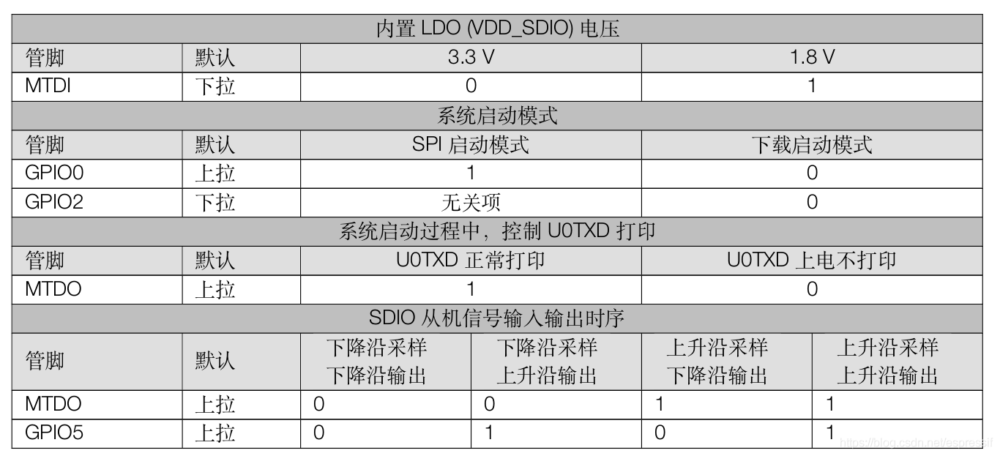
**Strapping 管脚  **

> 固件可以通过配置一些寄存器比特位，在启动后改变“内置 LDO (VDD_SDIO) 电压”和“SDIO 从机信号输入输出时序”的设定；
> ESP32-PICO-D4 集成的外部 SPI flash 工作电压为 3.3 V，因此在上电复位过程中需保持 Strapping 管脚 MTDI 为低电平；
> **注意供电不足时，打开WiFi会导致重启；**

### IO引脚分配

绿色突出显示的管脚可以使用。黄色突出显示的可以使用，但您需要注意，因为它们可能在启动时有意外行为。不建议将红色突出显示的管脚用作输入或输出：

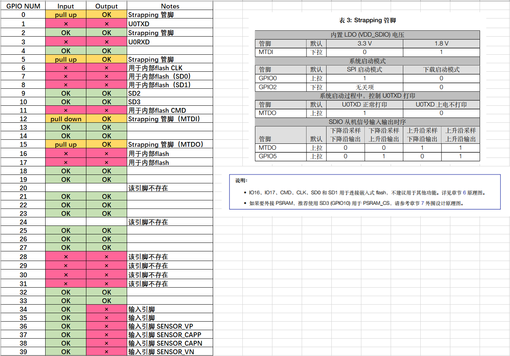

**IO引脚分配  **

### 外设引脚分配

ESP32的大多数外设信号都直接连接到其专用的IO_MUX引脚。但是，也可以使用GPIO矩阵将信号转换到任何其他可用的引脚。如果至少一个信号通过GPIO矩阵转换，则所有信号都将通过GPIO矩阵转换。

GPIO矩阵引入了转换灵活性，但也带来了以下缺点：

增加了MISO信号的输入延迟，这更可能违反MISO设置时间。如果SPI需要高速运行，请使用专用的IO_MUX引脚。

如果使用IO_MUX引脚，则允许信号的时钟频率最多为40 MHz，而时钟频率最高为80 MHz。

> ADC（模数转换器）和DAC（数模转换器）功能分配给特定的静态引脚。但是，您可以决定哪些管脚是UART、I2C、SPI、PWM等，您只需要在代码中分配它们。这是可能的，因为ESP32芯片的多路复用功能。

#### ADC

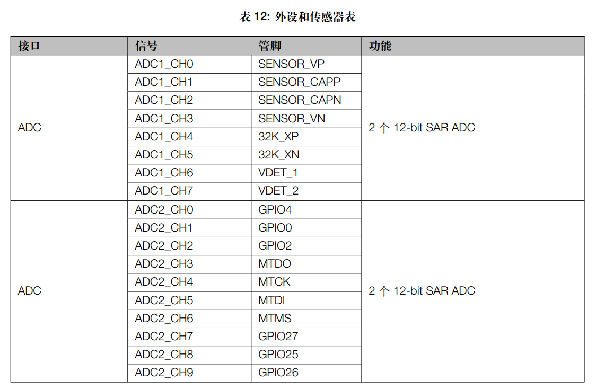

**ADC引脚分配  **

#### DAC

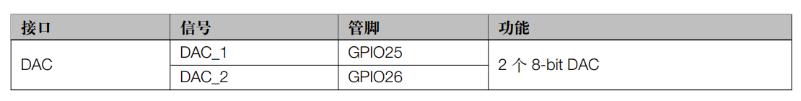

**DAC引脚分配  **

#### 触摸传感器

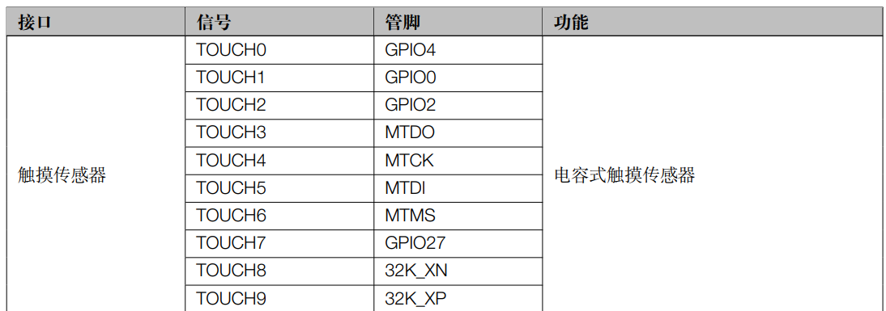

**触摸传感器引脚分配  **

#### JTAG

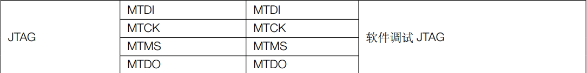

**JTAG引脚分配  **

#### SD/SDIO/MMC 主机控制器

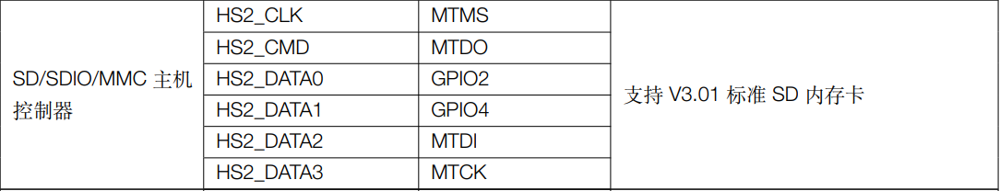

**SD/SDIO/MMC 主机控制器引脚分配  **

#### 电机PWM

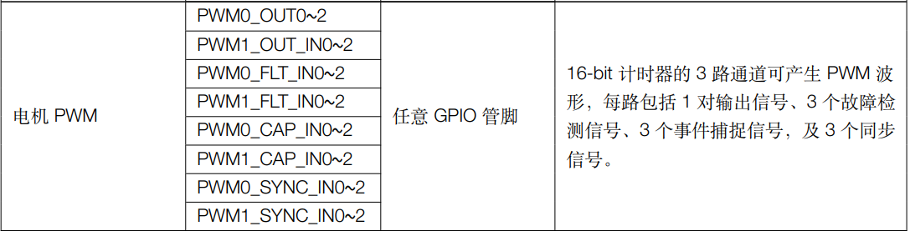

**电机PWM引脚分配  **

#### SDIO/SPI 从机控制器

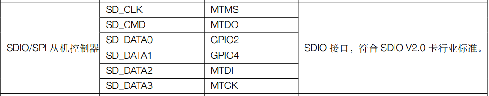

**SDIO/SPI 从机控制器引脚分配  **

#### UART

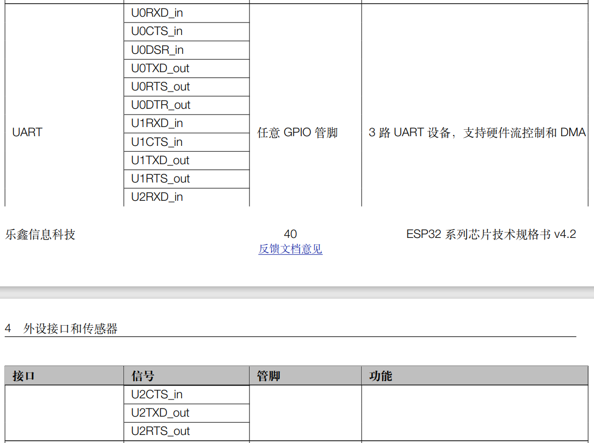

**UART引脚分配  **

#### I2C

> ESP32有两个I2C信道，任何管脚都可以设置为SDA或SCL。将ESP32与Arduino IDE一起使用时，默认I2C引脚为：
>   GPIO 21（SDA）
>   GPIO 22（SCL）

  如果要使用其他管脚，在使用导线库时，只需调用：Wire.begin(SDA, SCL);

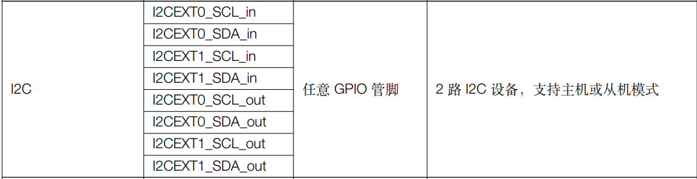

**I2C引脚分配  **

#### LED PWM

> ESP32 LED PWM控制器有16个独立信道，可以配置为生成具有不同特性的PWM信号。所有可以作为输出的管脚都可以用作PWM管脚（GPIOs 34到39不能产生PWM）。
> 要设置脉冲宽度调制信号，需要在代码中定义这些参数：
>   信号频率；
>   占空比；
>   脉宽调制信道；
>   要输出信号的GPIO。

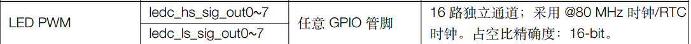

**LED PWM引脚分配  **

#### I2S

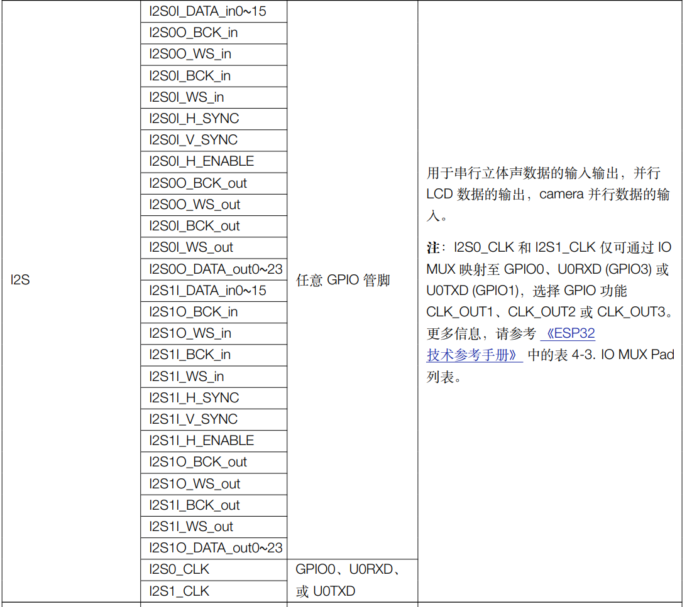

**I2S引脚分配  **

#### 红外遥控器

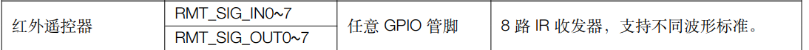

**红外遥控器引脚分配  **

#### 通用SPI

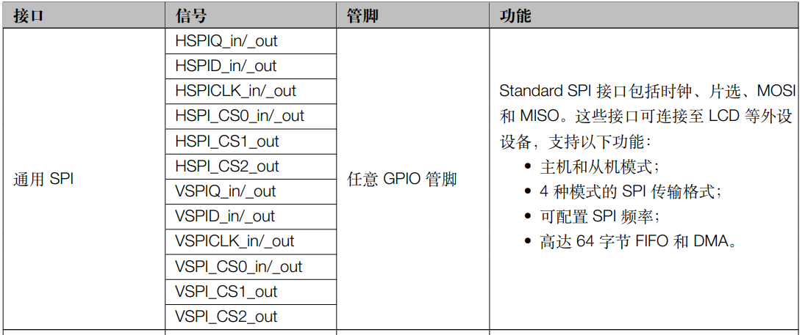

**通用SPI引脚分配  **

#### 并行SPI

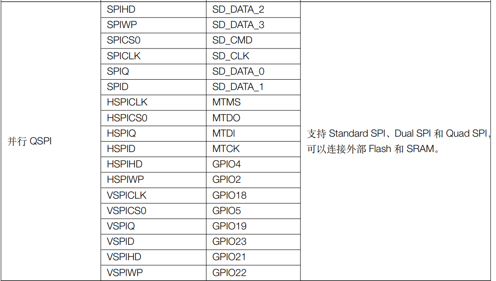

**并行SPI引脚分配  **

默认情况下，可以用的SPI的引脚映射是：

引脚对应的GPIO
SPI2
SPI3

CS0  *
15
5

SCLK
14
18

MISO
12
19

MOSI
13
23

QUADWP
2
22

QUADHD
4
21

> 仅连接到总线的第一个设备可以使用CS0引脚；

#### EMAC

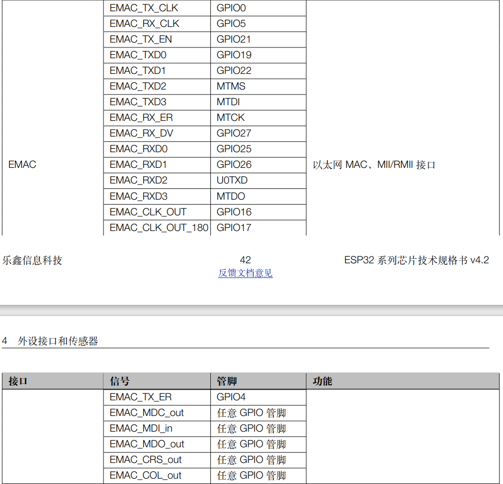

**EMAC引脚分配  **

#### 脉冲计数器

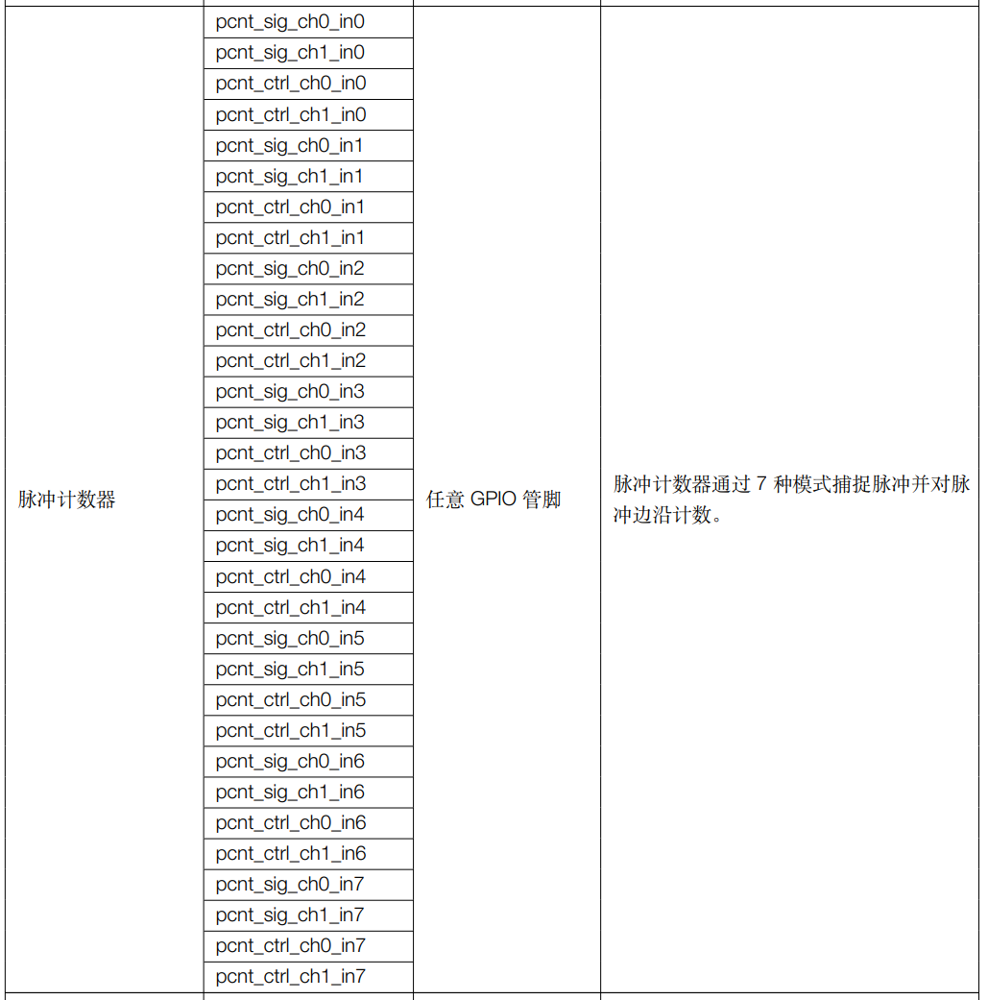

**脉冲计数器引脚分配  **

#### TWAI

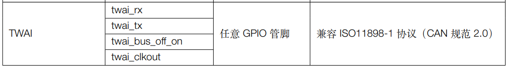

**TWAI引脚分配  **

#### 中断

> **所有GPIO都可以配置为中断；**

## 板子实物

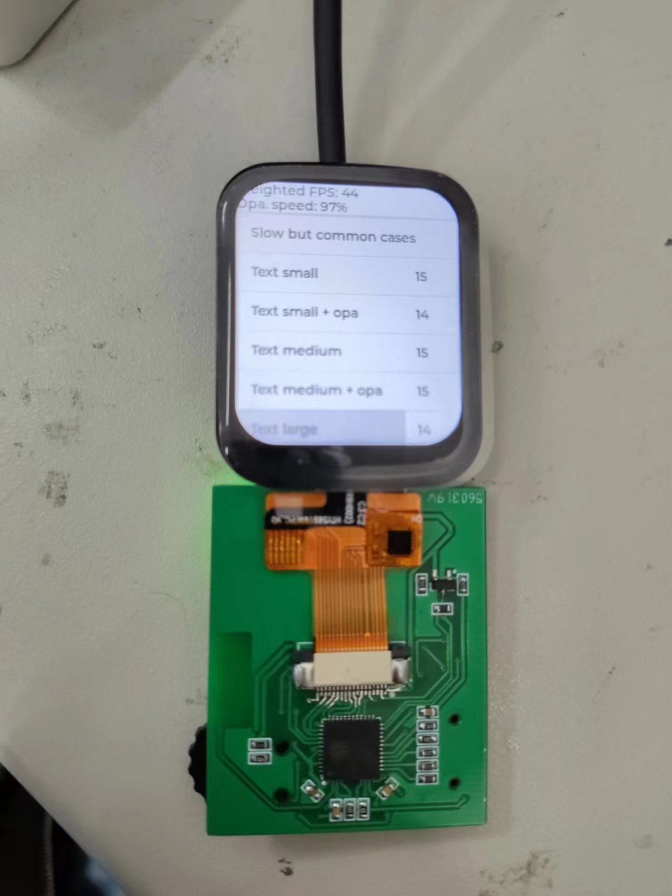

**正面**

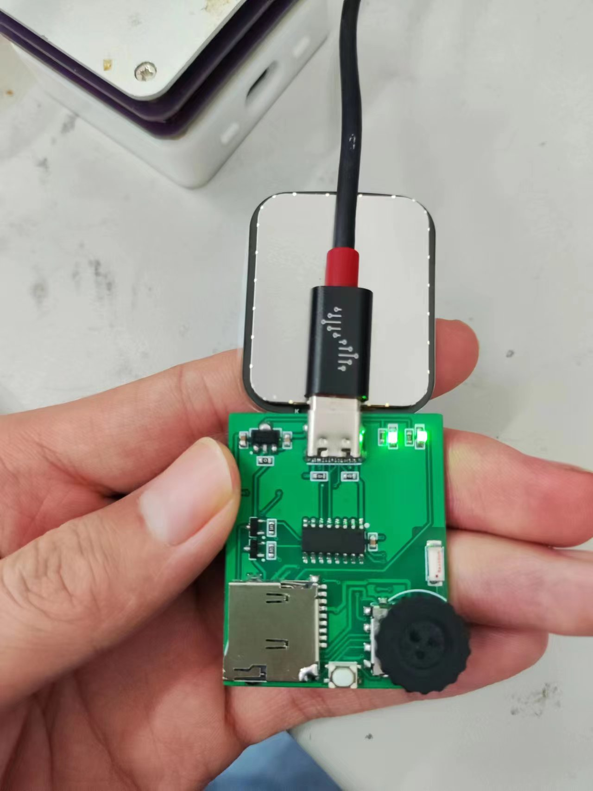

**反面**

**看看那个FPC焊盘被我刮得光亮，就知道肯定有点问题，再看屏幕方向(???)；**

**是的，我犯了一个很严重的错误，把LCD引脚的序号给搞反了；**

**好消息是：芯片功能都正常，屏幕显示，触摸，编码器开关等等都没问题；**

**坏消息是：屏幕方向搞反了，根本没法正常用，还得重新打板；**

> :cry:！！！
