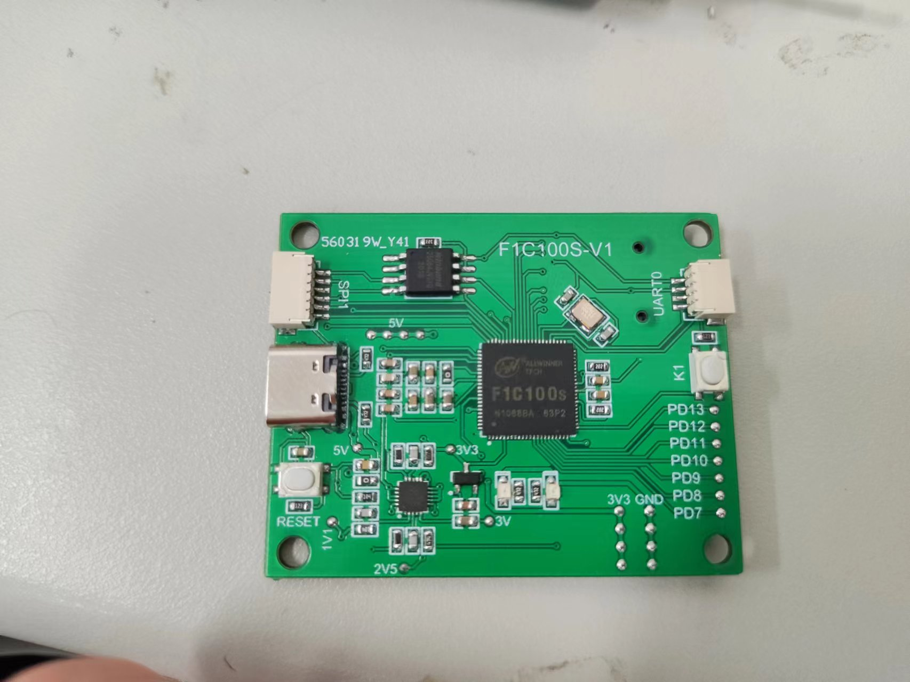
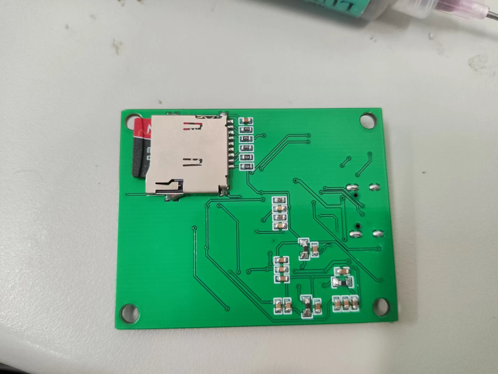
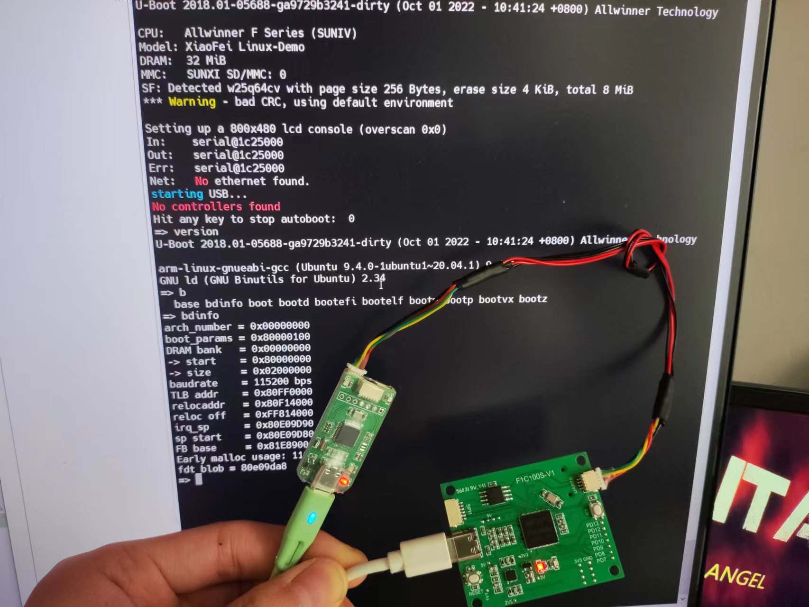

> 最近画了一个Linux板子，主控是全志的F1C100S，自带了32M RAM，不是很大，但是可以学习下；

## 板子图片：

板子正面
板子反面
UBoot启动





## FLASH下载工具使用

1、通过命令 `sudo sunxi-fel ver` 来确认有无成功进入fel模式；

```bash
sudo sunxi-fel ver
```

2、短接FLASH`1`和`4`脚，可以进入fel模式，其实就是CS引脚拉低；

3、单次运行（下载到RAM中）：

```bash
sunxi-fel uboot /your/path/to/u-boot-sunxi-with-spl.bin
```

4、烧进 spi-flash （开机自启）

```plaintext
sunxi-fel -p spiflash-write 0 /your/path/to/u-boot-sunxi-with-spl.bin
```

其中0是烧录偏移地址；

## Uboot编译

```bash
sudo apt-get install git
git clone https://gitee.com/LicheePiNano/u-boot.git
cd u-boot
# 查看分支
git branch -a
# 切换到 Nano 分支
git checkout nano-lcd800480
```

```bash
git clone -b nano-lcd800480 --depth=1 https://github.com/Lichee-Pi/u-boot.git
此处告知make采用arm-linux-gnueabi下的所有交叉编译工具，目标架构为Arm，设定各项默认配置为 nano 的spiflash支持版
make ARCH=arm CROSS_COMPILE=arm-linux-gnueabi- f1c100s_nano_uboot_defconfig

# 若不带spi-flash的板子，请换成 licheepi_nano_defconfig

# 进行可视化配置
make ARCH=arm menuconfig

# 修改默认bootcmd
gedit include/configs/suniv.h
# 需要修改为
#define CONFIG_BOOTCOMMAND "run distro_bootcmd"

# 开始编译
make ARCH=arm CROSS_COMPILE=arm-linux-gnueabi- -j8
```

只需要`u-boot-sunxi-with-spl.bin`即可；

## boot.scr

> 根据上面对`bootcmd`的修改，u-boot启动时会从第一分区读取 `boot.scr` 文件，并执行其中的脚本。我们可以通过这个来设置要传递给linux内核的参数、来加载内核和设备树、来启动内核。

**在uboot目录下新建boot.cmd文件，向其中写入u-boot要执行的脚本：**

```bash
cd ~/f1c100s-sdk/u-boot/
touch boot.cmd
gedit boot.cmd
```

**写入以下内容：**

```bash
#设置传递给内核的bootargs参数
#读取内核镜像和设备树到内存中指定位置
#启动内核程序
setenv bootargs console=tty0 console=ttyS0,115200 panic=5 rootwait root=/dev/mmcblk0p2 rw
load mmc 0:1 0x80008000 zImage
load mmc 0:1 0x80C00000 suniv-f1c100s-licheepi-nano.dtb
bootz 0x80008000 - 0x80C00000
```

使用u-boot编译后tools目录下的 `mkimage` 工具可以将`boot.cmd`文件生成为 `boot.scr` 文件，通过下面命令：

```bash
#arm架构；不压缩；script文件；输入boot.cmd文件；输出boot.scr文件
tools/mkimage -A arm -C none -T script -d boot.cmd boot.scr
```

**生成的 `boot.scr` 文件就在当前目录下；**

## Linux编译

1、Linux下载

```bash
git clone https://gitee.com/LicheePiNano/Linux.git
cd ./Linux
```

2、Linux编译

```bash
make ARCH=arm f1c100s_nano_linux_defconfig

make ARCH=arm CROSS_COMPILE=arm-linux-gnueabi- -j8

make ARCH=arm CROSS_COMPILE=arm-linux-gnueabihf- -j16 INSTALL_MOD_PATH=out modules

make ARCH=arm CROSS_COMPILE=arm-linux-gnueabihf- -j16 INSTALL_MOD_PATH=out modules_install
```

**编译成功后，生成文件所在位置：**

- **内核img文件：`./arch/arm/boot/zImage`**

- **设备树dtb文件:`./arch/arm/boot/dts/suniv-f1c100s-licheepi-nano.dtb`**

- **modules文件夹：`./out/lib/modules`**

## buildrooft构建根文件系统

> buildroot可用于构建小型的linux根文件系统。
>   大小最小可低至2M，与内核一起可以放入最小8M的spi flash中。
>   buildroot中可以方便地加入第三方软件包（其实已经内置了很多），省去了手工交叉编译的烦恼。

### 下载安装

首先安装一些依赖，比如linux头文件：

```bash
apt-get install linux-headers-$(uname -r)
```

然后下载安装：

```bash
wget https://buildroot.org/downloads/buildroot-2021.02.4.tar.gz
tar xvf buildroot-2021.02.4.tar.gz
cd buildroot-2021.02.4/
make menuconfig
```

### 配置

```bash
make menuconfig

以下选项为基础配置：

- Target options
  - Target Architecture (ARM (little endian))
  - Target Variant arm926t
- Toolchain
  - C library (musl) # 使用musl减小最终体积
- System configuration
  - Use syslinks to /usr .... # 启用/bin, /sbin, /lib的链接
  - Enable root login # 启用root登录
  - Run a getty after boot # 启用登录密码输入窗口
  - (licheepi) Root password #　默认账户为root 密码为licheepi

另可自行添加或删除指定的软件包
```

#### 一些配置的简单说明

```bash
Target options  --->

    Target Architecture Variant (arm926t)  --->   // arm926ejs架构
[ ] Enable VFP extension support                  // Nano 没有 VFP单元，勾选会导致某些应用无法运行
    Target ABI (EABI)  --->
    Floating point strategy (Soft float)  --->    // 软浮点

System configuration  --->

    (Lichee Pi) System hostname                   // hostname
    (licheepi) Root password                      // 默认账户为root 密码为licheepi
    [*] remount root filesystem read-write during boot  // 启动时重新挂在文件系统使其可读写
```

### 编译

```bash
make
```

编译的过程如果带上下载软件包的时间比较漫长，很适合喝杯茶睡个午觉；(buildroot不能进行多线程编译)

**编译完成的镜像包，是`buildroot-2021.02.4/output/images/rootfs.tar`；**

## 测试程序

嵌入式linux开发最终是需要在系统上运行应用程序来实现特定的功能需求，这里编写个基础的应用程序用于测试：

建立程序文件夹并进入

```bash
mkdir helloworld
cd helloworld/
```

建立程序文件并编写程序

```bash
touch helloworld.c
gedit helloworld.c
```

写入以下内容：

```c
#include
int main(void)
{
	printf("Hello, world!\n");
}
```

编译生成可执行文件：

```bash
arm-linux-gnueabi-gcc -static helloworld.c -o helloworld
```

生成的 helloworld 就是我们需要的可执行文件了。

> 需要静态编译；

## 系统烧录(SD卡)

### 在SD卡中放了以下文件：

```bash
├── boot.cmd
├── boot.scr*（这个可以在Uboot中输入对应命令达到相同的结果）
├── helloworld*
├── rootfs.tar*
├── suniv-f1c100s-licheepi-nano.dtb*
├── u-boot-sunxi-with-spl.bin*
└── zImage*
```

> 带星号的是加载进SD卡中的；
>   分别是U-boot、rootfs、Linux、boot.scr、测试程序；
>   **关于boot.scr：**
>   修改默认bootcmd：
> ```bash
> gedit include/configs/suniv.h
> ```
>   需要修改为：
> ```c
> #define CONFIG_BOOTCOMMAND "run distro_bootcmd"
> ```
>   然后就可以编译了：
>   根据上面对bootcmd的修改，u-boot启动时会从第一分区读取 boot.scr 文件，并执行其中的脚本。我们可以通过这个来设置要传递给linux内核的参数、来加载内核和设备树、来启动内核。

  **也可以使用Uboot中的boot命令：**

> boot 命令也是用来启动 Linux 系统的，只是 `boot`会读取环境变量 `bootcmd` 来启动 Linux 系  统， `bootcmd` 是一个很重要的环境变量！其名字分为“`boot`”和“`cmd`”，也就是“引导”和“命  令”，说明这个环境变量保存着引导命令，其实就是启动的命令集合，具体的引导命令内容是可  以修改的。比如我们要想使用 tftp 命令从网络启动 Linux 那么就可以设置 `bootcmd`为`“tftp
>   80800000 zImage; tftp 83000000 imx6ull-14x14-emmc-7-1024x600-c.dtb; bootz 80800000 -83000000”`，然后使用 `saveenv`将 `bootcmd`保存起来。然后直接输入 boot 命令即可从网络启动Linux 系统，命令如下：
> ```bash
> $:setenv bootcmd 'tftp 80800000 zImage; tftp 83000000 imx6ull-14x14-emmc-7-1024x600-c.dtb;bootz 80800000 - 83000000'
> $:saveenv
> $:boot
> ```

  **boot**命令使用如下所示：

```bash
$:setenv bootcmd 'setenv bootargs console=tty0 console=ttyS0,115200 panic=5 rootwait root=/dev/mmcblk0p2 rw; load mmc 0:1 0x80008000 zImage; load mmc 0:1 0x80C00000 suniv-f1c100s-licheepi-nano.dtb; bootz 0x80008000 - 0x80C00000'
$:saveenv
$:boot
```

  **最后输入boot，启动linux系统，并且重启后仍会自动跳转进入linux系统；**

**得到了需要的所有文件，接下来是烧录到SD卡中；**

### 文件烧录：

> 前面编译生成的内容可以分块分别烧录进SD卡进行测试，也可以将 u-boot & linux & rootfs 整块打包烧录进SD卡进行测试，其实本质上是一样的，这里先进行分块测试的介绍，打包烧录介绍将在后面的章节说明。

- 先将SD卡插入Ubuntu中；

- 使用 lsblk 查看SD卡设备号sdX；

我这里显示为sdb，下面均以此进行说明；

#### 分区设置：

准备SD卡并按要求分区，空间划分参考下表：

start
sector
size
usage

0KB
0
8KB
Unused, available for an MBR or (limited) GPT partition table

8KB
16
32KB
Initial SPL loader

40KB
80
Max 984KB
U-Boot

1MB
2048
-
bootfs and rootfs

**下面是在Ubuntu终端中进行分区划分示例：**

如果已经分过区了那么Ubuntu可能会自动挂载；

逐条使用 sudo umount /dev/sdbn 进行卸载；

对SD（TF）卡进行分区：

```bash
sudo fdisk /dev/sdb
#如果有分区的话可以输入 d 回车依次删除
#输入 n 新建分区，分区大小根据需要设置即可
#下面是我新建的两个分区的输入情况
#n回车  回车(p)  回车(1)  回车(2048)  +32M回车  (如果有额外提示则Y回车)
#n回车  回车(p)  回车(2)  回车(67584) +200M回车  (如果有额外提示则Y回车)
#输入 w 回车保存退出，输入使用 lsblk 查看分区情况
```

格式化分区建立文件系统：

```bash
sudo mkfs.vfat /dev/sdb1
sudo mkfs.ext4 /dev/sdb2
```

#### 分块烧录:

##### u-boot：

> u-boot-sunxi-with-spl.bin 文件需要放置在SD卡8k开始的位置上：

```bash
cd ~/f1c100s-sdk/u-boot/
sudo dd if=u-boot-sunxi-with-spl.bin  of=/dev/sdb bs=1024 seek=8
```

##### linux & dtb & boot.scr

> 这三个放在刚才新建的第一个分区里（sdb1）：

```bash
#如果分区已挂载到别的地方先进行卸载
sudo umount /dev/sdb1
#将分区挂载到 /mnt
sudo mount /dev/sdb1 /mnt
#拷贝linux和dtb
cd ~/f1c100s-sdk/linux/
sudo cp arch/arm/boot/zImage /mnt/
sudo cp arch/arm/boot/dts/suniv-f1c100s-licheepi-nano.dtb /mnt/
#拷贝boot.scr
cd ~/f1c100s-sdk/u-boot/
sudo cp boot.scr /mnt/
#保存退出
sync
sudo umount /dev/sdb1
```

##### rootfs：

> 这个放在刚才新建的第二个分区里（sdb2）：

```bash
#如果分区已挂载到别的地方先进行卸载
sudo umount /dev/sdb2
#将分区挂载到 /mnt
sudo mount /dev/sdb2 /mnt
#解压并拷贝rootfs
cd ~/f1c100s-sdk/buildroot-2022.02/
sudo tar -xf output/images/rootfs.tar -C /mnt/
#保存退出
sync
sudo umount /dev/sdb2
```

##### 测试程序：

```bash
#如果分区已挂载到别的地方先进行卸载
sudo umount /dev/sdb2
#将分区挂载到 /mnt
sudo mount /dev/sdb2 /mnt
#拷贝helloworld
cd ~/f1c100s-sdk/helloworld/
sudo cp helloworld /mnt/root/
#保存退出
sync
sudo umount /dev/sdb2
```

## 系统烧录(SPI FLASH 16M)

### Flash分区：

分区序号
分区大小
分区作用
地址空间及分区名

mtd0
1MB
spl+uboot
0x0000000-0x0100000 : “uboot”

mtd2
64KB
dtb文件
0x0100000-0x0110000: “dtb”

mtd2
4MB
linux内核
0x0110000-0x0510000 : “kernel”

mtd3
剩余
根文件系统
0x0510000-0x0c00000 : “rootfs”

mtd4
剩余
用户区
0x0c00000-0x1000000 : “user”

烧录前要进入fel模式，然后进行程序下载；

### 烧录文件准备：

**只有根文件系统烧录文件与TF卡的不同，其他文件均相同；**

准备根文件系统，生成`rootfs.img`镜像文件：

1、新建一个目录`make_rootfs`（这个目录随便找一个路径放就可以了），拷贝`rootfs.tar`到`make_rootfs`目录下。

2、使用命令解压：

```bash
tar -xf rootfs.tar
```

然后删除压缩包：

```bash
rm -rf rootfs.tar
```

3、回到上级目录`make_rootfs`：

```bash
cd ../
```

4、然后使用命令生成`rootfs.img`：

```bash
mkfs.jffs2 -s 0x100 -e 0x10000 -p 0x6F0000 -d rootfs/ -o rootfs.img
```

> 说明：（0x10000：块擦除大小）,（0x6F0000：分区的大小）；

5、`mtd-utils`安装：
此步骤是上一步制作根文件系统的命令没有的前提下进行的；

安装`mkfs.jffs2`工具：

```bash
sudo apt-get install mtd-utils
```

### 烧录命令：

清空flash，进入FEL模式：

```bash
sf probe 0
sf erase 0 0x100000 #清空flash
reset				#即可重新进入fel模式
```

#### 烧录u-boot

```bash
sudo sunxi-fel -p spiflash-write 0 ./u-boot-sunxi-with-spl.bin
```

#### 烧录kernel

```bash
sudo sunxi-fel -p spiflash-write 0x0110000 ./zImage
```

#### 烧录dtb

```bash
sudo sunxi-fel -p spiflash-write 0x0100000 ./suniv-f1c100s-licheepi-nano.dtb
```

#### 烧录rootfs

```bash
sudo sunxi-fel -p spiflash-write 0x0510000 ./rootfs.img
```

#### 烧录userfs

> 说明：这个是个人创建的文件系统，该分区如果不需要可以不烧了；

```bash
sudo sunxi-fel -p spiflash-write 0x0c00000 userfs.img
```

### U-boot中启动系统：

```bash
sf probe 0 50000000
sf read 0x80C00000 0x100000 0x10000  #加载dtb设备树
sf read 0x80008000 0x110000 0x400000 #加载内核
bootz 0x80008000 - 0x80C00000
```

```bash
setenv bootcmd 'sf probe 0 50000000; sf read 0x80C00000 0x100000 0x10000; sf read 0x80008000 0x110000 0x400000; bootz 0x80008000 - 0x80C00000'
saveenv
```

## U-boot中sf命令用法：

- **sf read用来读取flash数据到内存；**

- **sf write写内存数据到flash；**

- **sf erase 擦除指定位置,指定长度的flash内容, 在进行写flash的时候一定要先进行擦除，否则会失败，因为flash只能从1变为0；**

### 具体用法：

```bash
sf - SPI flash sub-system

Usage:0
sf probe [[bus:]cs] [hz] [mode] - init flash device on given SPI bus
                                  and chip select
sf read addr offset len - read `len' bytes starting at
                                  `offset' to memory at `addr'
sf write addr offset len        - write `len' bytes from memory
                                  at `addr' to flash at `offset'
sf erase offset [+]len          - erase `len' bytes from `offset'
                                  `+len' round up `len' to block size
sf update addr offset len       - erase and write `len' bytes from memory
                                  at `addr' to flash at `offset'
```

### 示例：

#### 连接flash：

```bash
sf probe 0
```

> 在使用sf的其他命令之前必须先进行此操作进行连接flash；

#### 写flash：

```plaintext
sf write 0x82000000 0x8000 0x20000
```

> 把内存0x8200 0000处的数据, 写入flash的偏移0x80000, 写入数据长度为0x20000(128KB), 操作偏移和长度最小单位是Byte；

#### 读flash：

```bash
sf read 0x82000000 0x10000 0x20000
```

> 把flash偏移0x10000(64KB)处, 长度为0x20000(128KB)的数据, 写入到内存0x82000000, 操作偏移和长度最小单位是Byte；

#### 擦除flash：

```bash
sf erase 0x0 0x10000
```

> 擦除偏移0x0处, 到0x10000之间的擦除块, 擦除操作是以erase block为单位的, 要求offset和len参数必须是erase block对齐的；

## sunxi-fel工具的使用：

### 安装：

```bash
git clone -b f1c100s-spiflash https://github.com/Icenowy/sunxi-tools.git
cd sunxi-tools
make && sudo make install

sudo apt install pkg-config
sudo apt install pkgconf
sudo apt-get install zlib1g-dev
sudo apt-get install libusb-1.0-0-dev
```

### 用法：

```bash
Usage: ./sunxi-fel [options] command arguments... [command...]
    -h, --help            Print this usage summary and exit
    -v, --verbose            Verbose logging
    -p, --progress            "write" transfers show a progress bar
    -l, --list            Enumerate all (USB) FEL devices and exit
    -d, --dev bus:devnum        Use specific USB bus and device number
        --sid SID            Select device by SID key (exact match)

    spl file            Load and execute U-Boot SPL
        If file additionally contains a main U-Boot binary
        (u-boot-sunxi-with-spl.bin), this command also transfers that
        to memory (default address from image), but won't execute it.

    uboot file-with-spl        like "spl", but actually starts U-Boot
        U-Boot execution will take place when the fel utility exits.
        This allows combining "uboot" with further "write" commands
        (to transfer other files needed for the boot).

    hex[dump] address length    Dumps memory region in hex
    dump address length        Binary memory dump
    exe[cute] address        Call function address
    reset64 address            RMR request for AArch64 warm boot
    memmove dest source size    Copy  bytes within device memory
    readl address            Read 32-bit value from device memory
    writel address value        Write 32-bit value to device memory
    read address length file    Write memory contents into file
    write address file        Store file contents into memory
    write-with-progress addr file    "write" with progress bar
    write-with-gauge addr file    Output progress for "dialog --gauge"
    write-with-xgauge addr file    Extended gauge output (updates prompt)
    multi[write] # addr file ...    "write-with-progress" multiple files,
                    sharing a common progress status
    multi[write]-with-gauge ...    like their "write-with-*" counterpart,
    multi[write]-with-xgauge ...      but following the 'multi' syntax:
                       addr file [addr file [...]]
    echo-gauge "some text"        Update prompt/caption for gauge output
    ver[sion]            Show BROM version
    sid                Retrieve and output 128-bit SID key
    clear address length        Clear memory
    fill address length value    Fill memory

    spiflash-info            Retrieves basic information
    spiflash-read addr length file    Write SPI flash contents into file
    spiflash-write addr file    Store file contents into SPI flash
```

### 示例：

烧录文件到FLASH：

```bash
sudo sunxi-fel -p spiflash-write 0 Your-Flash-BIN
```

烧录到RAM中：

```bash
sudo sunxi-fel uboot u-boot-sunxi-with-spl.bin
```

检测usb设备：

```bash
$: sudo sunxi-fel -l
USB device 002:005   Allwinner F1C100s
```

列出设备信息：

```bash
$:
AWUSBFEX soc=00001663(F1C100s) 00000001 ver=0001 44 08 scratchpad=00007e00 00000000 00000000
```

## F1C100S GPIO操作：

```bash
#使用sysfs操作GPIO的例子：
echo 192 > /sys/class/gpio/export  #导出 PG0, GREEN
ls /sys/class/gpio/
export     gpio192    gpiochip0  unexport
ls /sys/class/gpio/gpio192/
active_low direction subsystem/ value device/ power/ uevent
echo "out" > /sys/class/gpio/gpio192/direction #设置为输出
echo 0 > /sys/class/gpio/gpio192/value     #亮灯
echo 1 > /sys/class/gpio/gpio192/value #灭灯
echo "in" > /sys/class/gpio/gpio192/direction #设置为输入
cat /sys/class/gpio/gpio192/value #读取电平
0
```

引脚计算规则：

> 在Linux中，GPIO 使用0～MAX_INT之间的整数标识。
> 对于32位CPU，每组GPIO 32个，引脚号就是按顺序排列。
> 从PA0开始gpio是0，那么PE3对应是32*4+3=131，经试验已验证；

这个板子是PE12引脚为LED引脚，故：

PIN_{num}=32\times4+12=140
故点灯的脚本如下：

```bash
echo "out" > /sys/class/gpio/gpio140/direction #设置为输出
#死循环
while true
do
    echo 0 > /sys/class/gpio/gpio140/value
    echo "点亮"
    sleep 0.1
    echo 1 > /sys/class/gpio/gpio140/value
    sleep 0.1
    echo "熄灭"
done
```

## Linux取消开机登录输入账户密码：

找到 /etc/inittab 文件的：

```ini
console::respawn:/sbin/getty -L console 0 vt100 # GENERIC_SERIAL
```

修改为：

```ini
console::respawn:-/bin/sh
```

重启后就没有恼人的 login 提示了；
