> 大四应该没多少事情了，想继续做一下FOC相关的；

# 开发过程(持续更新)：

## 2022年9月29日：

中间好久没有更新，是这几天比较忙，没有时间写；

算下来，FOC的板子做了三个大的版本，五个比较小的版本，可以说是一次次的迭代更新；

主控
供电方案
驱动模块
是否有电流采样
通信方式

FOC-V1
STM32F103C6T6
AMS1117-3.3V
DRV8313
否
UART

FOC-V2
STM32F103C6T6
AMS1117-3.3V
DRV8313
否
UART

FOC-V3
STM32F103C6T6
AMS1117-3.3V
MP6540
是
UART

FOC-V4
AT32F403ACGU7
AMS1117-5V & AMS117-3.3V
DRV8313
否
UART

FOC-V5
STM32F405RGT6
L7805 & AMS1117-3.3V
BTN7960B
是
UART/CAN

**代码自己也加入了很多功能，电流环还没有做出来，后边再继续努力做，加油！**

#### 板子PCB：

版本
图片

FOC-V1
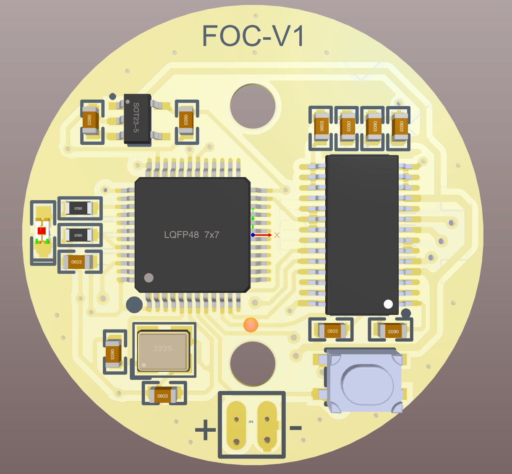

FOC-V2
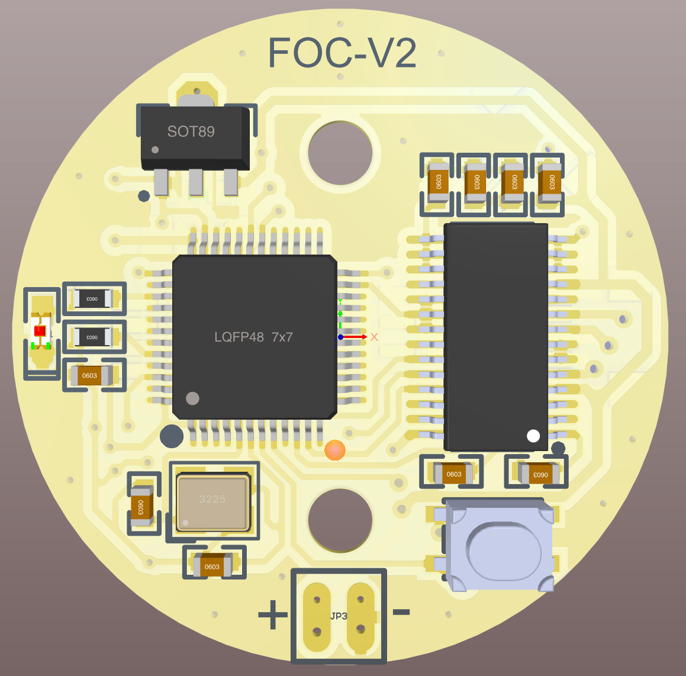

FOC-V3
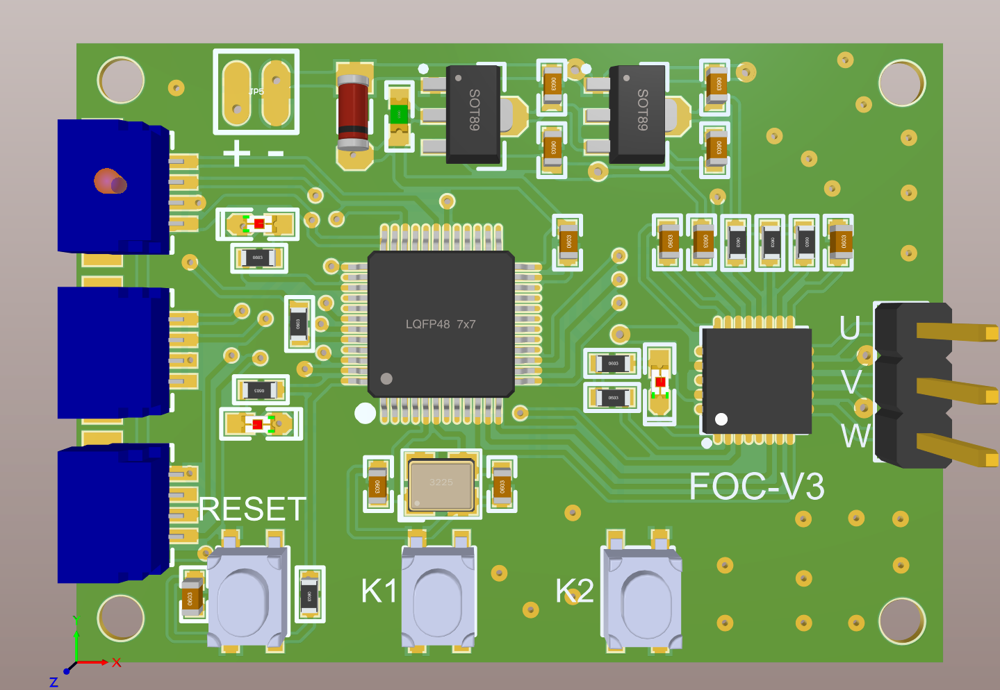

FOC-V4
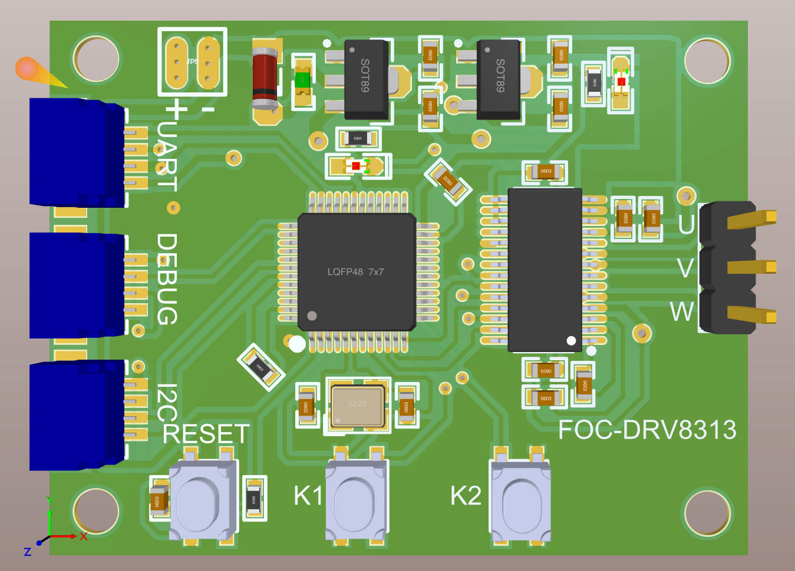

FOC-V5
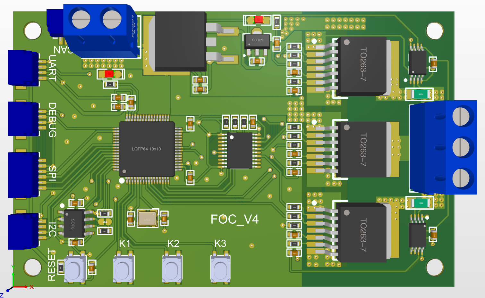

## 2022年9月12日：

中间好久不更新，这些天对FOC项目做了更多的测试，还有做了一些应用，例如倒立摆，平衡车等等；

想要加上电流环，刚开始自然的想法是，用合金采样电阻加电流放大器加stm32的AD，这个外围电路比较麻烦，成本也很高；

昨天查找资料发现了一个芯片：**MP6540**，三相电机驱动芯片，且内部集成了电流检测，只需要用32的AD去读就可以了，今上午画了一个测试板，已经发去打样了，希望能正常工作；

等板子回来了，我测试一下，在说要不要改用这个芯片；

## 2022年9月3日：

修改的板子今天已经到了，焊接好了，也测试了，很完美，发热没那么严重了；

这次使用的LDO是AMS1117(SOT-89封装)，它的输入最高电压是18V，完全够用了，发热虽然还是很大，但封装也更大了，所以还是可以接受的；

AMS1117数据手册说明的的输入电压限制

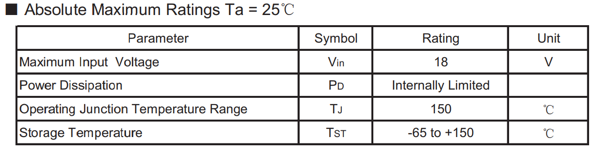

在测试过程中，长时间运转未出现任何问题，闭环控制，开环控制都可以很好运转；

后续就是开始做平衡车，调参数；

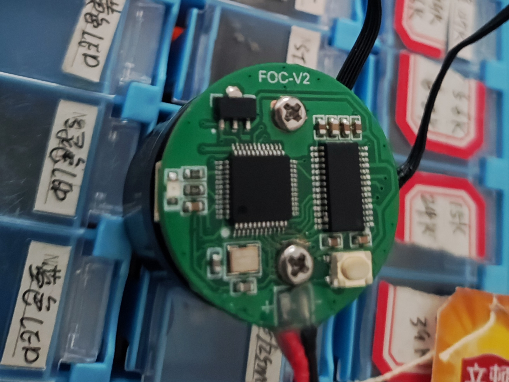

## 2022年8月22日：

今天又查看了一下RT9013-33GB的数据手册，发现电压最大为5.5V，看来是要换供电部分的电路了；

输入电压限制
输出电流限制

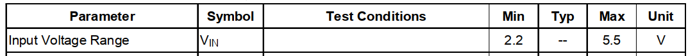

下午用飞线将降压芯片换成了AMS1117-3.3V，效果还好，不过还是会出现温度很高的情况；

更换降压芯片后的板子

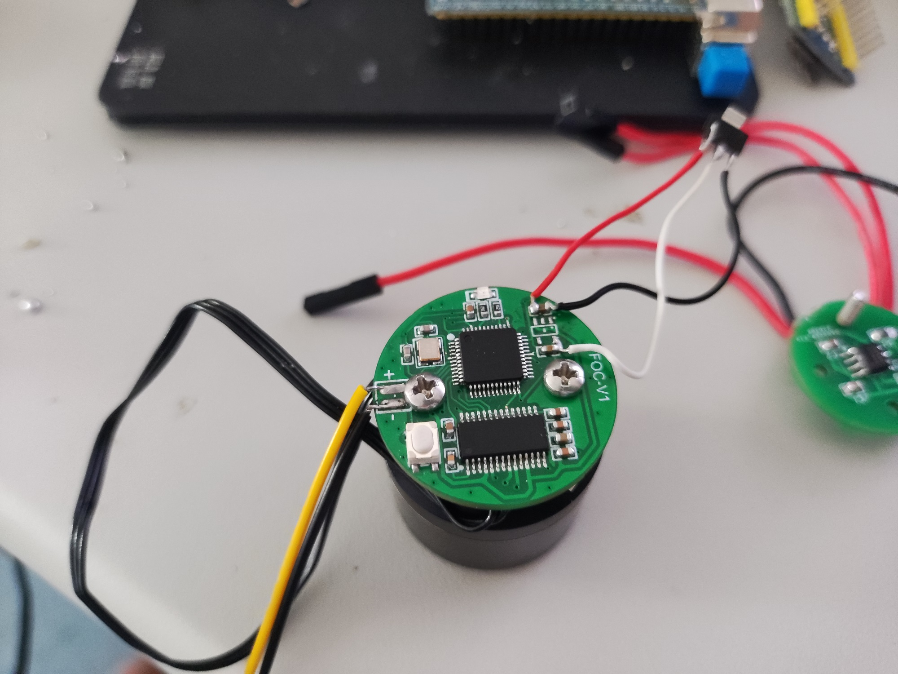

测试了闭环角度控制以及闭环速度控制，效果都还挺好的；

后续调参数，修改板子；

## 2022年8月21日：

板子已经收到，并且已经焊好各种元件以及安装在配套的无刷云台电机上；

图片如下所示：

板子实物图
凌乱的桌面

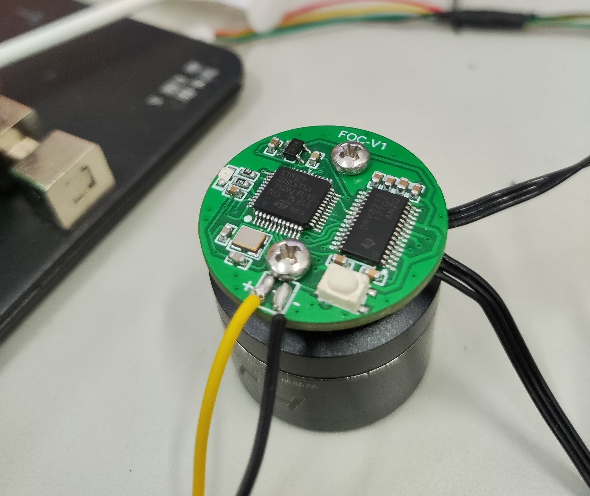
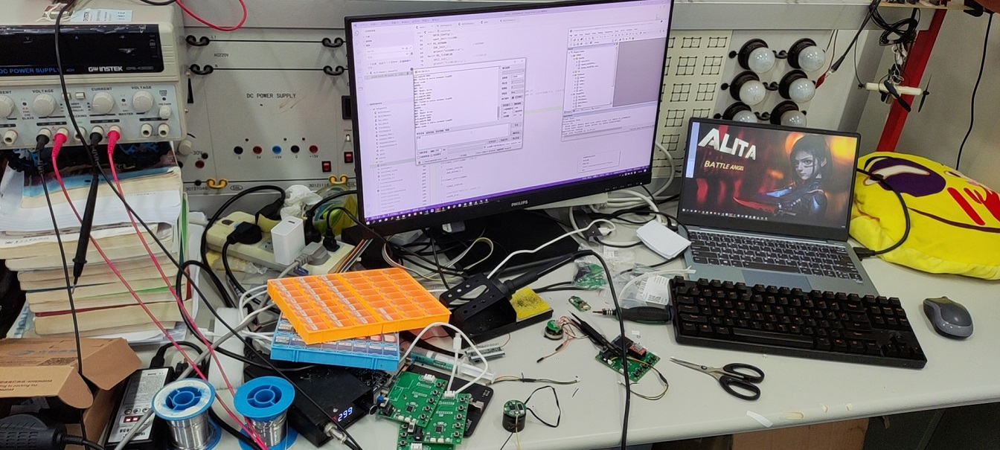

板子出现了一个比较大的问题，给单片机芯片以及磁传感器芯片供电的3.3V电压是通过一个线性稳压芯片做的，型号是RT9013-33GB，线性稳压芯片有一个很大的问题就是，当压降比较大时，效率会很低，其计算公式为：

\eta=\frac{I_{OUT}}{(I_{OUT}+I_{GND})}*\frac{V_{OUT}}{V_{IN}}*100\%
该式子前者接近于1，故效率主要取决于后者，输入输出压差越大，效率就越低，耗散的功率绝大部分都转化为热量，所以芯片温度会很高，很容易烧毁芯片造成短路，甚至会对主控芯片和驱动芯片造成损伤；

而驱动芯片使用的是DRV8313，最低的驱动电压是8V，经过线性稳压芯片输出3.3V，压降比较大，发热很大，下午调试的时候，用的可调电源，从5V往上升，升到10V的时候还是正常，除了发热比较大；再高一点，突然就芯片烧了，不仅是稳压芯片，连带着主控芯片也烧了，万用表一测，正负极直接滴滴响，换了芯片后，调到高一点的电压，还是会烧芯片；

另一个问题是，当输入电压为8V时，虽然不会直接毁芯片，但是运行一会，温度比较高，影响输出电压，导致磁编码器芯片不能正常工作，这个问题也很头疼，想到的解决办法是使用DC-DC降压电路先降到5V，再用线性稳压芯片降到3.3V，这就等下一版板子进行修改测试；

除了这些问题之外，其他倒没有什么问题，测试了开环驱动，闭环有一点问题，后续修改一下代码应该就可，角度值也可以正常读取；

**后续：修改板子，先用现有这一版测试闭环驱动，然后调参，然后上平衡车；**

## 2022年8月16日：

**已经发去打板，原理图和PCB图如下所示：**

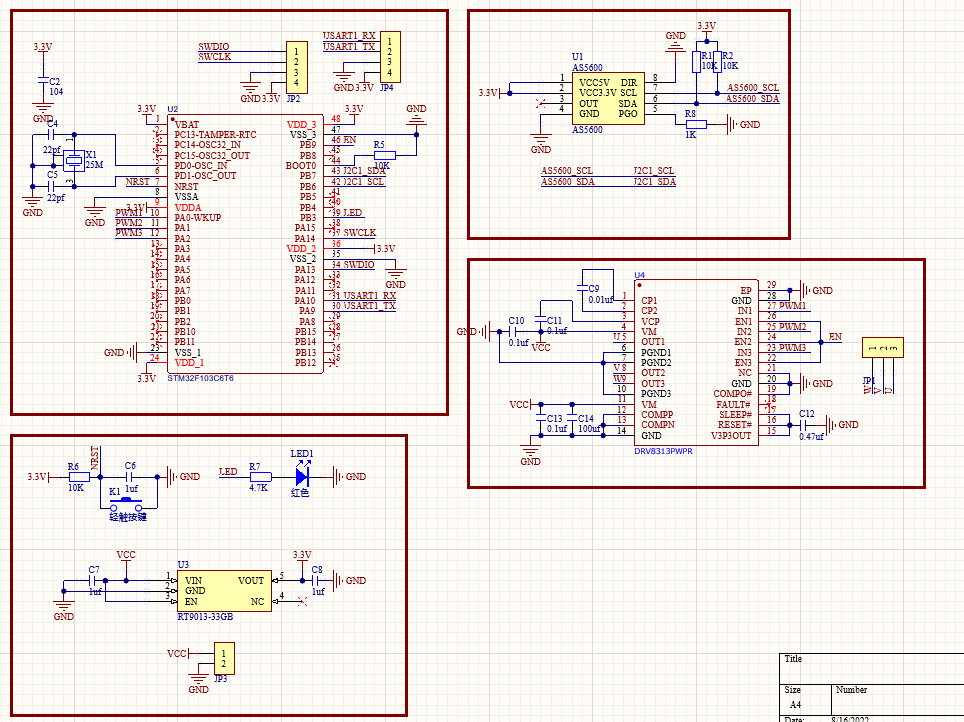

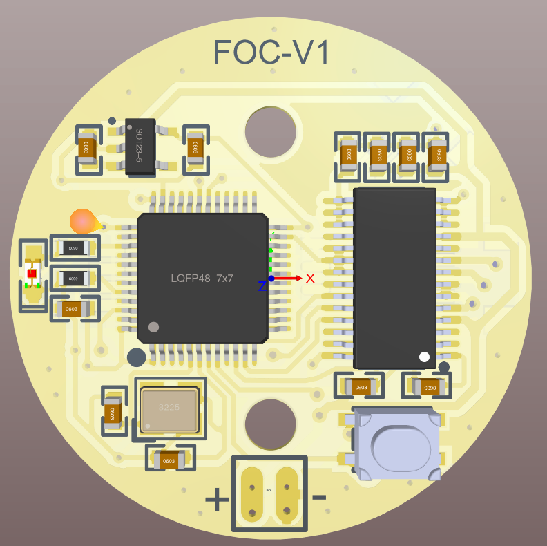
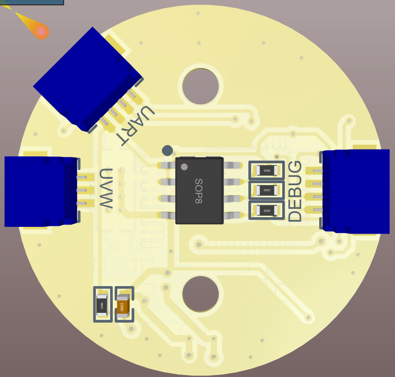

等打样的板子收到后看一下功能是不是都正常；

# 基本思路：

先把一个电机和单片机，驱动电路集成的出来，测试驱动能力，还有控制算法；

电流环先不加；

然后是做一个平衡车；

# 基本描述：

主控芯片：STM32F103C6T6A

驱动芯片：DRV8313

通讯方式：串口控制

参考方案：[https://oshwhub.com/iMcHineSe/mini_simplefoc](https://oshwhub.com/iMcHineSe/mini_simplefoc)

参考程序下载地址：[https://oshwhub.com/attachments/2022/6/Yc5g3HpSO4iSV1dMhxs98B2FosqwhmaWe8Zns9UF.bin?operation=download](https://oshwhub.com/attachments/2022/6/Yc5g3HpSO4iSV1dMhxs98B2FosqwhmaWe8Zns9UF.bin?operation=download)

原理图：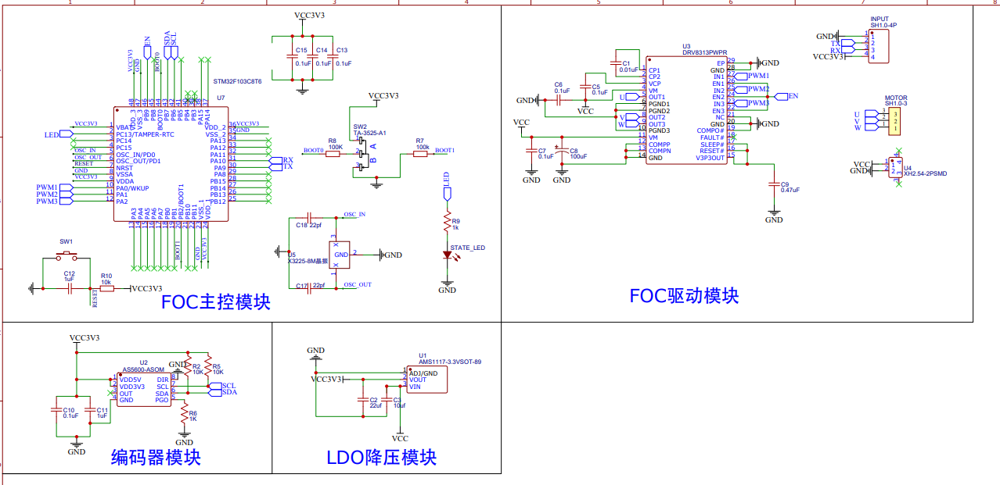

一些关键点，要集成接口，编码所在的板子上留出电机UVW三相的焊接接口；
