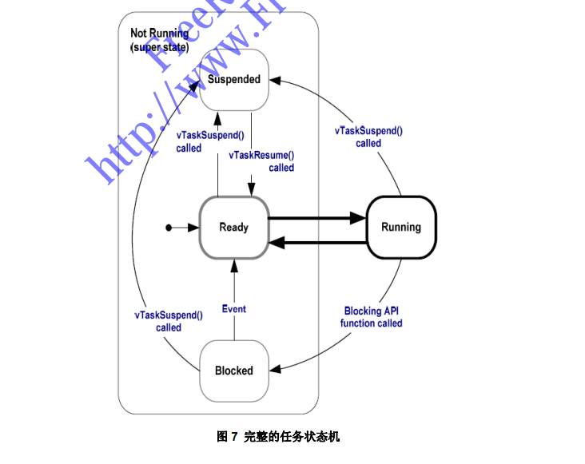
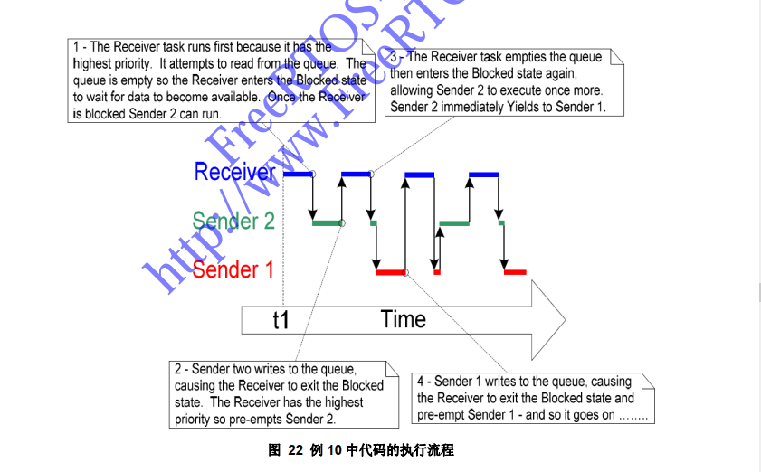
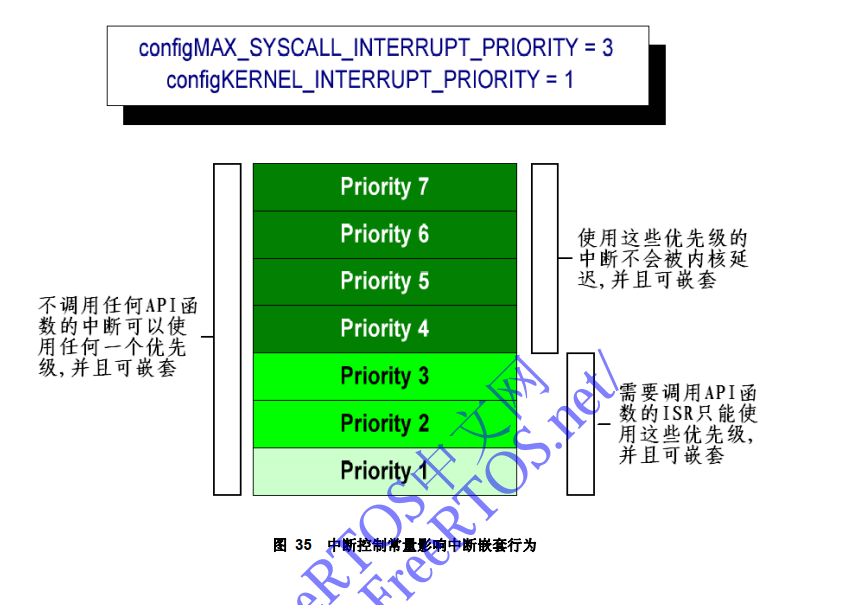
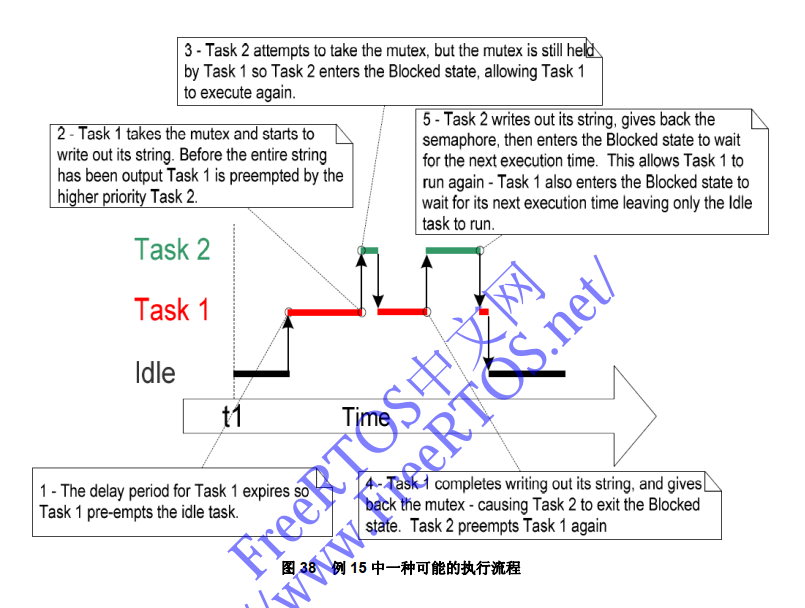
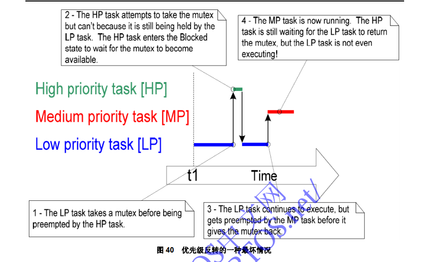
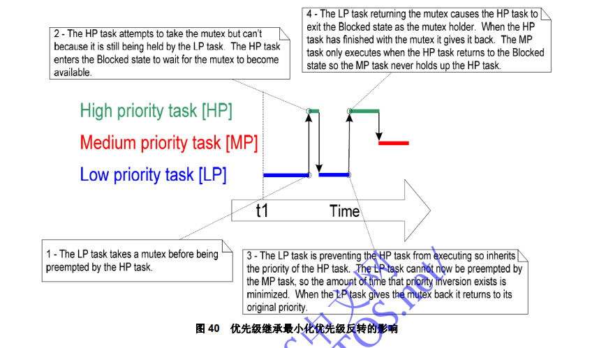
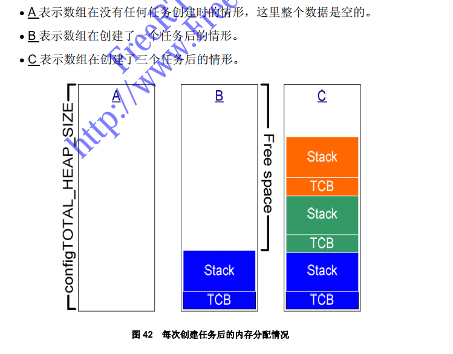
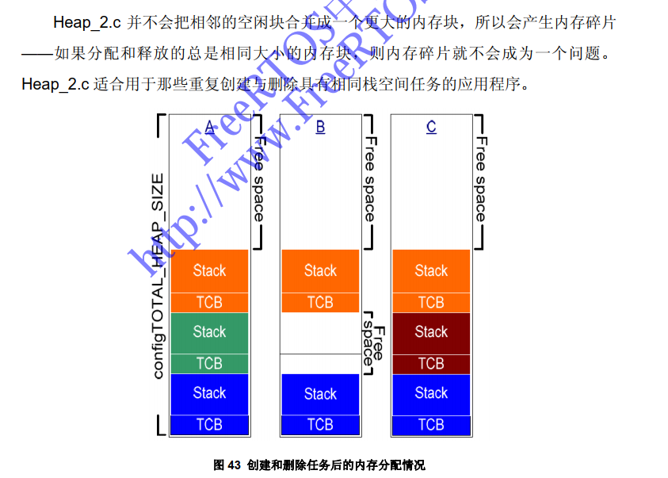
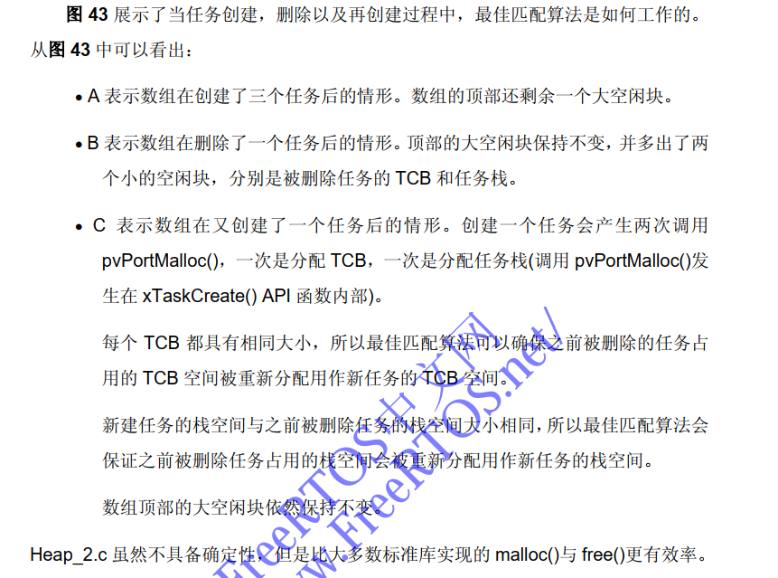
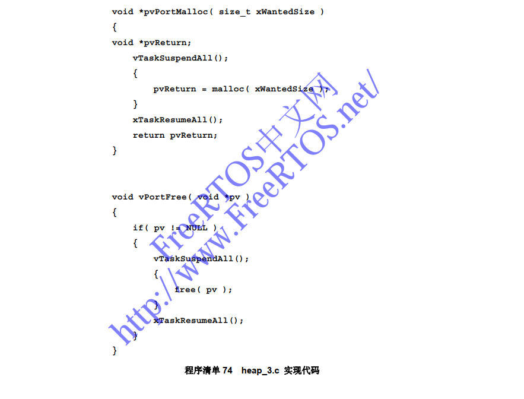

> FreeRTOS学习记录；

# FreeRTOS学习记录

### 一、任务管理

#### 任务函数：

```c
void ATaskFunction( void *pvParameters );
```

- 每一个任务函数都有自己的栈空间、自动变量；

- 函数里通常是一个死循环；

- 一般函数有可能跳出死循环，则必须删除函数：

```c
void ATaskFunction( void *pvParameters )
{
	/* 可以像普通函数一样定义变量。用这个函数创建的每个任务实例都有一个属于自己的iVarialbleExample变
	量。但如果iVariableExample被定义为static，这一点则不成立 – 这种情况下只存在一个变量，所有的任务实
	例将会共享这个变量。 */
	int iVariableExample = 0;
	/* 任务通常实现在一个死循环中。 */
	for( ;; )
	{
	/* 完成任务功能的代码将放在这里。 */
	}
	/* 如果任务的具体实现会跳出上面的死循环，则此任务必须在函数运行完之前删除。传入NULL参数表示删除
	的是当前任务 */
	vTaskDelete( NULL );
}
```

#### 任务创建函数：

```c
portBASE_TYPE xTaskCreate( pdTASK_CODE pvTaskCode,
                            const signed portCHAR * const pcName,
                            unsigned portSHORT usStackDepth,
                            void *pvParameters,
                            unsigned portBASE_TYPE uxPriority,
                            xTaskHandle *pxCreatedTask );
```

pvTaskCode
任务只是永不退出的 C 函数，实现常通常是一个死循环。参数 pvTaskCode 是一个指向任务的实现函数的指针(效果上仅仅是函数 名)。

pcName
具有描述性的任务名。这个参数不会被 FreeRTOS 使用。其只是单 纯地用于辅助调试。识别一个具有可读性的名字总是比通过句柄来 识别容易得多。 应用程序可以通过定义常量 config_MAX_TASK_NAME_LEN 来定 义任务名的最大长度——包括’\0’结束符。如果传入的字符串长度超 过了这个最大值，字符串将会自动被截断。

usStackDepth
当任务创建时，内核会分为每个任务分配属于任务自己的唯一状态。 usStackDepth 值用于告诉内核为它分配多大的栈空间。 这个值指定的是栈空间可以保存多少个字(word)，而不是多少个字 节(byte)。比如说，如果是 32 位宽的栈空间，传入的 usStackDepth 值为 100，则将会分配 400 字节的栈空间(100 * 4bytes)。栈深度乘 以栈宽度的结果千万不能超过一个 size_t 类型变量所能表达的最大 值。 应用程序通过定义常量 configMINIMAL_STACK_SIZE 来决定空闲 任务任用的栈空间大小。在 FreeRTOS 为微控制器架构提供的 Demo 应用程序中，赋予此常量的值是对所有任务的最小建议值。 如果你的任务会使用大量栈空间，那么你应当赋予一个更大的值。 没有任何简单的方法可以决定一个任务到底需要多大的栈空间。计 算出来虽然是可能的，但大多数用户会先简单地赋予一个自认为合 理的值，然后利用 FreeRTOS 提供的特性来确证分配的空间既不欠 缺也不浪费。第六章包括了一些信息，可以知道如何去查询任务使 用了多少栈空间。

pvParameters
任务函数接受一个指向 void 的指针(void*)。 pvParameters 的值即 是传递到任务中的值。这篇文档中的一些范例程序将会示范这个参 数可以如何使用。

uxPriority
指定任务执行的优先级。优先级的取值范围可以从最低优先级 0 到 最高优先级(configMAX_PRIORITIES – 1)。 configMAX_PRIORITIES 是一个由用户定义的常量。优先级号并没 有上限(除了受限于采用的数据类型和系统的有效内存空间)，但最 好使用实际需要的最小数值以避免内存浪费。如果 uxPriority 的值 超过了(configMAX_PRIORITIES – 1)，将会导致实际赋给任务的优 先级被自动封顶到最大合法值。

pxCreatedTask
pxCreatedTask 用于传出任务的句柄。这个句柄将在 API 调用中对 该创建出来的任务进行引用，比如改变任务优先级，或者删除任务。 如果应用程序中不会用到这个任务的句柄，则 pxCreatedTask 可以 被设为 NULL。

返回值
有两个可能的返回值： 1. pdTRUE 表明任务创建成功。 2. errCOULD_NOT_ALLOCATE_REQUIRED_MEMORY 由于内存堆空间不足， FreeRTOS 无法分配足够的空间来保存任务 结构数据和任务栈，因此无法创建任务。 第五章将提供更多有关内存管理方面的信息。

```c
int main( void )
{
    /* 创建第一个任务。 需要说明的是一个实用的应用程序中应当检测函数xTaskCreate()的返回值，以确保任
    务创建成功。 */
    xTaskCreate( vTask1, /* 指向任务函数的指针 */
                "Task 1", /* 任务的文本名字，只会在调试中用到 */
                1000, /* 栈深度 – 大多数小型微控制器会使用的值会比此值小得多 */
                NULL, /* 没有任务参数 */
                1, /* 此任务运行在优先级1上. */
                NULL ); /* 不会用到任务句柄 */
    /* Create the other task in exactly the same way and at the same priority. */
    xTaskCreate( vTask2, "Task 2", 1000, NULL, 1, NULL );
    /* 启动调度器，任务开始执行 */
    vTaskStartScheduler();
    /* 如果一切正常， main()函数不应该会执行到这里。但如果执行到这里，很可能是内存堆空间不足导致空闲
    任务无法创建。第五章有讲述更多关于内存管理方面的信息 */
    for( ;; );
}

void vTask1( void *pvParameters )
{
    const char *pcTaskName = "Task 1 is running\r\n";
    volatile unsigned long ul;
    /* 和大多数任务一样，该任务处于一个死循环中。 */
    for( ;; )
    {
        /* Print out the name of this task. */
        vPrintString( pcTaskName );
        /* 延迟，以产生一个周期 */
        for( ul = 0; ul  低优先级号表示任务的优先级低，优先级号 0 表示最低优先级。有效的优先级号范围从 0 到(configMAX_PRIORITES – 1)  .

​        时间片的长度通过心跳中断的频率进行设定，心跳中断频率由FreeRTOSConfig.h 中的编译时配置常量 configTICK_RATE_HZ 进行配置。比如说，如果 configTICK_RATE_HZ 设为100(HZ)，则时间片长度为 10ms。

​        需要说明的是， FreeRTOS API 函数调用中指定的时间总是以心跳中断为单位（通常的提法为心跳”ticks”)。常量portTICK_RATE_MS 用于将以心跳为单位的时间值转化为以毫秒为单位的时间值。有效精度依赖于系统心跳频率。

> 调度器总是选择具有最高优先级的可运行任务来执行。
> 为了使我们的任务切实有用，我们需要通过某种方式来进行**事件驱动**。一个事件驱动任务只会在事件发生后触发工作(处理)，而在事件没有发生时是不能进入运行态的。调度器总是选择所有能够进入运行态的任务中具有最高优先级的任务。一个高优先级但不能够运行的任务意味着不会被调度器选中，而代之以另一个优先级虽然更低但能够运行的任务。因此，采用事件驱动任务的意义就在于任务可以被创建在许多不同的优先级上，并且最高优先级任务不会把所有的低优先级任务饿死。

- 运行状态

- 阻塞状态
一个任务在等待某一个事件；
定时（时间相关事件）事件：可以是延时或者绝对时间；

- 同步事件：源于其他任务或者中断的事件；比如某个任务可以进入阻塞状态以等待队列中有数据到来；FreeRTOS的队列，二值信号量、计数信号量、互斥信号量和互斥量都可以用来实现同步事件。

- 任务可以在进入阻塞态以等待同步事件时指定一个等待超时时间，这样可以有效地实现阻塞状态下同时等待两种类型的事件；

- 挂起状态

属于非运行状态。大多数应用程序都不会用到挂起状态；

- 进入挂起状态：

调用 vTaskSuspend() API 函数；

- 唤醒挂起状态：

调 用 vTaskResume() 或vTaskResumeFromISR() API 函数  ；

- 就绪状态
如果任务处于非运行状态，但既没有阻塞也没有挂起，则这个任务处于就绪(ready，准备或就绪)状态。

- 处于就绪态的任务能够被运行，但只是”准备(ready)”运行，而当前尚未运行。



##### 使用阻塞态实现延时：

> 调用 vTaskDelay() API 函数来代替空循环，

```c
void vTaskDelay( portTickType xTicksToDelay );
        /*xTicksToDelay 延迟多少个心跳周期。调用该延迟函数的任务将进入阻塞态，经延迟指定的心跳周期数后，再转移到就绪态。
        举个例子，当某个任务调用 vTaskDelay( 100 )时，心跳计数值
        为 10,000，则该任务将保持在阻塞态，直到心跳计数计到
        10,100。常数 portTICK_RATE_MS 可以用来将以毫秒为单位的时间值转换为以心跳周期为单位的时间值。*/
vTaskDelay( 250 / portTICK_RATE_MS );
//延时250ms;
```

##### vTaskDelayUntil() API 函数 ：

> API 函数 vTaskDelayUntil()可以用于实现一个固定执行周期的需求(当你需要让你的任务以固定频率周期性执行的时候)。由于调用此函数的任务解除阻塞的时间是绝对时刻，比起相对于调用时刻的相对时间更精确(即比调用 vTaskDelay()可以实现更精确的周期性)。

```c
void vTaskDelayUntil( portTickType * pxPreviousWakeTime, portTickType xTimeIncrement );
/*pxPreviousWakeTime 此参数命名时假定 vTaskDelayUntil()用于实现某个任务以固定频率周期性执行。这种情况下 pxPreviousWakeTime保存了任务上一次离开阻塞态(被唤醒)的时刻。这个时刻被用作一个参考点来计算该任务下一次离开阻塞态的时刻。
pxPreviousWakeTime指向的变量值会在API函数vTaskDelayUntil()调用过程中自动更新，应用程序除了该变量第一次初始化外，通常都不要修改它的值。程序清单14 展示了这个参数的使用方法。TimeIncrement 此参数命名时同样是假定 vTaskDelayUntil()用于实现某个任 务 以 固 定 频 率 周 期 性 执 行 —— 这 个 频 率 就 是 由xTimeIncrement 指定的。
xTimeIncrement 的 单 位 是 心 跳 周 期 ， 可 以 使 用 常 量
portTICK_RATE_MS 将毫秒转换为心跳周期*/
//举例
```

```c
void vTaskFunction( void *pvParameters )
{
    char *pcTaskName;
    portTickType xLastWakeTime;
    /* The string to print out is passed in via the parameter. Cast this to a
    character pointer. */
    pcTaskName = ( char * ) pvParameters;
    /* 变量xLastWakeTime需要被初始化为当前心跳计数值。说明一下，这是该变量唯一一次被显式赋值。之后，
    xLastWakeTime将在函数vTaskDelayUntil()中自动更新。 */
    xLastWakeTime = xTaskGetTickCount();
    /* As per most tasks, this task is implemented in an infinite loop. */
    for( ;; )
    {
        /* Print out the name of this task. */
        vPrintString( pcTaskName );
        /* 本任务将精确的以250毫秒为周期执行。同vTaskDelay()函数一样，时间值是以心跳周期为单位的，
        可以使用常量portTICK_RATE_MS将毫秒转换为心跳周期。变量xLastWakeTime会在
        vTaskDelayUntil()中自动更新，因此不需要应用程序进行显示更新。 */
        vTaskDelayUntil( &xLastWakeTime, ( 250 / portTICK_RATE_MS ) );
    }
}
```

##### 空闲任务和空线任务钩子函数：

> 但处理器总是需要代码来执行——所以至少要有一个任务处于运行态。为了保证这一点，当调用vTaskStartScheduler()时，调度器会自动创建一个空闲任务。空闲任务是一个非常短小的循环——和最早的示例任务十分相似，总是可以运行。
> 空闲任务拥有最低优先级(优先级 0)以保证其不会妨碍具有更高优先级的应用任务进入运行态——当然，没有任何限制说是不能把应用任务创建在与空闲任务相同的优先级上；如果需要的话，你一样可以和空闲任务一起共享优先级  ；

​        通过空闲任务钩子函数(或称回调， hook, or call-back)，可以直接在空闲任务中添加应用程序相关的功能。空闲任务钩子函数会被空闲任务每循环一次就自动调用一次。

通常钩子函数被用于：

- 执行低优先级，后台或需要不停处理的功能代码。

- 测试处系统处理裕量(空闲任务只会在所有其它任务都不运行时才有机会执行，所以测量出空闲任务占用的处理时间就可以清楚的知道系统有多少富余的处理时间)。

- 将处理器配置到低功耗模式——提供一种自动省电方法，使得在没有任何应用功能需要处理的时候，系统自动进入省电模式。

钩子函数必须遵循的规则：

- 绝不能阻塞或挂起。空闲任务只会在其它任务都不运行时才会被执行(除非有应用任务共享空闲任务优先级)。以任何方式阻塞空闲任务都可能导致没有任务能够进入运行态！

- 如果应用程序用到了 vTaskDelete() API函数，则空闲钩子函数必须能够尽快返回。因为在任务被删除后，空闲任务负责回收内核资源。如果空闲任务一直运行在钩子函数中，则无法进行回收工作。

钩子函数的函数原型：

```c
void vApplicationIdleHook( void );

//举例
/* Declare a variable that will be incremented by the hook function. */
unsigned long ulIdleCycleCount = 0UL;
/* 空闲钩子函数必须命名为vApplicationIdleHook(),无参数也无返回值。 */
void vApplicationIdleHook( void )
{
    /* This hook function does nothing but increment a counter. */
    ulIdleCycleCount++;
}
```

> FreeRTOSConfig.h 中的配置常量 configUSE_IDLE_HOOK 必须定义为 1，这样空闲任务钩子函数才会被调用。

##### 修改任务优先级：

```c
//API 函数 vTaskPriofitySet()可以用于在调度器启动后改变任何任务的优先级。
void vTaskPrioritySet( xTaskHandle pxTask, unsigned portBASE_TYPE uxNewPriority );
/*pxTask 被修改优先级的任务句柄(即目标任务)——参考 xTaskCreate()API函数的参数 pxCreatedTask 以了解如何得到任务句柄方面的信息。任务可以通过传入 NULL 值来修改自己的优先级。
uxNewPriority 目标任务将被设置到哪个优先级上。如果设置的值超过了最大可用优先级(configMAX_PRIORITIES – 1)，则会被自动封顶为最大值。常量configMAX_PRIORITIES 是在 FreeRTOSConfig.h 头文件中设置的一个编译时选项*/

//uxTaskPriorityGet() API 函数用于查询一个任务的优先级。
unsigned portBASE_TYPE uxTaskPriorityGet( xTaskHandle pxTask );
//pxTask 被查询任务的句柄(目标任务) ——参考 xTaskCreate() API 函数的参数pxCreatedTask 以了解如何得到任务句柄方面的信息。任务可以通过传入 NULL 值来查询自己的优先级。
//返回值 被查询任务的当前优先级。
```

##### 任务删除函数：

```c
void vTaskDelete( xTaskHandle pxTaskToDelete );
```

> 任务可以使用 API 函数 vTaskDelete()删除自己或其它任务。任务被删除后就不复存在，也不会再进入运行态。空闲任务的责任是要将分配给已删除任务的内存释放掉。因此有一点很重要，那就是使用 vTaskDelete() API 函数的任务千万不能把空闲任务的执行时间饿死。需要说明一点，只有内核为任务分配的内存空间才会在任务被删除后自动回收。任务自己占用的内存或资源需要由应用程序自己显式地释放  ;

pxTaskToDelete
被删除任务的句柄(目标任务) —— 参考 xTaskCreate() API 函数的 参数 pxCreatedTask 以了解如何得到任务句柄方面的信息。 任务可以通过传入 NULL 值来删除自己.

##### 调度算法简述：

- 优先级抢占式调度（固定优先级抢占式调度）：
每个任务都赋予了一个优先级。

- 每个任务都可以存在于一个或多个状态。

- 在任何时候都只有一个任务可以处于运行状态。

- 调度器总是在所有处于就绪态的任务中选择具有最高优先级的任务来执行。

- 优先级无法被内核修改，只能被任务修改。

- 任务优先级的选择：
为一种通用规则，完成硬实时功能的任务优先级会高于完成软件时功能任务的优先级。但其它一些因素，比如执行时间和处理器利用率，都必须纳入考虑范围，以保证应用程序不会超过硬实时的需求限制。

- 单调速率调度(Rate Monotonic Scheduling, RMS)是一种常用的优先级分配技术。其根据任务周期性执行的速率来分配一个唯一的优先级。具有最高周期执行频率的任务赋予高最优先级；具有最低周期执行频率的任务赋予最低优先级。
这种优先级分配方式被证明了可以最大化整个应用程序的可调度性(schedulability)；

- 但是运行时间不定以及并非所有任务都具有周期性，会使得对这种方式的全面计算变得相当复杂。

- 协作式调度
采用一个纯粹的协作式调度器，只可能在运行态任务进入阻塞态或是运行态任务显式调用 taskYIELD()时，才会进行上下文切换。

- 任务永远不会被抢占，而具有相同优先级的任务也不会自动共享处理器时间。

- 协作式调度的这作工作方式虽然比较简单，但可能会导致系统响应不够快。

- 混合调度方案
需要在中断服务例程中显式地进行上下文切换；从而允许同步事件产生抢占行为，但时间事件却不行。这样做的结果是得到了一个没有时间片机制的抢占式系统。或许这正是所期望的，因为获得了效率，并且这也是一种常用的调度器配置；

### 二、队列管理

> FreeRTOS 中所有的通信与同步机制都是基于队列实现的。

#### 队列的特性:

- 数据存储

> 队列可以保存有限个具有确定长度的数据单元。队列可以保存的最大单元数目被称为队列的“深度”。在队列创建时需要设定其深度和每个单元的大小。
> 通常情况下，队列被作为 FIFO(先进先出)使用，即数据由队列尾写入，从队列首读出。当然，由队列首写入也是可能的。
> 往队列写入数据是通过字节拷贝把数据复制存储到队列中；
> 从队列读出数据使得把队列中的数据拷贝删除。

- 可以被多任务存取

> 队列是具有自己独立权限的内核对象，并不属于或赋予任何任务。
> 所有任务都可以向同一队列写入和读出。一个队列由多方写入是经常的事，但由多方读出倒是很少遇到。

- 读队列时阻塞

> 当某个任务试图读一个队列时，其可以指定一个阻塞超时时间。在这段时间中，如果队列为空，该任务将保持阻塞状态以等待队列数据有效。
> 当其它任务或中断服务例程往其等待的队列中写入了数据，该任务将自动由阻塞态转移为就绪态。当等待的时间超过了指定的阻塞时间，即使队列中尚无有效数据，任务也会自动从阻塞态转移为就绪态。
> 由于队列可以被多个任务读取，所以对单个队列而言，也可能有多个任务处于阻塞状态以等待队列数据有效。
> 这种情况下，一旦队列数据有效，只会有一个任务会被解除阻塞，这个任务就是所有等待任务中优先级最高的任务。而如果所有等待任务的优先级相同，那么被解除阻塞的任务将是等待最久的任务。

- 写队列时阻塞

> 同读队列一样，任务也可以在写队列时指定一个阻塞超时时间。这个时间是当被写队列已满时，任务进入阻塞态以等待队列空间有效的最长时间 ;
> 由于队列可以被多个任务写入，所以对单个队列而言，也可能有多个任务处于阻塞状态以等待队列空间有效。这种情况下，一旦队列空间有效，只会有一个任务会被解除阻塞，这个任务就是所有等待任务中优先级最高的任务。而如果所有等待任务的优先级相同，那么被解除阻塞的任务将是等待最久的任务。

#### 队列的使用：

##### 创建队列：

> 队列在使用前必须先被创建。队列由声明为 xQueueHandle 的变量进行引用xQueueCreate()用于创建一个队列，并返回一个 xQueueHandle 句柄以便于对其创建的队列进行引用。当创建队列时， FreeRTOS 从堆空间中分配内存空间。分配的空间用于存储队列数据结构本身以及队列中包含的数据单元。如果内存堆中没有足够的空间来创建队列，xQueueCreate()将返回 NULL  ;

```c
xQueueHandle xQueueCreate( unsigned portBASE_TYPE uxQueueLength,unsigned portBASE_TYPE uxItemSize );
```

uxQueueLength
队列能够存储的最大单元数目，即队列深度。

uxItemSize
队列中数据单元的长度，以字节为单位。

返回值
NULL 表示没有足够的堆空间分配给队列而导致创建失败。 非 NULL 值表示队列创建成功。此返回值应当保存下来，以作为 操作此队列的句柄。

##### 修改队列数据：

> xQueueSendToBack() 与 xQueueSendToFront() API 函数如同函数名字面意思所期望的一样，xQueueSendToBack()用于将数据发送到队列尾；而 xQueueSendToFront()用于将数据发送到队列首。xQueueSend()完全等同于 xQueueSendToBack()。但切记不要 在中断服务例程中调用 xQueueSendToFront() 或xQueueSendToBack()。系统提供中断安全版本的xQueueSendToFrontFromISR()与xQueueSendToBackFromISR()用于在中断服务中实现相同的功能。这些将在第三章中详述。

```c
portBASE_TYPE xQueueSendToFront( xQueueHandle xQueue,
                                const void * pvItemToQueue,
                                portTickType xTicksToWait );

portBASE_TYPE xQueueSendToBack( xQueueHandle xQueue,
                                const void * pvItemToQueue,
                                portTickType xTicksToWait );
```

xQueue
目标队列的句柄。这个句柄即是调用 xQueueCreate()创建该队 列时的返回值。

pvItemToQueue
发送数据的指针。其指向将要复制到目标队列中的数据单元。 由于在创建队列时设置了队列中数据单元的长度，所以会从该指 针指向的空间复制对应长度的数据到队列的存储区域。

xTicksToWait
阻塞超时时间。如果在发送时队列已满，这个时间即是任务处于 阻塞态等待队列空间有效的最长等待时间。如 果 xTicksToWait 设 为 0 ， 并 且 队 列 已 满 ， 则 xQueueSendToFront()与 xQueueSendToBack()均会立即返回。 阻塞时间是以系统心跳周期为单位的，所以绝对时间取决于系统 心跳频率。常量 portTICK_RATE_MS 可以用来把心跳时间单位 转换为毫秒时间单位。 如 果 把 xTicksToWait 设 置 为 portMAX_DELAY ，并 且 在 FreeRTOSConig.h 中设定 INCLUDE_vTaskSuspend 为 1，那 么阻塞等待将没有超时限制。

返回值
有两个可能的返回值: 1. pdPASS 返回 pdPASS 只会有一种情况，那就是数据被成功发送到队列 中。 如果设定了阻塞超时时间(xTicksToWait 非 0)，在函数返回之前任务将被转移到阻塞态以等待队列空间有效—在超时到来前能够将数据成功写入到队列，函数则会返回 pdPASS。 2. errQUEUE_FULL 如果设定了阻塞超时时间（ xTicksToWait 非 0），在函数返回之 前任务将被转移到阻塞态以等待队列空间有效。但直到超时也没有其它任务或是中断服务例程读取队列而腾出空间，函数则会返 回 errQUEUE_FULL。如 果 由 于 队 列 已 满 而 无 法 将 数 据 写 入 ， 则 将 返 回errQUEUE_FULL。

##### 读取队列数据：

> xQueueReceive()与 xQueuePeek() API 函数xQueueReceive()用于从队列中接收(读取）数据单元。接收到的单元同时会从队列中删除。xQueuePeek()也是从从队列中接收数据单元，不同的是并不从队列中删出接收到的单元。 xQueuePeek()从队列首接收到数据后，不会修改队列中的数据，也不会改变数据在队列中的存储序顺。切记不要在中断服务例程中调用 xQueueRceive()和 xQueuePeek()。中断安全版本的替代 API 函数 xQueueReceiveFromISR()将会在第三章中讲述。

```c
portBASE_TYPE xQueueReceive( xQueueHandle xQueue,
                                const void * pvBuffer,
                                portTickType xTicksToWait );

portBASE_TYPE xQueuePeek( xQueueHandle xQueue,
                            const void * pvBuffer,
                            portTickType xTicksToWait );
```

xQueue
被读队列的句柄。这个句柄即是调用 xQueueCreate()创建该队列 时的返回值。

pvBuffer
接收缓存指针。其指向一段内存区域，用于接收从队列中拷贝来 的数据。 数据单元的长度在创建队列时就已经被设定，所以该指针指向的 内存区域大小应当足够保存一个数据单元。

xTicksToWait
阻塞超时时间。如果在接收时队列为空，则这个时间是任务处于阻塞状态以等待队列数据有效的最长等待时间。 如果 xTicksToWait 设为 0，并且队列为空，则 xQueueRecieve() 与 xQueuePeek()均会立即返回。 阻塞时间是以系统心跳周期为单位的，所以绝对时间取决于系统 心跳频率。常量 portTICK_RATE_MS 可以用来把心跳时间单位转 换为毫秒时间单位。 如 果 把 xTicksToWait 设 置 为 portMAX_DELAY ， 并 且 在 FreeRTOSConig.h 中设定 INCLUDE_vTaskSuspend 为 1，那么 阻塞等待将没有超时限制.

返回值
有两个可能的返回值: 1. pdPASS 只有一种情况会返回 pdPASS，那就是成功地从队列中读到数据。 如果设定了阻塞超时时间(xTicksToWait 非 0)，在函数返回之前任 务将被转移到阻塞态以等待队列数据有效—在超时到来前能够从 队列中成功读取数据，函数则会返回 pdPASS。 2. errQUEUE_FULL 如果在读取时由于队列已空而没有读到任何数据，则将返回 errQUEUE_FULL。 如果设定了阻塞超时时间（ xTicksToWait 非 0），在函数返回之前 任务将被转移到阻塞态以等待队列数据有效。但直到超时也没有 其它任务或是中断服务例程往队列中写入数据，函数则会返回 errQUEUE_FULL。

##### 查询队列数据个数：

> uxQueueMessagesWaiting() API 函数uxQueueMessagesWaiting()用于查询队列中当前有效数据单元个数。切记不要在中断服务例程中调用 uxQueueMessagesWaiting()。应当在中断服务中使用其中断安全版本 uxQueueMessagesWaitingFromISR()。

```c
unsigned portBASE_TYPE uxQueueMessagesWaiting( xQueueHandle xQueue );
```

xQueue
被查询队列的句柄。这个句柄即是调用 xQueueCreate()创建该队列时 的返回值。

返回值
当前队列中保存的数据单元个数。返回 0 表明队列为空。

```c
//例子：
//发送：
static void vSenderTask( void *pvParameters )
{
    long lValueToSend;
    portBASE_TYPE xStatus;
    /* 该任务会被创建两个实例，所以写入队列的值通过任务入口参数传递 – 这种方式使得每个实例使用不同的
    值。队列创建时指定其数据单元为long型，所以把入口参数强制转换为数据单元要求的类型 */
    lValueToSend = ( long ) pvParameters;
    /* 和大多数任务一样，本任务也处于一个死循环中 */
    for( ;; )
    {
        /* 往队列发送数据
        第一个参数是要写入的队列。队列在调度器启动之前就被创建了，所以先于此任务执行。
        第二个参数是被发送数据的地址，本例中即变量lValueToSend的地址。
        第三个参数是阻塞超时时间 – 当队列满时，任务转入阻塞状态以等待队列空间有效。本例中没有设定超
        时时间，因为此队列决不会保持有超过一个数据单元的机会，所以也决不会满。
        */
        xStatus = xQueueSendToBack( xQueue, &lValueToSend, 0 );
        if( xStatus != pdPASS )
        {
            /* 发送操作由于队列满而无法完成 – 这必然存在错误，因为本例中的队列不可能满。 */
            vPrintString( "Could not send to the queue.\r\n" );
        }
        /* 允许其它发送任务执行。 taskYIELD()通知调度器现在就切换到其它任务，而不必等到本任务的时
        间片耗尽 */
        taskYIELD();
    }
}

//读取：
static void vReceiverTask( void *pvParameters )
{
    /* 声明变量，用于保存从队列中接收到的数据。 */
    long lReceivedValue;
    portBASE_TYPE xStatus;
    const portTickType xTicksToWait = 100 / portTICK_RATE_MS;
    /* 本任务依然处于死循环中。 */
    for( ;; )
    {
        /* 此调用会发现队列一直为空，因为本任务将立即删除刚写入队列的数据单元。 */
        if( uxQueueMessagesWaiting( xQueue ) != 0 )
        {
            vPrintString( "Queue should have been empty!\r\n" );
        }
        /* 从队列中接收数据
        第一个参数是被读取的队列。队列在调度器启动之前就被创建了，所以先于此任务执行。
        第二个参数是保存接收到的数据的缓冲区地址，本例中即变量lReceivedValue的地址。此变量类型与
        队列数据单元类型相同，所以有足够的大小来存储接收到的数据。
        第三个参数是阻塞超时时间 – 当队列空时，任务转入阻塞状态以等待队列数据有效。本例中常量
        portTICK_RATE_MS用来将100毫秒绝对时间转换为以系统心跳为单位的时间值。
        */
        xStatus = xQueueReceive( xQueue, &lReceivedValue, xTicksToWait );
        if( xStatus == pdPASS )
        {
            /* 成功读出数据，打印出来。 */
            vPrintStringAndNumber( "Received = ", lReceivedValue );
        }
        else
        {
            /* 等待100ms也没有收到任何数据。
            必然存在错误，因为发送任务在不停地往队列中写入数据 */
            vPrintString( "Could not receive from the queue.\r\n" );
        }
    }
}

//main函数
static void vReceiverTask( void *pvParameters )
{
    /* 声明变量，用于保存从队列中接收到的数据。 */
    long lReceivedValue;
    portBASE_TYPE xStatus;
    const portTickType xTicksToWait = 100 / portTICK_RATE_MS;
    /* 本任务依然处于死循环中。 */
    for( ;; )
    {
        /* 此调用会发现队列一直为空，因为本任务将立即删除刚写入队列的数据单元。 */
        if( uxQueueMessagesWaiting( xQueue ) != 0 )
        {
            vPrintString( "Queue should have been empty!\r\n" );
        }
        /* 从队列中接收数据
        第一个参数是被读取的队列。队列在调度器启动之前就被创建了，所以先于此任务执行。
        第二个参数是保存接收到的数据的缓冲区地址，本例中即变量lReceivedValue的地址。此变量类型与
        队列数据单元类型相同，所以有足够的大小来存储接收到的数据。
        第三个参数是阻塞超时时间 – 当队列空时，任务转入阻塞状态以等待队列数据有效。本例中常量
        portTICK_RATE_MS用来将100毫秒绝对时间转换为以系统心跳为单位的时间值。
        */
        xStatus = xQueueReceive( xQueue, &lReceivedValue, xTicksToWait );
        if( xStatus == pdPASS )
        {
            /* 成功读出数据，打印出来。 */
            vPrintStringAndNumber( "Received = ", lReceivedValue );
        }
        else
        {
            /* 等待100ms也没有收到任何数据。
            必然存在错误，因为发送任务在不停地往队列中写入数据 */
            vPrintString( "Could not receive from the queue.\r\n" );
        }
    }
}
```



##### 队列传递复合信息：

> 一个简单的方式就是利用队列传递结构体，结构体成员中就包含了数据信息和来源信息。

```c
//例子
/* 定义队列传递的结构类型。 */
typedef struct
{
    unsigned char ucValue;
    unsigned char ucSource;
} xData;
/* 声明两个xData类型的变量，通过队列进行传递。 */
static const xData xStructsToSend[ 2 ] =
{
    { 100, mainSENDER_1 }, /* Used by Sender1. */
    { 200, mainSENDER_2 } /* Used by Sender2. */
};

//读队列
static void vReceiverTask( void *pvParameters )
{
    /* 声明结构体变量以保存从队列中读出的数据单元 */
    xData xReceivedStructure;
    portBASE_TYPE xStatus;
    /* This task is also defined within an infinite loop. */
    for( ;; )
    {
        /* 读队列任务的优先级最低，所以其只可能在写队列任务阻塞时得到执行。而写队列任务只会在队列写
        满时才会进入阻塞态，所以读队列任务执行时队列肯定已满。所以队列中数据单元的个数应当等于队列的
        深度 – 本例中队列深度为3 */
        if( uxQueueMessagesWaiting( xQueue ) != 3 )
        {
            vPrintString( "Queue should have been full!\r\n" );
        }
        /* Receive from the queue.
        第二个参数是存放接收数据的缓存空间。本例简单地采用一个具有足够空间大小的变量的地址。
        第三个参数是阻塞超时时间 – 本例不需要指定超时时间，因为读队列任会只会在队列满时才会得到执行，
        故而不会因队列空而阻塞 */
        xStatus = xQueueReceive( xQueue, &xReceivedStructure, 0 );
        if( xStatus == pdPASS )
        {
            /* 数据成功读出，打印输出数值及数据来源。 */
            if( xReceivedStructure.ucSource == mainSENDER_1 )
            {
                vPrintStringAndNumber( "From Sender 1 = ", xReceivedStructure.ucValue );
            }
            else
            {
                vPrintStringAndNumber( "From Sender 2 = ", xReceivedStructure.ucValue );
            }
        }
        else
        {
            /* 没有读到任何数据。这一定是发生了错误，因为此任务只支在队列满时才会得到执行 */
            vPrintString( "Could not receive from the queue.\r\n" );
        }
    }
}

int main( void )
{
    /* 创建队列用于保存最多3个xData类型的数据单元。 */
    xQueue = xQueueCreate( 3, sizeof( xData ) );
    if( xQueue != NULL )
    {
        /* 为写队列任务创建2个实例。 The
        任务入口参数用于传递发送到队列中的数据。因此其中一个任务往队列中一直写入
        xStructsToSend[0]，而另一个则往队列中一直写入xStructsToSend[1]。这两个任务的优先级都
        设为2，高于读队列任务的优先级 */
        xTaskCreate( vSenderTask, "Sender1", 1000, &( xStructsToSend[ 0 ] ), 2, NULL );
        xTaskCreate( vSenderTask, "Sender2", 1000, &( xStructsToSend[ 1 ] ), 2, NULL );
        /* 创建读队列任务。
        读队列任务优先级设为1，低于写队列任务的优先级。 */
        xTaskCreate( vReceiverTask, "Receiver", 1000, NULL, 1, NULL );
        /* 启动调度器，创建的任务得到执行。 */
        vTaskStartScheduler();
    }
    else
    {
         /* 创建队列失败。 */
    }
    /* 如果一切正常， main()函数不应该会执行到这里。但如果执行到这里，很可能是内存堆空间不足导致空闲
    任务无法创建。第五章将提供更多关于内存管理方面的信息 */
    for( ;; );
}
```

##### 队列用于大型数据单元：

> 如果队列存储的数据单元尺寸较大，那最好是利用队列来传递数据的指针而不是对数据本身在队列上一字节一字节地拷贝进或拷贝出。传递指针无论是在处理速度上还是内存空间利用上都更有效。

注意：

- 指针指向的内存空间的所有权必须明确 ；
当任务间通过指针共享内存时，应该从根本上保证所不会有任意两个任务同时修改共享内存中的数据，或是以其它行为方式使得共享内存数据无效或产生一致性问题。原则上，共享内存在其指针发送到队列之前，其内容只允许被发送任务访问；共享内存指针从队列中被读出之后，其内容亦只允许被接收任务访问；

- 指针指向的内存空间必须有效 ；
如果指针指向的内存空间是动态分配的，只应该有一个任务负责对其进行内存释放。当这段内存空间被释放之后，就不应该有任何一个任务再访问这段空间。

- 切忌用指针访问任务栈上分配的空间。因为当栈帧发生改变后，栈上的数据将不再有效。

### 三、中断管理

#### 延迟中断处理：

> 二值信号量可以在某个特殊的中断发生时，让任务解除阻塞，相当于让任务与中断同步。这样就可以让中断事件处理量大的工作在同步任务中完成，中断服务例程(ISR)中只是快速处理少部份工作。 如此，中断处理可以说是被”推迟(deferred)”到一个”处理(handler)”任务。
> 如果某个中断处理要求特别紧急，其延迟处理任务的优先级可以设为最高，以保证延迟处理任务随时都抢占系统中的其它任务。这样，延迟处理任务就成为其对应的 ISR退出后第一个执行的任务，在时间上紧接着 ISR 执行，相当于所有的处理都在 ISR 中完成一样。
> 延迟处理任务对一个信号量进行带阻塞性质的”take”调用，意思是进入阻塞态以等待事件发生。当事件发生后， ISR 对同一个信号量进行”give”操作，使得延迟处理任务解除阻塞，从而事件在延迟处理任务中得到相应的处理。
> 在经典的信号量术语中，获取信号量等同于一个 P()操作，而给出信号量等同于一个 V()操作。
> 在这种中断同步的情形下，信号量可以看作是一个深度为 1 的队列。这个队列由于最多只能保存一个数据单元，所以其不为空则为满(所谓”二值”)。延迟处理任务调用xSemaphoreTake()时，等效于带阻塞时间地读取队列，如果队列为空的话任务则进入阻塞态。当事件发生后， ISR 简单地通过调用xSemaphoreGiveFromISR()放置一个令牌(信号量)到队列中，使得队列成为满状态。这也使得延迟处理任务切出阻塞态，并移除令牌，使得队列再次成为空。当任务完成处理后，再次读取队列，发现队列为空，又进入阻塞态，等待下一次事件发生。

#### 二值信号量创建：

> vSemaphoreCreateBinary() API 函数

​        FreeRTOS 中各种信号量的句柄都存储在xSemaphoreHandle 类型的变量中。在 使 用 信 号 量 之 前 ， 必 须 先 创 建 它 。 创 建二值信号量使用vSemaphoreCreateBinary()API 函数  ；

```c
void vSemaphoreCreateBinary( xSemaphoreHandle xSemaphore );
```

xSemaphore
创建的信号量 需要说明的是 vSemaphoreCreateBinary()在实现上是一个宏，所以 信号量变量应当直接传入，而不是传址。本章中包含本函数调用的示 例可用于参考进行复制

> xSemaphoreTake() API 函数

​        “带走(Taking)”一个信号量意为”获取(Obtain)”或”接收(Receive)”信号量。只有当信号量有效的时候才可以被获取。在经典信号量术中， xSemaphoreTake()等同于一次 P()操作。

​        除互斥信号量(Recursive Semaphore，直译为递归信号量，按通常的说法译为互斥信号量)外，所有类型的信号量都可以调用函数 xSemaphoreTake()来获取。但 xSemaphoreTake()不能在中断服务例程中调用。

```c
portBASE_TYPE xSemaphoreTake( xSemaphoreHandle xSemaphore, portTickType xTicksToWait );
```

xSemaphore
获取得到的信号量 信号量由定义为 xSemaphoreHandle 类型的变量引用。信号量在使 用前必须先创建。

xTicksToWait
阻塞超时时间。任务进入阻塞态以等待信号量有效的最长时间。 如果 xTicksToWait 为 0，则 xSemaphoreTake()在信号量无效时会 立即返回。 阻塞时间是以系统心跳周期为单位的，所以绝对时间取决于系统心 跳频率。常量 portTICK_RATE_MS 可以用来把心跳时间单位转换 为毫秒时间单位。 如 果 把 xTicksToWait 设 置 为 portMAX_DELAY ， 并 且 在 FreeRTOSConig.h 中设定 INCLUDE_vTaskSuspend 为 1，那么阻 塞等待将没有超时限制。

返回值
有两个可能的返回值: 1. pdPASS 只有一种情况会返回 pdPASS，那就是成功获得信号量。 如果设定了阻塞超时时间(xTicksToWait 非 0)，在函数返回之前任务 将被转移到阻塞态以等待信号量有效。如果在超时到来前信号量变 为有效，亦可被成功获取，返回 pdPASS。 2. pdFALSE 未能获得信号量。 如果设定了阻塞超时时间（ xTicksToWait 非 0），在函数返回之前任 务将被转移到阻塞态以等待信号量有效。但直到超时信号量也没有 变为有效，所以不会获得信号量，返回 pdFALSE。

> xSemaphoreGiveFromISR() API 函数除 互 斥 信 号 量 外 ， FreeRTOS 支 持 的 其 它 类 型 的 信 号 量 都 可 以 通 过 调 用xSemaphoreGiveFromISR()给出。xSemaphoreGiveFromISR()是 xSemaphoreGive()的特殊形式， 专门用于中断服务例程中。

```c
portBASE_TYPE xSemaphoreGiveFromISR( xSemaphoreHandle xSemaphore,
portBASE_TYPE *pxHigherPriorityTaskWoken );
```

xSemaphore
给出的信号量 信号量由定义为 xSemaphoreHandle 类型的变量引用。 信号量在使用前必须先创建。

pxHigherPriorityTaskWoken
对某个信号量而言，可能有不止一个任务处于阻塞态在 等待其有效。调用 xSemaphoreGiveFromISR()会让信 号量变为有效，所以会让其中一个等待任务切出阻塞 态。如果调用 xSemaphoreGiveFromISR()使得一个任 务解除阻塞，并且这个任务的优先级高于当前任务(也就 是被中断的任务)，那么 xSemaphoreGiveFromISR()会 在 函 数 内 部 将 *pxHigherPriorityTaskWoken 设 为 pdTRUE。 如 果 xSemaphoreGiveFromISR() 将 此 值 设 为 pdTRUE，则在中断退出前应当进行一次上下文切换。 这样才能保证中断直接返回到就绪态任务中优先级最 高的任务中。

返回值
有两个可能的返回值: 1. pdPASS xSemaphoreGiveFromISR()调用成功。 2. pdFAIL 如果信号量已经有效，无法给出，则返回 pdFAIL。

#### 利用二值信号量对任务和中断同步：

> 本例在中断服务例程中使用一个二值信号量让任务从阻塞态中切换出来——从效果上等同于让任务与中断进行同步。

```c
//周期性产生软件中断函数
static void vPeriodicTask( void *pvParameters )
{
    for( ;; )
    {
        /* 此任务通过每500毫秒产生一个软件中断来”模拟”中断事件 */
        vTaskDelay( 500 / portTICK_RATE_MS );
        /* 产生中断，并在产生之前和之后输出信息，以便在执行结果中直观直出执行流程 */
        vPrintString( "Periodic task - About to generate an interrupt.\r\n" );
        __asm{ int 0x82 } /* 这条语句产生中断 */
        vPrintString( "Periodic task - Interrupt generated. \r\n\r\n\r\n" );
    }
}

//延迟处理任务
static void vHandlerTask( void *pvParameters )
{
    /* As per most tasks, this task is implemented within an infinite loop. */
    for( ;; )
    {
        /* 使用信号量等待一个事件。信号量在调度器启动之前，也即此任务执行之前就已被创建。任务被无超
        时阻塞，所以此函数调用也只会在成功获取信号量之后才会返回。此处也没有必要检测返回值 */
        xSemaphoreTake( xBinarySemaphore, portMAX_DELAY );
        /* 程序运行到这里时，事件必然已经发生。本例的事件处理只是简单地打印输出一个信息 */
        vPrintString( "Handler task - Processing event.\r\n" );
    }
}

//中断服务例程
static void __interrupt __far vExampleInterruptHandler( void )
{
    static portBASE_TYPE xHigherPriorityTaskWoken;
    xHigherPriorityTaskWoken = pdFALSE;
    /* 'Give' the semaphore to unblock the task. */
    xSemaphoreGiveFromISR( xBinarySemaphore, &xHigherPriorityTaskWoken );
    if( xHigherPriorityTaskWoken == pdTRUE )
    {
        /* 给出信号量以使得等待此信号量的任务解除阻塞。如果解出阻塞的任务的优先级高于当前任务的优先级 – 强制进行一次任务切		换，以确保中断直接返回到解出阻塞的任务(优选级更高)。
        说明：在实际使用中， ISR中强制上下文切换的宏依赖于具体移植。此处调用的是基于Open Watcom DOS移植的宏。其它平台下		 的移植可能有不同的语法要求。对于实际使用的平台，请参如数对应移植自带的示例程序，以决定正确的语法和符号。
        */
        portSWITCH_CONTEXT();
    }
}

//main函数
int main( void )
{
    /* 信号量在使用前都必须先创建。本例中创建了一个二值信号量 */
    vSemaphoreCreateBinary( xBinarySemaphore );
    /* 安装中断服务例程 */
    _dos_setvect( 0x82, vExampleInterruptHandler );
    /* 检查信号量是否成功创建 */
    if( xBinarySemaphore != NULL )
    {
        /* 创建延迟处理任务。此任务将与中断同步。延迟处理任务在创建时使用了一个较高的优先级，以保证
        中断退出后会被立即执行。在本例中，为延迟处理任务赋予优先级3 */
        xTaskCreate( vHandlerTask, "Handler", 1000, NULL, 3, NULL );
        /* 创建一个任务用于周期性产生软件中断。此任务的优先级低于延迟处理任务。每当延迟处理任务切出，阻塞态，就会抢占周期任		   务*/
        xTaskCreate( vPeriodicTask, "Periodic", 1000, NULL, 1, NULL );
        /* Start the scheduler so the created tasks start executing. */
        vTaskStartScheduler();
    }
    /* 如果一切正常， main()函数不会执行到这里，因为调度器已经开始运行任务。但如果程序运行到了这里，
    很可能是由于系统内存不足而无法创建空闲任务。第五章会提供更多关于内存管理的信息 */
    for( ;; );
}
```

- 中断产生。

- 中断服务例程启动，给出信号量以使延迟处理任务解除阻塞。

- 当中断服务例程退出时，延迟处理任务得到执行。延迟处理任务做的第一件事便是获取信号量。

- 延迟处理任务完成中断事件处理后，试图再次获取信号量——如果此时信号量无效，任务将切入阻塞待等待事件发生。

#### 计数信号量：

> 一个二值信号量最多只可以锁存一个中断事件。在锁存的事件还未被处理之前，如果还有中断事件发生，那么后续发生的中断事件将会丢失。如果用计数信号量代替二值信号量，那么，这种丢中断的情形将可以避免。就如同我们可以把二值信号量看作是只有一个数据单元的队列一样，计数信号量可以看作是深度大于 1 的队列。任务其实对队列中存储的具体数据并不感兴趣——其只关心队列是空还是非空。计数信号量每次被给出(Given)，其队列中的另一个空间将会被使用。队列中的有效数据单元个数就是信号量的”计数(Count)”值。

两种典型用法：

- 事件计数；
在这种用法中，每次事件发生时，中断服务例程都会“给出(Give)”信号量——信号量在每次被给出时其计数值加 1。延迟处理任务每处理一个任务都会”获取(Take)”一次  信号量——信号量在每次被获取时其计数值减 1。信号量的计数值其实就是已发生事件的数目与已处理事件的数目之间的差值。

- 用于事件计数的计数信号量，在被创建时其计数值被初始化为 0。

- 资源管理；
在这种用法中，信号量的计数值用于表示可用资源的数目。一个任务要获取资源的控制权，其必须先获得信号量——使信号量的计数值减 1。当计数值减至 0，则表示没有可用资源。当任务利用资源完成工作后，将给出(归还)信号量——使信号量的计数值加 1。

- 用于资源管理的信号量，在创建时其计数值被初始化为可用资源总数。

> xSemaphoreCreateCounting() API 函数FreeRTOS 中所有种类的信号量句柄都由声明为 xSemaphoreHandle 类型的变量保存。信号量在使用前必须先被创建。使用xSemaphoreCreateCounting() API 函数来创建一个计数信号量。

```c
xSemaphoreHandle xSemaphoreCreateCounting( unsigned portBASE_TYPE uxMaxCount,
unsigned portBASE_TYPE uxInitialCount );//函数原型
```

uxMaxCount
最大计数值。如果把计数信号量类比于队列的话， uxMaxCount 值 就是队列的最大深度。 当此信号量用于对事件计数或锁存事件的话， uxMaxCount 就是可 锁存事件的最大数目。 当此信号量用于对一组资源的访问进行管理的话， uxMaxCount 应 当设置为所有可用资源的总数。

uxInitialCount
信号量的初始计数值。 当此信号量用于事件计数的话， uxInitialCount 应当设置为 0——因 为当信号量被创建时，还没有事件发生。 当 此 信 号 量 用 于 资 源 管 理 的 话 ， uxInitialCount 应 当 等 于 uxMaxCount——因为当信号量被创建时，所有的资源都是可用的。

返回值
如果返回 NULL 值，表示堆上内存空间不足，所以 FreeRTOS 无法 为信号量结构分配内存导致信号量创建失败。第五章有提供更多的 内存管理方面的信息。 如果返回非 NULL 值，则表示信号量创建成功。此值应当被保存起 来作为这个的信号量的句柄。

#### 利用计数信号量对任务和中断进行同步：

```c
/* 在信号量使用之前必须先创建。本例中创建了一个计数信号量。此信号量的最大计数值为10，初始计数值为0 */
xCountingSemaphore = xSemaphoreCreateCounting( 10, 0 );
/*为了模拟多个事件以高频率发生，修改了中断服务例程，在每次中断多次”给出
(Give)”信号量。每个事件都锁存到信号量的计数值中。修改后的中断服务例程如程序清
单 50 所示。
其它函数都复用之前的代码，保持不变*/

static void __interrupt __far vExampleInterruptHandler( void )
{
    static portBASE_TYPE xHigherPriorityTaskWoken;
    xHigherPriorityTaskWoken = pdFALSE;
    /* 多次给出信号量。第一次给出时使得延迟处理任务解除阻塞。后续给出用于演示利用被信号量锁存事件，
    以便延迟处理任何依序对这些中断事件进行处理而不会丢中断。用这种方式来模拟处理器产生多个中断，尽管
    这些事件只是在单次中断中模拟出来的 */
    xSemaphoreGiveFromISR( xCountingSemaphore, &xHigherPriorityTaskWoken );
    xSemaphoreGiveFromISR( xCountingSemaphore, &xHigherPriorityTaskWoken );
    xSemaphoreGiveFromISR( xCountingSemaphore, &xHigherPriorityTaskWoken );
    if( xHigherPriorityTaskWoken == pdTRUE )
    {
        /* 给出信号量以使得等待此信号量的任务解除阻塞。如果解出阻塞的任务的优先级高于当前任务的优先
        级 – 强制进行一次任务切换，以确保中断直接返回到解出阻塞的任务(优选级更高)。
        说明：在实际使用中， ISR中强制上下文切换的宏依赖于具体移植。此处调用的是基于Open Watcom DOS
        移植的宏。其它平台下的移植可能有不同的语法要求。对于实际使用的平台，请参如数对应移植自带的示
        例程序，以决定正确的语法和符号。
        */
        portSWITCH_CONTEXT();
    }
}
//每次中断发生后，延迟处理任务处理了中断生成的全部三个事件[模拟出来的]。 这些事件被锁存到信号量的计数值中，以使得延迟处理任务可以对它们依序进行处理。
```

#### 中断服务中使用队列：

> xQueueSendToFrontFromISR()，xQueueSendToBackFromISR()与 xQueueReceiveFromISR()分别是 xQueueSendToFront()， xQueueSendToBack()与 xQueueReceive()的中断安全版本，专门用于中断服务例程中。信号量用于事件通信。而队列不仅可以用于事件通信，还可以用来传递数据。

```c
portBASE_TYPE xQueueSendToFrontFromISR( xQueueHandle xQueue,
										void *pvItemToQueue
										portBASE_TYPE *pxHigherPriorityTaskWoken );
portBASE_TYPE xQueueSendToBackFromISR( xQueueHandle xQueue,
                                      	void *pvItemToQueue
										portBASE_TYPE *pxHigherPriorityTaskWoken);
```

xQueue
目标队列的句柄。这个句柄即是调用 xQueueCreate() 创建该队列时的返回值。

pvItemToQueue
发送数据的指针。其指向将要复制到目标队列中的数据 单元。 由于在创建队列时设置了队列中数据单元的长度，所以 会从该指针指向的空间复制对应长度的数据到队列的 存储区域。

pxHigherPriorityTaskWoken
对某个队列而言，可能有不止一个任务处于阻塞态在等 待其数据有效。调用 xQueueSendToFrontFromISR() 或 xQueueSendToBackFromISR()会使得队列数据变 为有效，所以会让其中一个等待任务切出阻塞态。如果 调用这两个 API 函数使得一个任务解除阻塞，并且这个 任务的优先级高于当前任务(也就是被中断的任务)，那 么 API 会在函数内部将*pxHigherPriorityTaskWoken 设 为 pdTRUE。 如果这两个 API 函数将此值设为 pdTRUE，则在中断退 出前应当进行一次上下文切换。这样才能保证中断直接 返回到就绪态任务中优先级最高的任务中。

返回值
有两个可能的返回值: 1. pdPASS 返回 pdPASS 只会有一种情况， 那就是数据被成功发送 到队列中。 2. errQUEUE_FULL 如 果 由 于 队 列 已 满 而 无 法 将 数 据 写 入 ， 则 将 返 回 errQUEUE_FULL。

利用队列在中断服务中发送或接收数据 ：

```c
/*本 例 演 示 在 同 一 个 中 断 服 务 中 使 用 xQueueSendToBackFromISR() 和
xQueueReceiveFromISR()。和之前一样，采用软件中断以方便实现。
创建一个周期任务用于每 200 毫秒往队列中发送五个数值，五个数值都发送完后
便产生一个软件中断。周期任务的实现代码参见程序清单 53。*/
static void vIntegerGenerator( void *pvParameters )
{
    portTickType xLastExecutionTime;
    unsigned portLONG ulValueToSend = 0;
    int i;
    /* 初始化变量，用于调用 vTaskDelayUntil(). */
    xLastExecutionTime = xTaskGetTickCount();
    for( ;; )
    {
        /* 这是个周期性任务。进入阻塞态，直到该再次运行的时刻。此任务每200毫秒执行一次 */
        vTaskDelayUntil( &xLastExecutionTime, 200 / portTICK_RATE_MS );
        /* 连续五次发送递增数值到队列。这此数值将在中断服务例程中读出。中断服务例程会将队列读空，所
        以此任务可以确保将所有的数值都发送到队列。因此不需要指定阻塞超时时间 */
        for( i = 0; i

configKERNEL_INTERRUPT_PRIORITY
设置系统心跳时钟的中断优先级。 如 果 在 移 植 中 没 有 使 用 常 量 configMAX_SYSCALL_INTERRUPT_PRIORITY，那 么需要调用中断安全版本 FreeRTOS API 的中断都必须运行在此优先级上。

configMAX_SYSCALL_INTERRUPT_PRIORITY
设置中断安全版本 FreeRTOS API 可以运 行的最高中断优先级。

> 建立一个全面的中断嵌套模型需要设置configMAX_SYSCALL_INTERRUPT_PRIRITY为比 configKERNEL_INTERRUPT_PRIORITY更高的优先级。

==在任务优先级和中断优先级之间常常会产生一些混淆。中断优先级是由微控制器架构体系所定义的。中断优先级是硬件控制的优先级，中断服务例程的执行会与之关联。任务并非运行在中断服务中，所以赋予任务的软件优先级与赋予中断源的硬件优先级之间没有任何关系;==



- 处于中断优先级 1 到 3(含)的中断会被内核或处于临界区的应用程序阻塞执行， 但是它们可以调用中断安全版本的 FreeRTOS API 函数；

- 处于中断优先级 4 及以上的中断不受临界区影响，所以其不会被内核的任何行为阻塞，可以立即得到执行——这是由微控制器本身对中断优先级的限定所决定的。通常 需 要 严 格 时 间 精 度 的 功 能 ( 如 电 机 控 制 ) 会 使 用 高 于  configMAX_SYSCALL_INTERRUPT_PRIRITY 的优先级，以保证调度器不会对其中断响应时间造成抖动；

- 不需要调用任何 FreeRTOS API 函数的中断，可以自由地使用任意优先级；

**注意：**

> Cortex M3 使用低优先级号数值表示逻辑上的高优先级中断。这显得不是那么直观，所以很容易被忘记。如果你想对某个中断赋予低优先级，则必须使用一个高优先级号数值。千万不要给它指定优先级号 0(或是其它低优先级号数值)，因为这将会使得这个 中 断 在 系 统 中 拥 有 最 高 优 先 级 — — 如 果 这 个 优 先 级 高 于configMAX_SYSCALL_INTERRUPT_PRIRITY，将很可能导致系统崩溃。Cortex M3 内核的最低优先级为 255，但是不同的 Cortex M3 处理器厂商实现的优先级位数不尽相同，而各自的配套库函数也使用了不同的方式来支持中断优先级。比如STM32， ST 的驱动库中将最低优先级指定为 15，而最高优先级指定为 0。

### 四、资源管理

#### 非原子操作：

> 这是一个”非原子”操作，因为完成整个操作需要不止一条指令，所以操作过程可能被中断。

#### 多任务系统中的风险：

- 访问外设；

- 读-改-写操作；

- 变量的非原子访问（更新16位机上的32位变量）；

- 函数重入（如果一个函数可以安全地被多个任务调用，或是在任务与中断中均可调用，则这个函数是可重入的 。）
每个任务都单独维护自己的栈空间及其自身在的内存寄存器组中的值。 如果一个函数除了访问自己栈空间上分配的数据或是内核寄存器中的数据外，不会访问其它任何数据，则这个函数就是可重入的。

```c
//可重入函数示例
long lAddOneHundered( long lVar1 )
{
    long lVar2;
    lVar2 = lVar1 + 100;
    return lVar2;
}

//不可重入函数示例
long lVar1;
long lNonsenseFunction( void )
{
    static long lState = 0;
    long lReturn;
    switch( lState )
    {
        case 0 : lReturn = lVar1 + 10;
        	lState = 1;
        	break;
        case 1 : lReturn = lVar1 + 20;
        	lState = 0;
        	break;
    }
}
```

**可重入和不可重入区别：**

> 一、不可重入函数**1、概念**
> 不可重入函数，即不能重复进入的函数，不能被中断的函数。在多个任务调用这个函数时可能修改其他任务调用这个函数的数据，从而导致不可预料的后果。不可重入函数在实时系统设计中被视为不安全函数。
> **2、特点**
> 有以下条件都属于不可重入函数：
> 函数体内使用了静态的数据结构；（static）
> 函数体内调用了malloc()或者free()函数；
> 函数体内调用了标准I/O函数。
> 函数体内访问了全局变量
> **3、其他**
> 在许多的处理器/编译器中，浮点一般都是不可重入的。
> printf()经常有重入和性能上的问题。
> 二、可重入函数**1、概念**
> 可重入函数，即可以重复进入的函数，能被中断的函数。可以在这个函数执行的任何时候中断他的运行，在任务调度下去执行另外一段代码而不会出现什么错误。
> **2、实现**
> 在函数体内不访问那些全局变量，不使用静态局部变量，坚持只使用缺省态（auto）局部变量。
> 如果使用全局变量（包括static），则应通过关中断、信号量（即P、V操作）等互斥方法对其加以保护。否则此函数就不具有可重入性，即当多个进程调用此函数时，很有可能使有关全局变量变为不可知状态。
> 在和硬件发生交互的时候，关闭硬件中断。完成交互打开中断。
> 不能调用其它不可重入的函数。

#### 互斥：

> 访问一个被多任务共享，或是被任务与中断共享的资源时，需要采用”互斥”技术以保证数据在任何时候都保持一致性。这样做的目的是要确保任务从开始访问资源就具有排它性，直至这个资源又恢复到完整状态。FreeRTOS 提供了多种特性用以实现互斥，但是最好的互斥方法（如果可能的话，任何时候都当如此）还是通过精心设计应用程序，尽量不要共享资源，或者是每个资源都通过单任务访问。

#### 临界区与挂起调度器 :

##### 基本临界区

> 基本临界区是指宏 taskENTER_CRITICAL()与taskEXIT_CRITICAL()之间的代码区间;

示例代码：

```c
/* 为了保证对PORTA寄存器的访问不被中断，将访问操作放入临界区。进入临界区 */
taskENTER_CRITICAL();
/* 在taskENTER_CRITICAL() 与 taskEXIT_CRITICAL()之间不会切换到其它任务。 中断可以执行，也允许嵌套，但只是针对优先级高于configMAX_SYSCALL_INTERRUPT_PRIORITY的中断 – 而且这些中断不允许访问FreeRTOS API 函数. */
PORTA |= 0x01;
/* 我们已经完成了对PORTA的访问，因此可以安全地离开临界区了。 */
taskEXIT_CRITICAL();

void vPrintString( const portCHAR *pcString )
{
    /* 往stdout中写字符串，使用临界区这种原始的方法实现互斥。 */
    taskENTER_CRITICAL();
    {
        printf( "%s", pcString );
        fflush( stdout );
    }
    taskEXIT_CRITICAL();
    /* 允许按任意键停止应用程序运行。实际的应用程序如果有使用到键值，还需要对键盘输入进行保护。 */
    if( kbhit() )
    {
        vTaskEndScheduler();
    }
}
```

> 临界区是提供互斥功能的一种非常原始的实现方法。临界区的工作仅仅是简单地把中断全部关掉，或是关掉优先级在 configMAX_SYSCAL_INTERRUPT_PRIORITY 及以下的中断——依赖于具体使用的 FreeRTOS 移植。抢占式上下文切换只可能在某个中断中完成，所以调用taskENTER_CRITICAL()的任务可以在中断关闭的时段一直保持运行态，直到退出临界区 ;

**PS：**

- 临界区必须只能具有很短的时间；

- 临界区嵌套是安全的；

##### 另一种实现临界区的方法：

> 挂起(锁定)调度器
> 也可以通过挂起调度器来创建临界区。挂起调度器有些时候也被称为锁定调度器。基本临界区保护一段代码区间不被其它任务或中断打断。由挂起调度器实现的临界区只可以保护一段代码区间不被其它任务打断，因为这种方式下，中断是使能的。如果一个临界区太长而不适合简单地关中断来实现，可以考虑采用挂起调度器的方式。但是唤醒(resuming, or un-suspending)调度器却是一个相对较长的操作。所以评估哪种是最佳方式需要结合实际情况。

调度器挂起函数：

```c
portBASE_TYPE xTaskResumeAll( void );
```

> 在调度器处于挂起状态时，不能调用 FreeRTOS API 函数;

调度器唤醒函数：

```c
portBASE_TYPE xTaskResumeAll( void );
```

返回值
在调度器挂起过程中，上下文切换请求也会被挂起，直到调度器 被唤醒后才会得到执行。如果一个挂起的上下文切换请求在 xTaskResumeAll()返回前得到执行，则函数返回 pdTRUE。在其 它情况下， xTaskResumeAll()返回 pdFALSE。

> 嵌套调用 vTaskSuspendAll()和 xTaskResumeAll()是安全的，因为内核有维护一个嵌套深度计数。调度器只会在嵌套深度计数为 0 时才会被唤醒——即在为每个之前调用的 vTaskSuspendAll()都配套调用了 xTaskResumAll()之后。

**例子：**

```c
void vPrintString( const portCHAR *pcString )
{
    /* Write the string to stdout, suspending the scheduler as a method
    of mutual exclusion. */
    vTaskSuspendScheduler();
    {
        printf( "%s", pcString );
        fflush( stdout );
    }
    xTaskResumeScheduler();
    /* Allow any key to stop the application running. A real application that
    actually used the key value should protect access to the keyboard input too. */
    if( kbhit() )
    {
        vTaskEndScheduler();
    }
}
```

#### 互斥量（及二值信号量）：

> 互斥量是一种特殊的二值信号量，用于控制在两个或多个任务间访问共享资源。单词MUTEX(互斥量)源于”MUTual EXclusion”。在用于互斥的场合，互斥量从概念上可看作是与共享资源关联的令牌。一个任务想要合法地访问资源，其必须先成功地得到(Take)该资源对应的令牌(成为令牌持有者)。当令牌持有者完成资源使用，其必须马上归还(Give)令牌。只有归还了令牌，其它任务才可能成功持有，也才可能安全地访问该共享资源。一个任务除非持有了令牌，否则不允许访问共享资源。

互斥量和二值信号量区别：

- 用于互斥的信号量必须归还；

- 用于同步的信号量通常是完成同步之后便丢弃，不再归还；

**xSemaphoreCreateMutex() API 函数**
        互斥量是一种信号量。 FreeRTOS 中所有种类的信号量句柄都保存在类型为xSemaphoreHandle 的变量中。
        互 斥 量 在 使 用 前 必 须 先 创 建 。创 建一个互斥 量 类 型 的 信 号 量 需 要 使 用xSemaphoreCreateMutex() API 函数。

```c
xSemaphoreHandle xSemaphoreCreateMutex( void );
```

返回值
如果返回 NULL 表示互斥量创建失败。原因是内存堆空间不足导致 FreeRTOS 无法为互斥量分配结构数据空间。第五章提供更多关于内存 管理方面的信息。 返回非 NULL 值表示互斥量创建成功。返回值应当保存起来作为该互斥 量的句柄。

**例子（使用信号量）：**

```c
/*本例创建了一个新版本的 vPrintString()，称为 prvNewPrintString()，然后在多任务
中调用这个新版函数。 prvNewPrintString()具有与 vPrintString()完全相同的功能，只是
在实现上使用互斥量代替基本临界区来实现对标准输出的控制。*/
static void prvNewPrintString( const portCHAR *pcString )
{
    /* 互斥量在调度器启动之前就已创建，所以在此任务运行时信号量就已经存在了。
    试图获得互斥量。如果互斥量无效，则将阻塞，进入无超时等待。 xSemaphoreTake()只可能在成功获得互
    斥量后返回，所以无需检测返回值。如果指定了等待超时时间，则代码必须检测到xSemaphoreTake()返回
    pdTRUE后，才能访问共享资源(此处是指标准输出)。 */
    xSemaphoreTake( xMutex, portMAX_DELAY );
    {
        /* 程序执行到这里表示已经成功持有互斥量。现在可以自由访问标准输出，因为任意时刻只会有一个任
        务能持有互斥量。 */
        printf( "%s", pcString );
        fflush( stdout );
        /* 互斥量必须归还! */
    }
    xSemaphoreGive( xMutex );
    /* Allow any key to stop the application running. A real application that
    actually used the key value should protect access to the keyboard too. A
    real application is very unlikely to have more than one task processing
    key presses though! */
    if( kbhit() )
    {
		vTaskEndScheduler();
    }
}
/*prvNewPrintString()被一个任务的两个实例重复调用。在每次调用之间采用了一个
随机延迟时间。任务的入口参数用于向任务的每个实例传递各自的输出字符串。*/
int main( void )
{
    /* 信号量使用前必须先创建。本例创建了一个互斥量类型的信号量。 */
    xMutex = xSemaphoreCreateMutex();
    /* 本例中的任务会使用一个随机延迟时间，这里给随机数发生器生成种子。 */
    srand( 567 );
    /* Check the semaphore was created successfully before creating the tasks. */
    if( xMutex != NULL )
    {
        /* Create two instances of the tasks that write to stdout. The string
        they write is passed in as the task parameter. The tasks are created
        at different priorities so some pre-emption will occur. */
        xTaskCreate( prvPrintTask, "Print1", 1000,
        "Task 1 ******************************************\r\n", 1, NULL );
        xTaskCreate( prvPrintTask, "Print2", 1000,
        "Task 2 ------------------------------------------\r\n", 2, NULL );
        /* Start the scheduler so the created tasks start executing. */
        vTaskStartScheduler();
    }
    /* 如果一切正常， main()函数不会执行到这里，因为调度器已经开始运行任务。但如果程序运行到了这里，
    很可能是由于系统内存不足而无法创建空闲任务。第五章会提供更多关于内存管理的信息 */
    for( ;; );
}
```



##### 存在的问题：优先级反转；

> 在这种可能的执行流程描述中，高优先级的任务 2 竟然必须等待低优先级的任务 1 放弃对互斥量的持有权。高优先级任务被低优先级任务阻塞推迟的行为被称为”优先级反转”。这是一种不合理的行为方式，如果把这种行为再进一步放大，当高优先级任务正等待信号量的时候，一个介于两个任务优先之间的中等优先级任务开始执行——这就会导致一个高优先级任务在等待一个低优先级任务，而低优先级任务却无法执行！

**例如：**



##### 解决方法：优先级继承（使用互斥量）；

> 互斥量自动提供了一个基本的”优先级继承”机制。优先级继承是最小化优先级反转负面影响的一种方案——其并不能修正优先级反转带来的问题，仅仅是减小优先级反转的影响。优先级继承使得系统行为的数学分析更为复杂，所以如果可以避免的话，并不建议系统实现对优先级继承有所依赖。
> 优先级继承暂时地将互斥量持有者的优先级提升至所有等待此互斥量的任务所具有的最高优先级。持有互斥量的低优先级任务”继承”了等待互斥量的任务的优先级。互斥量持有者在归还互斥量时，优先级会自动设置为其原来的优先级。



> 由于最好是优先考虑避免优先级反转，并且因为 FreeRTOS 本身是面向内存有限的微控制器，所以只实现了最基本的互斥量的优先级继承机制，这种实现假定一个任务在任意时刻只会持有一个互斥量 ;

##### 死锁（互斥量提供互斥功能的另一个缺陷）：

> 当两个任务都在等待被对方持有的资源时，两个任务都无法再继续执行，这种情况就被称为死锁。考虑如下情形，任务 A 与任务 B 都需要获得互斥量 X 与互斥量 Y 以完成各自的工作：

- 任务 A 执行，并成功获得了互斥量 X。

- 任务 A 被任务 B 抢占。

- 任务 B 成功获得了互斥量 Y，之后又试图获取互斥量 X——但互斥量 X 已经被任务 A 持有，所以对任务 B 无效。任务 B 选择进入阻塞态以等待互斥量 X 被释放。

- 任务 A 得以继续执行。其试图获取互斥量 Y——但互斥量 Y 已经被任务 B持有而对任务 A 无效。任务 A 也选择进入阻塞态以等待互斥量 Y 被释放。

​        这种情形的最终结局是，任务 A 在等待一个被任务 B 持有的互斥量，而任务 B 也在等待一个被任务 A 持有的互斥量。死锁于是发生，因为两个任务都不可能再执行下去了。

> ​        和优先级反转一样，避免死锁的最好方法就是在设计阶段就考虑到这种潜在风险，这样设计出来的系统就不应该会出现死锁的情况。于实践经验而言，对于一个小型嵌入式系统，死锁并不是一个大问题，因为系统设计者对整个应用程序都非常清楚，所以能够找出发生死锁的代码区域，并消除死锁问题。

##### 守护任务：

> 守护任务提供了一种干净利落的方法来实现互斥功能，而不用担心会发生优先级反转和死锁。守护任务是对某个资源具有唯一所有权的任务。只有守护任务才可以直接访问其守护的资源——其它任务要访问该资源只能间接地通过守护任务提供的服务。

**例子：**

​        下例提供了 vPrintString()的另一种实现方法，这里采用了一个守护任务来管理对标准输出的访问。当一个任务想要往终端写信息的时候，其不能直接调用打印函数，而是将消息发送到守护任务。
守护任务使用了一个 FreeRTOS 队列来对终端实现串行化访问。该任务内部实现；不必考虑互斥，因为它是唯一能够直接访问终端的任务。
​        守护任务大部份时间都在阻塞态等待队列中有信息到来。当一个信息到达时，守护任务仅仅简单地将收到的信息写到标准输出上，然后又返回阻塞态，继续等待下一条信息地到来。守护任务的具体实现参见程序。
中断中可以写队列，所以中断服务例程也可以安全地使用守护任务提供的服务，从而把信息输出到终端。在本例中，一个心跳中断钩子函数用于每 200 心跳周期就输出一个消息。

> 心跳钩子函数(或称回调函数)由内核在每次心跳中断时调用。要挂接一个心跳钩子函数，需要做以下配置：
> 设置 FreeRTOSConfig.h 中的常量 configUSE_TICK_HOOK 为 1。
> 提供钩子函数的具体实现，要使用固定的函数名和原型(void vApplicationTickHook( void );  )。
> 心跳钩子函数在系统心跳中断的上下文上执行，所以必须保证非常短小，适度占用栈空间，并且不要调用任何名字不带后缀  ”FromISR ”的 FreeRTOS API 函数。

```c
static void prvStdioGatekeeperTask( void *pvParameters )
{
    char *pcMessageToPrint;
    /* 这是唯一允许直接访问终端输出的任务。任何其它任务想要输出字符串，都不能直接访问终端，而是将要
    输出的字符串发送到此任务。并且因为只有本任务才可以访问标准输出，所以本任务在实现上不需要考虑互斥
    和串行化等问题。 */
    for( ;; )
    {
        /* 等待信息到达。指定了一个无限长阻塞超时时间，所以不需要检查返回值 – 此函数只会在成功收到
        消息时才会返回。 */
        xQueueReceive( xPrintQueue, &pcMessageToPrint, portMAX_DELAY );
        /* 输出收到的字符串。 */
        printf( "%s", pcMessageToPrint );
        fflush( stdout );
        /* Now simply go back to wait for the next message. */
    }
}

static void prvPrintTask( void *pvParameters )
{
    int iIndexToString;
    /* Two instances of this task are created. The task parameter is used to pass
    an index into an array of strings into the task. Cast this to the required type. */
    iIndexToString = ( int ) pvParameters;
    for( ;; )
    {
        /* 打印输出字符串，不能直接输出，通过队列将字符串指针发送到守护任务。队列在调度器启动之前就
        创建了，所以任务执行时队列就已经存在了。并有指定超时等待时间，因为队列空间总是有效。 */
        xQueueSendToBack( xPrintQueue, &( pcStringsToPrint[ iIndexToString ] ), 0 );
        /* 等待一个伪随机时间。注意函数rand()不要求可重入，因为在本例中rand()的返回值并不重要。但
        在安全性要求更高的应用程序中，需要用一个可重入版本的rand()函数 – 或是在临界区中调用rand()
        函数。 */
        vTaskDelay( ( rand() & 0x1FF ) );
    }
}
```

> 心跳钩子函数仅仅是简单地对其被调用次数进行计数，当计数至 200 时就向守护任务发送信息。为了具有更好的演示效果，心跳钩子函数将信息发送到队列首，而打印输出任务将信息发送到队列尾。心跳钩子函数的实现代码如下所示。

```c
void vApplicationTickHook( void )
{
    static int iCount = 0;
    portBASE_TYPE xHigherPriorityTaskWoken = pdFALSE;
    /* Print out a message every 200 ticks. The message is not written out
    directly, but sent to the gatekeeper task. */
    iCount++;
    if( iCount >= 200 )
    {
        /* In this case the last parameter (xHigherPriorityTaskWoken) is not
        actually used but must still be supplied. */
        xQueueSendToFrontFromISR( xPrintQueue,&( pcStringsToPrint[ 2 ] ),&xHigherPriorityTaskWoken );
        /* Reset the count ready to print out the string again in 200 ticks
        time. */
        iCount = 0;
    }
}
```

**main函数：**

```c
/* 定义任务和中断将会通过守护任务输出的字符串。 */
static char *pcStringsToPrint[] =
{
    "Task 1 ****************************************************\r\n",
    "Task 2 ----------------------------------------------------\r\n",
    "Message printed from the tick hook interrupt ##############\r\n"
};
/*-----------------------------------------------------------*/
/* 声明xQueueHandle变量。这个变量将会用于打印任务和中断往守护任务发送消息。 */
xQueueHandle xPrintQueue;
/*-----------------------------------------------------------*/
int main( void )
{
    /* 创建队列，深度为5，数据单元类型为字符指针。 */
    xPrintQueue = xQueueCreate( 5, sizeof( char * ) );
    /* 为伪随机数发生器产生种子。 */
    srand( 567 );
    /* Check the queue was created successfully. */
    if( xPrintQueue != NULL )
    {
        /* 创建任务的两个实例，用于向守护任务发送信息。任务入口参数传入需要输出的字符串索引号。这两
        个任务具有不同的优先级，所以高优先级任务有时会抢占低优先级任务。 */
        xTaskCreate( prvPrintTask, "Print1", 1000, ( void * ) 0, 1, NULL );
        xTaskCreate( prvPrintTask, "Print2", 1000, ( void * ) 1, 2, NULL );
        /* 创建守护任务。这是唯一一个允许直接访问标准输出的任务。 */
        xTaskCreate( prvStdioGatekeeperTask, "Gatekeeper", 1000, NULL, 0, NULL );
        /* Start the scheduler so the created tasks start executing. */
        vTaskStartScheduler();
    }
    /* 如果一切正常， main()函数不会执行到这里，因为调度器已经开始运行任务。但如果程序运行到了这里，
    很可能是由于系统内存不足而无法创建空闲任务。第五章会提供更多关于内存管理的信息 */
    for( ;; );
}
```

> 守护任务的优先级低于打印任务——所以发送到守护任务的消息会一直保持在队列中，直到两个打印任务都进入阻塞态。在一些情况下，需要给守护任务赋予一个较高的优先级，消息就可以得到更快的处理——但这样做会由于守护任务的开销使得低优先级任务被推迟，直到守护任务完成对受其保护的资源的访问。

### 五、内存管理

#### 标准malloc()和free()库函数缺点：

- 这两个函数在小型嵌入式系统中可能不可用。

- 这两个函数的具体实现可能会相对较大，会占用较多宝贵的代码空间。

- 这两个函数通常不具备线程安全特性。

- 这两个函数具有不确定性。每次调用时的时间开销都可能不同。

- 这两个函数会产生内存碎片。

- 这两个函数会使得链接器配置得复杂

> 当内核请求内存时，其调用 pvPortMalloc()而不是直接调用 malloc()；当释放内存时，调用 vPortFree()而不是直接调用 free()。 pvPortMalloc()具有与 malloc()相同的函数原型；vPortFree()也具有与 free()相同的函数原型。
> 在小型嵌入式系统中，通常是在启动调度器之前创建任务，队列和信号量。这种情况表明，动态分配内存只会出现在应用程序真正开始执行实时功能之前，而且内存一旦分配就不会再释放。这就意味着选择内存分配方案时不必考虑一些复杂的因素，比如确定性与内存碎片等，而只需要从性能上考虑，比如代码大小和简易性。

#### Heap_1.c :

> Heap_1.c 实现了一个非常基本的 pvPortMalloc()版本，而且没有实现 vPortFree()。如果应用程序不需要删除任务，队列或者信号量，则具有使用 heap_1 的潜质。 Heap_1总是具有确定性。这种分配方案是将 FreeRTOS 的内存堆空间看作一个简单的数组。当调用pvPortMalloc()时，则将数组又简单地细分为更小的内存块 。

​        数组的总大小(字节为单位)在 FreeRTOSConfig.h 中由 configTOTAL_HEAP_SIZE定义。以这种方式定义一个巨型数组会让整个应用程序看起来耗费了许多内存——即使是在数组没有进行任何实际分配之前 ；

​        需要为每个创建的任务在堆空间上分配一个任务控制块(TCB)和一个栈空间。



#### Heap_2.c：

> Heap_2.c 也是使用了一个由 configTOTAL_HEAP_SIZE 定义大小的简单数组。不同于 heap_1 的是， heap_2 采用了一个最佳匹配算法来分配内存，并且支持内存释放。由于声明了一个静态数组，所以会让整个应用程序看起来耗费了许多内存——即使是在数组没有进行任何实际分配之前。最佳匹配算法保证 pvPortMalloc()会使用最接近请求大小的空闲内存块。比如，考虑以下情形：
> 堆空间中包含了三个空闲内存块，分别为 5 字节， 25 字节和 100 字节大小。
> pvPortMalloc()被调用以请求分配 20 字节大小的内存空间。
> 匹配请求字节数的最小空闲内存块是具有25字节大小的内存块——所以pvPortMalloc()会将这个 25 字节块再分为一个 20 字节块和一个 5 字节块 ，然后返回一个指向 20 字节块的指针。剩下的 5 字节块则保留下来，留待以后调用 pvPortMalloc()时使用。





#### Heap_3.c：

> Heap_3.c 简单地调用了标准库函数 malloc()和 free()，但是通过暂时挂起调度器使得函数调用备线程安全特性。
> 此时的内存堆空间大小不受 configTOTAL_HEAP_SIZE 影响，而是由链接器配置决定。



### 六、错误排查

#### 效率更高的sprintf：

> printf-stdarg.c当调用标准 C 库函数时，栈空间使用量可能会急剧上升，特别是 IO 与字符串处理函数，比如 sprintf()。在 FreeRTOS 下载包中有一个名为 printf-stdarg.c 的文件。这个文件实现了一个栈效率优化版的小型 sprintf()，可以用来代替标准 C 库函数版本。在大多数情况下，这样做可以使得调用sprintf()及相关函数的任务对栈空间的需求量小很多。

#### 栈溢出问题：

- **uxTaskGetStackHighWaterMark() API 函数**、

> 每个任务都独立维护自己的栈空间， 栈空间总量在任务创建时进行设定。uxTaskGetStackHighWaterMark()主要用来查询指定任务的运行历史中， 其栈空间还差多少就要溢出。这个值被称为栈空间的”高水线(High Water Mark)”  ;

```c
unsigned portBASE_TYPE uxTaskGetStackHighWaterMark( xTaskHandle xTask );
```

  | xTask  | 被查询任务的句柄——欲知如何获得任务句柄，详情请参见 API 函数 xTaskCreate()的参数 pxCreatedTask。 如果传入 NULL 句柄，则任务查询的是自身栈空间的高水线。 |  | :——: | :—————————————————————————————- |  | 返回值 | 任务栈空间的实际使用量会随着任务执行和中断处理过程上下浮动。 uxTaskGetStackHighWaterMark()返回从任务启动执行开始的运行 历史中，栈空间具有的最小剩余量。这个值即是栈空间使用达到最深 时的剩下的未使用的栈空间。这个值越是接近 0，则这个任务就越是 离栈溢出不远了。 |

- **运行时栈侦测**

FreeRTOS 包含两种运行时栈侦测机制，由 FreeRTOSConfig.h 中的配置常量configCHECK_FOR_STACK_OVERFLOW 进行控制。这两种方式都会增加上下切换开销。

- 栈溢出钩子函数(或称回调函数)由内核在侦测到栈溢出时调用。要使用栈溢出钩子函数，需要进行以下配置：

在 FreeRTOSConfig.h 中把configCHECK_FOR_STACK_OVERFLOW 设为 1 或 2；

- 提供钩子函数的具体实现；

```c
void vApplicationStackOverflowHook( xTaskHandle *pxTask, signed portCHAR *pcTaskName );
```

**运行时栈侦测：方法 1**

​        当 configCHECK_FOR_STACK_OVERFLOW 设置为 1 时选用方法 1。

​        任务被交换出去的时候，该任务的整个上下文被保存到它自己的栈空间中。这时任务栈的使用应当达到了一个峰值。当 configCHECK_FOR_STACK_OVERFLOW 设为1 时，内核会在任务上下文保存后检查栈指针是否还指向有效栈空间。一旦检测到栈指针的指向已经超出任务栈的有效范围，栈溢出钩子函数就会被调用。

> 方法 1 具有较快的执行速度，但栈溢出有可能发生在两次上下文保存之间，这种情况不会被侦测到。

**运行时栈侦测：方法 2**

​        将 configCHECK_FOR_STACK_OVERFLOW 设为 2 就可以选用方法 2。

​        方法 2在方法 1 的基础上进行了一些补充。当创建任务时，任务栈空间中就预置了一个标记。方法 2 会检查任务栈的最后 20个字节，查看预置在这里的标记数据是否被覆盖。如果最后 20 个字节的标记数据与预设值不同，则栈溢出钩子函数就会被调用。

> 方法 2 没有方法 1 的执行速度快，但测试仅仅 20 个字节相对来说也是很快的。这种方法应该可以侦测到任何时候发生的栈溢出，虽然理论上还是有可能漏掉一些情况，但这些情况几乎是不可能发生的。

#### 其他错误：

> 问题现象：在一个 Demo 应用程序中增加了一个简单的任务，导致应用程序崩溃：

​        任务创建时需要在内存堆中分配空间。许多 Demo 应用程序定义的堆空间大小只够用于创建 Demo 任务——所以当任务创建完成后，就没有足够的剩余空间来增加其它的任务，队列或信号量。空闲任务是在 vTaskStartScheduler()调用中自动创建的。如果由于内存不足而无法创建空闲任务， vTaskStartScheduler()会直接返回。在调用 vTaskStartScheduler()后加上一条空循环[for(;;)]可以使这种错误更加容易调试。如果要添加更多的任务，可以增加内存堆空间大小，或是删掉一些已存在的 Demo任务。

> 问题现象：在中断中调用一个 API 函数，导致应用程序崩溃:

除了具有后缀为”FromISR”函数名的 API 函数，千万不要在中断服务例程中调用其它 API 函数。

> 问题现象：有时候应用程序会在中断服务例程中崩溃：

​        需要做的第一件事是检查中断是否导致了栈溢出。在不同的移植平台和不同的编译器上，中断的定义和使用方法是不尽相同的——所
以，需要做的第二件事是检查在中断服务例程中使用的语法，宏和调用约定是否符合Demo 程序的文档描述，以及是否和 Demp 程序中提供的中断服务例程范例相同。

​        如果应用程序工作在 Cotex M3 上，需要确定给中断指派优先级时，使用低优先级号数值表示逻辑上的高优先级中断，因为这种方式不太直观，所以很容易被忘记。

​        一个比较常见的错误就是，在优先级高于configMAX_SYSCALL_INTERRUPT_PRIORITY的中断中调用了 FreeRTOS API 函数。

> 问题现象：在启动第一个任务时，调度器就崩溃了：

​        如果使用的是 ARM7，那么请确定调用 vTaskStartScheduler()时处理器处于管理模式(Supervisor mode)。最简单的方式就是在 main() 之前的 C 启动态码中将处理器设置为管理模式。 ARM7 的 Demo 应用程序就是这么做的。如果处理器不在管理模式下，调度器是无法启动的。

> 问题现象：临界区无法正确嵌套：

​        除了 taskENTER_CRITICA()和 taskEXIT_CRITICAL()，千万不要在其它地方修改控制器的中断使能位或优先级标志。这两个宏维护了一个嵌套深度计数，所以只有当所有的嵌套调用都退出后计数值才会为 0，也才会使能中断。

> 问题现象：在调度器启动前应用程序就崩溃了：

​        如果一个中断会产生上下文切换，则这个中断不能在调度器启动之前使能。这同样适用于那些需要读写队列或信号量的中断。在调度器启动之前，不能进行上下文切换。还有一些 API 函数不能在调度器启动之前调用。在调用 vTaskStartScheduler()之前，最好是限定只使用创建任务，队列和信号量的 API 函数。

> 问题现象：在调度器挂起时调用 API 函数，导致应用程序崩溃；

​        调用 vTaskSuspendAll()使得调度器挂起，而唤醒调度器调用 xTaskResumeAll()。
千万不要在调度器挂起时调用其它 API 函数。

> 问题现象：函数原型 pxPortInitialiseStack()导致编译失败；

​        每种移植都需要定义一个对应的宏，以把正确的内核头文件加入到工程中。如果编译函数原型 pxPortInitialiseStack()时出错，这种现象基本上可以确定是因为没有正确定义相应的宏。请参见附录 4 以获得更多信息。可以基本相应平台的 Demo 工程建立新的应用程序。这种方式就不用担心没有包含正确的文件，也不必担心没有正确地配置编译器选项。
