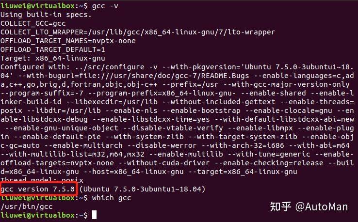
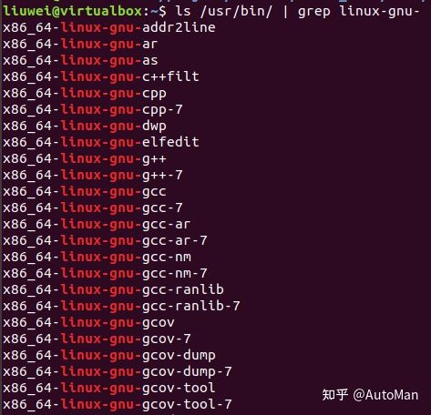
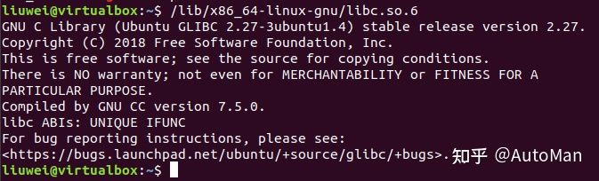

> GCC工具介绍以及常见的用法；

# GCC编译命令：

## 1. GCC工具

**GCC编译器：**

GCC（GNU Compiler Collection）是由 GNU 开发的编程语言编译器。 GCC最初代表“GNU C Compiler”，当时只支持C语言。 后来又扩展能够支持更多编程语言，包括 C++、Fortran 和 Java 等。 因此，GCC也被重新定义为“GNU Compiler Collection”，成为历史上最优秀的编译器， 其执行效率与一般的编译器相比平均效率要高 20%~30%。

GCC的官网地址为：[https://gcc.gnu.org/](https://link.zhihu.com/?target=https%3A//gcc.gnu.org/)，在Ubuntu系统下系统默认已经安装好GCC编译器，可以通过如下命令查看Ubuntu系统中GCC编译器的版本及安装路径：



**GCC编译工具链：**

GCC编译工具链（toolchain），是指以GCC编译器为核心的一整套工具。它主要包含以下三部分内容：

- gcc-core：即GCC编译器，用于完成预处理和编译过程，把C代码转换成汇编代码。

- Binutils ：除GCC编译器外的一系列小工具包括了链接器ld，汇编器as、目标文件格式查看器readelf等。

- glibc：包含了主要的 C语言标准函数库，C语言中常常使用的打印函数printf、malloc函数就在glibc 库中。

在很多场合下会直接用GCC编译器来指代整套GCC编译工具链。

**Binutils工具集：**

Binutils（bin utility），是GNU二进制工具集，通常跟GCC编译器一起打包安装到系统，它的官方说明网站地址为： [https://www.gnu.org/software/binutils/](https://link.zhihu.com/?target=https%3A//www.gnu.org/software/binutils/) 。

在进行程序开发的时候通常不会直接调用这些工具，而是在使用GCC编译指令的时候由GCC编译器间接调用。下面是其中一些常用的工具：

- as：汇编器，把汇编语言代码转换为机器码（目标文件）。

- ld：链接器，把编译生成的多个目标文件组织成最终的可执行程序文件。

- readelf：可用于查看目标文件或可执行程序文件的信息。

- nm ： 可用于查看目标文件中出现的符号。

- objcopy： 可用于目标文件格式转换，如.bin 转换成 .elf 、.elf 转换成 .bin等。

- objdump：可用于查看目标文件的信息，最主要的作用是反汇编。

- size：可用于查看目标文件不同部分的尺寸和总尺寸，例如代码段大小、数据段大小、使用的静态内存、总大小等。

系统默认的Binutils工具集位于/usr/bin目录下，可使用如下命令查看系统中存在的Binutils工具集：

```powershell
# 在Ubantu上执行如下命令
ls /usr/bin/ | grep linux-gnu-
```



**glibc库：**

glibc库是GNU组织为GNU系统以及Linux系统编写的C语言标准库，因为绝大部分C程序都依赖该函数库，该文件甚至会直接影响到系统的正常运行，例如常用的文件操作函数read、write、open，打印函数printf、动态内存申请函数malloc等。

在Ubuntu系统下，libc.so.6是glibc的库文件，可直接执行该库文件查看版本，在主机上执行如下命令：

```powershell
# 在Ubantu上执行如下命令
# 以下是Ubuntu 64位机的glibc库文件路径，可直接执行
/lib/x86_64-linux-gnu/libc.so.6
```



## 2. GCC编译

编写HelloWorld文件：

```c
#include
int main()
{
    printf("hello, world! This is a C program.\n");
    for(int i=0;i -E，只执行到预编译。直接输出预编译结果；

**2**、`gcc -S source_file.c`

> -S，只执行到源代码到汇编代码的转换，输出汇编代码；

**3**、`gcc -c source_file.c`

> -c，只执行到编译，输出目标文件；

**4**、`gcc (-E/S/c/) source_file.c -o output_filename`

> -o： 指定输出文件名，可以配合以上三种标签使用；  -o 参数可以被省略。这种情况下编译器将使用以下默认名称输出：
>   -E：预编译结果将被输出到标准输出端口（通常是显示器）  -S：生成名为source_file.s的汇编代码  -c：生成名为source_file.o的目标文件。  无标签情况：生成名为a.out的可执行文件。

**5**、`gcc -g source_file.c`

> -g，生成供调试用的可执行文件，可以在gdb中运行。由于文件中包含了调试信息因此运行效率很低，且文件也大不少。  这里可以用strip命令重新将文件中debug信息删除。这是会发现生成的文件甚至比正常编译的输出更小了，这是因为strip把原先正常编译中的一些额外信息（如函数名之类）也删除了。用法为 strip a.out

**6**、`gcc -s source_file.c`

> -s，直接生成与运用strip同样效果的可执行文件（删除了所有符号信息）。

**7、**`gcc -O source_file.c`

> -O（大写的字母O），编译器对代码进行自动优化编译，输出效率更高的可执行文件。  -O 后面还可以跟上数字指定优化级别，如：
>   `gcc -O2 source_file.c`  数字越大，越加优化。但是通常情况下，自动的东西都不是太聪明，太大的优化级别可能会使生成的文件产生一系列的bug。一般可选择2；3会有一定风险。

**8、**`gcc -Wall source_file.c`

> -W，在编译中开启一些额外的警告（warning）信息；
>   -Wall，将所有的警告信息全开；

**9、**`gcc source_file.c -L/path/to/lib -lxxx -I/path/to/include`

> -l，指定所使用到的函数库，本例中链接器会尝试链接名为libxxx.a的函数库；  -L，指定函数库所在的文件夹，本例中链接器会尝试搜索/path/to/lib文件夹；  -I，指定头文件所在的文件夹，本例中预编译器会尝试搜索/path/to/include文件夹；

### 3、调试选项：

**1**、`-g`

> 只是编译器，在编译的时候，产生调试信息；

**2**、-`gstabs`

> 此选项以stabs格式声称调试信息,但是不包括gdb调试信息；

**3**、`3-gstabs+`

> 此选项以stabs格式声称调试信息,并且包含仅供gdb使用的额外调试信息；

**4**、`-ggdb`

> 此选项将尽可能的生成gdb的可以使用的调试信息；

**5**、`-glevel`

> 请求生成调试信息，同时用level指出需要多少信息，默认的level值是2；

### 4、链接选项：

**1**、`-static` 此选项将禁止使用动态库。

> 优点：程序运行不依赖于其他库；
>   缺点：文件比较大；

**2**、`-shared (-G)` 此选项将尽量使用动态库，为默认选项

> 优点：生成文件比较小；
>   缺点：运行时需要系统提供动态库；

**3**、`-symbolic` 建立共享目标文件的时候,把引用绑定到全局符号上.

> 对所有无法解析的引用作出警告(除非用连接编辑选项 `-Xlinker -z -Xlinker defs’取代)；
>   **注：只有部分系统支持该选项；**

### 5、错误和警告选项：

**1**、`-Wall`

> 一般使用该选项，允许发出GCC能够提供的所有有用的警告。也可以用-W{warning}来标记指定的警告；

**2**、`-pedantic`

> 允许发出ANSI/ISO C标准所列出的所有警告；

**3**、`-pedantic-errors`

> 允许发出ANSI/ISO C标准所列出的错误；

**4**、`-werror`

> 把所有警告转换为错误，以在警告发生时中止编译过程；

**5**、`-w`

> 关闭所有警告,建议不要使用此项；

### 6、预处理选项：

**1**、`-Dmacro`

> 相当于C语言中的#define macro；

**2**、`-Dmacro=defn`

> 相当于C语言中的#define macro=defn；

**3**、`-Umacro`

> 相当于C语言中的#undef macro；

**4**、`-undef`

> 取消对任何非标准宏的定义；

### 7、其他选项：

**1**、`-fpic`

> 编译器就生成位置无关目标码.适用于共享库(shared library).

**2**、`-fPIC`

> 编译器就输出位置无关目标码.适用于动态连接(dynamic linking),即使分支需要大范围转移.

**3**、`-v`

> 显示详细的编译、汇编、连接命令
