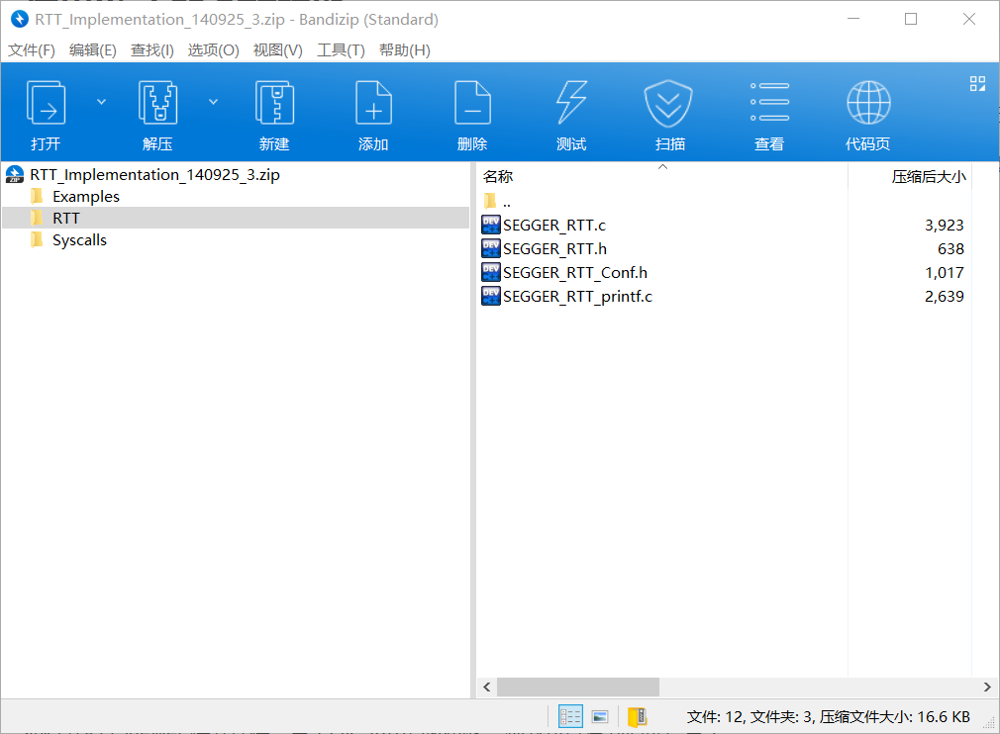
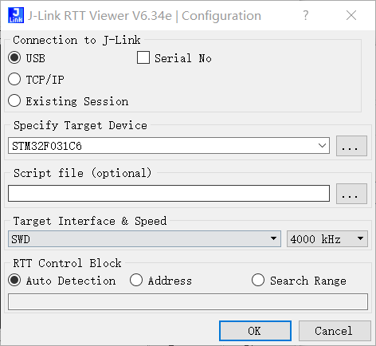
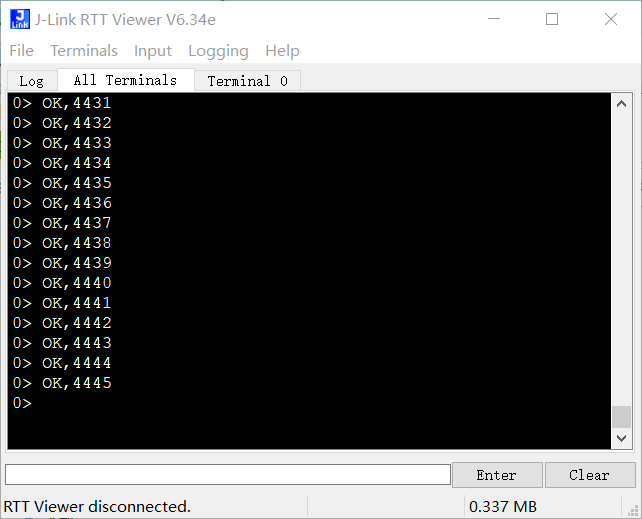

> Jlink RTT调试技巧；

## 使用Jlink的 RTT功能 :

这个功能是不需要另外接其他引脚的，如果使用SW连接方式，仅仅两根线就可以。

RTT 是Jlink的一种实时终端的方式连接输出调试信息，网上有很多说明之间按照做就可以，我仅仅是记录一下自己的步骤.

> 就是下载RTT软件包，下载RTT文件： [http://download.segger.com/J-Link/RTT/RTT_Implementation_140925.zip](http://download.segger.com/J-Link/RTT/RTT_Implementation_140925.zip)  ；

> 添加RTT文件到自己的工程：
> 添加必要的头文件：

> 输出函数打印：

这个时候RTT在程序中就添加成功了，我们可以使用使用Jlink带的工具进行查看数据；

如打开RTT Viewer 提升连接，点击OK 不出意外的话，你就可以看到调试信息了；

