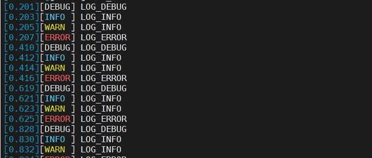
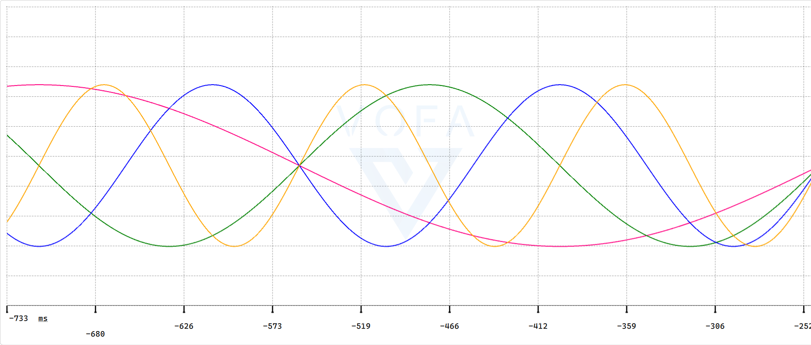

> 这个是关于LOG分级打印的配置，并有时间戳，基于STM32H7和gcc；

## 环境

STM32H743IIT6、STM32CubeMX、GCC、MakeFile

## printf映射

> usart.c中加入以下代码

```c
#include "stdio.h"
/*# 7- Retarget printf to UART (std library and toolchain dependent) #########*/

#if defined(__GNUC__)
int _write(int fd, char *ptr, int len)
{
    HAL_UART_Transmit(&huart1, (uint8_t *)ptr, len, HAL_MAX_DELAY);
    return len;
}
#elif defined(__ICCARM__)
#include "LowLevelIOInterface.h"
size_t __write(int handle, const unsigned char *buffer, size_t size)
{
    HAL_UART_Transmit(&huart1, (uint8_t *)buffer, size, HAL_MAX_DELAY);
    return size;
}
#elif defined(__CC_ARM)
int fputc(int ch, FILE *f)
{
    HAL_UART_Transmit(&huart1, (uint8_t *)&ch, 1, HAL_MAX_DELAY);
    return ch;
}
#endif

#ifdef __GNUC__
#define PUTCHAR_PROTOTYPE int __io_putchar(int ch)
#else
#define PUTCHAR_PROTOTYPE int fputc(int ch, FILE *f)
#endif /* __GNUC__ */

/**
 * @brief  Retargets the C library printf function to the USART.
 * @param  None
 * @retval None
 */
PUTCHAR_PROTOTYPE
{
    HAL_UART_Transmit(&huart1, (uint8_t *)&ch, 1, HAL_MAX_DELAY);
    return ch;
}
```

> MakeFile中删除以下配置：

```makefile
# LDFLAGS = $(MCU) -specs=nano.specs -T$(LDSCRIPT) $(LIBDIR) $(LIBS) -Wl,-Map=$(BUILD_DIR)/$(TARGET).map,--cref -Wl,--gc-sections
LDFLAGS = $(MCU)  -T$(LDSCRIPT) $(LIBDIR) $(LIBS) -Wl,-Map=$(BUILD_DIR)/$(TARGET).map,--cref -Wl,--gc-sections
```

## LOG分级打印

> 新建my_log.h文件，写入以下内容：

```c
#ifndef __MYLOG_H__
#define __MYLOG_H__

#ifdef __cplusplus
extern "C"
{
#endif

#include
#include "main.h"

/* 日志级别 */
#define ELOG_LVL_ASSERT 0
#define ELOG_LVL_ERROR 1
#define ELOG_LVL_WARN 2
#define ELOG_LVL_INFO 3
#define ELOG_LVL_DEBUG 4
#define ELOG_LVL_VERBOSE 5

/* 设置日志级别 */
#define ELOG_OUTPUT_LVL ELOG_LVL_VERBOSE

/*是否打印详细信息*/
#define ELOG_DETAIL 0

#if ELOG_DETAIL == 1
/* 断言(Assert)  */
#define LOG_ASSERT(args, ...)                                                                                                             \
    do                                                                                                                                    \
    {                                                                                                                                     \
        if (ELOG_OUTPUT_LVL >= ELOG_LVL_ASSERT)                                                                                           \
        {                                                                                                                                 \
            printf("[%ld.%03ld][ASSERT/%s Line:%.4d] " args "\r\n", tick_all / 1000, tick_all % 1000, __FILE__, __LINE__, ##__VA_ARGS__); \
        }                                                                                                                                 \
    } while (0)

/* 错误(Error) */
#define LOG_ERROR(args, ...)                                                                                                             \
    do                                                                                                                                   \
    {                                                                                                                                    \
        if (ELOG_OUTPUT_LVL >= ELOG_LVL_ASSERT)                                                                                          \
        {                                                                                                                                \
            printf("[%ld.%03ld][ERROR/%s Line:%.4d] " args "\r\n", tick_all / 1000, tick_all % 1000, __FILE__, __LINE__, ##__VA_ARGS__); \
        }                                                                                                                                \
    } while (0)

/* 警告(Warn) */
#define LOG_WARN(args, ...)                                                                                                              \
    do                                                                                                                                   \
    {                                                                                                                                    \
        if (ELOG_OUTPUT_LVL >= ELOG_LVL_WARN)                                                                                            \
        {                                                                                                                                \
            printf("[%ld.%03ld][WARN /%s Line:%.4d] " args "\r\n", tick_all / 1000, tick_all % 1000, __FILE__, __LINE__, ##__VA_ARGS__); \
        }                                                                                                                                \
    } while (0)

/* 信息(Info) */
#define LOG_INFO(args, ...)                                                                                                              \
    do                                                                                                                                   \
    {                                                                                                                                    \
        if (ELOG_OUTPUT_LVL >= ELOG_LVL_INFO)                                                                                            \
        {                                                                                                                                \
            printf("[%ld.%03ld][INFO /%s Line:%.4d] " args "\r\n", tick_all / 1000, tick_all % 1000, __FILE__, __LINE__, ##__VA_ARGS__); \
        }                                                                                                                                \
    } while (0)

/* 调试(Debug) */
#define LOG_DEBUG(args, ...)                                                                                                             \
    do                                                                                                                                   \
    {                                                                                                                                    \
        if (ELOG_OUTPUT_LVL >= ELOG_LVL_DEBUG)                                                                                           \
        {                                                                                                                                \
            printf("[%ld.%03ld][DEBUG/%s Line:%.4d] " args "\r\n", tick_all / 1000, tick_all % 1000, __FILE__, __LINE__, ##__VA_ARGS__); \
        }                                                                                                                                \
    } while (0)

/* 详细(Verbose) */
#define LOG_VERBOSE(args, ...)                                                                                                             \
    do                                                                                                                                     \
    {                                                                                                                                      \
        if (ELOG_OUTPUT_LVL >= ELOG_LVL_VERBOSE)                                                                                           \
        {                                                                                                                                  \
            printf("[%ld.%03ld][VERBOSE/%s Line:%.4d] " args "\r\n", tick_all / 1000, tick_all % 1000, __FILE__, __LINE__, ##__VA_ARGS__); \
        }                                                                                                                                  \
    } while (0)

#else

/* 断言(Assert)  */
#define LOG_ASSERT(args, ...)                                                                            \
    do                                                                                                   \
    {                                                                                                    \
        if (ELOG_OUTPUT_LVL >= ELOG_LVL_ASSERT)                                                          \
        {                                                                                                \
            printf("[%ld.%03ld][ASSERT] " args "\r\n", tick_all / 1000, tick_all % 1000, ##__VA_ARGS__); \
        }                                                                                                \
    } while (0)

/* 错误(Error) */
#define LOG_ERROR(args, ...)                                                                            \
    do                                                                                                  \
    {                                                                                                   \
        if (ELOG_OUTPUT_LVL >= ELOG_LVL_ASSERT)                                                         \
        {                                                                                               \
            printf("[%ld.%03ld][ERROR] " args "\r\n", tick_all / 1000, tick_all % 1000, ##__VA_ARGS__); \
        }                                                                                               \
    } while (0)

/* 警告(Warn) */
#define LOG_WARN(args, ...)                                                                             \
    do                                                                                                  \
    {                                                                                                   \
        if (ELOG_OUTPUT_LVL >= ELOG_LVL_WARN)                                                           \
        {                                                                                               \
            printf("[%ld.%03ld][WARN ] " args "\r\n", tick_all / 1000, tick_all % 1000, ##__VA_ARGS__); \
        }                                                                                               \
    } while (0)

/* 信息(Info) */
#define LOG_INFO(args, ...)                                                                             \
    do                                                                                                  \
    {                                                                                                   \
        if (ELOG_OUTPUT_LVL >= ELOG_LVL_INFO)                                                           \
        {                                                                                               \
            printf("[%ld.%03ld][INFO ] " args "\r\n", tick_all / 1000, tick_all % 1000, ##__VA_ARGS__); \
        }                                                                                               \
    } while (0)

/* 调试(Debug) */
#define LOG_DEBUG(args, ...)                                                                            \
    do                                                                                                  \
    {                                                                                                   \
        if (ELOG_OUTPUT_LVL >= ELOG_LVL_DEBUG)                                                          \
        {                                                                                               \
            printf("[%ld.%03ld][DEBUG] " args "\r\n", tick_all / 1000, tick_all % 1000, ##__VA_ARGS__); \
        }                                                                                               \
    } while (0)

/* 详细(Verbose) */
#define LOG_VERBOSE(args, ...)                                                                            \
    do                                                                                                    \
    {                                                                                                     \
        if (ELOG_OUTPUT_LVL >= ELOG_LVL_VERBOSE)                                                          \
        {                                                                                                 \
            printf("[%ld.%03ld][VERBOSE] " args "\r\n", tick_all / 1000, tick_all % 1000, ##__VA_ARGS__); \
        }                                                                                                 \
    } while (0)

#endif // !ELOG_DETAIL

#ifdef __cplusplus
}
#endif

#endif /* __MYLOG_H__ */
```

> stm32h7xx_it.c中添加以下内容：

```c
uint32_t tick_all = 0;
void SysTick_Handler(void)
{
  /* USER CODE BEGIN SysTick_IRQn 0 */
    tick_all++;
  /* USER CODE END SysTick_IRQn 0 */
  HAL_IncTick();
  /* USER CODE BEGIN SysTick_IRQn 1 */

  /* USER CODE END SysTick_IRQn 1 */
}
```

> main.h中添加以下内容：

```c
/* USER CODE BEGIN ET */
extern uint32_t tick_all;
/* USER CODE END ET */
```

## 测试

> main.c中添加以下代码：

```c
while (1)
{
    /* USER CODE END WHILE */
    /* USER CODE BEGIN 3 */
    HAL_GPIO_TogglePin(USER_LED_GPIO_Port, USER_LED_Pin);
    HAL_Delay(200);
    LOG_DEBUG("LOG_DEBUG");
    LOG_INFO("LOG_INFO");
    LOG_WARN("LOG_INFO");
    LOG_ERROR("LOG_ERROR");
}
```

> 结果：



## 增加VOFA支持



> 增加宏定义如下：

```c
/* VOFA */
#define LOG_VOFA(channel, args)                                                                                                            \
    do                                                                                                                                     \
    {                                                                                                                                      \
        switch (sizeof(args) / sizeof(args[0]))                                                                                                              \
        {                                                                                                                                  \
        case 1:                                                                                                                            \
            printf("[VOFA] %s:%f\n\r", tick_all / 1000, tick_all % 1000, channel, args[0]);                                     \
            break;                                                                                                                         \
        case 2:                                                                                                                            \
            printf("[VOFA] %s:%f,%f\n\r", tick_all / 1000, tick_all % 1000, channel, args[0], args[1]);                         \
            break;                                                                                                                         \
        case 3:                                                                                                                            \
            printf("[VOFA] %s:%f,%f,%f\n\r", tick_all / 1000, tick_all % 1000, channel, args[0], args[1], args[2]);             \
            break;                                                                                                                         \
        case 4:                                                                                                                            \
            printf("[VOFA] %s:%f,%f,%f,%f\n\r", tick_all / 1000, tick_all % 1000, channel, args[0], args[1], args[2], args[3]); \
            break;                                                                                                                         \
        default:                                                                                                                           \
            break;                                                                                                                         \
        }                                                                                                                                  \
    } while (0)
```

> 测试代码：

```c
float t = 0.0;
float ch4[4] = {0.0f};
t = t + 0.01;
ch4[0] = (float)sin(t);
ch4[1] = (float)sin(2 * t);
ch4[2] = (float)sin(3 * t);
ch4[3] = (float)sin(4 * t);
HAL_GPIO_TogglePin(USER_LED_GPIO_Port, USER_LED_Pin);
HAL_Delay(10);
LOG_VOFA("ch4", ch4);
```
