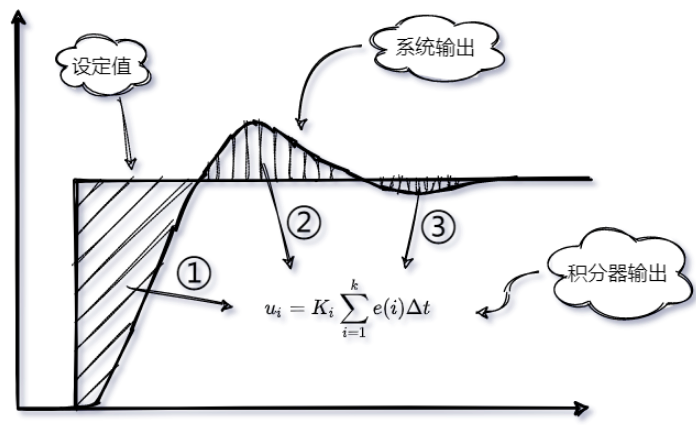

> PID控制中常出现的积分饱和概念及其解决方案；

## 积分饱和的概念：

这种现象往往发生在误差有大幅变化（例如大幅增加），积分器因为误差的大幅增加有很大的累计量，因为积分器的输出满足下式：

离散化形式表示为：

所以随着时间的增加，每次累积较大的误差，很容易造成积分饱和并产生较大的过冲，而且当误差变为负时，其过冲仍维持一段时间之后才恢复正常的情形。

**通常会产生的输出如下图所示：**

从图中我们不难发现，这里有三个过程：

- 因为这个过程存在 较大幅度变化的误差，因此积分器累积了较大的值，从图中可以看到，积分器的面积比较大（阴影部分）；

- 此时积分已经饱和，产生了较大的过冲，并且在较长的一段时间内，一直处于过冲的状态；

- 积分脱离饱和状态，产生了积极的调节作用，消除静差，系统输出达到设定值；

## 如何防止积分饱和：

为了防止PID控制器出现积分饱和，需要在算法加入抗积分饱和（`anti-integral windup`）的算法；通常有以下几种措施；

- 积分分离或者称为去积分算法；

- 在饱和的时候将积分器的累计值初始化到一个比较理想的值；

- **若积分饱和因为目标值突然变化而产生，将目标值以适当斜率的斜坡变化可避免此情形；**

- **将积分累计量限制上下限，避免积分累计量超过限制值；**

- 如果 PID输出已经饱和，则重新计算积分累计量，使输出恰好为合理的范围；

## 参考：

1、[一文详细解析到底什么是积分饱和](https://www.elecfans.com/d/1544295.html)；
