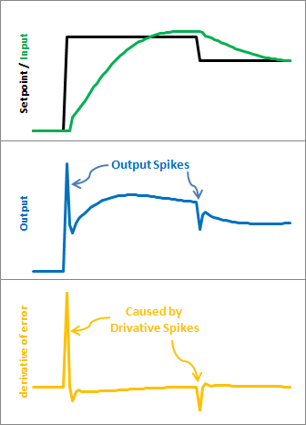
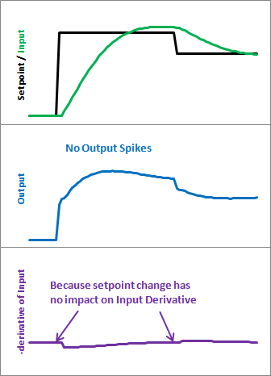

> PID精进教程；
>   这篇文章的主要内容是如何改进初学者的PID控制器。文章中提到，初学者的PID控制器设计的目的是不规则地调用。这会导致两个问题：您无法从PID获得一致的行为，因为有时它被频繁调用，有时则没有。您需要进行额外的数学计算，以计算导数和积分，因为它们都依赖于时间的变化。作者提出了一种新的方法，称为“Proportional on Measurement”，可以解决这些问题。

任何编写自己的 PID 算法的人都可以看看我是如何做的，并可以从中学到他们需要的东西。

这将是一个艰难的过程，但我想我找到了一种不太痛苦的方式来解释我的代码。我将从所谓的“初学者的 PID”开始。然后我将逐步改进它，直到我们得到一个高效、健壮的 pid 算法。

## PID的开始

这是初学PID的人都知道的公式：

Output=K_pe(t)+K_t\int{e(t)dt}+K_D{\frac{d}{dt}}e(t)
Where:e=Setpoint-Input
> 公式(2)也就是指偏差e等于设定值和当前值的差别；

根据这个公式，大多数都能写出下面的代码：

```c
/*working variables*/
unsigned long lastTime;
double Input, Output, Setpoint;
double errSum, lastErr;
double kp, ki, kd;
void Compute()
{
   /*How long since we last calculated*/
   unsigned long now = millis();
   double timeChange = (double)(now - lastTime);
  
   /*Compute all the working error variables*/
   double error = Setpoint - Input;
   errSum += (error * timeChange);
   double dErr = (error - lastErr) / timeChange;
  
   /*Compute PID Output*/
   Output = kp * error + ki * errSum + kd * dErr;
  
   /*Remember some variables for next time*/
   lastErr = error;
   lastTime = now;
}
  
void SetTunings(double Kp, double Ki, double Kd)
{
   kp = Kp;
   ki = Ki;
   kd = Kd;
}
```

`Compute()`被定期或不定期地调用，并且运行良好。不过，这个系列并不是关于“工作得很好”。如果我们要将这段代码变成与工业 PID 控制器相当的东西，我们必须解决一些问题：

> **采样时间（Sample Time）**：PID 算法在定期被调用时最佳。如果算法运行间隔固定，我们还可以简化一些内部数学运算。
>   **微分冲击（Derivative Kick）**：微分冲击是一种在PID控制器中出现的现象，它会导致PID控制器的输出出现尖峰，从而影响系统的稳定性；不是什么大问题，很容易修复；
>   **即时调节变化（On-The-Fly Tuning Changes）**：也即在运行时进行调整；一个好的 PID 算法是一种可以在不影响内部工作的情况下改变调节参数的算法；
>   **复位积分误差抑制（Reset Windup Mitigation）**：复位积分误差抑制是一种用于控制系统中的PID控制器的技术，它可以防止PID控制器在某些情况下产生积分误差。；
>   **开/关（自动/手动）（On/Off (Auto/Manual)）**：在大多数应用中，有时会希望关闭 PID 控制器并手动调整输出，而不受控制器的干扰；
>   **初始化（Initialization）**：当控制器第一次打开时，我们需要一个“无扰动转换”。也就是说，我们不希望输出突然猛增到某个新值；
>   **控制器方向（Controller Direction）**：具体来说，控制器方向是指控制器的输出如何随着输入信号的变化而变化。如果控制器的输出随着输入信号的增加而增加，那么这个控制器就是正向控制器；如果控制器的输出随着输入信号的增加而减少，那么这个控制器就是反向控制器。它旨在确保用户使用正确的符号输入调整参数；
>   **按比例测量（Proportional on Measurement）**：按测量比例是指控制器输出的变化量与被控制量的变化量成比例。添加此功能可以更轻松地控制某些类型的过程；

一旦我们解决了所有这些问题，我们就会有一个可靠的 PID 算法。我们还将拥有最新版本的 Arduino PID 库中使用的代码，这并非巧合。因此，无论您是想编写自己的算法，还是想了解 PID 库中发生的事情，我希望这对您有所帮助。让我们开始吧。

> PS：在的所有代码示例中，我使用的是double。因为在 Arduino 上，双精度与浮点数（单精度）相同。真正的双精度对 PID 来说太浪费了（精度过高）。如果你使用的语言是真正的双精度，我建议将所有双精度数更改为浮点数。

## 采样时间

> 文章中提到，为了确保定期调用PID，可以指定每个周期调用计算函数。根据预先确定的采样时间，PID决定是否应立即计算或返回。一旦我们知道PID以恒定间隔进行评估，也可以简化微分和积分计算。

### 问题

初学者的PID被设计为不定期地调用。这导致了两个问题：

1、你不能从PID中获得一致的行为，因为它有时被频繁调用，有时不被调用。

2、你需要做额外的数学运算来计算导数和积分，因为它们都依赖于时间的变化。

### 解决方法

确保PID以固定的时间间隔被调用。我决定这样做的方法是指定每个周期调用计算函数。根据预先确定的采样时间，PID决定它是否应该计算或立即返回。

一旦我们知道PID是以恒定的时间间隔被运行的，所以导数和积分的计算也可以被简化。

### 代码

```c
/*working variables*/
unsigned long lastTime;
double Input, Output, Setpoint;
double errSum, lastErr;
double kp, ki, kd;
int SampleTime = 1000; //1 sec
void Compute()
{
   unsigned long now = millis();
   int timeChange = (now - lastTime);
   if(timeChange>=SampleTime)
   {
      /*Compute all the working error variables*/
      double error = Setpoint - Input;
      errSum += error;
      double dErr = (error - lastErr);
 
      /*Compute PID Output*/
      Output = kp * error + ki * errSum + kd * dErr;
 
      /*Remember some variables for next time*/
      lastErr = error;
      lastTime = now;
   }
}
 
void SetTunings(double Kp, double Ki, double Kd)
{
  double SampleTimeInSec = ((double)SampleTime)/1000;
   kp = Kp;
   ki = Ki * SampleTimeInSec;
   kd = Kd / SampleTimeInSec;
}
 
void SetSampleTime(int NewSampleTime)
{
   if (NewSampleTime > 0)
   {
      double ratio  = (double)NewSampleTime
                      / (double)SampleTime;
      ki *= ratio;
      kd /= ratio;
      SampleTime = (unsigned long)NewSampleTime;
   }
}
```

在第10行和第11行，算法现在通过判断来决定是否该计算了。另外，因为我们现在知道两个样本之间的时间是相同的，我们不需要不断地乘以时间变化。我们只需适当地调整Ki和Kd（第31行和第32行），结果在数学上是等同的，但更有效率。

**如果用户在操作过程中决定改变采样时间，Ki和Kd将需要重新调整以反映这种新的变化，这就是第39-42行的全部内容。**

另外请注意，我在第29行将采样时间转换为秒数。严格地说，这不是必须的，但允许用户以1/秒和s为单位输入Ki和Kd，而不是1/mS和mS。

### 结果

上面的修改为我们做了3件事：

**1、无论调用Compute()的频率如何，PID算法将以固定的时间间隔被运行[第11行] 。**

**2、因为有了时间减法[第10行]，当millis()返回0的时候就没有问题了。**

**3、我们不需要再对时间变化进行乘除运算了。由于它是一个常数，我们可以将它从计算代码中移出[第15+16行]，并将其与PID常数放在一起[第31+32行]。在数学上，它的结果是一样的，但它节省了每次评估PID时的乘法和除法。**

### 关于中断

如果这个PID要进入一个微控制器，可以用一个非常好的理由来证明使用中断。SetSampleTime设置了中断频率，然后在时间到了时调用Compute。在这种情况下，就不需要第9-12、23和24行了。如果你打算在你的PID系统中这样做，那就去做吧! 不过要继续阅读这个系列。希望你仍能从后面的修改中得到一些好处。

我没有使用中断的原因有三个：

**1、就这个系列而言，不是每个人都能使用中断。**

**2、如果你想让它同时实现许多PID控制器，事情会变得很棘手。**

**3、如果我说实话，我并没有想到这一点。Jimmie Rodgers在为我校对该系列文章时建议我这样做。我可能决定在未来版本的PID库中使用中断。**

## 微分冲击

### 问题

此修改将稍微调整导数项。目标是消除一种称为“微分冲击”的现象。



上面的图片说明了这个问题。由于`误差=设定-输入`，设定点的任何变化都会导致误差的瞬时变化。这个变化的导数是无穷大（在实践中，由于dt不是0，它只是一个非常大的数字）。幸运的是，有一个简单的方法可以摆脱这种情况。

### 解决办法

\frac{dError}{dt}=\frac{dSetpoint}{dt}-\frac{dInput}{dt}
**当设定值保持不变时：**

\frac{dError}{dt}=-\frac{dInput}{dt}
事实证明，误差的导数等于输入的负导数，但设定点变化时除外。这最终成为一个完美的解决方案。我们不是加(Kd*误差的导数)，而是减(Kd*输入的导数)。这就是所谓的使用 “测量导数”(Derivative on Measurement)。

### 代码

```c
/*working variables*/
unsigned long lastTime;
double Input, Output, Setpoint;
double errSum, lastInput;
double kp, ki, kd;
int SampleTime = 1000; //1 sec
void Compute()
{
   unsigned long now = millis();
   int timeChange = (now - lastTime);
   if(timeChange>=SampleTime)
   {
      /*Compute all the working error variables*/
      double error = Setpoint - Input;
      errSum += error;
      double dInput = (Input - lastInput);
 
      /*Compute PID Output*/
      Output = kp * error + ki * errSum - kd * dInput;
 
      /*Remember some variables for next time*/
      lastInput = Input;
      lastTime = now;
   }
}
 
void SetTunings(double Kp, double Ki, double Kd)
{
  double SampleTimeInSec = ((double)SampleTime)/1000;
   kp = Kp;
   ki = Ki * SampleTimeInSec;
   kd = Kd / SampleTimeInSec;
}
 
void SetSampleTime(int NewSampleTime)
{
   if (NewSampleTime > 0)
   {
      double ratio  = (double)NewSampleTime
                      / (double)SampleTime;
      ki *= ratio;
      kd /= ratio;
      SampleTime = (unsigned long)NewSampleTime;
   }
}
```

> 这里的修改很容易。我们用-dInput代替+dError。我们现在不是记住最后的错误，而是记住最后的输入值。

### 结果



下面是这些修改给我们带来的结果。请注意，输入的情况仍然是一样的。所以我们得到了同样的性能，但我们不会在每次设定点变化时发出巨大的输出尖峰。

这可能是也可能不是一个大问题。这完全取决于你的应用对输出尖峰有多敏感。但在我看来，这也不需要更多的工作，为什么不把事情做对呢？
