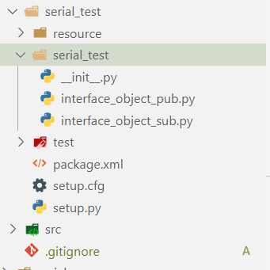
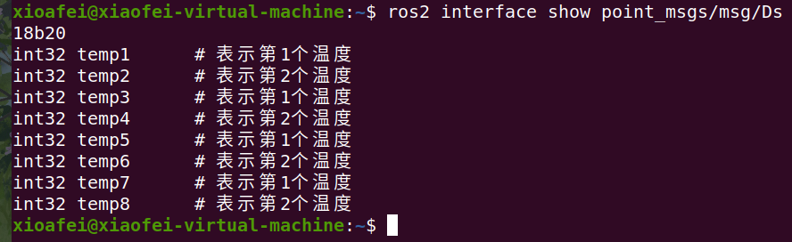
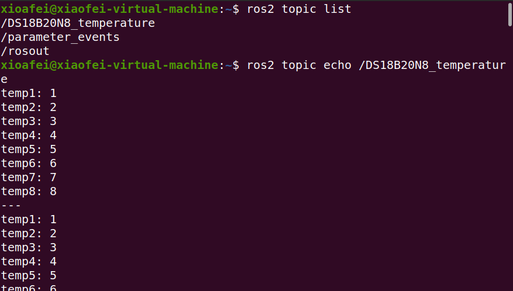

> 做毕设用到了ROS，这里记录ROS相关知识；

语言基于Python，因为C++短时间学不起来，Python的话还能懂一些；

### 工作空间构建

创建一个新的文档夹
我们创建一个新的文档夹作为新的工作空间的开始
给每个新的工作空间创建一个新的文档夹是一个好习惯，取上面名字无关紧要，但是最好能从这个名字上看出这个工作空间是干什么的，例如main_ws，(主要工作空间)：

```bash
mkdir main_ws
```

将功能包放入src也是一个比较好的习惯，我们创建一个工作空间同时创建一个src文档夹，然后进入这个文档夹内：

```bash
mkdir main_ws/src
cd main_ws/src
```

与ROS1不同，ROS2的工作空间并不需要init；

### 自定义包

如何在ROS2中创建一个功能包呢？我们可以使用这个指令：

```bash
$ ros2 pkg create --build-type

```

在ros2命令中：

- **pkg**：表示功能包相关的功能；

- **create**：表示创建功能包；

- **build-type**：表示新创建的功能包是C++还是Python的，如果使用C++或者C，那这里就跟ament_cmake，如果使用Python，就跟ament_python；

- **package_name**：新建功能包的名字。

比如在终端中分别创建C++和Python版本的功能包：

```bash
cd ~/main_ws/src
ros2 pkg create --build-type ament_cmake learning_pkg_c               # C++
ros2 pkg create --build-type ament_python learning_pkg_python # Python
```

对于Python包：

只需要进到构建的包文件夹中，进入与上一层文件夹名字相同的包中即可，然后写入源文件；



然后修改package.xml文件：

```xml
from setuptools import setup

package_name = 'serial_test'

setup(
    name=package_name,
    version='0.0.0',
    packages=[package_name],
    data_files=[
        ('share/ament_index/resource_index/packages',
            ['resource/' + package_name]),
        ('share/' + package_name, ['package.xml']),
    ],
    install_requires=['setuptools'],
    zip_safe=True,
    maintainer='xioafei',
    maintainer_email='2253770787@qq.com',
    description='TODO: Package description',
    license='TODO: License declaration',
    tests_require=['pytest'],
    entry_points={
        'console_scripts': [
         'interface_object_pub  = serial_test.interface_object_pub:main',
        #  'interface_object_sub  = serial_test.interface_object_sub:main',
        ],
    },
)
```

### 编译功能包

在创建好的功能包中，我们可以继续完成代码的编写，之后需要编译和配置环境变量，才能正常运行：

```bash
cd ~/main_ws  #在工作空间的根目录编译
colcon build  #编译工作空间所有功能包
colcon build --packages-select 包名#编译特定的包
```

编译成功后，需要source一下，才能让ros识别到这个包：

> 注意，最好新开一个终端，而不是在当前终端；

```bash
source install/local_setup.bash
```

> 关于sourceros1和ros2有很大的不同，在install目录下会有local_setup 和setup两个文档。local_setup只会把当前工作空间中的可用包添加到环境当中，setup则会把新建该工作空间时候的底层的工作空间也加入到环境当中，这样就可用同时使用两个工作空间中的包；
>   因此，先sourceROS2安装时系统的setup，然后再source main_ws的local_setup，和source main_ws的setup的效果是相同的，应为main_ws这个工作空间的创建时的底层就是系统的setup；
>   对于存在多个工作空间的情况这种区别就会体现出来，官网对于新的工作空间叫overlay，也就是这个一个每个工作空间之间是存在覆盖累计的情况；
>   个人推荐首先source系统，然后对于自己创建的工作空间选择local_setup这样就会减少自己创建的多个工作空间之间的干扰。这解决了ros1上一个很头疼的问题；

### 自定义数据类型

在ROS2中定义接口，需要编写一个接口文档，该文档后缀为`msg`、`srv`、`action`

在接口文档中定义通信过程中所使用的数据类型和数据名称；

数据类型有哪些呢？

原始的数据类型只有九类，其中每一个都可以在后面加上[]将其变成数组形式（从一个变成多个）

```plaintext
bool
byte
char
float32, float64
int8, uint8
int16, uint16
int32, uint32
int64, uint64
string
```

使用以下命令可以查看数据组成：

```bash
ros2 interface show point_msgs/msg/Ds18b20
```



如何自定义数据类型呢？

对于话题接口的定义：

你会、在包里面创建定制化的.msg和.srv文档，并且它们可在别的包内使用．所涉及的包应该放到同一工作空间下面．

建立一个新的包：

```bash
ros2 pkg create --build-type ament_cmake tutorial_interfaces
```

tutorial_interfaces是新包的名字．注意这是一个CMake类型的包；在单纯python包里面，目前是没有办法生成.msg或者.srv文档的．在CMake型包里面，你可以创建定制化接口，然后在python型节点中使用；

在一个包中，最后是让.msg 和.srv放在各自文档目录比较好．在目录main_ws/src/tutorial_interfaces创建文档夹：

```bash
mkdir msg
mkdir srv
```

在刚刚创建的tutorial_interfaces/msg文档目录，新建一个名字为Ds18b20.msg的文档，里面放着声明数据结构的一行代码：

```plaintext
int32 temp1      # 表示第1个温度
int32 temp2      # 表示第2个温度
int32 temp3      # 表示第1个温度
int32 temp4      # 表示第2个温度
int32 temp5      # 表示第1个温度
int32 temp6      # 表示第2个温度
int32 temp7      # 表示第1个温度
int32 temp8      # 表示第2个温度
```

将八个32位整数称为temp1~8，这就是你的定制化消息；

3.3 CMakeLists.txt
为了将你定义的接口转为特定语言代码（如c++和python）,使得这些接口可在这些语言里被使用，(为了达到这个目地你)

参考CMakeLists.txt文档：

```cmake
cmake_minimum_required(VERSION 3.8)
project(point_msgs)

# Default to C99
if(NOT CMAKE_C_STANDARD)
  set(CMAKE_C_STANDARD 99)
endif()

# Default to C++14
if(NOT CMAKE_CXX_STANDARD)
  set(CMAKE_CXX_STANDARD 14)
endif()

if(CMAKE_COMPILER_IS_GNUCXX OR CMAKE_CXX_COMPILER_ID MATCHES "Clang")
  add_compile_options(-Wall -Wextra -Wpedantic)
endif()

# find dependencies
find_package(ament_cmake REQUIRED)
# uncomment the following section in order to fill in
# further dependencies manually.
# find_package( REQUIRED)
find_package(rosidl_default_generators REQUIRED)

rosidl_generate_interfaces(${PROJECT_NAME}
  "msg/Ds18b20.msg"
 )

if(BUILD_TESTING)
  find_package(ament_lint_auto REQUIRED)
  # the following line skips the linter which checks for copyrights
  # uncomment the line when a copyright and license is not present in all source files
  #set(ament_cmake_copyright_FOUND TRUE)
  # the following line skips cpplint (only works in a git repo)
  # uncomment the line when this package is not in a git repo
  #set(ament_cmake_cpplint_FOUND TRUE)
  ament_lint_auto_find_test_dependencies()
endif()

ament_package()
```

参考package.xml文档：

```xml

  point_msgs
  0.0.0
  TODO: Package description
  xioafei
  TODO: License declaration

  ament_cmake

  ament_lint_auto
  ament_lint_common

  rosidl_default_generators
  rosidl_default_runtime
  rosidl_interface_packages

    ament_cmake

```

既然你定制化接口包的组成部分都齐了，那可以编译这个包了．在工作空间根目录（~/main_ws）下，运行下面指令：

```plaintext
colcon build --packages-select tutorial_interfaces
```

现在，这些接口可以被ros2包找到了；

在新终端，main_ws工作空间运行下面指令来source一下（该空间环境变量）：

```bash
source ./install/setup.bash
```

现在使用ros2 interface show指令来确认你的创建的接口可以使用了．

```bash
ros2 interface show tutorial_interfaces/msg/Ds18b20
```

应该返回：

```plaintext
int32 temp1      # 表示第1个温度
int32 temp2      # 表示第2个温度
int32 temp3      # 表示第1个温度
int32 temp4      # 表示第2个温度
int32 temp5      # 表示第1个温度
int32 temp6      # 表示第2个温度
int32 temp7      # 表示第1个温度
int32 temp8      # 表示第2个温度
```

### 通过发布话题发布自定义数据

参考源码：

```python
import rclpy                                     # ROS2 Python接口库
from rclpy.node import Node                      # ROS2 节点类
from std_msgs.msg import String                  # 字符串消息类型

from point_msgs.msg import Ds18b20  # 自定义的温度消息

"""
创建一个发布者节点
"""
class PublisherNode(Node):

    def __init__(self, name):
        super().__init__(name)                                    # ROS2节点父类初始化
        self.pub = self.create_publisher(Ds18b20, "Ds18b20_temperature", 100)# 创建发布者对象（消息类型、话题名、队列长度）
        self.timer = self.create_timer(0.1, self.timer_callback)  # 创建一个定时器（单位为秒的周期，定时执行的回调函数）

    def timer_callback(self):                                     # 创建定时器周期执行的回调函数
        temp = Ds18b20()
        temp.temp1= int(1)
        temp.temp2= int(2)
        temp.temp3= int(3)
        temp.temp4= int(4)
        temp.temp5= int(5)
        temp.temp6= int(6)
        temp.temp7= int(7)
        temp.temp8= int(8)
        self.pub.publish(temp)                              # 发布目标位置
        self.get_logger().info('Publishing: "%d"' % temp.temp1) # 输出日志信息，提示已经完成话题发布

def main(args=None):                                 # ROS2节点主入口main函数
    rclpy.init(args=args)                            # ROS2 Python接口初始化
    node = PublisherNode("interface_object_pub")     # 创建ROS2节点对象并进行初始化
    rclpy.spin(node)                                 # 循环等待ROS2退出
    node.destroy_node()                              # 销毁节点对象
    rclpy.shutdown()                                 # 关闭ROS2 Python接口
```

通过以下命令验证：

```bash
ros2 topilist
ros2 topic echo /DS18B20N8_temperature
```



### 通过订阅话题订阅自定义数据

参考源码：

```python

```

### ROS2 TurtleBot3

主机和树莓派的ROS_DOMAIN_ID要设置的一样才可以；

```bash
export ROS_DOMAIN_ID=30 #TURTLEBOT3
```

装ROS2 TurtleBot3 的包只需要：

```bash
sudo apt install ros-galatic-turtlebot3-*
```

其他的包也是类似；

**[TurtleBot] 启动小车**

```bash
ros2 launch turtlebot3_bringup robot.launch.py
```

**[Remote PC] 运行键盘控制节点**

```bash
ros2 run turtlebot3_teleop teleop_keyboard
```

**[Remote PC] 启动Rviz**

```bash
ros2 launch turtlebot3_bringup rviz2.launch.py
```

[Remote PC] 查看话题

```bash
$ ros2 topic list
/battery_state
/cmd_vel
/imu
/joint_states
/magnetic_field
/odom
/parameter_events
/robot_description
/rosout
/scan
/sensor_state
/tf
/tf_static
```

[Remote PC] 查看服务

```bash
ros2 service list
```

### GAZEBO仿真

用自己做的模型替代例子包中的文件

### 注意点：

1、串口设备和激光雷达设备串口会干扰，且好像激光雷达默认串口ttyUSB0，因此要在开机时或者运行launch.py前拔掉自己的串口设备；

2、ros2 run nav2_map_server map_saver -f ~/map修改为：

```plaintext
ros2 run nav2_map_server map_saver_server -f ~/map
```
