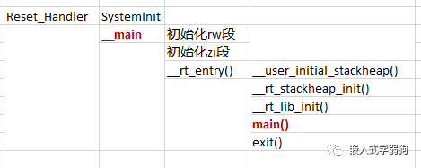
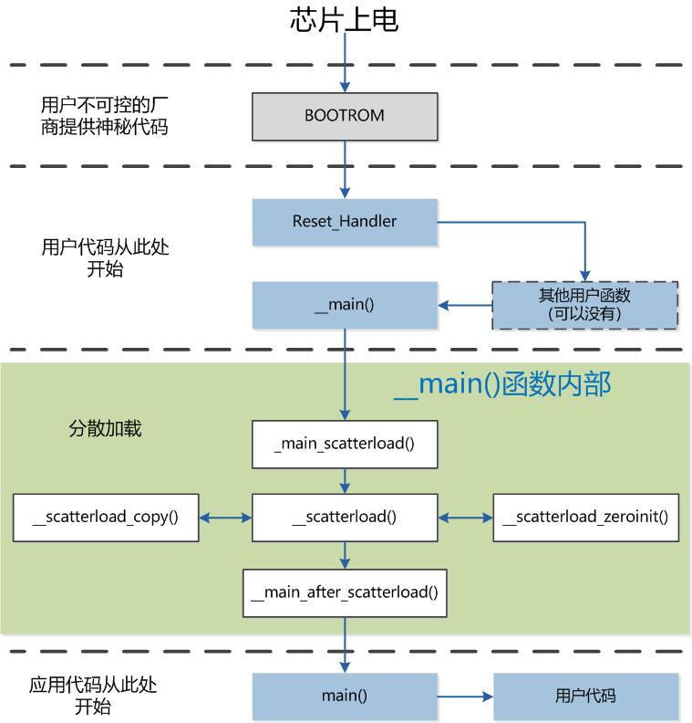

> STM32启动代码原理分析（底层技术）；

## 简述

ARM Cortex-M系列MCU的启动代码（使用汇编语言编程则不需要）主要做3件事情：

- 初始化并正确放置异常/中断矢量表；

- 分散加载；

- 初始化C语言运行环境（初始化堆栈以及C Library、浮点等）。

> Cortex-M3内核规定，起始地址必须存放堆顶指针，而第二个地址则必须存放复位中断入口矢量地址，这样在Cortex-M3内核复位后，会自动从起始地址的下一个32位空间取出复位中断入口矢量，跳转执行复位中断服务程序。对比ARM7/ARM9内核，Cortex-M3内核则是固定了中断矢量表的位置而起始地址是可变化的。

## 源码分析

基于`STM32F103C6T6`的启动文件`startup_stm32f103x6.s`的简要说明如下：

```plaintext
;******************** (C) COPYRIGHT 2017 STMicroelectronics ********************
;* File Name          : startup_stm32f103x6.s
;* Author             : MCD Application Team
;* Description        : STM32F103x6 Devices vector table for MDK-ARM toolchain.
;*                      This module performs:
;*                      - Set the initial SP
;*                      - Set the initial PC == Reset_Handler
;*                      - Set the vector table entries with the exceptions ISR address
;*                      - Configure the clock system
;*                      - Branches to __main in the C library (which eventually
;*                        calls main()).
;*                      After Reset the Cortex-M3 processor is in Thread mode,
;*                      priority is Privileged, and the Stack is set to Main.
;******************************************************************************
;* @attention
;*
;* Copyright (c) 2017 STMicroelectronics.
;* All rights reserved.
;*
;* This software component is licensed by ST under BSD 3-Clause license,
;* the "License"; You may not use this file except in compliance with the
;* License. You may obtain a copy of the License at:
;*                        opensource.org/licenses/BSD-3-Clause
;*
;******************************************************************************

; Amount of memory (in bytes) allocated for Stack
; Tailor this value to your application needs
;  Stack Configuration
;    Stack Size (in Bytes)
;

Stack_Size		EQU     0x400       ;声明栈的大小为0x400字节

                AREA    STACK, NOINIT, READWRITE, ALIGN=3
Stack_Mem       SPACE   Stack_Size  ;开辟一段大小为Stack_Size的内存空间作为栈
__initial_sp                        ;标号__initial_sp，表示栈空间顶地址。

;  Heap Configuration
;     Heap Size (in Bytes)
;

Heap_Size       EQU     0x200     ;声明栈的大小为0x200字节

                AREA    HEAP, NOINIT, READWRITE, ALIGN=3
__heap_base                       ;标号__heap_base，表示堆空间起始地址。
Heap_Mem        SPACE   Heap_Size ;开辟一段大小为Heap_Size的内存空间作为堆。
__heap_limit                      ;标号__heap_limit，表示堆空间结束地址。

;--------------------------------------------
;第一部分：
;启动代码最重要的工作是把异常中断向量表放到正确的Flash地址上
;把向量表定义为只读数据段，并导出向量表标号(Symbol)，让链接器识别此标号并根据分散加载文件正确的放置向量表
;__Vectors标号需要与分散加载文件合起来看，才会明白其真正的功能
;--------------------------------------------
                PRESERVE8         ;告诉编译器以8字节对齐。
                THUMB             ;告诉编译器使用THUMB指令集。

; Vector Table Mapped to Address 0 at Reset
                AREA    RESET, DATA, READONLY   ;声明权限为“READONLY”的名称为“RESET”的数据段
                                       ;（假设STM32从FLASH启动，则此中断矢量表起始地址即为0x8000000）
                EXPORT  __Vectors      ;将标号__Vectors声明为全局标号，这样外部文档就可以使用这个标号。
                EXPORT  __Vectors_End
                EXPORT  __Vectors_Size
;标号__Vectors，表示中断矢量表入口地址
;创建中断矢量表
;---------------------------------------
;第二部分:
;__initial_sp
;   1、栈顶指针地址，此语法跟MDK编译器的底层相关，是ARMCC编译器才能识别的语法
;      GCC与IAR的底层编译器ICCARM编译器不能识别;
;   2、__initial_sp 是一个链接器Image Symbol;
;   3、此处__initial_sp相当于是顶地址，或者此处直接把顶地址写到此处也行(如:0x20004000);
;   4、__initial_sp具体是多少，在此种写法下，是由分散加载文件决定的，下文会有详细论述;
;
;Reset_Handler:
;   1、Reset_Handler函数地址，此处相当于把Reset_Handler函数地址赋值给PC，即调用Reset_Handler函数;
;   2、此处也可以是其他函数，只是把复位函数放于此处最符合实际应用场景。
;      重要关键节点:
;   1、绝大多数cortex-M微控制器(M0、M3、M4都是这样)复位后先进入厂商BOOTROM，此时所有用户行为均无法介入处理器;
;   2、厂商BOOTROM(有些厂商会有其他名称来称呼此功能) 主要负责处理一些芯片最初级初始化、
;      加密以及一些对MCU的差异化设置等工作:
;   3、BOOTROM顺利完成后，MCu控制权会交给用户，即启动代码;
;   4、启动代码(运行汇编语言则不需要此启动代码)，最重要的工作在于设置MSP (主堆栈指针)以及PC(程序计数器)的值;
;   5、Cortex-M微控制器会默认把0x00000000地址里面的值设置为MSP的值，0x00000004地址里面的值设置为PC的值;
;   6、5中的默认地址可以通过修改Cortex-M中的VTOR寄存器来重新映射，比如改到0x20000000地址或其他;
;
;关于Exception(异常) 与Interrupt (中断) 的区别说明
;   1、Exception(异常)与Interrupt(中断)是不同的，是两个不同的概念，很多人会混淆两者,
;      把他们都按照中断来看待，这是错误的;
;   2、Exception(异常)是向量表的前16个向量，其优先级为负数，高于所有中断，而且不可调整优先级也不可关闭,
;      可以打断正常程序与Interrupt(中断) 的运行:
;   3、从第16个向量以后才是Interrupt(中断)，可以设置优先级，不用时可以关闭，但优先级永远低于Exception(异常);
;   4、从这里大家就可以理解Pendsy Handler与svsTick Handler为什么会被用于嵌入式操作系统，
;      因为其优先级高于所有中断,可以确保操作系统拥有高于普通用户程序执行的超级权限,
;      SVC_Handler有时也会用于操作系统，原理相同;
;   5、用户应用程序应尽量避免使用Exception(异常);
;---------------------------------------
__Vectors       DCD     __initial_sp               ; Top of Stack  栈顶地址
                DCD     Reset_Handler              ; Reset Handler 复位向量
                DCD     NMI_Handler                ; NMI Handler
                DCD     HardFault_Handler          ; Hard Fault Handler
                DCD     MemManage_Handler          ; MPU Fault Handler
                DCD     BusFault_Handler           ; Bus Fault Handler
                DCD     UsageFault_Handler         ; Usage Fault Handler
                DCD     0                          ; Reserved
                DCD     0                          ; Reserved
                DCD     0                          ; Reserved
                DCD     0                          ; Reserved
                DCD     SVC_Handler                ; SVCall Handler
                DCD     DebugMon_Handler           ; Debug Monitor Handler
                DCD     0                          ; Reserved
                DCD     PendSV_Handler             ; PendSV Handler 操作系统会用到的异常向量
                DCD     SysTick_Handler            ; SysTick Handler 操作系统会用到的心跳定时器异常向量(没有操作系统时可以用作普通定时器中断)
;---------------------------------------
;第三部分:
;   1、这里开始是中断向量表;
;   2、各个向量的顺序是芯片设计的时候就定义好的，不能更改;
;---------------------------------------
                ; External Interrupts
                DCD     WWDG_IRQHandler            ; Window Watchdog
                DCD     PVD_IRQHandler             ; PVD through EXTI Line detect
                DCD     TAMPER_IRQHandler          ; Tamper
                DCD     RTC_IRQHandler             ; RTC
                DCD     FLASH_IRQHandler           ; Flash
                DCD     RCC_IRQHandler             ; RCC
                DCD     EXTI0_IRQHandler           ; EXTI Line 0
                DCD     EXTI1_IRQHandler           ; EXTI Line 1
                DCD     EXTI2_IRQHandler           ; EXTI Line 2
                DCD     EXTI3_IRQHandler           ; EXTI Line 3
                DCD     EXTI4_IRQHandler           ; EXTI Line 4
                DCD     DMA1_Channel1_IRQHandler   ; DMA1 Channel 1
                DCD     DMA1_Channel2_IRQHandler   ; DMA1 Channel 2
                DCD     DMA1_Channel3_IRQHandler   ; DMA1 Channel 3
                DCD     DMA1_Channel4_IRQHandler   ; DMA1 Channel 4
                DCD     DMA1_Channel5_IRQHandler   ; DMA1 Channel 5
                DCD     DMA1_Channel6_IRQHandler   ; DMA1 Channel 6
                DCD     DMA1_Channel7_IRQHandler   ; DMA1 Channel 7
                DCD     ADC1_2_IRQHandler          ; ADC1_2
                DCD     USB_HP_CAN1_TX_IRQHandler  ; USB High Priority or CAN1 TX
                DCD     USB_LP_CAN1_RX0_IRQHandler ; USB Low  Priority or CAN1 RX0
                DCD     CAN1_RX1_IRQHandler        ; CAN1 RX1
                DCD     CAN1_SCE_IRQHandler        ; CAN1 SCE
                DCD     EXTI9_5_IRQHandler         ; EXTI Line 9..5
                DCD     TIM1_BRK_IRQHandler        ; TIM1 Break
                DCD     TIM1_UP_IRQHandler         ; TIM1 Update
                DCD     TIM1_TRG_COM_IRQHandler    ; TIM1 Trigger and Commutation
                DCD     TIM1_CC_IRQHandler         ; TIM1 Capture Compare
                DCD     TIM2_IRQHandler            ; TIM2
                DCD     TIM3_IRQHandler            ; TIM3
                DCD     0                          ; Reserved
                DCD     I2C1_EV_IRQHandler         ; I2C1 Event
                DCD     I2C1_ER_IRQHandler         ; I2C1 Error
                DCD     0                          ; Reserved
                DCD     0                          ; Reserved
                DCD     SPI1_IRQHandler            ; SPI1
                DCD     0                          ; Reserved
                DCD     USART1_IRQHandler          ; USART1
                DCD     USART2_IRQHandler          ; USART2
                DCD     0                          ; Reserved
                DCD     EXTI15_10_IRQHandler       ; EXTI Line 15..10
                DCD     RTC_Alarm_IRQHandler        ; RTC Alarm through EXTI Line
                DCD     USBWakeUp_IRQHandler       ; USB Wakeup from suspend
__Vectors_End

__Vectors_Size  EQU  __Vectors_End - __Vectors
;---------------------------------------
;第四部分:
;这部分开始可以称作Reset Handler实体，芯片上电后，经过BOOTROM后进入的用户可控最开始处的地方;
;   1、如果想让Mcu正常使用c语言，务必在此处调用 main函数;
;   2、__main() 不是main() 两者有着本质性的区别;
;   3、__main()是c Library中的函数，Kei1开发环境中自带的c Library中的函数;
;   4、main()是被 __main()调用的，__main()工作完成后最后一步就是调用main();
;   5、__main()被调用之前，可以根据需要插入一个或多个其他功能函数;
;---------------------------------------
                AREA    |.text|, CODE, READONLY             ;定义只读的代码段

; Reset handler routine
;复位中断服务程序，PROC…ENDP结构表示程序的开始和结束。
Reset_Handler    PROC
                 EXPORT  Reset_Handler             [WEAK]   ;声明复位中断矢量Reset_Handler为全局属性
                                                            ;这样外部文档就可以调用此复位中断服务。
     IMPORT  __main                                         ;声明__main标号。
     IMPORT  SystemInit                                     ;声明SystemInit标号。
                 LDR     R0, =SystemInit                    ;跳转SystemInit地址执行
                 BLX     R0
                 LDR     R0, =__main                        ;跳转__main地址执行
                 BX      R0
                 ENDP

; Dummy Exception Handlers (infinite loops which can be modified)
;---------------------------------------------------------------
;第五部分:
;   1、[weak]指定了一个这个函数为"弱函数”;
;   2、这些中断服务函教定义成弱函数的意义是，当中断出现时，需要有一个中断服务函数予以响应，但真实的
;      用户程序往往只会使用一部分中断，甚至不使用中断，所以以下这些函数给出了异常/中断服务函数的
;      默认实现，很简单，默认实现就是死循环汇编中的"B."语句,相当于while(1);因为不知道用户是否会
;      用到多少中断，但这些服务函数又很重要，所以就把这些函数都"实现"并声明为弱函数;
;   3、弱函数的意思是如果用户定义了同样名称的另一个函数，那么默认实现的弱函数就会被覆盖，比如
;      HardFault_Handler异常在下面有一个默认的实现，但这种默认的实现不能满足我的需要的时候，我可以
;      再重新定义一个HardEault Handler函数这个新定义的HardFault_Handler函数会覆盖原有的被声明
;      为[WEAK]的弱函数;
;   4、有很多种适合使用弱函数的场合，默认的异常/中断服务函数只是一种应用场景;
;   5、在C语言中声明弱函数是在函数后加“__attribute((weak))”;
;----------------------------------------------------------------
NMI_Handler     PROC
                EXPORT  NMI_Handler                [WEAK]
                B       .
                ENDP
HardFault_Handler\
                PROC
                EXPORT  HardFault_Handler          [WEAK]
                B       .
                ENDP
MemManage_Handler\
                PROC
                EXPORT  MemManage_Handler          [WEAK]
                B       .
                ENDP
BusFault_Handler\
                PROC
                EXPORT  BusFault_Handler           [WEAK]
                B       .
                ENDP
UsageFault_Handler\
                PROC
                EXPORT  UsageFault_Handler         [WEAK]
                B       .
                ENDP
SVC_Handler     PROC
                EXPORT  SVC_Handler                [WEAK]
                B       .
                ENDP
DebugMon_Handler\
                PROC
                EXPORT  DebugMon_Handler           [WEAK]
                B       .
                ENDP
PendSV_Handler  PROC
                EXPORT  PendSV_Handler             [WEAK]
                B       .
                ENDP
SysTick_Handler PROC
                EXPORT  SysTick_Handler            [WEAK]
                B       .
                ENDP

Default_Handler PROC

                EXPORT  WWDG_IRQHandler            [WEAK]
                EXPORT  PVD_IRQHandler             [WEAK]
                EXPORT  TAMPER_IRQHandler          [WEAK]
                EXPORT  RTC_IRQHandler             [WEAK]
                EXPORT  FLASH_IRQHandler           [WEAK]
                EXPORT  RCC_IRQHandler             [WEAK]
                EXPORT  EXTI0_IRQHandler           [WEAK]
                EXPORT  EXTI1_IRQHandler           [WEAK]
                EXPORT  EXTI2_IRQHandler           [WEAK]
                EXPORT  EXTI3_IRQHandler           [WEAK]
                EXPORT  EXTI4_IRQHandler           [WEAK]
                EXPORT  DMA1_Channel1_IRQHandler   [WEAK]
                EXPORT  DMA1_Channel2_IRQHandler   [WEAK]
                EXPORT  DMA1_Channel3_IRQHandler   [WEAK]
                EXPORT  DMA1_Channel4_IRQHandler   [WEAK]
                EXPORT  DMA1_Channel5_IRQHandler   [WEAK]
                EXPORT  DMA1_Channel6_IRQHandler   [WEAK]
                EXPORT  DMA1_Channel7_IRQHandler   [WEAK]
                EXPORT  ADC1_2_IRQHandler          [WEAK]
                EXPORT  USB_HP_CAN1_TX_IRQHandler  [WEAK]
                EXPORT  USB_LP_CAN1_RX0_IRQHandler [WEAK]
                EXPORT  CAN1_RX1_IRQHandler        [WEAK]
                EXPORT  CAN1_SCE_IRQHandler        [WEAK]
                EXPORT  EXTI9_5_IRQHandler         [WEAK]
                EXPORT  TIM1_BRK_IRQHandler        [WEAK]
                EXPORT  TIM1_UP_IRQHandler         [WEAK]
                EXPORT  TIM1_TRG_COM_IRQHandler    [WEAK]
                EXPORT  TIM1_CC_IRQHandler         [WEAK]
                EXPORT  TIM2_IRQHandler            [WEAK]
                EXPORT  TIM3_IRQHandler            [WEAK]
                EXPORT  I2C1_EV_IRQHandler         [WEAK]
                EXPORT  I2C1_ER_IRQHandler         [WEAK]
                EXPORT  SPI1_IRQHandler            [WEAK]
                EXPORT  USART1_IRQHandler          [WEAK]
                EXPORT  USART2_IRQHandler          [WEAK]
                EXPORT  EXTI15_10_IRQHandler       [WEAK]
                EXPORT  RTC_Alarm_IRQHandler        [WEAK]
                EXPORT  USBWakeUp_IRQHandler       [WEAK]
;---------------------------------------------------
;第六部分
;   这部分比较简单，看一下第五部分的代码就可以理解下面的部分;
;---------------------------------------------------
WWDG_IRQHandler
PVD_IRQHandler
TAMPER_IRQHandler
RTC_IRQHandler
FLASH_IRQHandler
RCC_IRQHandler
EXTI0_IRQHandler
EXTI1_IRQHandler
EXTI2_IRQHandler
EXTI3_IRQHandler
EXTI4_IRQHandler
DMA1_Channel1_IRQHandler
DMA1_Channel2_IRQHandler
DMA1_Channel3_IRQHandler
DMA1_Channel4_IRQHandler
DMA1_Channel5_IRQHandler
DMA1_Channel6_IRQHandler
DMA1_Channel7_IRQHandler
ADC1_2_IRQHandler
USB_HP_CAN1_TX_IRQHandler
USB_LP_CAN1_RX0_IRQHandler
CAN1_RX1_IRQHandler
CAN1_SCE_IRQHandler
EXTI9_5_IRQHandler
TIM1_BRK_IRQHandler
TIM1_UP_IRQHandler
TIM1_TRG_COM_IRQHandler
TIM1_CC_IRQHandler
TIM2_IRQHandler
TIM3_IRQHandler
I2C1_EV_IRQHandler
I2C1_ER_IRQHandler
SPI1_IRQHandler
USART1_IRQHandler
USART2_IRQHandler
EXTI15_10_IRQHandler
RTC_Alarm_IRQHandler
USBWakeUp_IRQHandler

                B       .

                ENDP

                ALIGN

;*******************************************************************************
; User Stack and Heap initialization
;*******************************************************************************
;IF…ELSE…ENDIF结构，判断是否使用DEF:__MICROLIB（此处为不使用）。
;若使用DEF:__MICROLIB，则将__initial_sp，__heap_base，__heap_limit
;亦即栈顶地址，堆始末地址赋予全局属性，使外部程序可以使用。
                 IF      :DEF:__MICROLIB

                 EXPORT  __initial_sp
                 EXPORT  __heap_base
                 EXPORT  __heap_limit

                 ELSE

                 IMPORT  __use_two_region_memory    ;定义全局标号__use_two_region_memory。
                 EXPORT  __user_initial_stackheap   ;声明全局标号__user_initial_stackheap，
                                                    ;这样外程序也可调用此标号

__user_initial_stackheap                    ;标号__user_initial_stackheap，表示用户堆栈初始化程序入口
                 ;分别保存栈顶指针和栈大小，堆始地址和堆大小至R0，R1，R2，R3寄存器。
                 LDR     R0, =  Heap_Mem
                 LDR     R1, =(Stack_Mem + Stack_Size)
                 LDR     R2, = (Heap_Mem +  Heap_Size)
                 LDR     R3, = Stack_Mem
                 BX      LR

                 ALIGN
                 ENDIF
                 END;程序完毕
;************************ (C) COPYRIGHT STMicroelectronics *****END OF FILE*****
```

## 部分解释

以上便是STM32的启动代码的完整解析，接下来对几个小地方做解释：

1、AREA指令：伪指令，用于定义代码段或数据段，后跟属性标号。其中比较重要的一个标号为“READONLY”或者“READWRITE”，其中“READONLY”表示该段为只读属性，联系到STM32的内部存储介质，可知具有只读属性的段保存于FLASH区，即0x8000000地址后。而“READONLY”表示该段为“可读写”属性，可知“可读写”段保存于SRAM区，即0x2000000地址后。由此可以从栈堆定义的代码知道，堆栈段位于SRAM空间。从`AREA RESET, DATA, READONLY`可知，中断矢量表放置于FLASH区，而这也是整片启动代码中最先被放进FLASH区的数据。因此可以得到一条重要的信息：0x8000000地址存放的是栈顶地址__initial_sp，0x8000004地址存放的是复位中断矢量Reset_Handler（STM32使用32位总线，因此存储空间为4字节对齐）。

2、 DCD指令：作用是开辟一段空间，其意义等价于C语言中的地址符“&”。因此从`__Vectors`行开始创建的中断矢量表则类似于使用C语言定义了一个指针数组，其每一个成员都是一个函数指针，分别指向各个中断服务函数。

3、 标号：前文多处使用了“标号”一词。标号主要用于表示一片内存空间的某个位置，等价于C语言中的“地址”概念。地址仅仅表示存储空间的一个位置，从C语言的角度来看，变量的地址，数组的地址或是函数的入口地址在本质上并无区别。

4、 `IMPORT __main`的__main标号并不表示C程序中的main函数入口地址，因此接下来的`BX R0`也并不是跳转至main函数开始执行C程序。__main标号表示C/C++标准实时库函数里的一个初始化子程序__main的入口地址。该程序的一个主要作用是初始化堆栈（对于程序清单一来说则是跳转__user_initial_stackheap标号进行初始化堆栈的），并初始化映像文档，最后跳转C程序中的main函数。这就解释了为何所有的C程序必须有一个main函数作为程序的起点——因为这是由C/C++标准实时库所规定的——并且不能更改，因为C/C++标准实时库并不对外界开发源代码。因此，实际上在用户可见的前提下，程序在`BX R0`后就跳转至.c文档中的main函数，开始执行C程序了。

至此可以总结一下STM32的启动文档和启动过程。首先对栈和堆的大小进行定义，并在代码区的起始处创建中断矢量表，其第一个表项是栈顶地址，第二个表项是复位中断服务入口地址。然后在复位中断服务程序中跳转C/C++标准实时库的__main函数，完成用户堆栈等的初始化后，跳转.c文档中的main函数开始执行C程序。

假设STM32被设置为从内部FLASH启动（这也是最常见的一种情况），中断矢量表起始地位为0x8000000，则栈顶地址存放于0x8000000处，而复位中断服务入口地址存放于0x8000004处。当STM32遇到复位信号后，则从0x80000004处取出复位中断服务入口地址，继而执行复位中断服务程序，然后跳转__main函数，最后进入mian函数，来到C的世界。

## 图片示意

### 函数的调用过程：



### 启动流程1（使用标准库，不使用Microlib）

如下图：


### 启动流程2（使用Microlib）

> microlib 是缺省 C 库的备选库。它旨在与需要装入到极少量内存中的深层嵌入式应用程序配合使用。这些应用程序不在操作系统中运行。 microlib 进行了高度优化以使代码变得很小。它的功能比缺省 C 库少，并且根本不具备某些 ISOC 特性。某些库函数的运行速度也比较慢，例如， memcpy() 。
>   microlib与缺省C库之间的主要差异是：
> microlib不符合ISO C库标准。不支持某些ISO特性，并且其他特性具有的功能也较少；
> microlib不符合IEEE 754二进制浮点算法标准；
> microlib进行了高度优化以使代码变得很小；
> 无法对区域设置进行配置。缺省C区域设置是唯一可用的区域设置；
> 不能将main()声明为使用参数，并且不能返回内容；
> 不支持stdio，但未缓冲的stdin、stdout和stderr除外；
> microlib对C99函数提供有限的支持；
> microlib不支持操作系统函数；
> microlib不支持与位置无关的代码；
> microlib不提供互斥锁来防止非线程安全的代码；
> microlib不支持宽字符或多字节字符串；
> 与stdlib不同，microlib不支持可选择的单或双区内存模型。microlib只提供双区内存模型，即单独的堆栈和堆区。

启动流程如下图：


