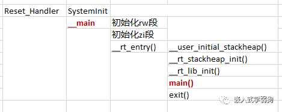
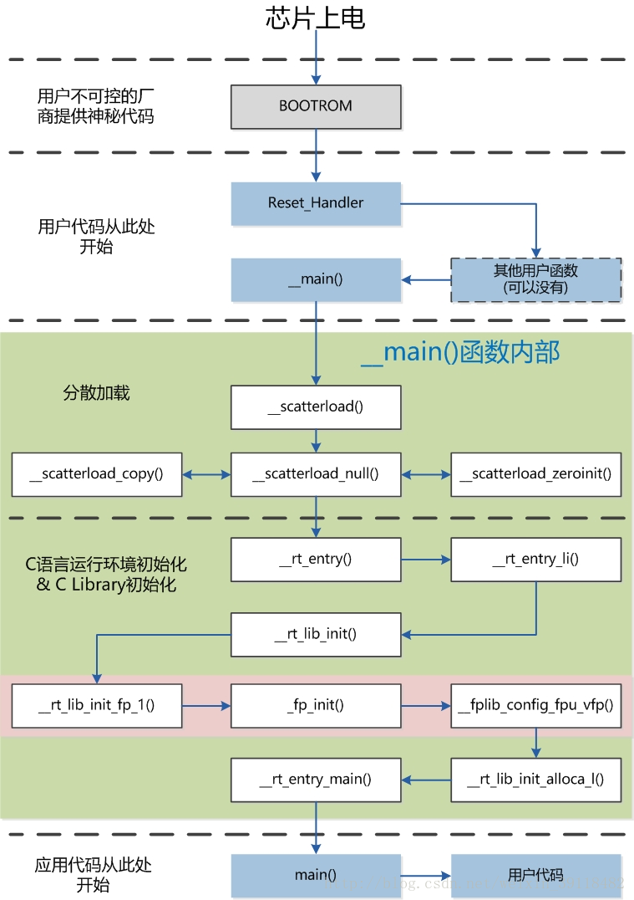
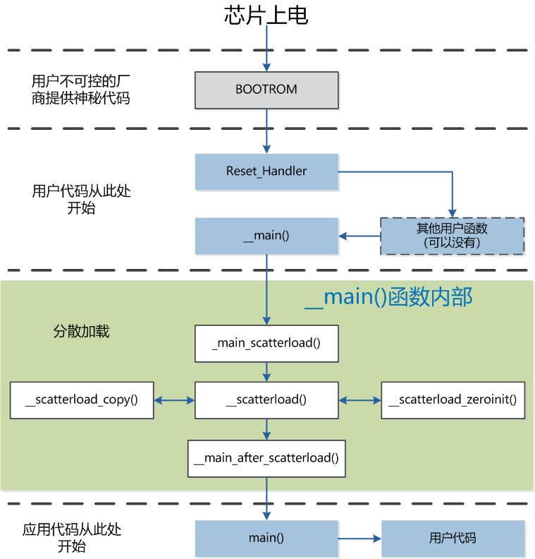

> STM32单片机是如何从上电运行到main()函数的；

用三张图片基本就能理解了：

> 参考：
> [https://blog.csdn.net/weixin_39118482/article/details/79508747?spm=1001.2014.3001.5502](https://blog.csdn.net/weixin_39118482/article/details/79508747?spm=1001.2014.3001.5502)
> [https://www.modb.pro/db/548699](https://www.modb.pro/db/548699)
> [https://www.cnblogs.com/yucloud/p/stm32_SystemInit_to_main.html](https://www.cnblogs.com/yucloud/p/stm32_SystemInit_to_main.html)

## 1、函数的调用过程：

## 2、启动流程1（使用标准库，不使用Microlib）

如下图：

## 3、启动流程2（使用Microlib）

> microlib 是缺省 C 库的备选库。它旨在与需要装入到极少量内存中的深层嵌入式应用程序配合使用。这些应用程序不在操作系统中运行。 microlib 进行了高度优化以使代码变得很小。它的功能比缺省 C 库少，并且根本不具备某些 ISOC 特性。某些库函数的运行速度也比较慢，例如， memcpy() 。
>   microlib与缺省C库之间的主要差异是：
> microlib不符合ISO C库标准。不支持某些ISO特性，并且其他特性具有的功能也较少；
> microlib不符合IEEE 754二进制浮点算法标准；
> microlib进行了高度优化以使代码变得很小；
> 无法对区域设置进行配置。缺省C区域设置是唯一可用的区域设置；
> 不能将main()声明为使用参数，并且不能返回内容；
> 不支持stdio，但未缓冲的stdin、stdout和stderr除外；
> microlib对C99函数提供有限的支持；
> microlib不支持操作系统函数；
> microlib不支持与位置无关的代码；
> microlib不提供互斥锁来防止非线程安全的代码；
> microlib不支持宽字符或多字节字符串；
> 与stdlib不同，microlib不支持可选择的单或双区内存模型。microlib只提供双区内存模型，即单独的堆栈和堆区。

启动流程如下图：

## 4、其他

> 关于stm32的启动文件：
>   [https://www.fan-pengfei.top/2023/02/25/STM32%E5%90%AF%E5%8A%A8%E4%BB%A3%E7%A0%81%E5%8E%9F%E7%90%86%E5%88%86%E6%9E%90/#more](https://www.fan-pengfei.top/2023/02/25/STM32%E5%90%AF%E5%8A%A8%E4%BB%A3%E7%A0%81%E5%8E%9F%E7%90%86%E5%88%86%E6%9E%90/#more)
