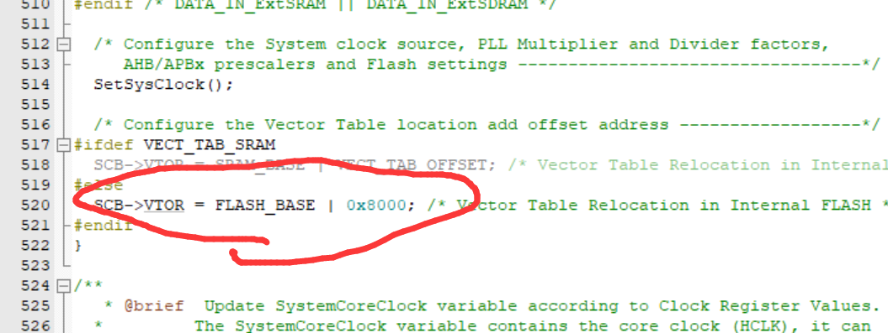
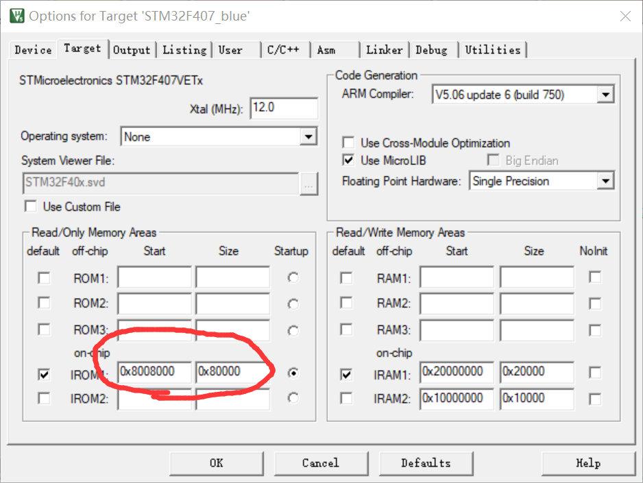
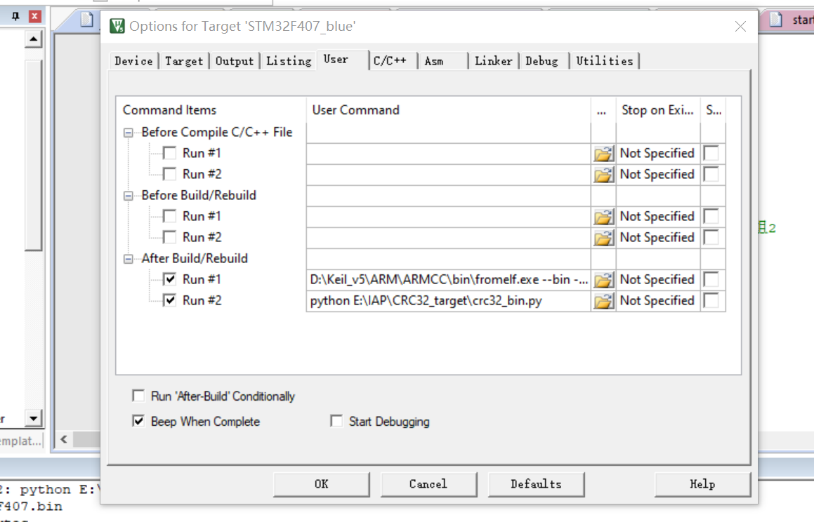
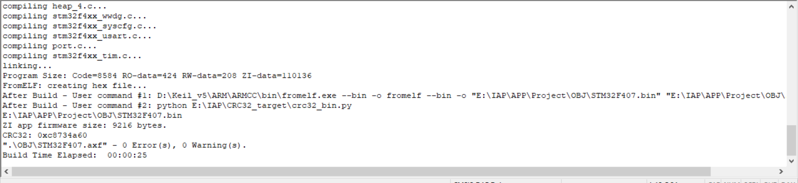
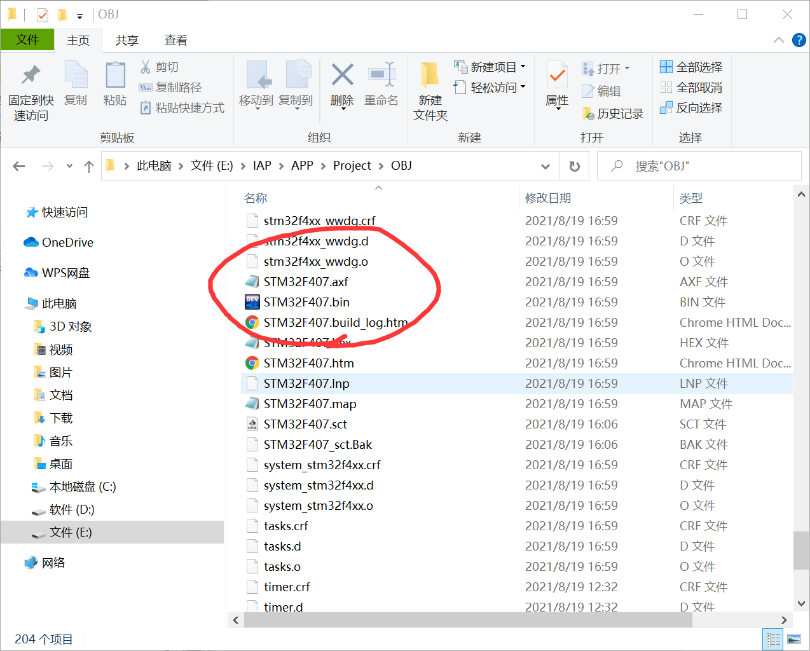

> 之前准备电赛的时候，需要用到无线调试器，先是上淘宝看了一下，基本都是大几百，所以想着自己自制一个，直接搞DAP无线调试器有点难，所以就用手头现有的蓝牙模块搞了一个串口无线下载器，调试的话就靠printf打印了；

也做了好几个版本，最初的版本主要有两个大的问题：

> 1、没有程序校验过程，不能保证单片机收到的APP程序是完整且正确的；
> 2、没有错误解决机制，一旦APP程序错误或者程序跑飞，就必须手动按下复位键进行复位；

为解决以上两个问题，采取了以下措施

> 1、对APP程序加入CRC校验；
> 2、加入看门狗，解决程序跑飞问题；

## 以下是关于这个项目的具体介绍：

### 一、APP程序部分

> 首先要有一个APP程序，与一般的程序相比，APP程序有两个地方需要进行配置：

分别如下图所示：

1、在system_stm32f4xx.c中进行修改：



2、在小锤子那里进行修改：



3、修改完毕后，进行正常的编译即可；

### 二、BIN文件的处理

> 最初的版本并没有加入crc校验，所以经常会出错，导致程序经常跑飞，所以加入了crc32校验；经检验，效果那是非常的好；
> 为什么是采用bin文件而不是使用更容易得到的hex文件呢？
> 原因很简单：因为写入单片机flash的程序实际就是bin文件，hex文件需要转换才能写进flash中；
> 以上操作只是得到了hex文件，而我们需要的是bin文件，以下是对hex文件的处理过程：

1、第一步呢，当然是得到最初的bin文件；而Keil默认情况下编译成功后生成的是Hex文件，而不是bin文件，所以要将Hex文件转换为bin文件，当然是有现成的Hex转bin的程序的，但是比较麻烦，可以用Keil自带的功能完成编译后自动生成bin文件的过程，具体的方法请自行百度；

这是我的配置，仅供参考：

> D:\Keil_v5\ARM\ARMCC\bin\fromelf.exe —bin -o fromelf —bin -o “$L@L.bin” “#L”

2、然后是对bin文件进行处理，也就是crc32校验码的生成以及插入该校验码到bin文件中，我用的是python脚本的方式，代码如下：

```python
# -*- coding:utf-8 -*-
import binascii
import os
import sys

def crc2hex(crc):
    res=''
    for i in range(4):
        t=crc & 0xFF
        crc >>= 8
        res='%02X%s' % (t, res)
    return res
inputfile = "E:\IAP\APP\Project\OBJ\STM32F407.bin"#实际存放的bin文件路径
isfile = os.path.isfile(inputfile);
print(inputfile);
fp = open(inputfile, "r+b")  #直接打开一个文件，如果文件不存在则创建文件
filesize = os.path.getsize(inputfile)
print("ZI app firmware size:", filesize, "bytes.")

#计算bin文件的CRC，首先清空CRC32区域的4个byte
fp.seek(0x1c, 0)#从bin文件开始，偏移地址为0x1c的地方存放bin的CRC32
clear4bytes = '00000000'
c4 =binascii.unhexlify(clear4bytes)
fp.write(c4)  #将CRC32存放的区域4bytes清零
fp.seek(0, 0)#从0开始读取整个bin
file_content = fp.read()#读整个文件内容到 file_content
crc = binascii.crc32(file_content)
print('CRC32:', hex(crc))

fp.seek(0x1c, 0)#从bin文件开始，偏移地址为0x1c的地方存放bin的CRC32
#存放计算CRC32四个字节
crcstr_2 = crc2hex(crc)
r=binascii.unhexlify(crcstr_2)
fp.write(r)
fp.close()
sys.exit(0)##正常退出
```

> 代码我就不多解释了，应该还是挺容易看懂的；

3、然后是对Keil进行配置，实现编译，生成bin文件和加入CRC校验可以一步完成；

具体配置结果的截图如下：



配置成功后输出的结果：



4、此时在工程文件目录下就可以找到.bin文件了：



Bin文件的发送我用的是正点原子的串口助手，配置好波特率什么的就可以用蓝牙发送该bin文件了;

### 三、Bootloader部分

> BootLoader就是一个引导程序，它的功能就是用串口接收蓝牙模块收到的信息，处理信息，校验信息，最后执行APP程序；
> 值得注意的是，Bootloader部分程序需要通过st-link或者DAP等调试器下载到单片机flash中；

Bootloader部分程序具体的工作流程是：

```bash
#接收串口收到的信息;
#判断是否接收完毕;
#提取bin文件中储存的crc32校验码;
#清除该校验码，还原初始bin文件;
#对该bin文件进行CRC校验得到校验码;
#比对两次得到的校验码;
#将bin文件写入flash中，跳转到目标地址执行APP程序;
```

#### 关键的代码如下：

> CRC校验函数以及校验过程：

```c
crc32_temp=USART_RX_BUF[0x1c]*256*256*256
			+USART_RX_BUF[0x1c+1]*256*256
			+USART_RX_BUF[0x1c+2]*256
			+USART_RX_BUF[0x1c+3];//读取crc32的值
for(i=0;i CRC校验函数：

```c
uint32_t crc32(unsigned char *buf,uint32_t size)
{
	uint32_t i, crc;
	crc = 0xFFFFFFFF;
	for (i = 0; i > 8);
	}
	return crc^0xFFFFFFFF;
}
```

```c
static const uint32_t crc32tab[] = {
 0x00000000L, 0x77073096L, 0xee0e612cL, 0x990951baL,
 0x076dc419L, 0x706af48fL, 0xe963a535L, 0x9e6495a3L,
 0x0edb8832L, 0x79dcb8a4L, 0xe0d5e91eL, 0x97d2d988L,
 0x09b64c2bL, 0x7eb17cbdL, 0xe7b82d07L, 0x90bf1d91L,
 0x1db71064L, 0x6ab020f2L, 0xf3b97148L, 0x84be41deL,
 0x1adad47dL, 0x6ddde4ebL, 0xf4d4b551L, 0x83d385c7L,
 0x136c9856L, 0x646ba8c0L, 0xfd62f97aL, 0x8a65c9ecL,
 0x14015c4fL, 0x63066cd9L, 0xfa0f3d63L, 0x8d080df5L,
 0x3b6e20c8L, 0x4c69105eL, 0xd56041e4L, 0xa2677172L,
 0x3c03e4d1L, 0x4b04d447L, 0xd20d85fdL, 0xa50ab56bL,
 0x35b5a8faL, 0x42b2986cL, 0xdbbbc9d6L, 0xacbcf940L,
 0x32d86ce3L, 0x45df5c75L, 0xdcd60dcfL, 0xabd13d59L,
 0x26d930acL, 0x51de003aL, 0xc8d75180L, 0xbfd06116L,
 0x21b4f4b5L, 0x56b3c423L, 0xcfba9599L, 0xb8bda50fL,
 0x2802b89eL, 0x5f058808L, 0xc60cd9b2L, 0xb10be924L,
 0x2f6f7c87L, 0x58684c11L, 0xc1611dabL, 0xb6662d3dL,
 0x76dc4190L, 0x01db7106L, 0x98d220bcL, 0xefd5102aL,
 0x71b18589L, 0x06b6b51fL, 0x9fbfe4a5L, 0xe8b8d433L,
 0x7807c9a2L, 0x0f00f934L, 0x9609a88eL, 0xe10e9818L,
 0x7f6a0dbbL, 0x086d3d2dL, 0x91646c97L, 0xe6635c01L,
 0x6b6b51f4L, 0x1c6c6162L, 0x856530d8L, 0xf262004eL,
 0x6c0695edL, 0x1b01a57bL, 0x8208f4c1L, 0xf50fc457L,
 0x65b0d9c6L, 0x12b7e950L, 0x8bbeb8eaL, 0xfcb9887cL,
 0x62dd1ddfL, 0x15da2d49L, 0x8cd37cf3L, 0xfbd44c65L,
 0x4db26158L, 0x3ab551ceL, 0xa3bc0074L, 0xd4bb30e2L,
 0x4adfa541L, 0x3dd895d7L, 0xa4d1c46dL, 0xd3d6f4fbL,
 0x4369e96aL, 0x346ed9fcL, 0xad678846L, 0xda60b8d0L,
 0x44042d73L, 0x33031de5L, 0xaa0a4c5fL, 0xdd0d7cc9L,
 0x5005713cL, 0x270241aaL, 0xbe0b1010L, 0xc90c2086L,
 0x5768b525L, 0x206f85b3L, 0xb966d409L, 0xce61e49fL,
 0x5edef90eL, 0x29d9c998L, 0xb0d09822L, 0xc7d7a8b4L,
 0x59b33d17L, 0x2eb40d81L, 0xb7bd5c3bL, 0xc0ba6cadL,
 0xedb88320L, 0x9abfb3b6L, 0x03b6e20cL, 0x74b1d29aL,
 0xead54739L, 0x9dd277afL, 0x04db2615L, 0x73dc1683L,
 0xe3630b12L, 0x94643b84L, 0x0d6d6a3eL, 0x7a6a5aa8L,
 0xe40ecf0bL, 0x9309ff9dL, 0x0a00ae27L, 0x7d079eb1L,
 0xf00f9344L, 0x8708a3d2L, 0x1e01f268L, 0x6906c2feL,
 0xf762575dL, 0x806567cbL, 0x196c3671L, 0x6e6b06e7L,
 0xfed41b76L, 0x89d32be0L, 0x10da7a5aL, 0x67dd4accL,
 0xf9b9df6fL, 0x8ebeeff9L, 0x17b7be43L, 0x60b08ed5L,
 0xd6d6a3e8L, 0xa1d1937eL, 0x38d8c2c4L, 0x4fdff252L,
 0xd1bb67f1L, 0xa6bc5767L, 0x3fb506ddL, 0x48b2364bL,
 0xd80d2bdaL, 0xaf0a1b4cL, 0x36034af6L, 0x41047a60L,
 0xdf60efc3L, 0xa867df55L, 0x316e8eefL, 0x4669be79L,
 0xcb61b38cL, 0xbc66831aL, 0x256fd2a0L, 0x5268e236L,
 0xcc0c7795L, 0xbb0b4703L, 0x220216b9L, 0x5505262fL,
 0xc5ba3bbeL, 0xb2bd0b28L, 0x2bb45a92L, 0x5cb36a04L,
 0xc2d7ffa7L, 0xb5d0cf31L, 0x2cd99e8bL, 0x5bdeae1dL,
 0x9b64c2b0L, 0xec63f226L, 0x756aa39cL, 0x026d930aL,
 0x9c0906a9L, 0xeb0e363fL, 0x72076785L, 0x05005713L,
 0x95bf4a82L, 0xe2b87a14L, 0x7bb12baeL, 0x0cb61b38L,
 0x92d28e9bL, 0xe5d5be0dL, 0x7cdcefb7L, 0x0bdbdf21L,
 0x86d3d2d4L, 0xf1d4e242L, 0x68ddb3f8L, 0x1fda836eL,
 0x81be16cdL, 0xf6b9265bL, 0x6fb077e1L, 0x18b74777L,
 0x88085ae6L, 0xff0f6a70L, 0x66063bcaL, 0x11010b5cL,
 0x8f659effL, 0xf862ae69L, 0x616bffd3L, 0x166ccf45L,
 0xa00ae278L, 0xd70dd2eeL, 0x4e048354L, 0x3903b3c2L,
 0xa7672661L, 0xd06016f7L, 0x4969474dL, 0x3e6e77dbL,
 0xaed16a4aL, 0xd9d65adcL, 0x40df0b66L, 0x37d83bf0L,
 0xa9bcae53L, 0xdebb9ec5L, 0x47b2cf7fL, 0x30b5ffe9L,
 0xbdbdf21cL, 0xcabac28aL, 0x53b39330L, 0x24b4a3a6L,
 0xbad03605L, 0xcdd70693L, 0x54de5729L, 0x23d967bfL,
 0xb3667a2eL, 0xc4614ab8L, 0x5d681b02L, 0x2a6f2b94L,
 0xb40bbe37L, 0xc30c8ea1L, 0x5a05df1bL, 0x2d02ef8dL
};
```

> 程序加载以及程序跳转函数：

```c
if(((*(vu32*)(0X20001000+4))&0xFF000000)==0x08000000)//判断是否为0X08XXXXXX.
{
	iap_write_appbin(FLASH_APP1_ADDR,USART_RX_BUF,applenth);//更新FLASH代码
	printf("固件更新完成!\r\n");
	printf("开始执行FLASH用户代码!!\r\n");
	if(((*(vu32*)(FLASH_APP1_ADDR+4))&0xFF000000)==0x08000000)//判断是否为0X08XXXXXX.
	{
		iap_load_app(FLASH_APP1_ADDR);//执行FLASH APP代码
		crc32_true=0;
	}
	else
	{
		printf("非FLASH应用程序,无法执行!\r\n");
	}
}
```

> 完整的代码我放在GitHub上边了，欢迎访问。

**该项目的GitHub地址是：[https://github.com/fan-pengfei/Stm32_IAP/tree/master](https://github.com/fan-pengfei/Stm32_IAP/tree/master)**
