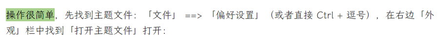

> 如何修改 Typora 「高亮」的颜色；

Typora 有一个「高亮」的格式（示例：`==例子==`），类似于荧光笔，但是感觉默认的颜色偏亮，看久了不舒服，所以利用修改主题文件的方式来自定义颜色。

操作很简单，先找到主题文件：「文件」 ==> 「偏好设置」（或者直接 Ctrl + 逗号），在右边「外观」栏中找到「打开主题文件」打开：

打开主题对应的 `.css` 文件，在最后面加上下面的文字：

```css
mark {
  background: #a9d18e;
  border-bottom: 0px solid #ffffff;
  padding: 0.0px;
  margin: 0 0px;
}
```

如果只是想要单纯改变颜色，也可以只写 `background`的这一行：

```css
mark {
    background: #a9d18e;
}
```

其中 `backgraoud`后面的十六进制数为所需要的颜色。`border-bottom` 是下划线的大小和颜色。`padding`就是上下左右的边框大小。`margin`就是所标记文字离左右文字的距离。

最后，Typora 中「高亮」没有快捷键，但是可以自定义。Ctrl+逗号 打开「偏好设置」，在「通用」里最下面打开高级设置，找到下图位置，添加自己需要的快捷键：

```json
// Custom key binding, which will override the default ones.
"keyBinding": {
  // for example:
  // "Always on Top": "Ctrl+Shift+P"
},
```

修改为：

```json
// Custom key binding, which will override the default ones.
"keyBinding": {
  // for example:
  // "Always on Top": "Ctrl+Shift+P"
    "Highlight":"Ctrl+Shift+H"
},
```

最后的效果如下：


