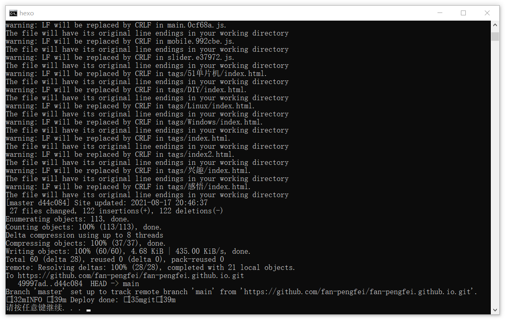

> 常用bat脚本；

## Windows bat脚本：

> 依次执行多条命令，并且执行完执行完毕并不退出：

```bash
/*upload.bat:博客自动上传脚本*/
call hexo clean //
call hexo g //博客生成
call hexo d //博客上传
pause //页面暂停
```

> 同时执行多条命令，并且执行完执行完毕并不退出（以下例子仅仅说明语法，并不代表可用）：

```bash
/*upload.bat:博客自动上传脚本*/
start hexo clean //
start hexo g //博客生成
start hexo d //博客上传
pause //页面暂停
```

脚本运行结果：


