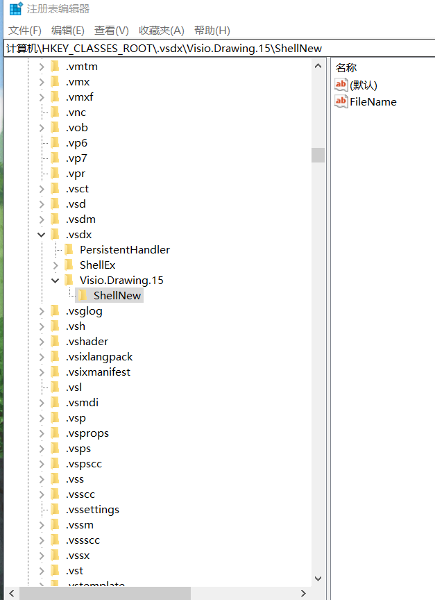
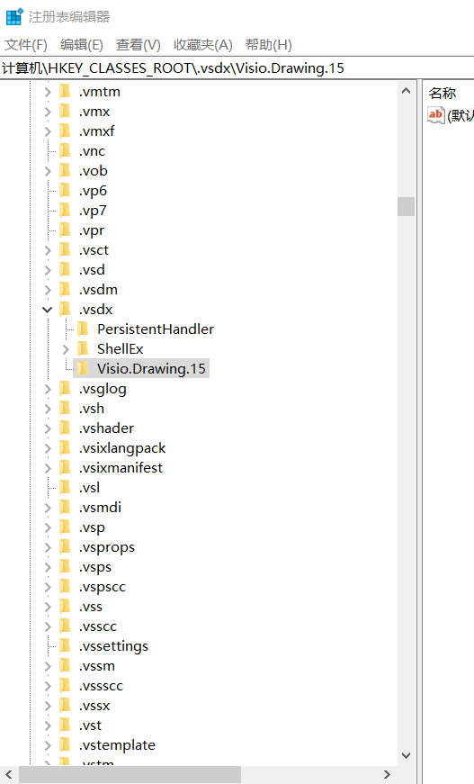

> Windows 使用技巧;

### 应用程序自启动

> 1、在Windows10桌面，右键点击桌面左下角的开始按钮，在弹出的菜单中选择”运行”菜单项.
> 2、这时就会打开Windows10的运行窗口，在窗口中输入命令shell:startup，然后点击确定按钮.
> 3、这时就可以打开Windows10系统的启动文件夹.
> 4、把需要开机启动的应用或是程序的快捷方式拖动到该文件夹中，这样以后电脑开机的时候，就会自动启动这些应用.

### 添加右键新建Markdown文档

> 1、在电脑桌面右键一个.txt文本(文档名随便，文档内容如下)；
> ```shell
> Windows Registry Editor Version 5.00
> [HKEY_CLASSES_ROOT\.md]
> @="MarkdownFile"
> "PerceivedType"="text"
> "Content Type"="text/plain"
> [HKEY_CLASSES_ROOT\.md\ShellNew]
> [HKEY_CLASSES_ROOT\MarkdownFile]
> @="Markdown File"
> [HKEY_CLASSES_ROOT\MarkdownFile\DefaultIcon]
> @="%SystemRoot%\system32\imageres.dll,-102"
> [HKEY_CLASSES_ROOT\MarkdownFile\shell]
> [HKEY_CLASSES_ROOT\MarkdownFile\shell\open]
> ```
>   2、修改文档的后缀为.reg；
>   3、双击打开这个.reg文档；
>   4、点击确定写进注册表；
>   5、在桌面右键刷新，然后新建就看到有markdown啦；

### 取消右键新建文件(以visio文件为例)

> 1、WIN+R；
> 2、输入regedit，enter确认，打开注册表编辑器；
> 3、在第一项HKEY_CLASSES_ROOT中找到对应的后缀名(例如.vsdx)；
> 4、删去该项的子项->ShellNew；
> 
> 
> 5、再次右键新建文件即可发现已经修改成功；
