> 今天用到了git rebase命令来进行合并两次提交，顺带梳理下rebase命令的用法；
>   参考：[https://www.jianshu.com/p/4a8f4af4e803](https://www.jianshu.com/p/4a8f4af4e803)

rebase在git中是一个非常有魅力的命令，使用得当会极大提高自己的工作效率；相反，如果乱用，会给团队中其他人带来麻烦。它的作用简要概括为：可以对某一段线性提交历史进行编辑、删除、复制、粘贴；因此，合理使用rebase命令可以使我们的提交历史干净、简洁！

**前提：不要通过rebase对任何已经提交到公共仓库中的commit进行修改（你自己一个人玩的分支除外）；**

### 一、合并多个commit为一个完整commit

当我们在本地仓库中提交了多次，在我们把本地提交push到公共仓库中之前，为了让提交记录更简洁明了，我们希望把如下分支B、C、D三个提交记录合并为一个完整的提交，然后再push到公共仓库。

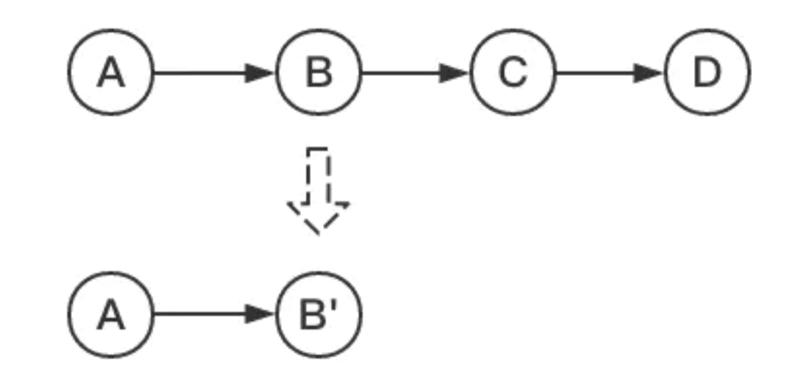

现在我们在测试分支上添加了四次提交，我们的目标是把最后三个提交合并为一个提交：

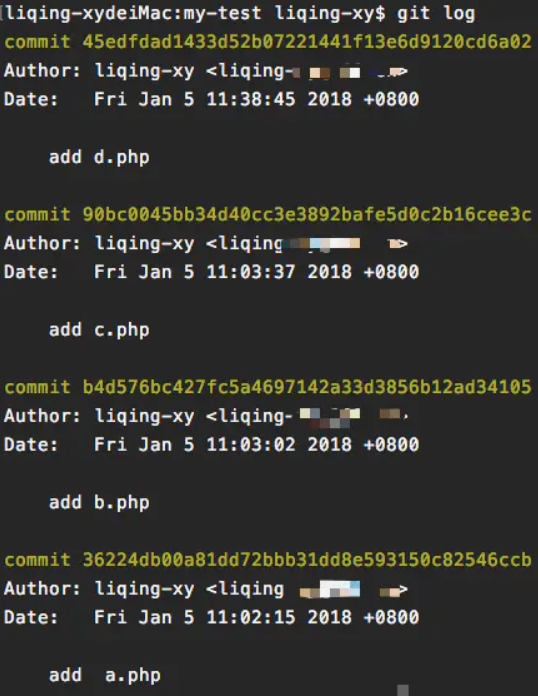

这里我们使用命令:

```bash
git rebase -i  [startpoint]  [endpoint]
```

其中`-i`的意思是`--interactive`，即弹出交互式的界面让用户编辑完成合并操作，`[startpoint]`  `[endpoint]`则指定了一个编辑区间，如果不指定`[endpoint]`，则该区间的终点默认是当前分支`HEAD`所指向的`commit`(注：该区间指定的是一个前开后闭的区间)。
在查看到了log日志后，我们运行以下命令：

```bash
git rebase -i 36224db
```

或:

```bash
git rebase -i HEAD~3
```

然后我们会看到如下界面:

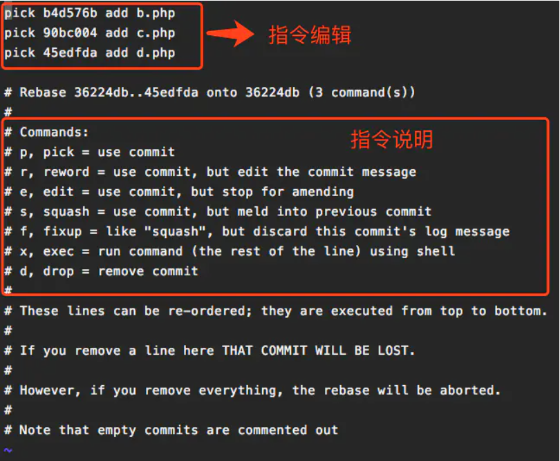

上面未被注释的部分列出的是我们本次rebase操作包含的所有提交，下面注释部分是git为我们提供的命令说明。每一个commit id 前面的`pick`表示指令类型，git 为我们提供了以下几个命令:

> pick：保留该commit（缩写:p）
> reword：保留该commit，但我需要修改该commit的注释（缩写:r）
> edit：保留该commit, 但我要停下来修改该提交(不仅仅修改注释)（缩写:e）
> squash：将该commit和前一个commit合并（缩写:s）
> fixup：将该commit和前一个commit合并，但我不要保留该提交的注释信息（缩写:f）
> exec：执行shell命令（缩写:x）
> drop：我要丢弃该commit（缩写:d）

根据我们的需求，我们将commit内容编辑如下:

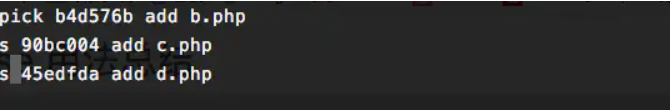

然后是注释修改界面:

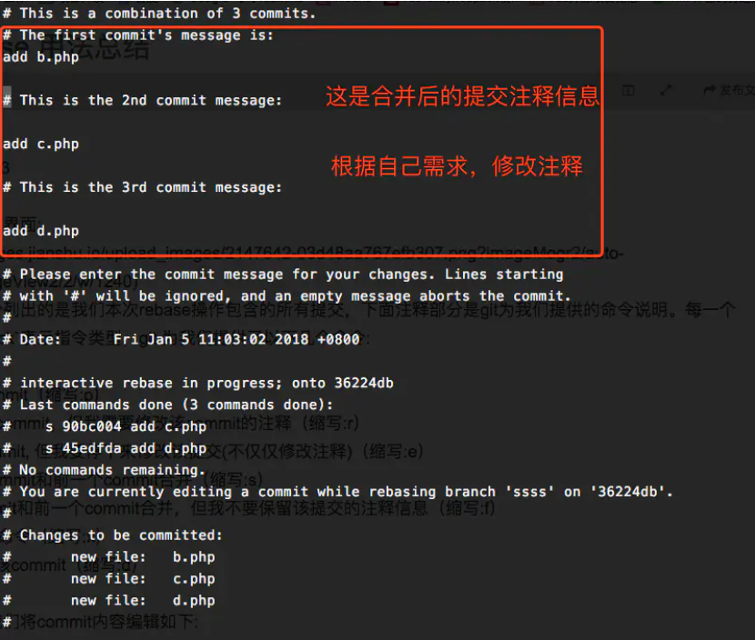

编辑完保存即可完成commit的合并了：

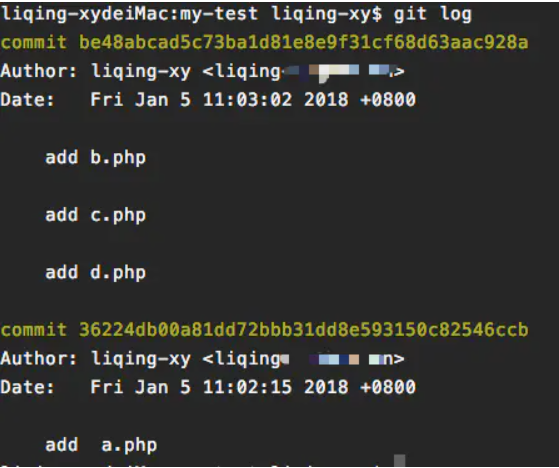

### 二、将某一段commit粘贴到另一个分支上

当我们项目中存在多个分支，有时候我们需要将某一个分支中的一段提交同时应用到其他分支中，就像下图：

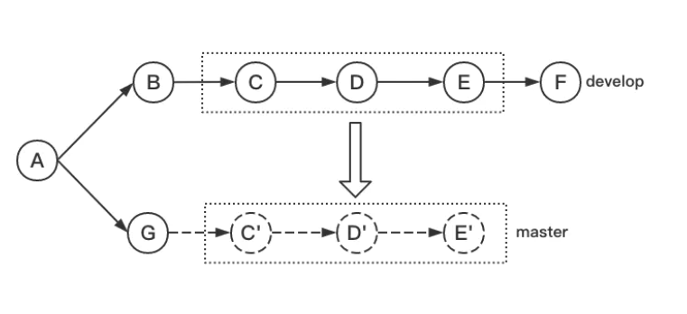

我们希望将develop分支中的C~E部分复制到master分支中，这时我们就可以通过rebase命令来实现（如果只是复制某一两个提交到其他分支，建议使用更简单的命令:`git cherry-pick`）。

在实际模拟中，我们创建了master和develop两个分支:

**master分支:**

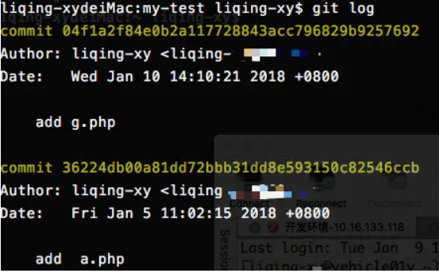

**develop分支:**

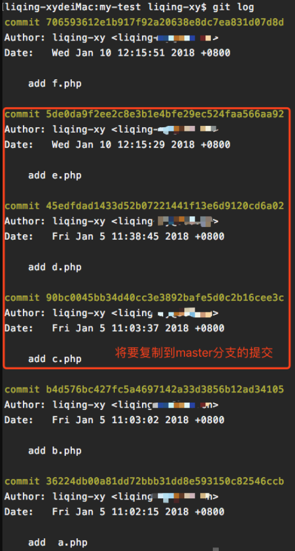

我们使用命令的形式为:

```bash
git rebase [startpoint] [endpoint] --onto [branchName]
```

其中，`[startpoint]`  `[endpoint]`仍然和上一个命令一样指定了一个编辑区间(前开后闭)，`--onto`的意思是要将该指定的提交复制到哪个分支上。

所以，在找到C(90bc0045b)和E(5de0da9f2)的提交id后，我们运行以下命令：

```bash
git  rebase 90bc0045b^ 5de0da9f2 --onto master
```

注:因为`[startpoint]`  `[endpoint]`指定的是一个前开后闭的区间，为了让这个区间包含C提交，我们将区间起始点向后退了一步。

运行完成后查看当前分支的日志:

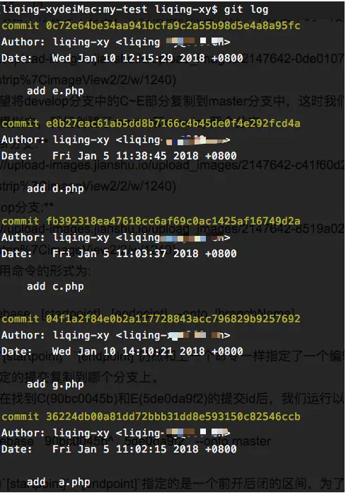

可以看到，C~E部分的提交内容已经复制到了G的后面了，大功告成？NO！我们看一下当前分支的状态:

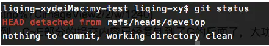

当前HEAD处于游离状态，实际上，此时所有分支的状态应该是这样:

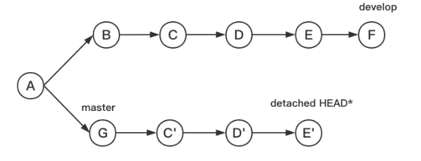

所以，虽然此时HEAD所指向的内容正是我们所需要的，但是master分支是没有任何变化的，`git`只是将C~E部分的提交内容复制一份粘贴到了master所指向的提交后面，我们需要做的就是将master所指向的提交id设置为当前HEAD所指向的提交id就可以了，即:

```bash
git checkout master
git reset --hard  0c72e64
```

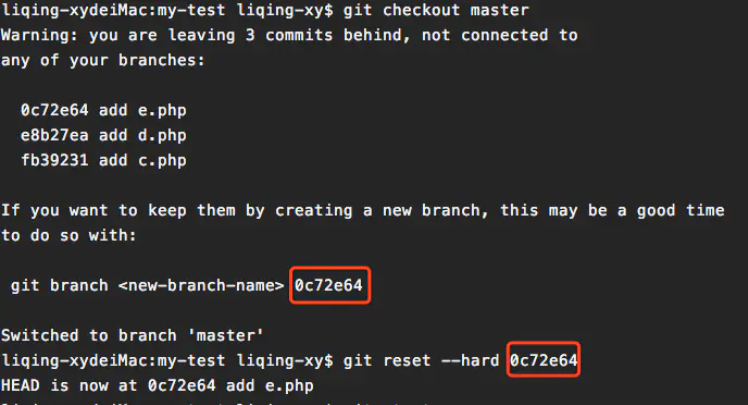

这样就大功告成了！
