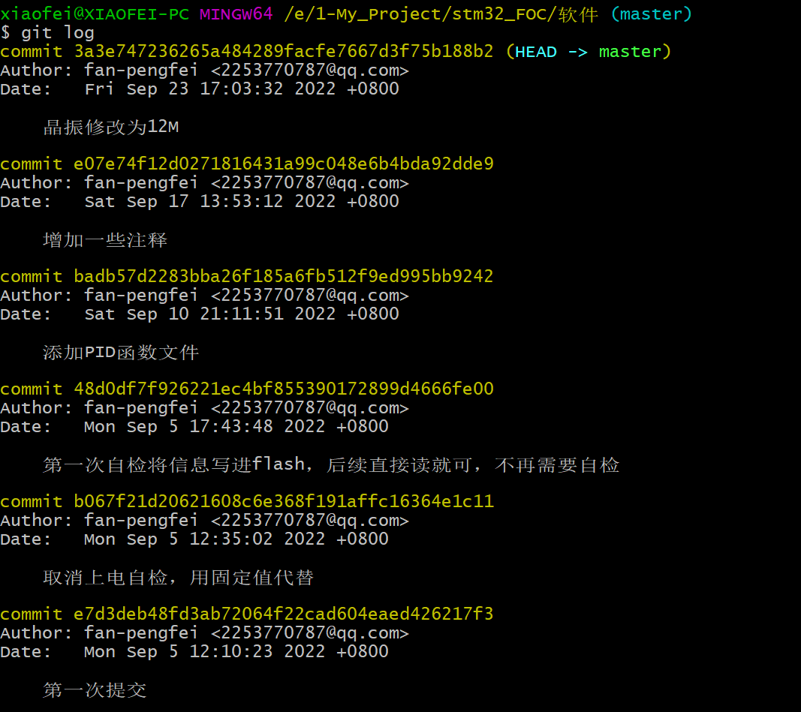
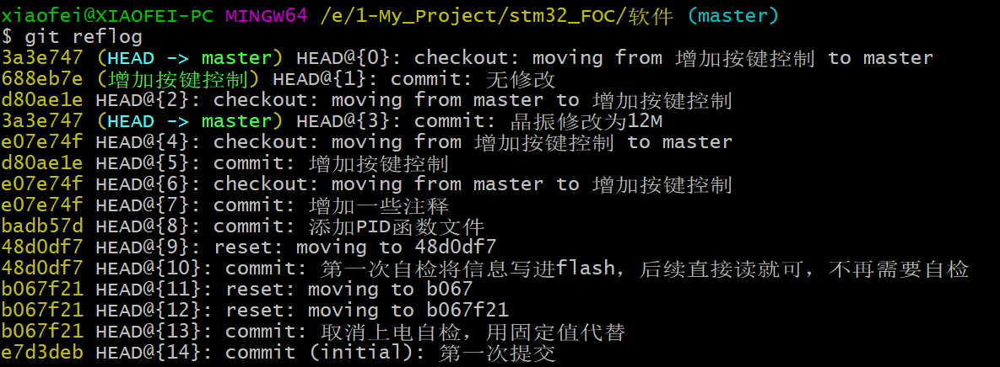
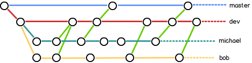
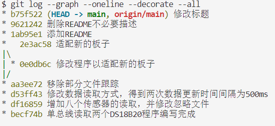

> 最近在做FOC项目的时候，用到了GIT中的分支功能，因而再复习一下GIT的用法，在此记录一下GIT常用命令；

**为表简洁，我就直接给出具体的命令以及简短的注释和自己对此的理解；**

#### 1、git init

> 用于初始化git仓库；

#### 2、git add +文件名

> 将指定工作区文件提交到git暂存区；
>   -A，是添加文件夹内的所有文件到暂存区；
>   每次提交，都要`git add`加入到暂存区，然后再commit提交；
>   第一次修改 -> `git add` -> 第二次修改 -> `git add` -> `git commit`；
>   commit提交的是git add 加入的修改的内容，而不是文件当前的内容；

#### 3、git commit -m +“本次提交的说明”

> 将暂存区文件提交到仓库；
> -m，后边是关于本次提交的说明；
> 该命令执行成功后会显示提交的内容：
> 例如：
> `1 file changed`：1个文件被改动；
> `2 insertions`：插入了两行内容；

#### 4、git status

> 显示当前仓库的状态（被修改的文件是否被提交）；
>   例如某个文件被修改却未被提交；
>   包括工作区的文件修改情况和暂存区的文件修改情况；

#### 5、git diff +文件名

> 查看文件修改内容；
> 常看尚未被提交的文件做了什么修改；
> **是工作区和暂存区文件之间的差别；**

#### 6、git log

> 显示从近到远的提交日志；
> 

#### 7、git reset —hard HEAD^

> 回退到上一版本；
> HEAD
> 当前版本
> HEAD^
> 上一版本
> HEAD^^
> 上上一版本

#### 8、git reset —hard 1094a

> 回退或者前进到指定版本；
>   —hard，后边的是版本号前几位；

#### 9、git reflog

> 显示历史命令；
> 

#### 10、git diff HEAD — readme.txt

> 查看`readme.txt`文件工作区和版本库中最新版本的区别；

#### 11、git checkout — 文件名

> 撤销工作区的修改；
>   让这个文件回到最近一次`git commit`或`git add`时的状态；
>   注意是 `--`；
>   `git checkout`其实是用版本库里的版本替换工作区的版本，无论工作区是修改还是删除，都可以“一键还原”；

#### 12、git reset HEAD 文件名

> 撤销暂存区的修改，重新放回工作区；
>   已经提交到暂存区，如何从暂存区和工作区撤销：
>   （`git reset HEAD  文件名`）撤销暂存区的修改，回到工作区->（`git checkout -- 文件名`）撤销工作区的修改；

#### 13、git rm 文件名

> 从版本库删除某文件；
>   `git rm ` -> commit提交该删除；

#### 14、git branch <分支名>

> 创建分支；
>   不加参数为列出所有分支，当前分支前有一个`*`号；

#### 15、git branch -d <分支名>

> 删除某一分支；
> -d，delete；

#### 15、git checkout <分支名>

> 切换到某一分支；
>   `git checkout -b `，创建并切换到新的分支；

#### 16、git switch <分支名>

> 切换到某一分支；
>   `git switch -c `，创建并切换到新的分支；

#### 17、git merge

> 用于合并指定分支到当前分支；

#### 18、分支合并

> 分支1修改->提交该修改->分支2修改->提交该修改->合并分支->出现冲突->解决冲突->合并分支->删除某一分支；

#### 19、git log —graph

> 查看分支合并图；

#### 20、git merge —no-ff -m “merge with no-ff” dev

> 合并dev分支，并有合并信息；
> 合并分支时，加上`--no-ff`参数就可以用普通模式合并，合并后的历史有分支，能看出来曾经做过合并，而`fast forward`合并就看不出来曾经做过合并；

#### 21、分支管理策略

> 首先，`master`分支应该是非常稳定的，也就是仅用来发布新版本，平时不能在上面干活；
> 那在哪干活呢？干活都在`dev`分支上，也就是说，`dev`分支是不稳定的，到某个时候，比如1.0版本发布时，再把`dev`分支合并到`master`上，在`master`分支发布1.0版本；
> 你和你的小伙伴们每个人都在`dev`分支上干活，每个人都有自己的分支，时不时地往`dev`分支上合并就可以了；
> 所以，团队合作的分支看起来就像这样；
> 

#### 22、git stash

> 暂存当前工作区和暂存区的内容，可以等恢复现场后再工作；
>   `git stash list`，列出当前暂存的内容；
>   `git stash apply`，恢复当前暂存的内容到工作区；
>   `git stash drop`，删除暂存的内容；
>   `git stash pop`，恢复当前暂存的内容到工作区的同时删除暂存的内容；
>   可以多次stash，先用`git stash list`查看，然后恢复指定的stash，用命令：`git stash apply stash@{0}`；

#### 23、修复bug

> 在Git中，由于分支是如此的强大，所以，每个bug都可以通过一个新的临时分支来修复，修复后，合并分支，然后将临时分支删除；
> 修复bug时，我们会通过创建新的bug分支进行修复，然后合并，最后删除；
> 当手头工作没有完成时，先把工作现场`git stash`一下，然后去修复bug，修复后，再`git stash pop`，回到工作现场；
> 在master分支上修复的bug，想要合并到当前dev分支，可以用`git cherry-pick `命令，把bug提交的修改“复制”到当前分支，避免重复劳动。

#### 24、修复不同分支上相同的bug

> Git专门提供了一个`cherry-pick`命令，让我们能复制一个特定的提交到当前分支；
> `git cherry-pick 4c805e2`；

#### 25、开发新的feature

> 开发一个新feature，最好新建一个分支；
> 如果要丢弃一个没有被合并过的分支，可以通过`git branch -D `强行删除。

#### 26、标签管理

> 发布一个版本时，我们通常先在版本库中打一个标签（tag），这样，就唯一确定了打标签时刻的版本。将来无论什么时候，取某个标签的版本，就是把那个打标签的时刻的历史版本取出来。所以，标签也是版本库的一个快照。
> Git的标签虽然是版本库的快照，但其实它就是指向某个commit的指针（跟分支很像对不对？但是分支可以移动，标签不能移动），所以，创建和删除标签都是瞬间完成的。
> 在Git中打标签非常简单，首先，切换到需要打标签的分支上->
> 然后，敲命令`git tag `就可以打一个新标签->
> 可以用命令`git tag`查看所有标签；
> 默认标签是打在最新提交的commit上的。有时候，如果忘了打标签，比如，现在已经是周五了，但应该在周一打的标签没有打，怎么办？
> 方法是找到历史提交的commit id，然后打上就可以了：
> ```bash
> >$ git log --pretty=oneline --abbrev-commit
> >12a631b (HEAD -> master, tag: v1.0, origin/master) merged bug fix 101
> >4c805e2 fix bug 101
> >e1e9c68 merge with no-ff
> >f52c633 add merge
> >cf810e4 conflict fixed
> >5dc6824 & simple
> >14096d0 AND simple
> >b17d20e branch test
> >d46f35e remove test.txt
> >b84166e add test.txt
> >519219b git tracks changes
> >e43a48b understand how stage works
> >1094adb append GPL
> >e475afc add distributed
> >eaadf4e wrote a readme file
> ```
> 比方说要对`add merge`这次提交打标签，它对应的commit id是`f52c633`，敲入命令：
> ```plaintext
> >$ git tag v0.9 f52c633
> ```
> 再用命令`git tag`查看标签：
> ```plaintext
> >$ git tag
> >v0.9
> >v1.0
> ```
> 注意，标签不是按时间顺序列出，而是按字母排序的。可以用`git show `查看标签信息：
> ```plaintext
> >$ git show v0.9
> >commit f52c63349bc3c1593499807e5c8e972b82c8f286 (tag: v0.9)
> >Author: Michael Liao
> >Date:   Fri May 18 21:56:54 2018 +0800
>    add merge
> >diff --git a/readme.txt b/readme.txt
> >...
> ```
> 可以看到，`v0.9`确实打在`add merge`这次提交上。
> 还可以创建带有说明的标签，用`-a`指定标签名，`-m`指定说明文字：
> ```plaintext
> >$ git tag -a v0.1 -m "version 0.1 released" 1094adb
> ```
> 用命令`git show `可以看到说明文字：
> ```plaintext
> >$ git show v0.1
> >tag v0.1
> >Tagger: Michael Liao
> >Date:   Fri May 18 22:48:43 2018 +0800
> >version 0.1 released
> >commit 1094adb7b9b3807259d8cb349e7df1d4d6477073 (tag: v0.1)
> >Author: Michael Liao
> >Date:   Fri May 18 21:06:15 2018 +0800
>    append GPL
> >diff --git a/readme.txt b/readme.txt
> >...
> ```
> **命令`git tag `用于新建一个标签，默认为`HEAD`，也可以指定一个commit id；**
> **命令`git tag -a  -m "blablabla..."`可以指定标签信息；**
> **命令`git tag`可以查看所有标签；**
> 如果标签打错了，也可以删除：
> ```plaintext
> >$ git tag -d v0.1
> >Deleted tag 'v0.1' (was f15b0dd)
> ```
> 因为创建的标签都只存储在本地，不会自动推送到远程。所以，打错的标签可以在本地安全删除。

#### 27、忽略特殊文件

> 在Git工作区的根目录下创建一个特殊的`.gitignore`文件，然后把要忽略的文件名填进去，Git就会自动忽略这些文件；
> 例如：
> ```plaintext
> ># Windows:
> >Thumbs.db
> >ehthumbs.db
> >Desktop.ini
> ># Python:
> >*.py[cod]
> >*.so
> >*.egg
> >*.egg-info
> >dist
> >build
> ># My configurations:
> >db.ini
> >deploy_key_rsa
> ```
> **忽略某些文件时，需要编写`.gitignore`；**
> **`.gitignore`文件本身要放到版本库里，并且可以对`.gitignore`做版本管理！**
> 有些时候，你想添加一个文件到Git，但发现添加不了，原因是这个文件被`.gitignore`忽略了：
> ```plaintext
> >$ git add App.class
> >The following paths are ignored by one of your .gitignore files:
> >App.class
> >Use -f if you really want to add them.
> ```
> 如果你确实想添加该文件，可以用`-f`强制添加到Git：
> ```plaintext
> >$ git add -f App.class
> ```
> 或者你发现，可能是`.gitignore`写得有问题，需要找出来到底哪个规则写错了，可以用`git check-ignore`命令检查：
> ```plaintext
> >$ git check-ignore -v App.class
> >.gitignore:3:*.class	App.class
> ```
> Git会告诉我们，`.gitignore`的第3行规则忽略了该文件，于是我们就可以知道应该修订哪个规则。
> 还有些时候，当我们编写了规则排除了部分文件时：
> ```plaintext
> ># 排除所有.开头的隐藏文件:
> >.*
> ># 排除所有.class文件:
> >*.class
> ```
> 但是我们发现`.*`这个规则把`.gitignore`也排除了，并且`App.class`需要被添加到版本库，但是被`*.class`规则排除了。
> 虽然可以用`git add -f`强制添加进去，但有强迫症的童鞋还是希望不要破坏`.gitignore`规则，这个时候，可以添加两条例外规则：
> ```plaintext
> ># 排除所有.开头的隐藏文件:
> >.*
> ># 排除所有.class文件:
> >*.class
> ># 不排除.gitignore和App.class:
> >!.gitignore
> >!App.class
> ```
> 把指定文件排除在`.gitignore`规则外的写法就是`!`+文件名，所以，只需把例外文件添加进去即可。

#### 28、打包发布文件

使用git压缩文档命令：
1、打包所有文档

> 打包master分枝的所有文档

```bash
git archive --format=zip --output master.zip master
```

> 其中，输出格式为zip，输出文档为master.zip；git支持zip和tar两种输出格式；

2、打包当前分枝当前HEAD的所有文档

```bash
git archive --format=zip --output head.zip GEAD
```

3、打包v1.2标签的所有文档

```bash
git archive --format=zip --output v1.2.zip v1.2
```

4、打包更改的文档

> 原理：  用git diff找出文档列表，再用打包命令打包；  也就是说：只要能用找出文档列表，就可以git打包出来；

5、打包最后修改的文档

> 先通过git diff找到最新版本修改过的文档，再压缩打包这些文档；

```bash
git archive --format=zip -o update.zip HEAD $(git diff --name--only HEAD^)
```

6、打包最后两个版本修改的文档

> 总共也是2个版本；

```bash
git achive --format=zip -o update.zip HEAD $(git diff --name-only HEAD~2)
```

7、打包两个分枝之间差别的文档

```bash
git archive --formate=zip -o update.zip HEAD $(git diff --name only master fix-error)
```

#### 29、简单明了显示log

```bash
git log --graph --oneline --decorate --all
```



#### 30、更新与合并

要更新你的本地仓库至最新改动，执行：

```bash
git pull
```

以在你的工作目录中 *获取（fetch）* 并 *合并（merge）* 远端的改动；
要合并其他分支到你的当前分支（例如 master），执行：

```bash
git merge
```

在这两种情况下，git 都会尝试去自动合并改动。遗憾的是，这可能并非每次都成功，并可能出现*冲突（conflicts）*。 这时候就需要你修改这些文档来手动合并这些*冲突（conflicts）*。改完之后，你需要执行如下命令以将它们标记为合并成功：

```bash
git add
```

在合并改动之前，你可以使用如下命令预览差异：

```bash
git diff
```

#### 31、标签

为软件发布创建标签是推荐的。这个概念早已存在，在 SVN 中也有。你可以执行如下命令创建一个叫做 *1.0.0* 的标签：

```bash
git tag 1.0.0 1b2e1d63ff
```

*1b2e1d63ff* 是你想要标记的提交 ID 的前 10 位字符。可以使用下列命令获取提交 ID：

```bash
git log
```

你也可以使用少一点的提交 ID 前几位，只要它的指向具有唯一性；

#### 32、替换本地改动

假如你操作失误（当然，这最好永远不要发生），你可以使用如下命令替换掉本地改动：

```bash
git checkout --
```

此命令会使用 HEAD 中的最新内容替换掉你的工作目录中的文档；已添加到暂存区的改动以及新文档都不会受到影响；

假如你想丢弃你在本地的所有改动与提交，可以到服务器上获取最新的版本历史，并将你本地主分支指向它：

```bash
git fetch origin
git reset --hard origin/master
```

#### 33、推送改动

你的改动现在已经在本地仓库的 **HEAD** 中了；执行如下命令以将这些改动提交到远端仓库：

```bash
git push origin master
```

可以把 *master* 换成你想要推送的任何分支；

如果你还没有克隆现有仓库，并欲将你的仓库连接到某个远程服务器，你可以使用如下命令添加：

```bash
git remote add origin
```

如此你就能够将你的改动推送到所添加的服务器上去了；

#### 34、修改提交记录

修改最近的一次提交记录；

```bash
git commit --amend
```

**参考：[廖永峰的git教程](https://www.liaoxuefeng.com/wiki/896043488029600)；**
