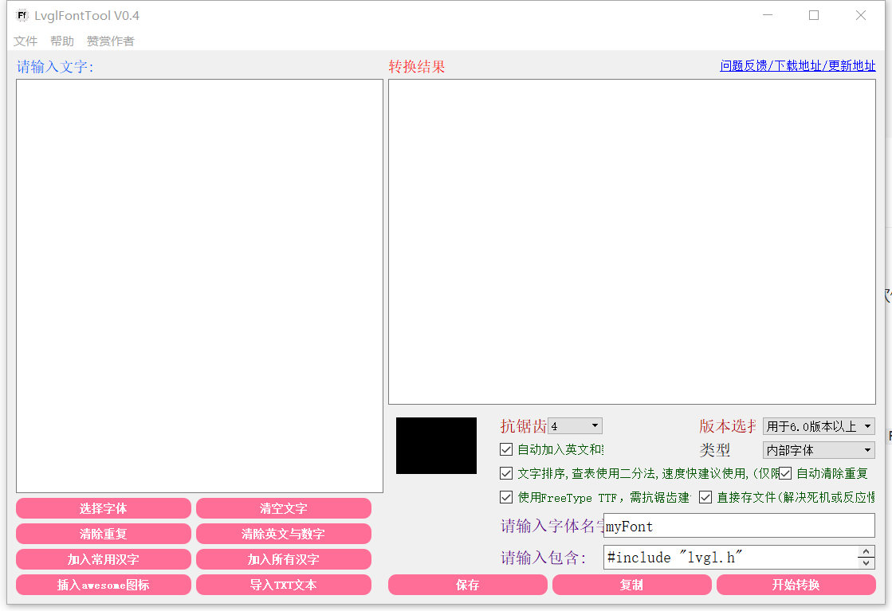
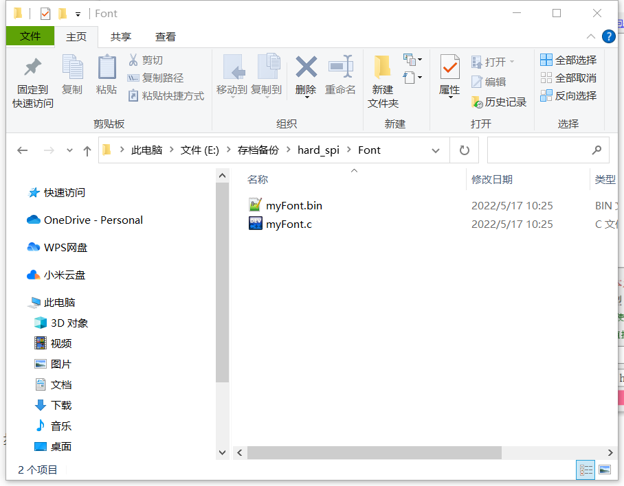
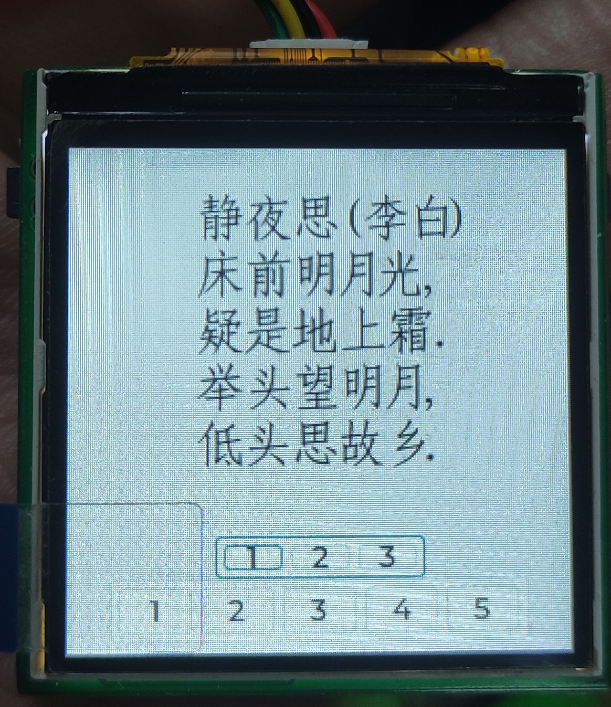
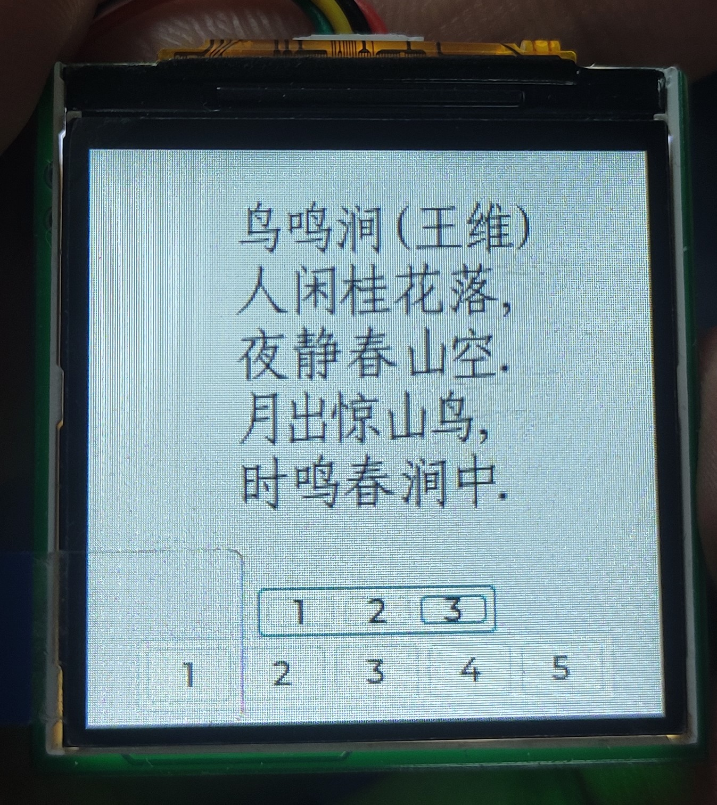
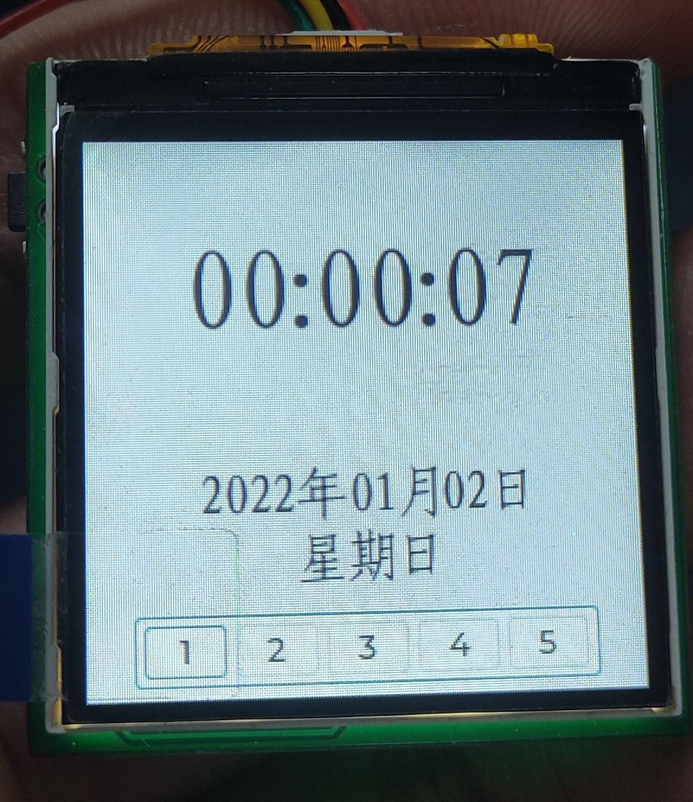
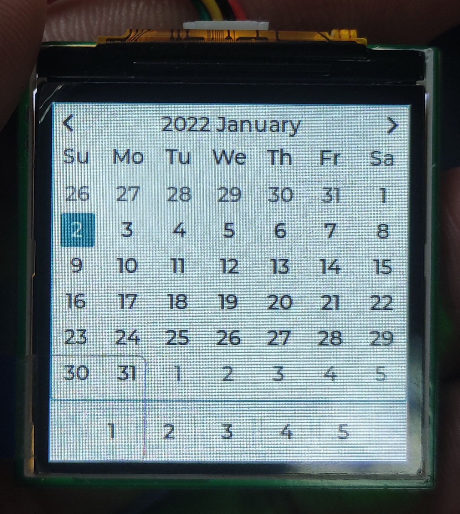
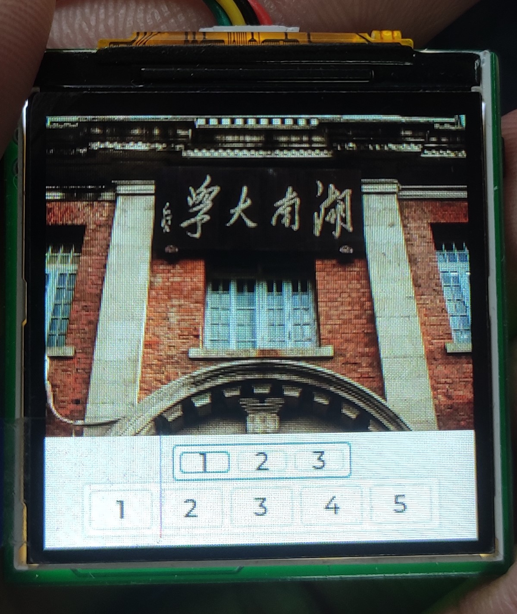
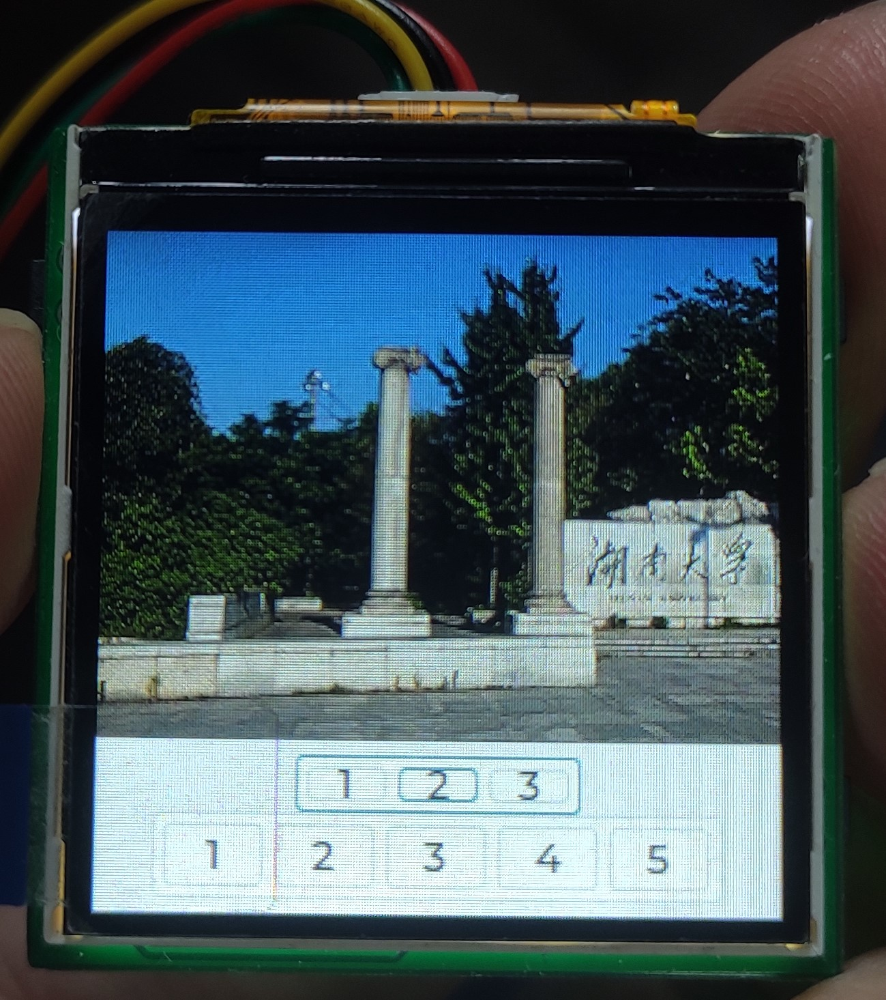

> 前些天做微机课设，给小一加了几个功能，其中一个重要功能是显示中文文本；

## 字体取模：

屏幕要显示图案，例如某个汉字或者数字、图案等，都需要对图案进行取模操作；

使用的是`LvglFontTool`工具，`LVGL`官网的字体转化用于单个字体取模比较方便；批量的话，使用这个离线取模软件比较方便；

操作界面如下所示：



步骤还是很简单的：

- 首先选择字体，包括一个`TFF`字体文件还有选择需要取模的字体大小；

- 然后加入汉字，我是将所有常用的汉字都加入了；

- 然后在右边配置一些选项，按照图片上的配置就可以；

- 最后点击开始转换就可以生成一个`myFont.c`和`myFont.bin`文件，`bin`文件加载到`SPI FLASH`中，C文件加入`Keil`工程即可;



如果只需要显示数量比较少的文本，取模后得到的数组可以直接放在一个`.c`或者`.h`文件中，直接下载到单片机的`FLASH`中即可，但是如果要显示各种不同样式和不同大小的字体，取模后得到的文件会很大，加载到`FLASH`中存放是不合理的。

## 文件放置：

小一这一版的硬件是带了一个`8M`的`SPI FLASH`，所以取模后的数据可以放在这块`SPI FLASH`中，可以用哪些方法通过单片机读取`bin`文件中的内容呢？

一般是有两个方法：

- 放入移植好的`Fatfs`文件系统中，通过文件系统提供的接口读取该bin文件；

- 加载进`SPI FLASH`中，直接通过最底层的读取函数读取；

两种方案各有优缺点，第一种更换字体取模文件很方便，但是由于字体取模文件会频繁被读取，所以这个方案的效率会比较差；第二种方案更换字体取模文件比较麻烦，但是读取的效率会高不少。我是选择了第二种方案，第一种我也试了，效率确实不是很高。

对于第二种方案，首先要将取模文件从PC机放入`SPI FLASH`中，我采用的方案是将`SPI FLASH`划分为两部分：

前4MB
后4MB

用于存储字体取模数据
用于建立文件系统

然后将`SPI FLASH`模拟为USB设备，插入PC机，会弹出一个U盘，将字体文件拖入；然后通过一个函数，将`bin`文件分段读取并分段写入`SPI FLASH`的前`4MB`部分中，具体函数如下所示：

```c
void write_to_flash(void)
{
    uint8_t i;
    f_res = f_open(&file1, "myFont.bin", FA_READ);//打开对应文件
    count_f = 0;
    for (i = 0; i  如果有多个字体文件，可以将写入的地址偏移一个大小即可。

## 文件读取：

字体取模文件读取只需要修改`myFont.c`中的一个函数：

```c
static uint8_t __g_font_buf[324]; //如bin文件存在SPI FLASH可使用此buff
static uint8_t *__user_font_getdata(int offset, int size)
{
    //如字模保存在SPI FLASH, SPIFLASH_Read(__g_font_buf,offset,size);
    //如字模已加载到SDRAM,直接返回偏移地址即可如:return (uint8_t*)(sdram_fontddr+offset);
    my_W25QXX_Read(__g_font_buf, offset, size);
    return __g_font_buf;
}
```

> 如果有多个字体文件，可以在对应的`myFont`文件中将读出的地址偏移一个大小即可。

## 字体使用：

使用LVGL提供的函数接口即可调用：

```c
LV_FONT_DECLARE(myFont24); 										// 字体声明,24号字体
lv_style_init(&font_style_24);
lv_style_set_text_font(&font_style_24, LV_STATE_DEFAULT, &myFont24);

lv_obj_t *scr = lv_disp_get_scr_act(NULL); 						/* 获取当前屏幕 */
lv_obj_t *label1 = lv_label_create(scr, NULL); 					/* 创建 label 控件 */

lv_obj_set_pos(label1, 0, 0);                  					/* 设置控件的坐标 */
sprintf((uint8_t *)text_temp, "你好，我是小一!");
lv_label_set_text(label1, text_temp);							/* 设置文字 */
lv_obj_align(label1, NULL, LV_ALIGN_CENTER, 0, 0); 			/* 设置控件的对齐方式-相对坐标 */
lv_obj_add_style(label1, LV_LABEL_PART_MAIN, &font_style_24); 	// 应用效果风格
```

这里边有很多坑：

- 第一个是文本的字体编码格式，要修改为`UTF-8`编码格式才能正常显示；

- 第二个是换行符要进行修改，`Windows`下换行是`\r\n`，而`LVGL`中换行是`\n`，所以要进行一下转换(可以使用`VScode`完成)；

## 最后：

刚开始字体取模还有读取取模文件就卡了好久，首先是文字编码问题，然后是`myFont`中的字体读取函数卡死，然后还有换行符的问题，然后中间莫名其妙系统还卡死很多次，初步判断是`LVGL`中的任务切换函数不能放在优先级较高的定时器中断中，必须要放在`while`循环中才可以正常运行，然后就是`LVGL`会卡死在某一个函数中，按照提示修改一般都可以解决问题。

在项目中遇到了很多很多问题，花费了很大的精力才解决，不过这也是一个学习的过程，学到了很多知识还有解决问题时的办法。

最后附上小一的图片还有开源代码地址:

### 图片：










### 开源地址：

[GitHub地址](https://github.com/fan-pengfei/XiaoYi.git)
