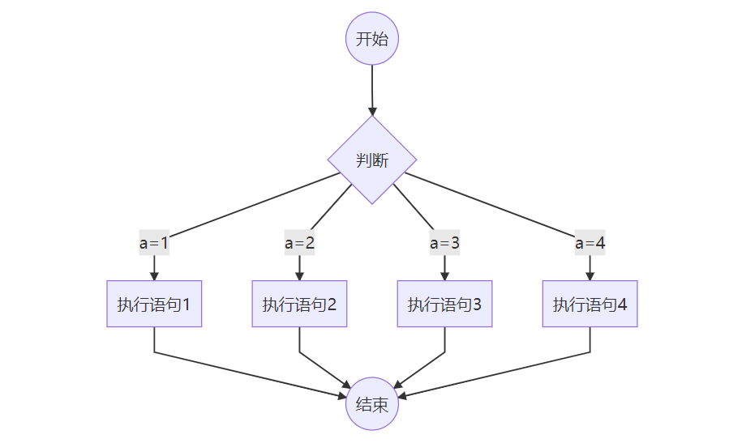
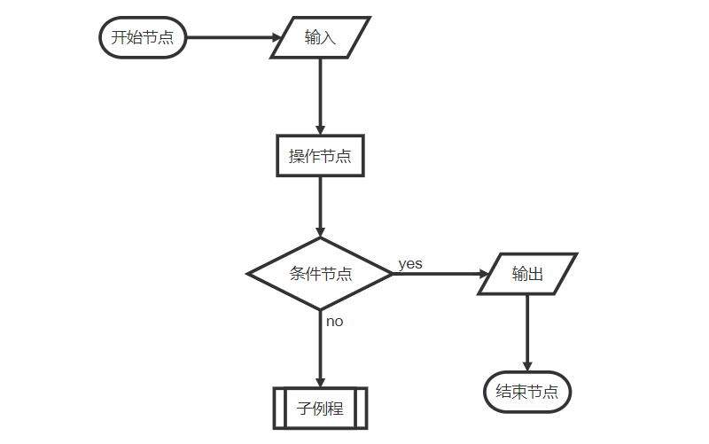

> Markdown绘制简单流程图；

# Typora流程图：

## mermaid效果（这个可以在Typora编辑器中显示，博客中渲染失败）

- **输入```，然后输入mermaid即可**

```plaintext
·mermaid
graph TD
   B((开始)) -->C{判断}
   C --  a=1 -->D[执行语句1]
   C --  a=2  -->E[执行语句2]
   C --  a=3 -->F[执行语句3]
   C -- a=4  -->G[执行语句4]
   D--> AA((结束))
   E--> AA
   F--> AA
   G--> AA
```

  **如下图：**

  

### 语法：

> 官网说明文档 [Mermaid](https://mermaid-js.github.io/mermaid/#/) .

## flowchar效果（只有这个可以在博客中显示流程图）

```plaintext
···flow
st=>start: 开始节点
in=>inputoutput: 输入
e=>end: 结束节点
op=>operation: 操作节点
cond=>condition: 条件节点
sub=>subroutine: 子例程
out=>inputoutput: 输出
st(right)->in->op->cond
cond(yes,right)->out->e
cond(no)->sub
```



**实际例子1：**

```plaintext
···flow
st=>start: Start
i=>inputoutput: 输入年份n
cond1=>condition: n能否被4整除？
cond2=>condition: n能否被100整除？
cond3=>condition: n能否被400整除？
o1=>inputoutput: 输出非闰年
o2=>inputoutput: 输出非闰年
o3=>inputoutput: 输出闰年
o4=>inputoutput: 输出闰年
e=>end
st->i->cond1
cond1(no)->o1->e
cond1(yes)->cond2
cond2(no)->o3->e
cond2(yes)->cond3
cond3(yes)->o2->e
cond3(no)->o4->e
```

**实际例子2：**

```plaintext
···flow
st=>start: start:>http://www.baidu.com
op1=>operation: 操作1
cond1=>condition: YES or NO?
sub=>subroutine: 子程序
e=>end

st->op1->cond1
cond1(yes)->e
cond1(no)->sub(right)->op1
```

**综合例子：**

```plaintext
···flow
st=>start: Improve your
l10n process!
e=>end: Continue to have fun!:>https://youtu.be/YQryHo1iHb8[blank]
op1=>operation: Go to locize.com:>https://locize.com[blank]
sub1=>subroutine: Read the awesomeness
cond(align-next=no)=>condition: Interested to
getting started?
io=>inputoutput: Register:>https://www.locize.io/register[blank]
sub2=>subroutine: Read about improving
your localization workflow
or another source:>https://medium.com/@adrai/8-signs-you-should-improve-your-localization-process-3dc075d53998[blank]
op2=>operation: Login:>https://www.locize.io/login[blank]
cond2=>condition: valid password?
cond3=>condition: reset password?
op3=>operation: send email
sub3=>subroutine: Create a demo project
sub4=>subroutine: Start your real project
io2=>inputoutput: Subscribe

st->op1->sub1->cond
cond(yes)->io->op2->cond2
cond2(no)->cond3
cond3(no,bottom)->op2
cond3(yes)->op3
op3(right)->op2
cond2(yes)->sub3
sub3->sub4->io2->e
cond(no)->sub2(right)->op1
st@>op1({"stroke":"Red"})@>sub1({"stroke":"Red"})@>cond({"stroke":"Red"})@>io({"stroke":"Red"})@>op2({"stroke":"Red"})@>cond2({"stroke":"Red"})@>sub3({"stroke":"Red"})@>sub4({"stroke":"Red"})@>io2({"stroke":"Red"})@>e({"stroke":"Red","stroke-width":6,"arrow-end":"classic-wide-long"})
```

### 语法：

> 官网说明文档 [FlowChar](https://flowchart.js.org/) .

st=>start: Start
i=>inputoutput: 输入年份n
cond1=>condition: n能否被4整除？
cond2=>condition: n能否被100整除？
cond3=>condition: n能否被400整除？
o1=>inputoutput: 输出非闰年
o2=>inputoutput: 输出非闰年
o3=>inputoutput: 输出闰年
o4=>inputoutput: 输出闰年
e=>end
st->i->cond1
cond1(no)->o1->e
cond1(yes)->cond2
cond2(no)->o3->e
cond2(yes)->cond3
cond3(yes)->o2->e
cond3(no)->o4->e{"scale":1,"line-width":2,"line-length":50,"text-margin":10,"font-size":12}  var code = document.getElementById("flowchart-0-code").value;  var options = JSON.parse(decodeURIComponent(document.getElementById("flowchart-0-options").value));  var diagram = flowchart.parse(code);  diagram.drawSVG("flowchart-0", options);
st=>start: start:>http://www.baidu.com
op1=>operation: 操作1
cond1=>condition: YES or NO?
sub=>subroutine: 子程序
e=>end

st->op1->cond1
cond1(yes)->e
cond1(no)->sub(right)->op1{"scale":1,"line-width":2,"line-length":50,"text-margin":10,"font-size":12}  var code = document.getElementById("flowchart-1-code").value;  var options = JSON.parse(decodeURIComponent(document.getElementById("flowchart-1-options").value));  var diagram = flowchart.parse(code);  diagram.drawSVG("flowchart-1", options);st=>start: Improve your
l10n process!
e=>end: Continue to have fun!:>https://youtu.be/YQryHo1iHb8[blank]
op1=>operation: Go to locize.com:>https://locize.com[blank]
sub1=>subroutine: Read the awesomeness
cond(align-next=no)=>condition: Interested to
getting started?
io=>inputoutput: Register:>https://www.locize.io/register[blank]
sub2=>subroutine: Read about improving
your localization workflow
or another source:>https://medium.com/@adrai/8-signs-you-should-improve-your-localization-process-3dc075d53998[blank]
op2=>operation: Login:>https://www.locize.io/login[blank]
cond2=>condition: valid password?
cond3=>condition: reset password?
op3=>operation: send email
sub3=>subroutine: Create a demo project
sub4=>subroutine: Start your real project
io2=>inputoutput: Subscribe

st->op1->sub1->cond
cond(yes)->io->op2->cond2
cond2(no)->cond3
cond3(no,bottom)->op2
cond3(yes)->op3
op3(right)->op2
cond2(yes)->sub3
sub3->sub4->io2->e
cond(no)->sub2(right)->op1

st@>op1({"stroke":"Red"})@>sub1({"stroke":"Red"})@>cond({"stroke":"Red"})@>io({"stroke":"Red"})@>op2({"stroke":"Red"})@>cond2({"stroke":"Red"})@>sub3({"stroke":"Red"})@>sub4({"stroke":"Red"})@>io2({"stroke":"Red"})@>e({"stroke":"Red","stroke-width":6,"arrow-end":"classic-wide-long"}){"scale":1,"line-width":2,"line-length":50,"text-margin":10,"font-size":12}  var code = document.getElementById("flowchart-2-code").value;  var options = JSON.parse(decodeURIComponent(document.getElementById("flowchart-2-options").value));  var diagram = flowchart.parse(code);  diagram.drawSVG("flowchart-2", options);
