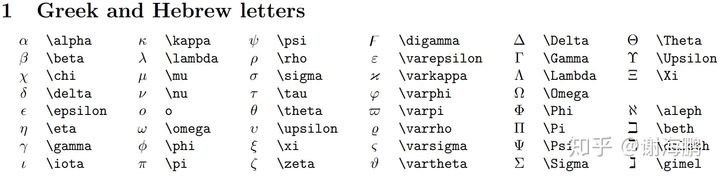
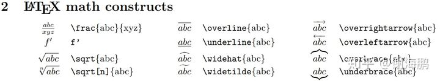
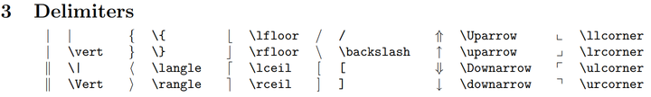
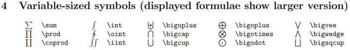
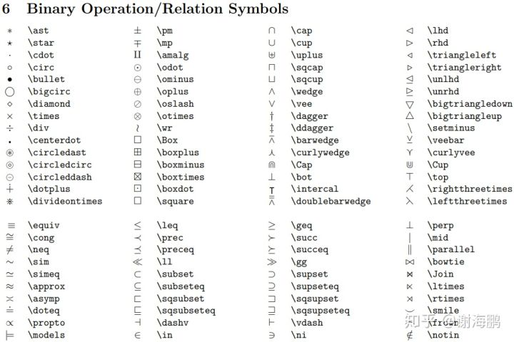

> 用Markdown编辑数学公式看起来会很舒服，学一下；

## 希腊字母：

### 常见希腊字母：



```plaintext
$\alpha$、$\beta$、$\chi$、$\Delta$、$\Gamma$、$\Theta$
$$
\alpha\beta\chi
$$
```

显示效果为：

\alpha\beta\chi\Delta\Gamma\Theta
> 注：当希腊字母的LaTex语法首字母大写时，即输出大写的希腊字母；首字母小写时，输出小写的希腊字母。

## 数学结构：



### 分数：

```plaintext
$\frac{abc}{xyz}$
```

显示效果为：

\frac{abc}{xyz}
### 根号：

```plaintext
$$
\frac{\sqrt{1+abc}}{\sqrt{1-abc}}
$$
```

显示效果为：

\frac{\sqrt{1+abc}}{\sqrt{1-abc}}
### 向量符号：



```plaintext
$\overrightarrow{F}$
```

显示效果为：

\overrightarrow{F}
## 定界符：


```plaintext
$|$、$\|$、$\Uparrow$
```

显示效果为：

|、\|、\Uparrow
> 注：将上述定界符与`\left`和`right`组合使用可以使得定界符匹配其内容的高度。

比如要构建一个如下的矩阵的行列式。

```plaintext
$$
\left|\begin{matrix}
   1 & 2 & 3 \\
   4 & 5 & 6 \\
   7 & 8 & 9
  \end{matrix} \right|
$$
```

显示效果如下：

\left|\begin{matrix}
    1 & 2 & 3 \\
    4 & 5 & 6 \\
    7 & 8 & 9
   \end{matrix} \right|
## 可变大小的符号



```plaintext
$\sum$、$\int$、$\oint$、$\iint$
$$
\bigcap\bigcup\bigoplus\bigotimes
$$
```

显示效果如下：

\sum\int\oint\iint\bigcap\bigcup\bigoplus\bigotimes
## 函数名称：

```plaintext
$\sin$、$\cos$、$\tan$、$\log$
$$
\tan(at-n\pi)
$$
```

显示效果如下：

 \tan(at-n\pi)
## 二进制运算符和关系运算符



```plaintext
$\times$、$\ast$、$\div$、$\pm$、$\mp$、$\leq$、$\geq$、$\lessgtr$
```

显示效果如下：

\times\ast\div\pm\mp\leq\geq\lessgtr
## 上下标

在符号的后面打下划线_，那么下划线后面的符号就自动放在了下标的位置；

上标就是次方符号^；

如果要同时打出上下标，直接连续输入即可。并且上、下标的输入顺序是无所谓的；

如果上下标的内容由多个字符组成，那么就必须要加上花括号。这是因为上下标符号后面只默认第一个字符为上下标内容；

左边的上下标，直接把上下标的内容左边即可；

举例：

```plaintext
T^t
T_t
T_t^r
T_{tt}
```

T^t
T_t
T_t^r
T_{tt}
## 其他例子

由以下公式：

^{i-1}_iT=Rot(x,\alpha_{i-1})*Trans(\alpha_{i-1},0,0)*Rot(z,\theta_i)*Trans(0,0,d_i)
^{i-1}_iT=
\left [\begin{array}{c}
cos\theta_i &-sin\theta_icos\alpha_i &sin\theta_isin\alpha_i &\alpha_icos\theta_i \\
sin\theta_i &cos\theta_isin\alpha_i &-cos\theta_isin\alpha_i &\alpha_isin\theta_i \\
0 &sin\alpha_i &cos\alpha_i  &d_i \\
0 &0 &0 &1
\end{array}\right]
可以得到^0_1T、^1_2T、^2_3T、^3_4T、^4_5T、^5_6T的计算公式；

然后由公式：

^0_6T=^0_1T*^1_2T*^2_3T*^3_4T*^4_5T*^5_6T=
\left [\begin{array}{c}
n_x &o_x &a_x &p_x \\
n_y &o_y &a_y &p_y\\
n_z &o_z &a_z &p_z\\
0     &0   &0   &1
\end{array}\right]
可以计算得出^0_6T的值即可；

使用MATLAB计算得到的结果为：

^0_6T=
\left [\begin{array}{r}
0.000 &-1.000 &0.000 &0.1639 \\
1.000 &-1.000 &0.000 &-0.7277\\
0.000 &1.000  &0.000 &-0.3529\\
0.000 &0.000  &0.000 &1.0000
\end{array}\right]
从末端姿态矩阵^0_6T可以知道机器人的末端位置分量：

(p_x,p_y,p_z)=(0.1639,-0.7277,-0.3529)
按照关节角度[90°, 0°, 90°, 180°, 90°, 90°]来控制仿真程序中机器人得到的仿真结果如下图所示：

## Hexo公式渲染问题：

[hexo LaTeX渲染问题](https://zhuanlan.zhihu.com/p/105986034)
