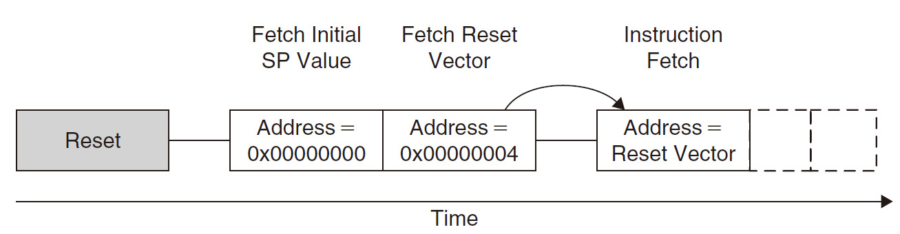
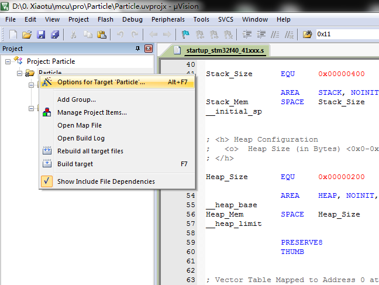
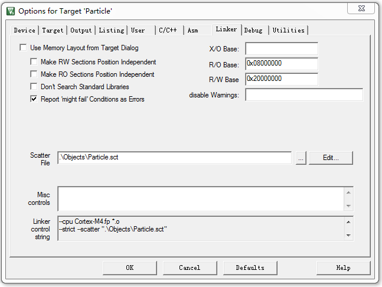
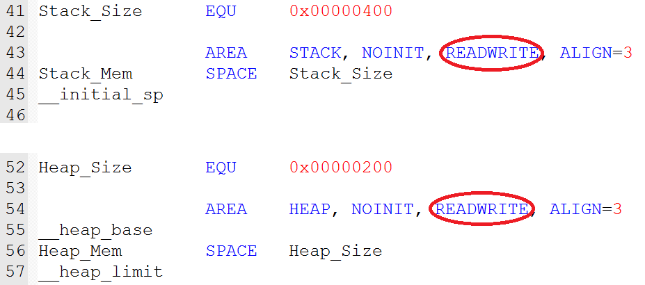
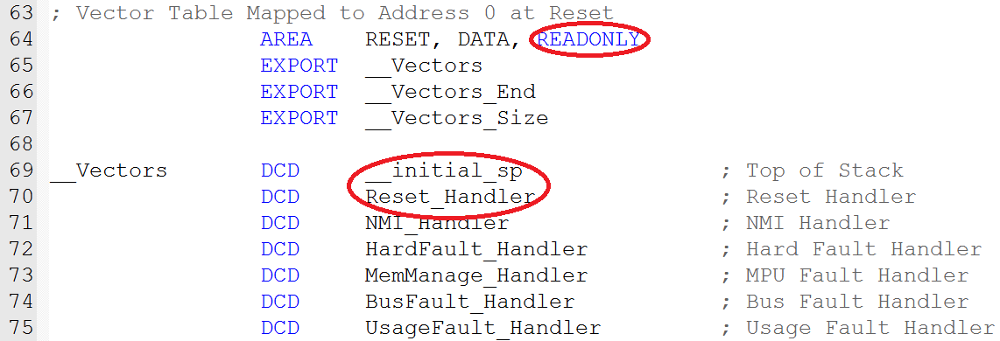
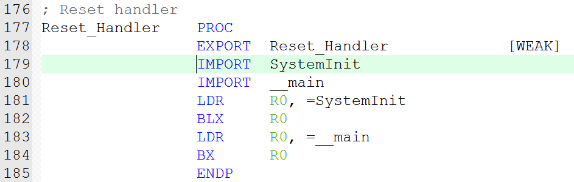

> 了解stm32的启动过程，方便遇到问题时的调试；

## 主要是两个问题：

- STM32是如何启动的，如何执行到main函数；

- 如何保证编译后的代码可以烧录到正确的地址；

作为一个计算机系统的核心，CPU的实际工作就是取指令和计算。大体上它可以看做是三个部分组成的：寄存器组、算术逻辑单元(ALU) 、指令队列。 在`Cortex-M4`的寄存器中有一个特殊的寄存器PC(Program Counter,程序计数器)， 用于控制程序的执行。在每个时钟周期中CPU都会根据PC中的值，从地址空间中取一条指令放到指令队列中， 同时从指令队列中取出一条指令进行解析和运算(实际上ARM采用的是一种流水线的指令处理方式，与这里所讲的内容还是有很大差异的，但大体思想差不多)。 并把上次的运算结果写到寄存器中。

CPU运算所用的指令和数据都来自地址空间。在`Cortex-M4`的内存系统中， CPU可以访问4G的地址空间，根据所映射的物理对象不同大体上被划分成了6块。我们烧写到芯片内部的程序一般都在其中的Code段中， 在STM32中这个段对应的是一块FLASH。上电的时候，基本上只有这块FLASH中的内容是确定的，其它地址空间以及CPU内部的寄存器中的值都是随机的。 当然为了防止上电的时候外设产生意外，片上外设(`Peripheral`)段中的值在上电的时候也会有初始值。

所以，从处理器的角度来看，启动过程实际上是给各个寄存器赋初值的过程，更具体的是给PC寄存器赋初值的过程。从MCU和系统的角度来看， 启动过程是初始化处理器和外设的过程。

## 以STM32F4为例：

### STM32是如何启动的：

> 上电后系统进行复位，等到时钟稳定后才可以正常工作，这个过程通常需要几个毫秒。 图1中描述了处理器的复位过程，Cortex-M内核会先从地址`0x0000`处读取栈地址，并写到CPU内部的SP寄存器中。 再从地址`0x0004`读取`Reset Vector`到PC寄存器中，进而跳转到`Reset Vector`所指的地址上开始执行程序。



 图1 Cortex-M复位流程

栈空间是处理器实现函数调用和中断服务的工具。函数调用和中断服务有一个共同的特点就是，它们都需要先把当前正在处理的内容暂时保存下来，转而执行要调用的函数， 或者中断服务函数，等待新的函数执行完毕返回后，在从原来保存的内容恢复回来继续执行原来的函数。而函数的调用是支持嵌套的，也就是说一个函数中可以调用子函数， 在子函数中又可以调用其它子函数。那么从函数的调用和返回的顺序上来看，最后调用的函数一定先返回。栈这种数据结构的特点就是其中的数据是后进先出的， 与函数调用和返回的顺序是一致的。因而，人们就专门在内存空间中划分出来一块用作栈空间，并从CPU中拿出一个宝贵的寄存器用于指示栈顶， 该寄存器被记为SP (Stack Pointer)。

所以，前面所说的从CPU的角度看启动过程就是PC寄存器初始化的过程还不完善。虽然对PC寄存器进行初始化后，CPU就可以正常的取指令并进行运算了， 但这时所能完成的功能十分有限，并不能支持对我们很重要的函数和中断。因此，从CPU角度看启动过程是对PC和SP两个寄存器的初始化过程。

`Cortex-M4`中规定`0x0000`起始的地址存放的是系统向量表(`vector table`)。在STM32中`0x0000`本身并不对应什么物理设备， ==通过配置引脚BOOT[1:0]我们可以控制`0x0000`映射到地址空间中的其它地址中，也就实现了不同的启动方式。==一共有三种可选的启动方式如表1所示， 从主闪存或者系统存储器启动时，硬件上会把`0x0000 0000`映射到`0x0800 0000`或者`0x1FFF F000`上，这样我们从地址`0x0000 0000`访问的空间实际上就是主闪存或者系统存储器的空间。 从SRAM启动时，只能在`0x2000 0000`开始的地址访问SRAM。一般我都是从主闪存启动的，也就是说系统的向量表应当烧写在`0x0800 0000`的地址上。至于如何从SRAM启动需要查看其他资料`todo`。

启动模式选择引脚

启动模式
偏移地址

BOOT1
BOOT0

X
0
主闪存(Main Flash Memory)
0x0800 0000

0
1
系统存储器(system memory)
0x1FFF F000

1
1
内置SRAM(Embedded SRAM)
0x2000 0000

表1 STM32的启动模式

### 确定代码的烧写地址：

在STM32中，一般都会有一个片上的Flash和SRAM。Flash用于烧录我们编译后生成的目标代码，SRAM则用于栈空间和保存全局变量， 它们分别对应图1中地址空间的Code段和SRAM段。此外STM32中的Flash一般都映射在`0x0800 0000`的地址上的， 因此为了保证向量表写在`0x0800 0000`的位置上，我们必须保证生成的目标代码中一开始就是向量表的内容。

我们的源文件不止一个，向量表怎么就写在了`0x0800 0000`的地址上呢？我们打开“Options for Target ‘Project Name’”窗口， 如图3所示，在Linker选项卡下，可以看到链接器的配置。其中”R/O Base”一栏中标注了只读代码的起始位置`0x0800 0000`，”R/W Base”一栏标注了可读写的地址空间。 我们只需要保证向量表链接在只读代码段的起始位置就可以了。这一点由链接器的控制参数(Linker control string)和分布文件(Scatter File)实现。 这两项都是由μVision自动生成的，刚刚提到的只读代码段地址和可读写的地址实际上只是为生成分布文件提供了一些数据而已。 我们也可以根据自己的需要重新编辑分布文件，比如实现`应用程序自编程`时，我们就会对其做些简单的修改。




Linker control string描述了链接器的工作参数，我们的项目的具体配置信息如下。

```shell
--cpu Cortex-M4.fp *.o
--strict --scatter ".\Objects\Particle.sct"
--summary_stderr --info summarysizes --map --xref --callgraph --symbols
--info sizes --info totals --info unused --info veneers
--list ".\Listings\Particle.map"
-o .\Objects\Particle.axf
```

这里把关于Scater File的选项是`--strict --scatter ".\Objects\Particle.sct"`，按照其描述的路径就可以找到Particle所用的分布文件。 Scater File则是用来告知编译器各段代码在最后生成的可执行文件中的位置。下面是由μVision生成的分布文件内容：

```c
LR_IROM1 0x08000000 0x00100000  {    ; load region size_region
	ER_IROM1 0x08000000 0x00100000  {  ; load address = execution address
		*.o (RESET, +First)
		*(InRoot$$Sections)
	.ANY (+RO)
}
RW_IRAM1 0x20000000 0x00020000  {  ; RW data
	.ANY (+RW +ZI)
	}
}
```

LR_IROM1描述了可以烧录代码的起始地址(`0x0800 000`)和大小(`0x0010 0000`)，最后生成的代码分为ER_IROM1和RW_IRAM1两个部分。 这里的起始地址正好就是向量表所要在的位置。

参考数据手册(Data Sheet)的第四章内存映射内容我们知道从`0x0800 0000`开始长度为`0x0010 0000`的这段地址空间是一段片上的FLASH， 系统掉电后它仍保有原来的数据，一般用来保存系统的代码。 所以这里的ER_IROM1就是用来告知链接器把生成的各个*.o工程文件以及只读的代码放置在从`0x0800 0000`起始的地址空间中。 `*.o (RESET, +First)`语句告知链接器把RESET代码段放置到起始位置。后面分析启动文件时就会发现RESET代码段一开始就定义了系统的向量表。

任何可读可写的代码段都被放置到了RW_IRAM1中，RW_IRAM1起始于`0x2000 0000`对应于一段片上的RAM区域， 这段地址空间中的数据掉电后是不能保留的，通常用作数据段保存系统工作过程中的数据， 一般被抽象为栈空间和堆空间(关于栈和堆以后会有专题介绍)。

### 启动文件(.s)分析：

启动文件中定义了系统的向量表、栈空间和堆空间。系统复位后首先就执行该文件中的代码。

在启动文件中，首先定义了400字节的栈空间和200字节的堆空间。 由于这两段空间是可读可写的(READWRITE)，根据链接器和分布文件的配置，这两段代码将被放置到RW_IRAM1声明的地址空间下，即0x20000000。



接着启动文件定义了系统的向量表。 这段代码被定义为只读的(READONLY)，并且被标记为RESET，因此将被映射到ER_IROM1声明的地址空间下的起始位置，而__Vectors标识了向量表的起始位置。 其中的第一个数据就是系统的栈顶向量__initial_sp， 紧接着就是复位处理程序向量Reset_Handler，这正是系统复位时首先读取的两个数据。



复位处理程序很简单只有几行，它首先执行函数SystemInit，然后执行函数__main。 这两个函数就是那两个空函数，SystemInit和main（main函数在编译过程中会被加两个下划线）。

> main is your main procedure form main.c file, once **main is an internal procedure created by Keil toolchain which is calling at the end your main, but before it is initializing all variables (copying variables from FLASH to proper positions in RAM). In gcc it is seen explicitly, in Keil you can see it within debug process.**
> main 是由 Keil 工具链创建的内部过程，它初始化所有变量（将变量从 FLASH 复制到 RAM 中的适当位置），并在最后调用您的 main，在 gcc 中它是明确可见的，在 Keil 中你可以在调试过程中看到它；
> 也就是说，__main 是库自带的东西，在编译时会由编译器链接到二进制程序里；



此时我们可以看到，系统在跳转到Reset_Handler所指的代码后，先执行了函数SystemInit。 在官方的库中，这个函数做了一些系统时钟初始化的工作。 然后就开始执行我们的main函数，实际上我们完全可以把SystemInit这个函数删掉，把初始化工作移到main函数中完成。

> 一些概念：
>   Code （代码段）
>   ZI （Zero-Inintialize Data段）
>   RO （ReadOnly Data段）
>   RW (ReacWrite Data段)
>   占用计算：
>   FLASH 储存：Code + RO + RW
>   RAM 内存： RW + ZI

## 总结：

- **STM32是如何启动的，为什么能够执行到main函数:**
**上电后，系统先后从向量表中读取栈顶地址和复位处理程序地址，并跳转到复位处理程序；**

- **在复位处理程序中，首先执行一些系统初始化的工作，然后执行main函数。**

- **如何保证编译后的代码能够烧写到芯片的正确地址中：**
**在项目链接选项中指定只读代码段的起始地址，并标记向量表的符号__Vectors作为代码的起始符号；**

- **在启动文件把向量表定义为只读的代码段并用__Vectors标识。**

**参考：**

- [https://gaoyichao.com/Xiaotu/?book=stm32&title=STM32%E7%9A%84%E5%90%AF%E5%8A%A8%E8%BF%87%E7%A8%8B](https://gaoyichao.com/Xiaotu/?book=stm32&title=STM32%E7%9A%84%E5%90%AF%E5%8A%A8%E8%BF%87%E7%A8%8B)

- [https://zhuanlan.zhihu.com/p/337203514](https://zhuanlan.zhihu.com/p/337203514)

- [https://blog.51cto.com/u_14114084/3651520](https://blog.51cto.com/u_14114084/3651520)
