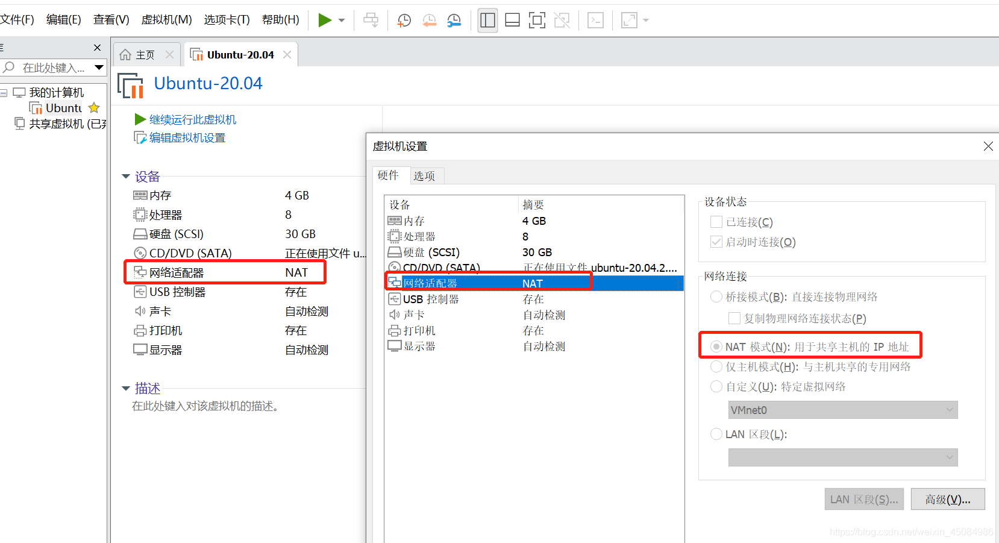
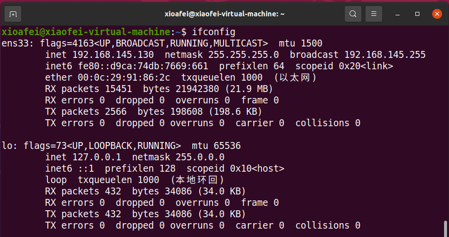

> 最近Ubuntu2004虚拟机无法联网，而且这个问题很常见，就记录一下；

参考：[VMware Ubuntu20.04无法联网的解决方法](https://blog.csdn.net/weixin_45084986/article/details/119192544?spm=1001.2014.3001.5506)

## 一、安装环境及版本

> 宿主机
> Windows 10
> 虚拟机软件版本
> VMware Workstation 16 Pro
> ubuntu版本
> Ubuntu 20.04

## 二、解决方法

1、虚拟机->设置->网络适配器：进行如下设置：



2、然后打开终端窗口，在终端窗口输入如下命令：

```bash
sudo service network-manager stop
sudo rm /var/lib/NetworkManager/NetworkManager.state
sudo service network-manager start
```

3、再运行`ifconfig`便可以发现网络已经恢复正常；


