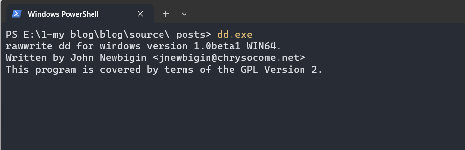
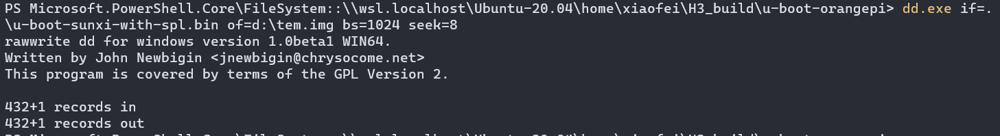

> windows11下如何烧录uboot镜像呢？当然是用windows下的dd命令了；

首先下载dd.exe，并将其命名为dd.exe，将其加入系统变量；

> [http://www.chrysocome.net/downloads/ddrelease64.exe](http://www.chrysocome.net/downloads/ddrelease64.exe)

测试如下图所示即安装成功：



然后已有u-boot-sunxi-with-spl.bin，因而插入SD卡，输入以下命令：

```powershell
dd.exe if=.\u-boot-sunxi-with-spl.bin of=d:\temp.img bs=1024 seek=8
```



然后使用DiskImager将temp.img镜像烧录进SD卡即可。

> 感觉之后生成的各种镜像只要组合成一个大的image就可以。
