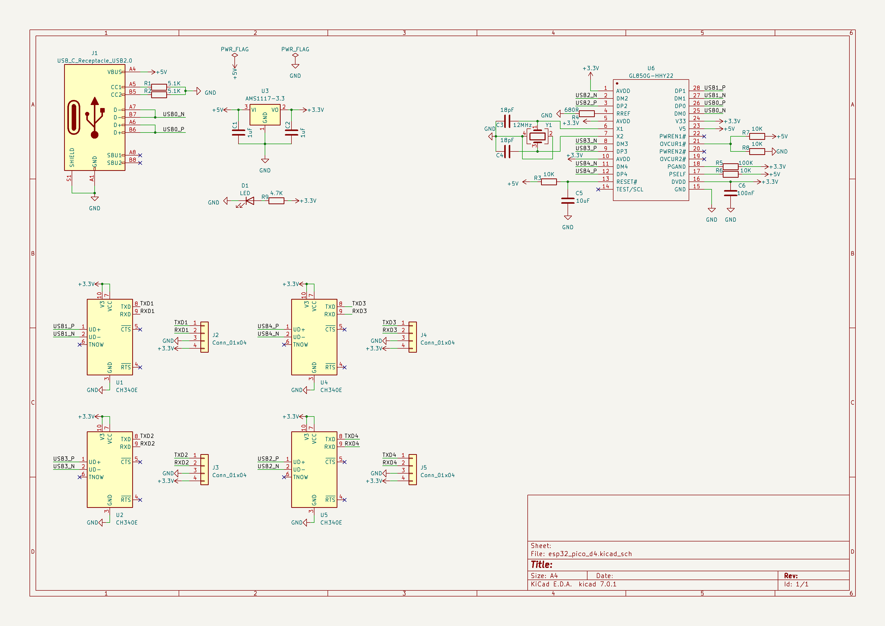
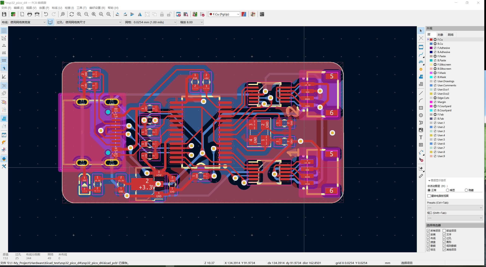
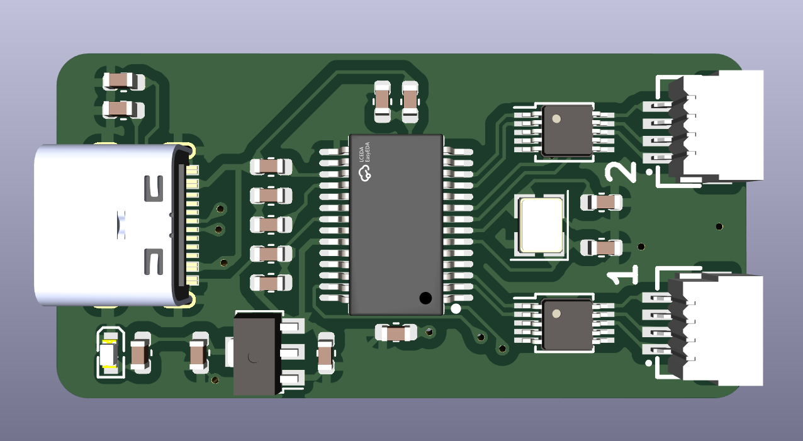
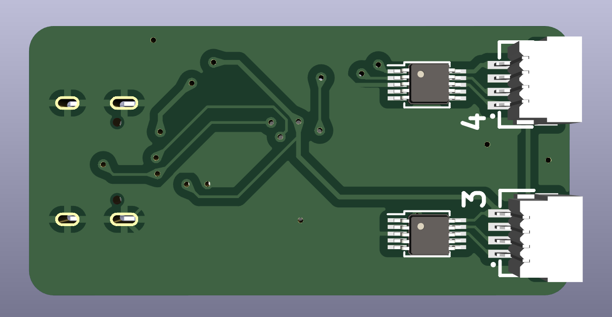
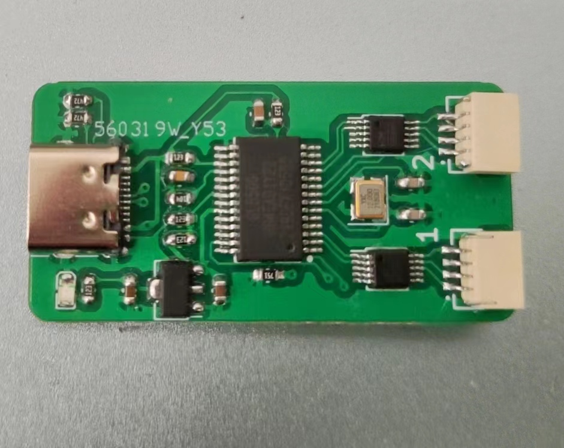
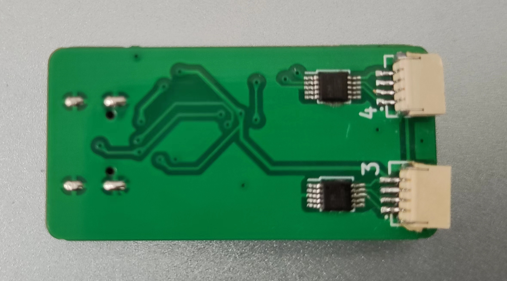
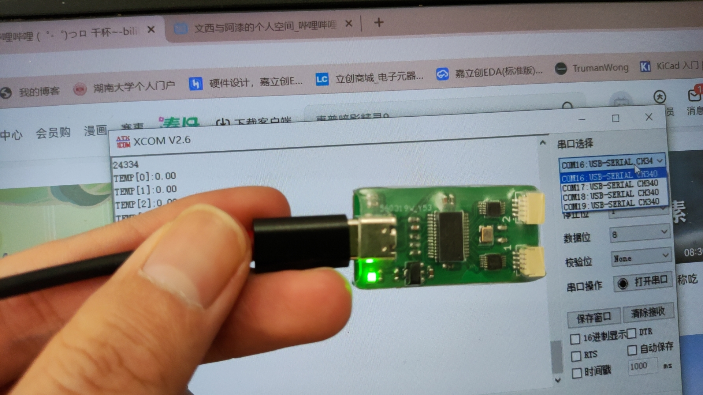

> 经常会遇到USB转TTL模块不够用的情况，因此这次直接搞一个一转四的USB转TTL模块，这下总够用了吧；

## 原理图

**设计原理图**

## PCB

**PCB图**

​

**PCB仿真图(正面)**

**PCB仿真图(反面)**

## 在线BOM

[BOM](https://www.fan-pengfei.top/HTML/USB2TTL)

## 实物图

**实物图(正面)**

**实物图(反面)**

**四个COM口！！！！**

