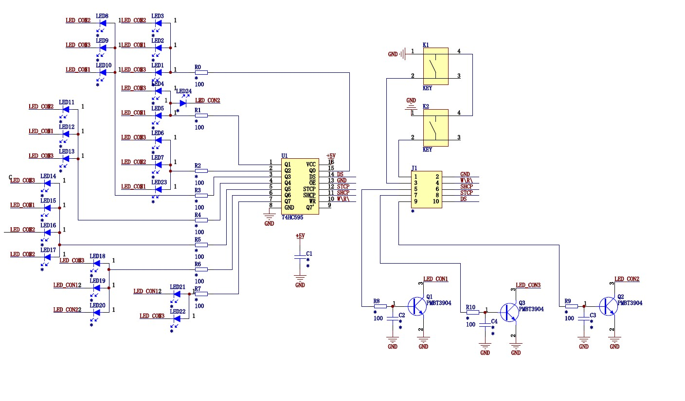

> 今天写代码的时候再次用到了与或非等逻辑运算符来完成一些二进制处理应用，总结记录一下；

## 一、缘起

以下是一个显示板的原理图，由于LED数量较多，因此在LED控制方案的选择上是选用了一块串转并的芯片74HC595；



对于74HC595的使用在这里就不再赘述；

74HC595串转并是转出8个输出端，再加上三个直接连接单片机引脚的COM端，理论上是可以很容易控制24个LED灯亮灭，就像是控制三个数码管一样，利用人眼的暂留现象，就可以使这24个LED灯的亮灭随意组合；

每一个COM端和8个LED组成一个组合，然后轮询点亮这三组LED，速度够快的话，就能看到三组LED被同时点亮；

## 二、解决

为了消除残影问题，在每一组的LED点亮后，应该马上写入使LED全部熄灭的命令，以消除可能会出现的残影问题；

首先定义三个`uint8_t`变量，例如代码中的`LED_NUM1`、`LED_NUM2`、`LED_NUM3`，然后通过控制COM端，分别向每组LED中写入这三个数据：

第一组
COM引脚排布：100
待写入74HC595中的数据：LED_NUM1

第二组
COM引脚排布：010
待写入74HC595中的数据：LED_NUM2

第三组
COM引脚排布：001
待写入74HC595中的数据：LED_NUM3

然后对于每一个单独LED的控制，就需要用到逻辑运算，例如图中的LED1，其属于第三组LED，因为其控制COM引脚为COM3，

因而代码可以写为：

```c
//只点亮LED1，而不影响本组内其他LED的显示
LED_NUM3 = LED_NUM3 | 0x01;
//只熄灭LED1，而不影响本组内其他LED的显示
LED_NUM3 = LED_NUM3 & (~0x01);
```

其他的LED控制也是一样的道理；

可以提取出公式，如LED的编号为0~7，分别接在74HC595的Q0~Q1引脚上，设任意一引脚为n号引脚，则其控制代码为：

```c
//只点亮LEDn，而不影响本组内其他LED的显示
LED_NUM = LED_NUM | (0x01 PF0
STCP -> PA12
DS  -> PB5
COM1->PA15
COM2->PB3
COM3->PB4
*/
/**
 * @brief 模拟SPI向74HC595芯片发送数据
 * @param SendVal 待发送八位数据
 * @return 无
 */
void HC595SendData(uint8_t SendVal)
{
    uint8_t i;
    for (i = 0; i  0)
    {
        LED_NUM1 = LED_NUM1 | 0x08;
    }
    else
    {
        LED_NUM1 = LED_NUM1 & (~0x08);
    }
    HC595SendData(LED_NUM1);
    HC595SendData(0x00);

    HAL_GPIO_WritePin(COM1_PIN_GPIO_Port, COM1_PIN_Pin, GPIO_PIN_RESET);
    HAL_GPIO_WritePin(COM2_PIN_GPIO_Port, COM2_PIN_Pin, GPIO_PIN_SET);
    HAL_GPIO_WritePin(COM3_PIN_GPIO_Port, COM3_PIN_Pin, GPIO_PIN_RESET);
    if (LED_second_case > 1)
    {
        LED_NUM2 = LED_NUM2 | 0x08;
    }
    else
    {
        LED_NUM2 = LED_NUM2 & (~0x08);
    }
    HC595SendData(LED_NUM2);
    HAL_Delay(0);
    HC595SendData(0x00);
    HAL_GPIO_WritePin(COM1_PIN_GPIO_Port, COM1_PIN_Pin, GPIO_PIN_RESET);
    HAL_GPIO_WritePin(COM2_PIN_GPIO_Port, COM2_PIN_Pin, GPIO_PIN_RESET);
    HAL_GPIO_WritePin(COM3_PIN_GPIO_Port, COM3_PIN_Pin, GPIO_PIN_SET);
    if (LED_second_case > 2)
    {
        LED_NUM3 = LED_NUM3 | 0x08;
    }
    else
    {
        LED_NUM3 = LED_NUM3 & (~0x08);
    }
    if (LED_power)
    {
        LED_NUM3 = LED_NUM3 | 0x40;
    }
    else
    {
        LED_NUM3 = LED_NUM3 & (~0x40);
    }
    if (LED_smart == 1)
    {
        if (pwm_high > pwm_t)
        {
            LED_NUM3 = LED_NUM3 | (0x20);
        }
        else
        {
            LED_NUM3 = LED_NUM3 & (~0x20);
        }
    }

    if (pwm_temp % 100 == 0)
    {
        if (flag == 1)
        {
            pwm_t--;
            if (pwm_t == 0)
            {
                flag = !flag;
            }
        }
        else
        {
            pwm_t++;
            if (pwm_t == 10)
            {
                flag = !flag;
            }
        }
    }
    pwm_high++;
    if (pwm_high == 10)
    {
        pwm_high = 0;
    }
    switch (LED_first_case)
    {
    case 1:
        /* code */
        LED_NUM3 = LED_NUM3 | (0x01);
        LED_NUM3 = LED_NUM3 & (~0x02);
        LED_NUM3 = LED_NUM3 & (~0x10);
        LED_NUM3 = LED_NUM3 & (~0x04);
        break;
    case 2:
        /* code */
        LED_NUM3 = LED_NUM3 & (~0x01);
        LED_NUM3 = LED_NUM3 | (0x02);
        LED_NUM3 = LED_NUM3 & (~0x10);
        LED_NUM3 = LED_NUM3 & (~0x04);
        break;
    case 3:
        /* code */
        LED_NUM3 = LED_NUM3 & (~0x01);
        LED_NUM3 = LED_NUM3 & (~0x02);
        LED_NUM3 = LED_NUM3 | (0x10);
        LED_NUM3 = LED_NUM3 & (~0x04);
        break;
    case 4:
        /* code */
        LED_NUM3 = LED_NUM3 & (~0x01);
        LED_NUM3 = LED_NUM3 & (~0x02);
        LED_NUM3 = LED_NUM3 & (~0x10);
        LED_NUM3 = LED_NUM3 | (0x04);
        break;
    default:
        break;
    }
    HC595SendData(LED_NUM3);
    HAL_Delay(0);
    HC595SendData(0x00);
}
```

，
