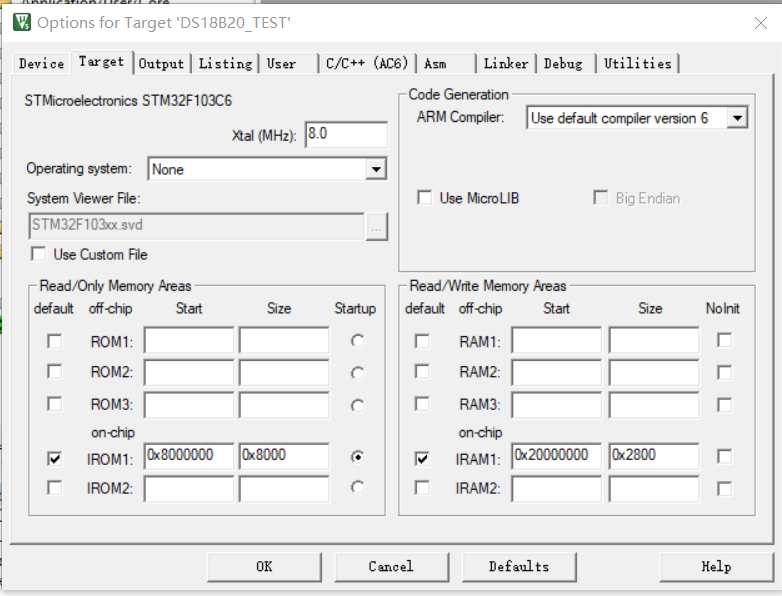
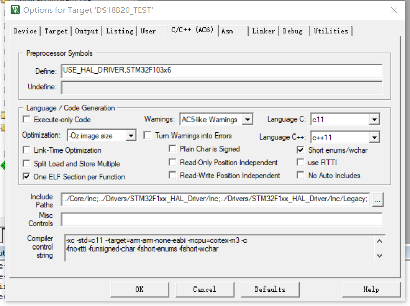
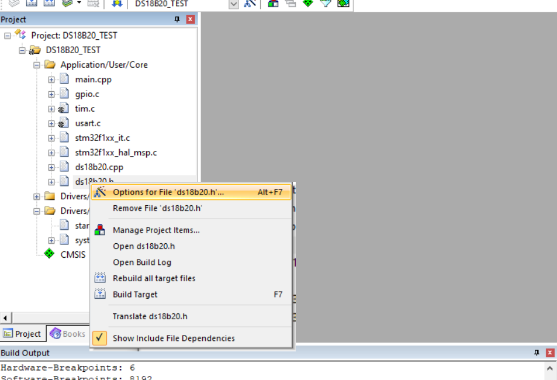
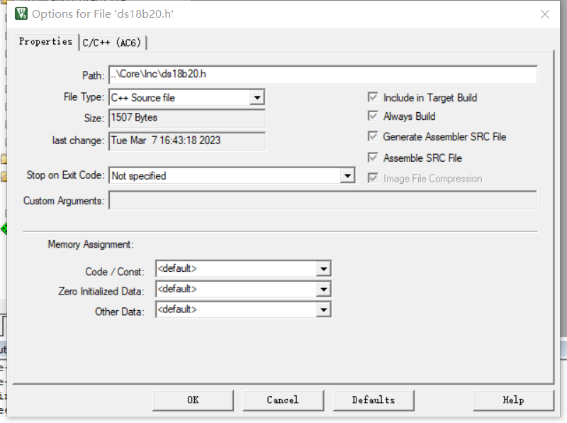
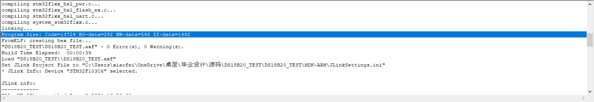
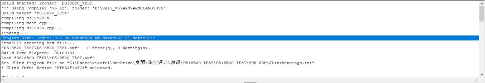

> 在做毕设过程中，用到了八个相同的传感器，传感器的通信协议都是一样的，固然直接搞八个差不多的文件来驱动传感器是没问题的，但是有一种更简洁的方式，那就是使用C++，来复用通信程序；

参考：[https://zhuanlan.zhihu.com/p/115068898](https://zhuanlan.zhihu.com/p/115068898)

## 环境说明

使用的单片机芯片是STM32F103C6T6；

Keil编译器版本为AC6；

Keil的配置如下：





然后是将C++源文件配对的头文件改为使用C++编译器进行编译；





## 源码编写

> 注意把main文件的后缀也改为.cpp，否则会出错；

### 头文件：

```cpp
/*
 * @Author       : fan-pengfei 2253770787@qq.com
 * @Date         : 2023-03-07 13:43:38
 * @LastEditors  : fan-pengfei 2253770787@qq.com
 * @LastEditTime : 2023-03-07 14:41:29
 * @FilePath     : \Core\Inc\ds18b20.h
 * @Description  :
 * Copyright (c) 2023 by ${git_name_email}, All Rights Reserved.
 */
#ifndef __DS18B20_H
#define __DS18B20_H

#include "main.h"
#include "tim.h"
class DS18B20_Class
{
private:
    GPIO_TypeDef *BSP_DS18B20_PORT;
    uint16_t BSP_DS18B20_PIN;
    float *Temp_Sum;
    uint8_t LOCATION;

public:
    DS18B20_Class(GPIO_TypeDef *BSP_DS18B20_PORT, uint16_t BSP_DS18B20_PIN, uint8_t LOCATION, float *Temp_data);
    void delay_us(uint16_t us);
    GPIO_PinState DS18B20_IN(void);
    void DS18B20_OUT_1(void);
    void DS18B20_OUT_0(void);
    void DS18B20_Mode_OUT_PP(void);
    void DS18B20_Mode_IN_NP(void);
    void DS18B20_Reset(void);
    uint8_t DS18B20_Presence(void);
    uint8_t DS18B20_ReadBit(void);
    uint8_t DS18B20_ReadByte(void);
    void DS18B20_WriteByte(uint8_t dat);
    void DS18B20_ReadId(uint8_t *ds18b20_id);
    void DS18B20_SkipRom(void);
    void DS18B20_MatchRom(void);
    uint8_t Init(void);
    float DS18B20_GetTemp_SkipRom(void);
    float DS18B20_GetTemp_MatchRom(uint8_t *ds18b20_id);
    void Start_Convert(void);
    void Get_Data(uint8_t ds18b20_id[64][8]);
};

extern "C"
{
    void User_DS18B20_Init(void);
    void User_Start_Convert(void);
    void User_Get_Data(void);
}
#endif
```

### 源文件：

```c++
/*
 * @Author       : fan-pengfei 2253770787@qq.com
 * @Date         : 2023-03-07 13:43:26
 * @LastEditors  : fan-pengfei 2253770787@qq.com
 * @LastEditTime : 2023-03-07 16:41:42
 * @FilePath     : \Core\Src\ds18b20.cpp
 * @Description  :
 * Copyright (c) 2023 by ${git_name_email}, All Rights Reserved.
 */
#include "ds18b20.h"
#include "main.h"
#include "DS18B20_ID.h"
extern float Temp_Sum[64];
void DS18B20_Class::delay_us(uint16_t us)
{
    tim_delay_us(us);
    // uint32_t delay;
    // delay = (1600 * us);
    // while (delay--)
    // {
    // }
}
GPIO_PinState DS18B20_Class::DS18B20_IN(void)
{
    return HAL_GPIO_ReadPin(BSP_DS18B20_PORT, BSP_DS18B20_PIN);
}
void DS18B20_Class::DS18B20_OUT_1(void)
{
    HAL_GPIO_WritePin(BSP_DS18B20_PORT, BSP_DS18B20_PIN, GPIO_PIN_SET);
}
void DS18B20_Class::DS18B20_OUT_0(void)
{
    HAL_GPIO_WritePin(BSP_DS18B20_PORT, BSP_DS18B20_PIN, GPIO_PIN_RESET);
}
/**
 * @brief DS18B20 输出模式
 */
void DS18B20_Class::DS18B20_Mode_OUT_PP(void)
{
    GPIO_InitTypeDef GPIO_InitStruct;
    GPIO_InitStruct.Pin = BSP_DS18B20_PIN;
    GPIO_InitStruct.Mode = GPIO_MODE_OUTPUT_PP;
    GPIO_InitStruct.Speed = GPIO_SPEED_FREQ_HIGH;
    HAL_GPIO_Init(BSP_DS18B20_PORT, &GPIO_InitStruct);
}
/**
 * @brief DS18B20 输入模式
 */
void DS18B20_Class::DS18B20_Mode_IN_NP(void)
{
    GPIO_InitTypeDef GPIO_InitStruct;
    GPIO_InitStruct.Pin = BSP_DS18B20_PIN;
    GPIO_InitStruct.Mode = GPIO_MODE_INPUT;
    GPIO_InitStruct.Pull = GPIO_NOPULL;
    HAL_GPIO_Init(BSP_DS18B20_PORT, &GPIO_InitStruct);
}
/**
 * @brief 主机给从机发送复位脉冲
 */
void DS18B20_Class::DS18B20_Reset(void)
{
    DS18B20_Mode_OUT_PP(); // 主机输出
    DS18B20_OUT_0();       // 主机至少产生 480us 的低电平复位信号
    delay_us(750);
    DS18B20_OUT_1(); // 主机在产生复位信号后，需将总线拉高
    // 从机接收到主机的复位信号后，会在 15 ~ 60 us 后给主机发一个存在脉冲
    delay_us(15);
}
/**
 * @brief  检测从机给主机返回的存在脉冲
 * @return 0：成功		1：失败
 */
uint8_t DS18B20_Class::DS18B20_Presence(void)
{
    uint8_t pulse_time = 0;
    DS18B20_Mode_IN_NP();                      // 主机设为输入
    while (DS18B20_IN() && (pulse_time = 100)
    {
        return 1;
    }
    else
    {
        pulse_time = 0;
    }
    while (!(DS18B20_IN()) && pulse_time = 240)
    {
        return 1;
    }
    else
    {
        return 0;
    }
}
/**
 * @brief 从DS18B20读取一个bit
 */
uint8_t DS18B20_Class::DS18B20_ReadBit(void)
{
    uint8_t dat;
    DS18B20_Mode_OUT_PP(); // 读 0 和读 1 的时间至少要大于 60 us
    DS18B20_OUT_0();       // 读时间的起始：必须由主机产生 > 1us > 1;
        // 写 0 和写 1 的时间至少要大于60us
        if (testb) // 当前位写 1
        {
            DS18B20_OUT_0();
            delay_us(5);     // 拉低发送写时段信号
            DS18B20_OUT_1(); // 读取电平时间保持高电平
            delay_us(65);
        }
        else // 当前位写 0
        {
            DS18B20_OUT_0(); // 拉低发送写时段信号
            delay_us(70);    // 读取电平时间保持低电平
            DS18B20_OUT_1();
            delay_us(2); // 恢复时间
        }
    }
}
/**
 * @brief  跳过匹配 DS18B20 ROM
 */
void DS18B20_Class::DS18B20_SkipRom(void)
{
    DS18B20_Reset();
    DS18B20_Presence();
    DS18B20_WriteByte(0XCC); /* 跳过 ROM */
}
/**
 * @brief  执行匹配 DS18B20 ROM
 */
void DS18B20_Class::DS18B20_MatchRom(void)
{
    DS18B20_Reset();
    DS18B20_Presence();
    DS18B20_WriteByte(0X55); /* 匹配 ROM */
}

DS18B20_Class::DS18B20_Class(GPIO_TypeDef *BSP_DS18B20_PORT, uint16_t BSP_DS18B20_PIN, uint8_t LOCATION, float *Temp_data)
{
    DS18B20_Class::BSP_DS18B20_PORT = BSP_DS18B20_PORT;
    DS18B20_Class::BSP_DS18B20_PIN = BSP_DS18B20_PIN;
    DS18B20_Class::LOCATION = LOCATION;
    DS18B20_Class::Temp_Sum = Temp_data;
}
uint8_t DS18B20_Class::Init(void)
{
    DS18B20_Mode_OUT_PP();
    DS18B20_OUT_1();
    DS18B20_Reset();
    return DS18B20_Presence();
}
/**
 * 存储的温度是16 位的带符号扩展的二进制补码形式
 * 当工作在12位分辨率时，其中5个符号位，7个整数位，4个小数位
 *
 *         |---------整数----------|-----小数 分辨率 1/(2^4)=0.0625----|
 * 低字节  | 2^3 | 2^2 | 2^1 | 2^0 | 2^(-1) | 2^(-2) | 2^(-3) | 2^(-4) |
 *
 *
 *         |-----符号位：0->正  1->负-------|-----------整数-----------|
 * 高字节  |  s  |  s  |  s  |  s  |    s   |   2^6  |   2^5  |   2^4  |
 *
 *
 * 温度 = 符号位 + 整数 + 小数*0.0625
 */
/**
 * @brief  在跳过匹配 ROM 情况下获取 DS18B20 温度值
 * @param  无
 * @retval 温度值
 */
float DS18B20_Class::DS18B20_GetTemp_SkipRom(void)
{
    uint8_t tpmsb, tplsb;
    int16_t s_tem;
    float f_tem;
    DS18B20_SkipRom();
    DS18B20_WriteByte(0X44); /* 开始转换 */
    DS18B20_SkipRom();
    DS18B20_WriteByte(0XBE); /* 读温度值 */
    tplsb = DS18B20_ReadByte();
    tpmsb = DS18B20_ReadByte();
    s_tem = tpmsb  要注意其中的`extern "C"`的用法；

### Main中调用：

> 注意main文件也是cpp后缀；

```c++
void main(void)
{
    User_DS18B20_Init();
    while (1)
    {
        User_Start_Convert();
        HAL_Delay(200); // 更新速率为200ms，等待转换结束
        User_Get_Data();
        int i = 0;
        while (i

使用C编写



使用C++编写



**C:**

Total RO  Size (Code + RO Data)
14016 (13.69kB)

Total RW  Size (RW Data + ZI Data)
2040 (1.99kB)

Total ROM Size (Code + RO Data + RW Data)
14464 (  14.13kB)

**C++:**

Total RO  Size (Code + RO Data)
11780 (11.50kB)

Total RW  Size (RW Data + ZI Data)
2864 (2.80kB)

Total ROM Size (Code + RO Data + RW Data)
12220 (  11.93kB)

> 相比较而言C用的ROM比较多一些，C++用的RAM比较多一些；

**可见在某些情况下，使用C++编写代码可以有效缩减代码体积，且代码更易懂；**

### microlib

使用C++编译的话，就没法再使用MicroLIB，因为MicroLIB为非标准的精简库，会与标准C++产生冲突；

### 中断服务程序

如果中断服务程序是异常的，因为stm32的中断入口矢量是按C的方式进入的，因此需要在整个文档的头部和末尾加上extern “C”{}用大括号把整个代码段扩住，这样中断就可以正常的进入了；

### Cubemx

Cubemx在生成头文件中已经加入了：

```c
#ifdef __cplusplus
extern "C" {
#endif

#ifdef __cplusplus
}
#endif
```

所以在不是其生成的文件中要注意`extern "C"`的使用；

当需要使用有C++特性的头文档时可以直接用cpp后缀，没有用到C++特性的可以C后缀也可以以CPP后缀了；

### printf的实现

半主机模式是ARM的一种机制，实现将来ARM应用程序代码的输入/输出请求传送至运行着调试器的主机。例如设置使用半主机模式下的ARM应用程序，可以使用printf()和scanf()来使用主机的显示器和键盘，而不需要在ARM系统上搭配显示器和键盘。
半主机通过一组定义好的软件指令(如SVC)来实现的，这些指令在程序控制下产生异常，ARM应用程序调用半主机对应的异常处理函数，然后调试代理处理该异常。

第二段话感觉理解起来有点模糊，但是第一段还是懂它在讲什么的。一般的ARM应用程序中并不需要半主机操作，在这里为确保ARM应用程序中没有链接MicroLib的半主机相关函数，我们要取消ARM的半主机工作模式。

实现代码：

在工程中加上如下代码：

```c
// 取消ARM的半主机工作模式
__asm(".global __use_no_semihosting"); // 用于AC6编译器
// #pragma import(__use_no_semihosting)//用于AC5编译器
FILE __stdout;
void _sys_exit(int x)
{
    x = x;
}

int fputc(int ch, FILE *f)
{
    HAL_UART_Transmit(&huart1, (uint8_t *)&ch, 1, 0xFFFF);
    return ch;
}
```

然后就可以愉快的使用printf打印日志了；
