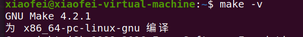
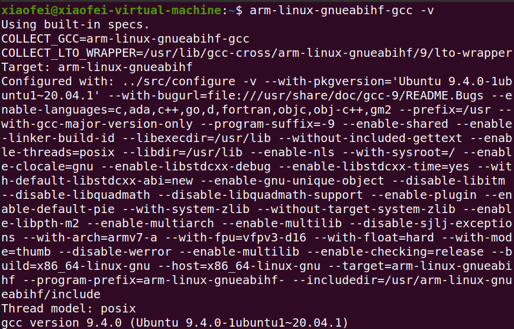
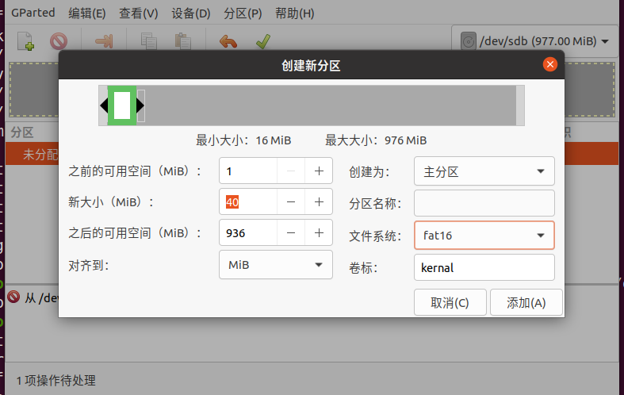
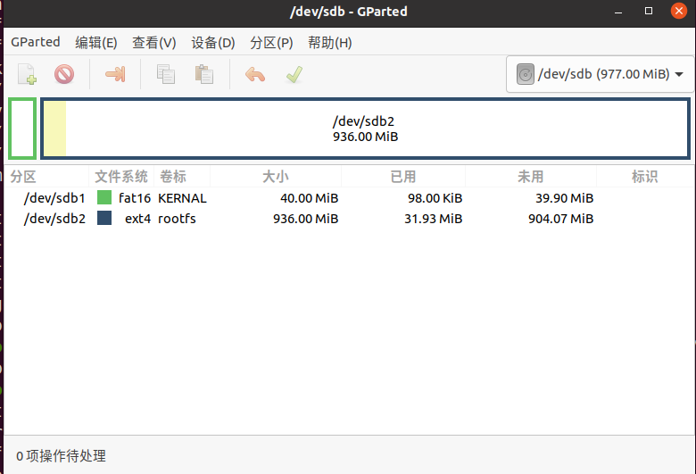
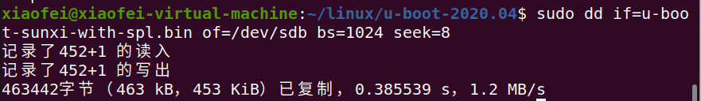
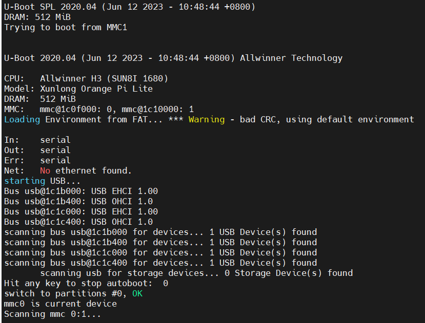

> 最近买了一块便宜的Linux开发板，是基于全志H3芯片的，想从头到尾跑一下开发流程；

# Uboot开发

## 环境搭建

安装好`make`、`arm-linux-gnueabihf-`等工具。





## Uboot编译

源码下载：[https://ftp.denx.de/pub/u-boot/](https://ftp.denx.de/pub/u-boot/)

```bash
wget https://ftp.denx.de/pub/u-boot/u-boot-2020.04.tar.bz2
```

> 选择`u-boot-2020.04.tar.bz2`即可；

使用以下命令进行解压操作：

```bash
tar -xvf u-boot-2020.04.tar.bz2
```

然后进行编译选项配置：

```bash
cd u-boot-2020.04/
make -j4 ARCH=arm CROSS_COMPILE=arm-linux-gnueabihf- orangepi_lite_defconfig
```

编译：

```plaintext
make -j4 ARCH=arm CROSS_COMPILE=arm-linux-gnueabihf- V=1
```

## Uboot烧录

准备一个micro SD卡（大于8GB）；

通过读卡器插入电脑；

安装并打开gparted：

```bash
sudo apt install gparted
sudo gparted
```

按照以下方式修改分区配置：





> 可能会出现`/sdb`大小不对的问题，可以先取下读卡器，然后使用`sudo rm -rf /dev/sdb`即可，然后再次进行分区即可；

使用以下命令进行烧录即可：

```bash
sudo dd if=u-boot-sunxi-with-spl.bin of=/dev/sdb bs=1024 seek=8
```



## 上电测试

将SD卡插入开发板，给开发板上电，打开调试接口接口看到以下输出：



# Linux内核开发

## 源码下载

```bash
git clone --depth 1  --branch orange-pi-5.4  https://ghproxy.com/https://github.com/orangepi-xunlong/linux-orangepi.git
cd linux-orangepi/
```

## 编译

```bash
make sunxi_defconfig ARCH=arm CROSS_COMPILE=arm-linux-gnueabihf-
make -j8 zImage dtbs ARCH=arm CROSS_COMPILE=arm-linux-gnueabihf-
```

生成的设备树和镜像路径：

```bash
/arch/arm/boot
```

## UBoot启动

```bash
setenv bootcmd 'load mmc 0:1 0x43000000 sun8i-h3-orangepi-lite.dtb; load mmc 0:1 0x42000000 zImage; bootz 0x42000000 - 0x43000000'
saveenv
boot
```

# rootfs

## 烧写

```bash
sudo dd if=/dev/sdb2 of=rootfs.ext2 bs=1M count=512
```
