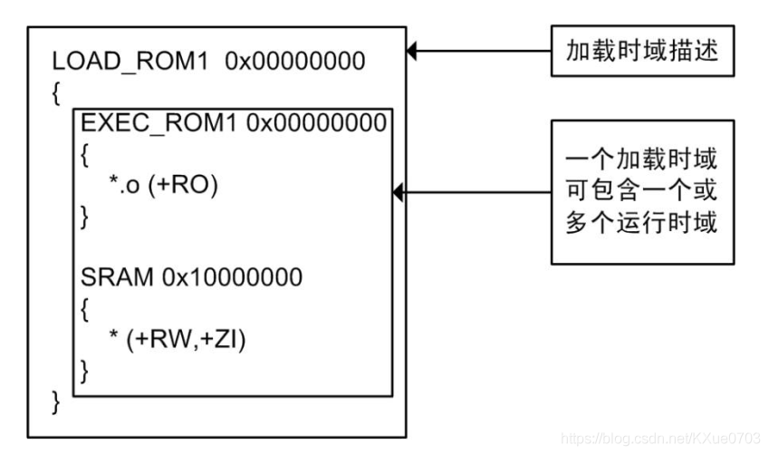
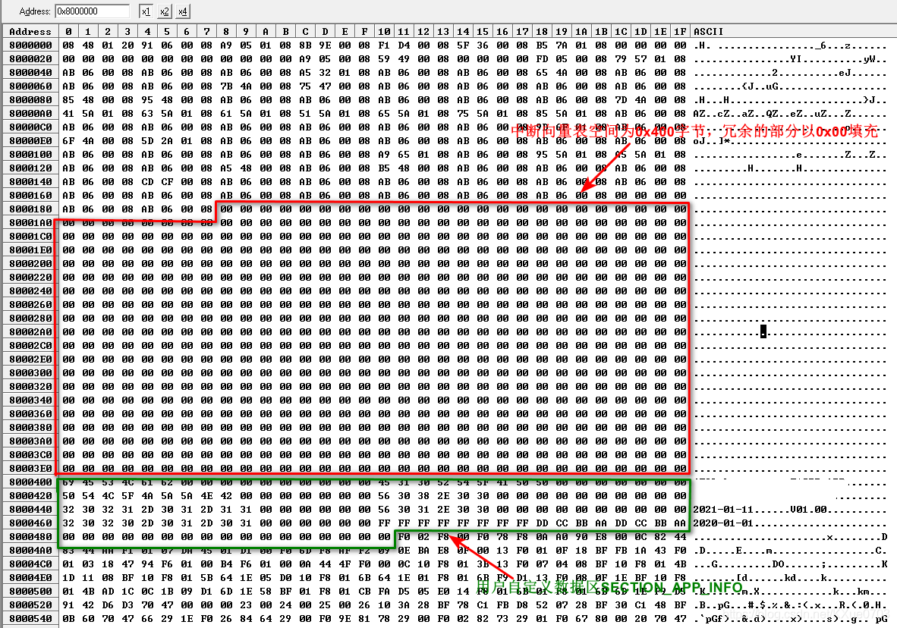

> 分散加载（scatter）文档是一个文本文档，它可以用来描述ARM连接器生成映像文档时所需要的信息；
>   参考：[https://blog.csdn.net/KXue0703/article/details/114018759](https://blog.csdn.net/KXue0703/article/details/114018759)

## 一、基础知识

为了充分理解分散加载文档的魅力，需要对工程编译后的内容有详细的了解。
Keil 编译后的内容如下所示：

- Code：为程序代码部分；

- RO-Data：表示程序定义的常量及 const 型数据；

- RW-Data：表示已经初始化的静态变量，变量有初值；

- ZI-Data：表示未初始化的静态变量，变量无初值；

当 Keil 工程编译完成后，查看其 map 文档，可得到结果如下程序清单：

```plaintext
Code (inc. data)   RO Data    RW Data    ZI Data      Debug

4194        230        714         16       1640      72715   Grand Totals
4194        230        714         16       1640      72715   ELF Image Totals
4194        230        714         16          0          0   ROM Totals

Total RO  Size (Code + RO Data)                 4908 (4.79kB)
Total RW  Size (RW Data + ZI Data)              1656 (1.62kB)
Total ROM Size (Code + RO Data + RW Data)       4924 (4.81kB)
```

由map文档可以看出：
ROM Size = Code＋RO-Data＋RW-Data = 4.81kB；
RAM Size = RW-Data＋ZI-Data = 1.62kB；

> 大小都很小，是因为这只是一个基础工程，是一个点灯程序；

为什么上述的 RW-Data 既占用 Flash 又占用 RAM 呢？变量不是放在 RAM 中的吗？为什么还会占用 Flash？因为 RW 数据不能像 ZI 那样“无中生有”的，ZI 段数据只要求其所在的区域全部初始化为零，所以只需要程序根据编译器给出的 ZI 基址及大小来将相应的 RAM清零。但 RW 段数据却不这样做，所以编译器为了完成所有 RW 段数据赋值，其先将 RW 段的所有初值，先保存到 Flash 中，程序执行时，再 Flash 中的数据搬运到 RAM 中，所以 RW 段即占用 Flash 又占用 RAM，且占用的空间大小是相等的；

这里有必要再了解一下，ZI 和 RW 段数据的赋值在某个工程中是在什么地方实现的呢？首先变量必先要初始化才能使用，否则初值不正确，而在 main() 函数后变量已经可以正常使用，那就是说变量的初始化是在之前完成的，查看这之前的代码只有__main() 一个函数，除了赋初值外，都还做了什么呢？

函数__main()主要由以下两部分功能组成，如下所示:

- __main()：完成代码和数据的拷贝，并把 ZI 数据区清零。代码拷贝可将代码拷贝到另外一个映射空间并执行 (例如将代码拷贝到 RAM 执行)； 数据拷贝完成 RW 段数据赋值；数据区清零完成 ZI 段数据赋值。以上的代码和分散加载文档密切相关；

- rt_entry()：进行 STACK 和 HEAP 等的初始化。最后_rt_entry跳进 main()函数入口。当 main()函数执行完后， _rt_entry 又将控制权交还给调试器。；

## 二、什么是分散加载文档

分散加载（scatter）文档是一个文本文档，它可以用来描述ARM连接器生成映像文档时所需要的信息；

如果不用scatter文档指定，那么ARM连接器会按照默认的方式来生成映像文档，一般情况下我们是不需要使用分散加载文档的，但在某些场合，我们希望把某些数据放在指定的地址处，那么这时候scatter文档就发挥了非常大的作用。而且scatter文档用起来非常简单好用；

在分散加载文档中可以指定下列信息：

- 各个加载时域（load region）加载时的起始地址（load address）和最大尺寸（max size）；

- 各个加载时域的属性；

- 从每个加载时域中分割出来的运行时域；

- 各个运行时域（excution region）的运行起始地址（excution address）和最大尺寸（max size）；

- 各个运行时域的存储访问特性；

- 各个运行时域的属性；

- 各个运行时域中包含的输入段；

## 三、为什么需要分散加载文档

一般情况下，我们可以不独自编写分散加载文档，ARM连接器直接按照默认的方式来生成映像文档即可，但是在某些场合，我们希望将某些数据放在指定的位置，此时分散加载文档就发挥了非常发的作用；

比如在下面几种情况就充分体现了分散加载文档的优势：

- ==复杂内存映射==：如果必须将代码和数据放在多个不同的内存区域中，则需要使用详细指令指定将哪些数据放在哪个内存空间中；

- ==不同类型的内存==：许多系统都包含多种不同的物理内存设备，如闪存、 ROM、 SDRAM 和快速 SRAM。分散加载描述可以将代码和数据与最适合的内存类型相匹配。例如，可以将中断代码放在快速 SRAM 中以缩短中断等待时间，而将不经常使用的配置信息放在较慢的闪存中；

- ==位于固定位置的函数==：可以将函数放在内存中的固定位置，即使已修改并重新编译周围的应用程序；

- ==使用符号标识堆和堆栈==：链接应用程序时，可以为堆和堆栈位置定义一些符号；

## 四、分散加载文档的基本特点

- 编译后输出的映像文档中各段是首尾相连的，中间没有空闲的区域，他们的先后关系是根据链接时参数的先后次序决定的`armlinker -file1.o file2.o …`

- scatter用于将编译后的映像文档中的特定段加载到多个分散的指定内存区域；

- 两类域(region)：执行域(execution region)和加载域(load region)；

- 加载域，该映像文档开始运行前存放的区域，即当系统启动或加载时应用程序存放的区域；

- 执行域，映像文档运行时的区域，即系统启动后，应用程序进行执行和数据访问的存储器区域，系统在实时运行时可以有一个或多个执行块；

- scatter本身并不能对映像实现“解压缩”，编译器读入scatter文档之后会根据其中的各种地址生成启动代码了，实现对映像的加载，而这一段代码就是`*(InRoot$$Sections)`它是__main()的一部分。这就是在汇编启动代码的最后跳转到__main()而不是跳向main()的原因之一；

- 起始地址与加载域重合的执行域称为root region，*(InRootSections)必须放在这个执行域中，否则链接的时候会报错；

## 五、分散加载文档的语法

分散加载文档一般由1个加载时域和1到多个运行时域组成（当然也可以包含2个以上的加载时域）。其大致的结构如下图所示：



### 5.1 加载时域描述

加载时域语法格式如下所示:

```c
load_region_name(base_address|("+"offset))[attribute_list][max_size]
{
    execution_region_description+
}
```

- ==load_region_name==：为本加载时域的名称，名称可以按照用户意愿自己定义，该名称中只有前 31 个字符有意义。它仅仅用来唯一的标识一个加载时域，而不像运行时域的名称除了唯一的标识一个运行时域外，还用来构成连接器连接生成的连接符号。

- ==base_designator==：用来表示本加载时域的起始地址，可以有下面两种格式中的一种：
base_address：表示本加载时域中的对象在连接时的起始地址，地址必须是字对齐的；

- +offset：表示本加载时域中的对象在连接时的起始地址是在前一个加载时域的结束地址后偏移量 offset 字节处。本加载时域是第一个加载时域，则它的起始地址即为 offset， offset 的值必须能被 4 整除。

- ==attribute_list==：指定本加载时域内容的属性，包含以下几种， 默认加载时域的属性是ABSOLUTE。
PI – 位置无关属性。

- RELOC – 重定位。

- OVERLAY – 覆盖。

- ABSOLUTE – 起始地址由base_designator指定（默认属性）。

- ==max_size==：指定本加载时域的最大尺寸。如果本加载时域的实际尺寸超过了该值，连接器将报告错误， 默认取值为 0xFFFFFFFF。

- ==execution_region_description==：表示运行时域，后面有个+号，表示其可以有一个或者多个运行时域，关于运行时域的介绍请看后面。

### 5.2 运行时域描述

运行时域语法格式如下所示:

```plaintext
exec_region_name(base_address|"+"offset)[attribute_list][max_size|" "length]
{
    input_section_description*
}
```

- ==exec_region_name==： 为为本加载时域的名称，名称可以按照用户意愿自己定义， 该名称中只有前 31 个字符有意义。它除了唯一的标识一个运行时域外，还用来构成连接器生成的连接符号。

- ==base_designator==：用来表示本加载时域的起始地址，可以有下面两种格式中的一种：
base_address：表示本运行时域中的对象在连接时的起始地址，地址必须是字对齐的；

- +offset：表示本运行时域中的对象在连接时的起始地址是在前一个加运行时域的结束地址后偏移量 offset 字节处。本运行时域是第一个加载时域，则它的起始地址即为 offset， offset 的值必须能被 4 整除。

- ==attribute_list==：指定本加载时域内容的属性，包含以下几种， 默认加载时域的属性是ABSOLUTE。
PI – 位置无关属性。

- RELOC – 重定位。

- OVERLAY – 覆盖。

- ABSOLUTE – 起始地址由base_designator指定（默认属性）。

- FIXED – 固定地址。此时该域加载时域地址和运行时域地址是相同的，而且都是通过base_designator指定的，而且base_designator必须是绝对地址或者offset为0。

- ==max_size==：指定本运行时域的最大尺寸。如果本运行时域的实际尺寸超过了该值，连接器将报告错误， 默认取值为 0xFFFFFFFF。

- ==length==：如果指定的长度为负值，则将 base_address 作为区结束地址。它通常与EMPTY 一起使用，以表示在内存中变小的堆栈。

### 5.3 输入段描述

输入段语法描述如下所示：

```plaintext
module_select_pattern [ "(" input_section_selector ( "," input_section_selector )* ")" ]
("+" input_section_attr | input_section_pattern | input_symbol_pattern)
```

- ==module_select_pattern==：目标文档滤波器，支持使用通配符“”与“?”。其中符号“”代表零个或多个字符，符号“？”代表单个字符。进行匹配时所有字符不区分大小写。

- ==nput_section_attr==：属性选择器与输入段属性相匹配。每个 input_section_attr 的前面有一个“+”号。如果指定一个模式以匹配输入段名称，名称前面必须有一个“+”号。可以省略紧靠“+”号前面的任何逗号。 选择器不区分大小写（可以识别的为属性First、Last）。

通过使用特殊模块选择器模式.ANY ，可以将输入段分配给执行区，而无需考虑其父模块。可以使用一个或多个.ANY 模式以任意分配方式填充运行时域。在大多数情况下，使用单个.ANY 等效于使用*模块选择器。

## 六、 分散加载应用举例

### 6.1 一个加载域多个执行域的情况

以ST的CortexM4核的低功耗STM32L476VC芯片为例，其资源如下：

> Flash基地址：0x08000000，小为256kB；  RAM基地址：0x20000000，大小为96kB；

```json
LR_IROM1 0x08000000 0x00040000  {   ; 定义一个加载时域，域基址：0x08000000，域大小为 0x00040000
  ER_IROM1 0x08000000 0x00040000  { ; 定义一个运行时域，第一个运行时域必须和加载
                                    ; 时域起始地址相同，否则库不能加载到该时域的
                                    ; 错误，其域大小一般也和加载时域大小相同
   *.o (RESET, +First)              ; 将 RESET 段最先加载到本域的起始地址外，即
                                    ; RESET 的起始地址为 0， RESET 存储的是矢量表
  }
  ER_IROM2 + 0 {                    ; 自定义的应用程序信息（软硬件版本、发布时间、升级信息等）
                                    ; 将其固定的放在中断矢量表之后，便于通过.bin文档查看程序的信息
   *.o (SECTION_APP_INFO, +First)
  }

  ER_IROM3 + 0 {                    ; 初始化相关代码
   *(InRoot$$Sections)
   .ANY (+RO)                       ; 加载所有匹配目标文档的只读属性数据，包含：
                                    ; Code、 RW-Code、 RO-Data。
  }

  RW_IRAM1 0x20000000 0x00018000  { ; 定义一个运行时域，域基址： 0x20000000 ，域大
                                    ; 小为 0x00018000 ，对应实际 RAM 大小
   .ANY (+RW +ZI)                   ; 这里也可以用 * 号替代 .ANY
  }
}
```

如上分散加载文档所示：它包含1个加载时域，3个运行时域。其第一个运行时域与加载时域的基地址一致（在嵌入式系统中，必须首先加载中断矢量表，且必须与加载时域的基地址保持一致，否则编译时会报错）。

==SECTION_APP_INFO==：用户自定义的一块区域，记录终端的版本、升级等相关信息，它是一块固定的位置，紧随中断矢量变之后。它为一个结构体形式。
结构体形式如下：

```c
/**
  * @brief 应用程序信息(必须为4字节对齐。同时用于IAP和APP)
  */
typedef struct
{
    UINT8   ucFactory[FACTORY_LENGTH];        /* 厂商标志 */
    UINT8   ucProduct[PRODUCT_LENGTH];        /* 产品标志 */
    UINT8   ucProtocol[PROTOCOL_LENGTH];      /* 规约标志 */
    UINT8   ucVerSW[VER_SW_LENGTH];           /* 软件版本 */
    UINT8   ucVerDateSW[DATE_SW_LENGTH];      /* 软件发布日期 */
    UINT8   ucVerHW[VER_SW_LENGTH];           /* 硬件版本 */
    UINT8   ucVerDateHW[DATE_HW_LENGTH];      /* 硬件发布日期 */
    UINT64  udwUpGradeFlag;                   /* 升级标志。主要存放升级方式。该值在升级完成后，改为 以上定义的各种值，以指示升级方式 */
    UINT64  udwAppFlag;                       /* 应用程序标志。该值在升级中动态改变。升级完成后必为APP_FLAG_UPGRADED */
    UINT64  udwCRC;                           /* 程序本身的 CRC。用来保证数据的完整性 */
    UINT64  udwLength;                        /* 程序本身的长度。仅指计算 CRC 的长度 */
} APP_INFO, IAP_INFO;
```

实现形式如下：

```c
const APP_INFO stAppInfo __attribute__((section("SECTION_IAP_INFO"))) =
{
    FACTORY,		/* 厂商标识，宏值 */
    PRODUCT,		/* 产品标识，宏值 */
    PROTOCOL,		/* 规约标识，宏值 */
    VER_SW,			/* 软件版本，宏值 */
    DATE_SW,		/* 软件版本发布日期，宏值 */
    VER_HW,			/* 硬件版本，宏值 */
    DATE_HW,		/* 硬件版本发布日期，宏值 */
    UPDATE_FLAG,	/* 升级标志，宏值 */
    APP_FLAG,		/* 应用程序标识，宏值 */
};
```

.ANY (+RW +ZI)可以由*（+RW +ZI）代替。

### 6.2 以属性FIXED实现一个加载域多个执行域的情况

下面的这种情况是对6.1中分散加载文档的略微修改，它将第2个加载时域（ER_IROM2 ）的基地址固定为了0x08000400 。这样为中断矢量表预留的空间大小为0x400字节，冗余的部分以0x00填充（这样写会导致生成的映像文档变大）。

```plaintext
LR_IROM1 0x08000000 0x00040000  {           ; load region size_region
  ER_IROM1 0x08000000 0x400  {              ; load address = execution address
   *.o (RESET, +First)
  }

  ER_IROM2 0x08000400  FIXED 0x0003C000 {   ; 应用程序信息
   *.o (SECTION_APP_INFO, +First)           ;First标识该输入段是运行该运行时域的第一个输入段
  }

  ER_IROM3 + 0 {                            ; 初始化相关代码
   *(InRoot$$Sections)
   .ANY (+RO)
  }

  RW_IRAM1 0x20000000 0x00018000  {         ; RW data
   .ANY (+RW +ZI)
  }
}
```

对应的.bin文档如下图所示：



下面的这种情况也是是对6.1中分散加载文档的略微修改，它将第2个加载时（ER_IROM2 ）的基地址固定为了0x08000400 ，第3个加载域（ER_IROM23）的基地址固定为了0x08000800，这样为中断矢量表和SECTION_APP_INFO均预留的空间大小为0x400字节，冗余的部分以0x00填充；

```plaintext
LR_IROM1 0x08000000 0x00040000  {           ; load region size_region
  ER_IROM1 0x08000000 0x400  {              ; load address = execution address
   *.o (RESET, +First)
  }

  ER_IROM2 0x08000400  FIXED 0x0003C000 {   ; 应用程序信息
   *.o (SECTION_APP_INFO, +First)
  }

  ER_IROM3 0x08000800  FIXED 0x00038000 {   ; 初始化相关代码
   *(InRoot$$Sections)
   .ANY (+RO)
  }

  RW_IRAM1 0x20000000 0x00018000  {         ; RW data
   .ANY (+RW +ZI)
  }
}
```

### 6.3 多块 RAM 的分散加载文档配置

还是上述的 MCU，假设其增加了另外一块 RAM，其资源如下：

- Flash基地址：0x08000000，小为256KB

- RAM基地址：0x10000000，大小为24KB

- RAM基地址：0x20000000，大小为24KB

若想将两块RAM都使用起来（可使用64KB），那么分散加载文档的写法应该如下：

```plaintext
LR_IROM1 0x08000000 0x00040000  {           ; load region size_region
  ER_IROM1 0x08000000 0x400  {              ; load address = execution address
   *.o (RESET, +First)
  }
  ER_IROM2 0x08000400  FIXED 0x0003C000 {   ; 应用程序信息
   *.o (SECTION_APP_INFO, +First)           ;First标识该输入段是运行该运行时域的第一个输入段
  }
  ER_IROM3 + 0 {                            ; 初始化相关代码
   *(InRoot$$Sections)
   .ANY (+RO)
  }

  RW_IRAM1 0x100000000 0x6000  {        ; 定义的RAM1的运行时域
   .ANY (+RW +ZI)                       ; 使用.ANY 进行随意分配变量，这里不能使用*号
                                        ; 替代， *表示匹配有所有的目标文档，这样变量就
                                        ; 无法分配到第二块 RAM 空间了
  }
  RW_IRAM2 0x200000000 0x6000  {        ; 定义的RAM1的运行时域
   .ANY (+RW +ZI)                       ; 同样使用.ANY 随意分配变量的方式
  }
                                        ; 如果还有另多的 RAM 块，在这里增加新的运行
                                        ; 时域即可，格式和 RAM2 的定义相同
}
```

那么问题来了，以上的分散加载机制确实可以使两个RAM空间（64KB）都使用起来，但是它并不等同于一个64KB的RAM。在实际应用中我们可能会遇到如下的情况：

比如我们在UpComm.c中定义了一个30KB的数组Test，如下面的函数清单所示：

```c
// main.c 文档
//......
unsigned char Test[30 * 1024];     // 定义一个 30KB 的数组
//unsigned char Test1[15 * 1024];  // 定义第一个 15KB 数组
//unsigned char Test2[15 * 1024];  // 定义第二个 15KB 数组
//......
// end of file
```

程序在编译时会出现错误，并提示没有足够的空间，为什么呢？原因为数组是一个整体，其内部元素的地址是连续的，不能分割的， 但是在两个不连续的24KB 空间中，是没办法分配出一个连续的 30KB 地址空间，所以编译会提示空间不足，分配 30KB 数组失败。

去掉Test[30 * 1024]，改为两个15KB的数组Test1[15 * 1024]和Test2[15 * 1024]，编译时依然出现错误，并体会没有足够的空间，这又是为什么呢？

以上的问题还得从.ANY通配符的作用开始说起，ANY 是一个通配符， 当其与以下内容之一相匹配时将进行选择:

- 包含段和目标文档的名称；

- 库成员名称（不带前导路径名）；

- 库的完整名称（包括路径名）；

第一个匹配项为：包含段和目标文档,“目标文档”，不是其它，即是说一个 C 文档编译后，其所有的变量、代码都会作为一个整体。所以定义两个15KB 和定义了一个 30KB，在编译器看来都是一样，就是这个C文档总共定义了30KB 的空间，我要用 20KB 的空间来分配它，因此会出现同样的错误。

关于大数组分配的解决方法，有两种，分别如下：

- 将数组分开在不同的 C 文档中定义，避免在同一个 C 文档定义的数据大小总量超过其中最大的分区；

- 将一个 C 数组，使用段定义，使其从该 C 文档中独立出来，这样编译器就不会将它们作为一个整体来划分空间了（如下所示）。==关于段的详细说明见下面的附录==；

```c
#pragma arm section zidata = "SRAM"      // 在 C 文档中定义新的段
unsigned char Test1[15 * 1024];          // 定义第一个15KB数组
#pragma arm section // 恢复原有的段
unsigned char Test2[15 * 1024];          // 定义第二个15KB数组，这20KB数组不会和
                                         // Test1 作为一个整体来划分空间
```

### 6.4 多块 Flash 的分散加载文档配置

假设有一个MCU，它有两块独立的Flash，一个RAM，资源分配如下：

- Flash1 基址： 0x00000000，大小：256 Kbyte；

- Flash2 基址： 0x20000000，大小：2048 Kbyte；

- RAM 基址： 0x10000000，大小： 32 Kbyte；

注意这里多增加的一块的不是RAM，而是Flash，其情况会如何呢？假设其相同，那写法应该就是如程序清单所示的样子：

```plaintext
LR_IROM1 0x00000000 0x00040000 {
    ER_IROM1 0x00000000 0x00040000 {   ; 定义 Flash1 运行时域
        *.o (RESET, +First)            ; 先加载矢量表
		*(InRoot$$Sections)
        .ANY (+RO)                     ; 随意分配只读数据
	}
 ER_IROM2 0x20000000 0x00200000 {   ; 定义 Flash2 运行时域
        .ANY (+RO)                     ; 随意分配只读数据
	}
	RW_IRAM1 0x10000000 0x00008000 {
		.ANY (+RW +ZI)
	}
}
```

令人遗憾的是，编译出错，为什么会出错呢，仔细分析一下：代码加载时，仅加载到了ROM1中（加载地址是ROM1），但是运行时只读数据却是在ROM1、ROM2随机分配的。当内核访问ROM2的数据时，那必须先将数据复制到ROM2中才能访问（但这一操作是不能实现的），当然导致编译出错。

正确的编写方式应该如下：

```plaintext
LR_IROM1 0x00000000 0x00040000 {     ; 定义 Flash1 的加载域
	ER_IROM1 0x00000000 0x00040000 {
		*.o (RESET, +First)
		*(InRoot$$Sections)
        .ANY (+RO)                   ; 随机分配只读数据
	}
	RW_IRAM1 0x10000000 0x00008000 {
		.ANY (+RW +ZI)
	}
}
LR_IROM2 0x20000000 0x00200000 {     ; 定义 Flash2 的加载域
	ER_IROM2 0x20000000 0x00200000 {
        .ANY (+RO)                   ; 随机分配只读数据，代码不会进行拷贝
	}
}
```

这样写能够解决双Flash加载的问题，但是同样有一个问题，那就是，编译时会生成2份bin文档，需要分别两次烧录代码。

### 6.5 关于加载时域与第一个运行时域的关系的说明

- 第一个运行时域存放的代码不会进行额外拷贝因为分散加载文档有一项很强大的功能，就是可以将 Flash的代码拷贝到 RAM中运行，这一段拷贝代码就存在于__main()函数中，但拷贝代码不能拷贝自身，所以必须规定有一个运行时域中存放的代码是不会被拷贝的，这个指的就是第一个运行时域。一段代码必须先完成拷贝，才能被执行。换句理解就是拷贝代码前包括自身的所有代码都不能拷贝，也就是说这些代码全部都必须放在第一个运行时域中。

- 规定其余运行时域中存放的代码均会被拷贝一个加载时域，只需要一个不拷贝的运行时域即可。所以规定其余所有的运行时域中的代码均会被拷贝。

- 第一个运行时域的基址必须与加载域基址相同为了保证第一个运行时域的代码能够被正确存储和执行，因此要求第一个运行时域的基址必须和加载时域的基址相同。
