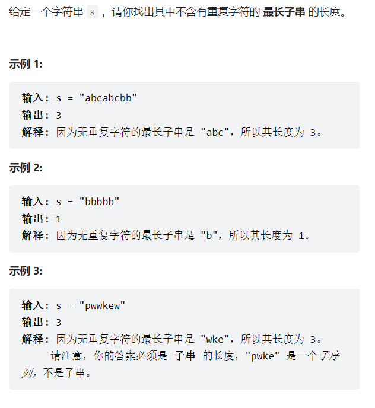
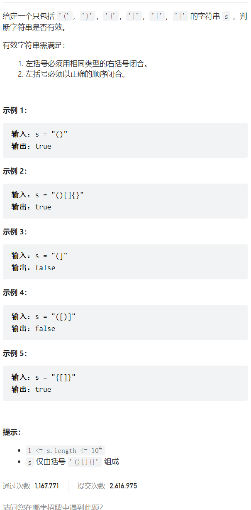

> 记录自己刷算法题中遇到的问题和自己的思路；

### 1、无重复长度的最长子串：

#### 题目描述：



> 提示：
> `0 <= s.length <= 5 * 104；
> `s` 由英文字母、数字、符号和空格组成；

#### 思路：

就是做两个标志位，表示当前字符串的起始位置和正在比较的字符位置；

遍历整个字符串；

从起始标志位开始，到结束位置，依次比对是否有重复字符；

如果无，就结束位置加加；

如果有，就计算长度，并移动起始位置到重复字符的下一个位置；

然后一直循环；

要特别考虑：

```plaintext
au
abb
bba
```

这些特殊排序的字符串；

是因为最后一个没有办法比较；

#### 题解代码：

```c
int lengthOfLongestSubstring(char *s)
{
    int str_length = strlen(s);
    int end_flag = 1, start_flag = 0, max_length = 1;
    char flag = 0;
    int i = 0;
    if (str_length == 0)
    {
        return 0;
    }
    while (*(s + end_flag) != '\0')
    {
        for (i = start_flag; i  max_length)
                {
                    max_length = end_flag - start_flag;
                }
                flag = 1;
                break;
            }
            if (i == str_length - 2)
            {
                if ((*(s + end_flag + 1) == '\0'))
                {
                    if (end_flag - start_flag + 1 > max_length)
                    {
                        max_length = end_flag - start_flag + 1;
                    }
                }
            }
        }
        if (flag == 1)
        {
            flag = 0;
            start_flag = i + 1;
        }
        else
        {
            end_flag++;
        }
    }
    return max_length;
```

#### 改进：

```c
//方法2
int lengthOfLongestSubstring(char * s){
    int str_length=strlen(s);
    int end_flag=1,start_flag=0,max_length=1;
    char flag=0;
    int i=0;
    if(str_length==0)
    {
        return 0;
    }
    while(*(s+end_flag)!='\0')
    {
        for(i=start_flag;imax_length)
            {
                 max_length=end_flag-start_flag;
            }
            flag=0;
            start_flag=i+1;
        }
        else
        {
            if(end_flag-start_flag+1>max_length)
            {
                 max_length=end_flag-start_flag+1;
            }
            end_flag++;
        }
    }
    return max_length;
}
```

## 2、括号匹配



```c
bool isValid(char * s){
    char *temp_s;
    int p_temp=-1;
    if(strlen(s)%2!=0)
    {
        return false;
    }
    temp_s=(char *)malloc(strlen(s));
    if((*s==')')||(*s=='}')||(*s==']'))
    {
        return false;
    }
    while(*s!='\0')
    {
        switch(*s)
        {
            case '(':
                p_temp++;
                if(p_tempmax)
        {
            max=temp;
        }
        if(height[p_left]valval)
        {
            pre->next=list1;
            list1=list1->next;
        }
        else
        {
            pre->next=list2;
            list2=list2->next;
        }
        pre=pre->next;
    }
    if(list1==NULL)
    {
        pre->next=list2;
    }
    else
    {
        pre->next=list1;
    }
    return dummy->next;
}
```

### 思路：

主要是不用考虑申请空间的问题，因为空间本身就是存在的，只需要改变链表中各个节点间的指向关系就可以；

最后看哪一个先为NULL，然后把不为空的整体连接上去，返回即可；
