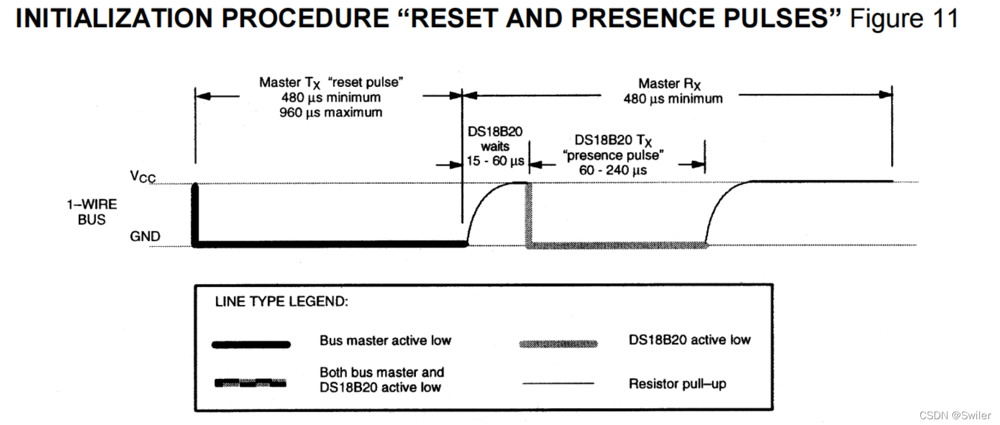
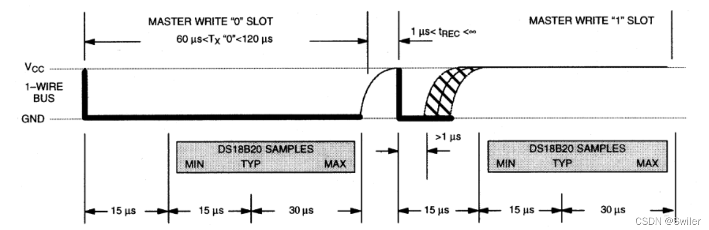
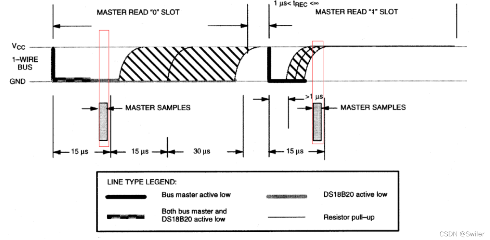
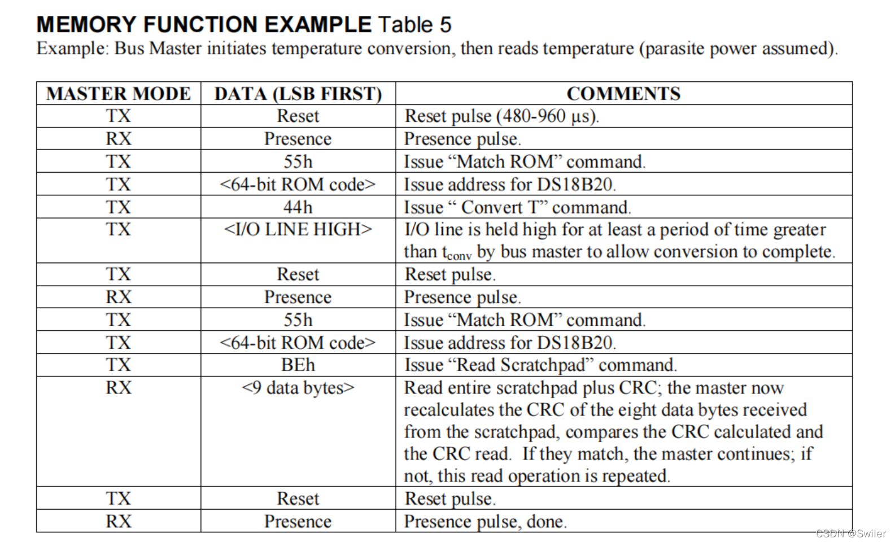
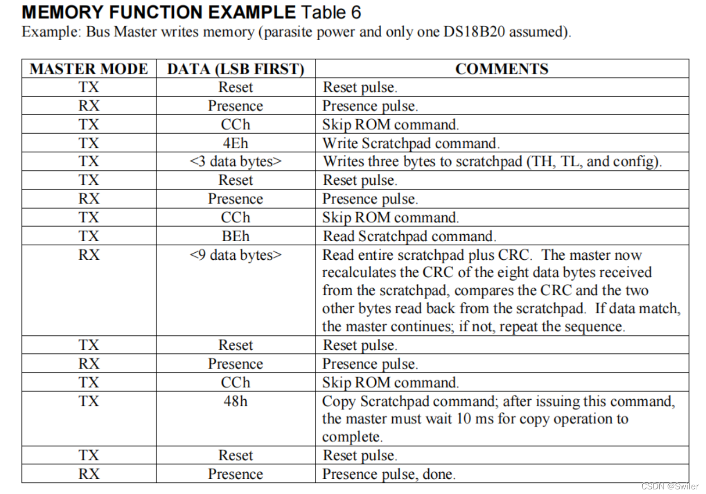

> 当需要同时读取多个点的温度数据时，DS18B20就是一个很好的选择，不仅精度高，而且还可以单总线挂载多个传感器以节省IO口的使用；

## 初始化函数

DS18B20的通信协议为单总线通信协议；



首先由主机发送一个复位脉冲约480-960us；然后总线被拉高；在15-60us之后传感器向单片机发送一个约60-240us的存在脉冲，然后总线被拉高。

```c
/**
 * @brief 主机给从机发送复位脉冲
 */
static void DS18B20_Reset(void)
{
    DS18B20_Mode_OUT_PP(); // 主机输出
    DS18B20_OUT_0; // 主机至少产生 480us 的低电平复位信号
    delay_us(750);
    DS18B20_OUT_1; // 主机在产生复位信号后，需将总线拉高
    // 从机接收到主机的复位信号后，会在 15 ~ 60 us 后给主机发一个存在脉冲
    delay_us(15);
}

/**
 * @brief  检测从机给主机返回的存在脉冲
 * @return 0：成功		1：失败
 */
static uint8_t DS18B20_Presence(void)
{
    uint8_t pulse_time = 0;
    DS18B20_Mode_IN_NP(); // 主机设为输入
    // 等待存在脉冲的到来，存在脉冲为一个 60 ~ 240 us 的低电平信号
    // 如果存在脉冲没有来则做超时处理，从机接收到主机的复位信号后，会在 15 ~ 60 us 后给主机发一个存在脉冲
    while (DS18B20_IN && (pulse_time = 100)
    {
        return 1;
    }
    else
    {
        pulse_time = 0;
    }
    // 响应脉冲（低电平）到来，且存在的时间不能超过 240 us
    while (!(DS18B20_IN) && pulse_time = 240)
    {
        return 1;
    }
    else
    {
        return 0;
    }
}
/**
 * @brief  DS18B20 初始化函数
 * @reurn  0：成功		1：失败
 */
uint8_t DS18B20_Init(void)
{
    DS18B20_Mode_OUT_PP();
    DS18B20_OUT_1;
    DS18B20_Reset();
    return DS18B20_Presence();
}
```

## 配置写函数

当主机将数据线从高逻辑级别拉到低逻辑级别时，将启动写入时隙。有两种类型的写时槽：写1时槽和写0时槽。所有写入时隙的持续时间必须至少为60µs，且每个写入周期之间的恢复时间至少为1µs以上。在DQ线下降后，DS18B20在15µs到60µs的窗口中对DQ线进行采样。

如果DQ为高，则会出现Write1。如果DQ为低低，则会出现Write0。

要使主机生成写1时隙，必须将数据线拉到逻辑低级别，然后释放，允许数据线在写时隙开始后的15µs内拉到高级别。

要使主机生成写0时隙，必须将数据线拉到逻辑低级别，并在低级别保持60µs。



```c
/**
 * @brief 写一个字节到 DS18B20，低位先行
 */
static void DS18B20_WriteByte(uint8_t dat)
{
    uint8_t i, testb;
    DS18B20_Mode_OUT_PP();
    for (i = 0; i > 1;
        // 写 0 和写 1 的时间至少要大于60us
        if (testb) // 当前位写 1
        {
            DS18B20_OUT_0;
            delay_us(5); // 拉低发送写时段信号
            DS18B20_OUT_1; // 读取电平时间保持高电平
            delay_us(65);
        }
        else // 当前位写 0
        {
            DS18B20_OUT_0; // 拉低发送写时段信号
            delay_us(70);  // 读取电平时间保持低电平
            DS18B20_OUT_1;
            delay_us(2); // 恢复时间
        }
    }
}
```

## 配置读函数

当要从DS18B20读取数据时，主机生成读取时隙。当主机将数据线从逻辑高级级别到逻辑低级别时，启动读取时隙。数据线必须保持在低逻辑级别至少1µs；来自DS18B20的输出数据在读取时隙边缘下降后15µs有效。因此，主机必须将DQ引脚拉低，以便从读取槽的开始读取其15µs的状态。在读取时隙结束时，DQ引脚将通过外部上拉电阻重新拉高。所有读取时间槽的持续时间必须至少为60µs，每个读取时间槽之间的恢复时间至少为1-µs。



```c
/**
 * @brief 从DS18B20读取一个bit
 */
static uint8_t DS18B20_ReadBit(void)
{
    uint8_t dat;
    DS18B20_Mode_OUT_PP(); // 读 0 和读 1 的时间至少要大于 60 us
    DS18B20_OUT_0; // 读时间的起始：必须由主机产生 > 1us  要搭配硬件电路使用

```c
void Power_Select(uint8_t value)
{
    DS18B20_WriteByte(0xB4);
    if(value == 1)
    {
        DS18B20_WriteByte(1);
    }
    if(value == 0)
    {
        DS18B20_WriteByte(0);
    }
}
```

## 读取芯片ID

```c
/**
 * @brief  读取ID
 * @param  ds18b20_id：用于存放 DS18B20 串行号的数组的首地址
 */
void DS18B20_ReadId(uint8_t *ds18b20_id)
{
    uint8_t uc;
    DS18B20_WriteByte(0x33); // 读取串行号
    for (uc = 0; uc



```c
/**
 * 存储的温度是16 位的带符号扩展的二进制补码形式
 * 当工作在12位分辨率时，其中5个符号位，7个整数位，4个小数位
 *
 *         |---------整数----------|-----小数 分辨率 1/(2^4)=0.0625----|
 * 低字节  | 2^3 | 2^2 | 2^1 | 2^0 | 2^(-1) | 2^(-2) | 2^(-3) | 2^(-4) |
 *
 *
 *         |-----符号位：0->正  1->负-------|-----------整数-----------|
 * 高字节  |  s  |  s  |  s  |  s  |    s   |   2^6  |   2^5  |   2^4  |
 *
 *
 * 温度 = 符号位 + 整数 + 小数*0.0625
 */

/**
 * @brief  在匹配 ROM 情况下获取 DS18B20 温度值
 * @param  ds18b20_id：存放 DS18B20 串行号的数组的首地址
 * @retval 温度值
 */
float DS18B20_GetTemp_MatchRom(uint8_t *ds18b20_id)
{
    uint8_t tpmsb, tplsb, i;
    int16_t s_tem;
    float f_tem;
    DS18B20_MatchRom(); /* 匹配ROM */
    for (i = 0; i



```c
/**
 * 存储的温度是16 位的带符号扩展的二进制补码形式
 * 当工作在12位分辨率时，其中5个符号位，7个整数位，4个小数位
 *
 *         |---------整数----------|-----小数 分辨率 1/(2^4)=0.0625----|
 * 低字节  | 2^3 | 2^2 | 2^1 | 2^0 | 2^(-1) | 2^(-2) | 2^(-3) | 2^(-4) |
 *
 *
 *         |-----符号位：0->正  1->负-------|-----------整数-----------|
 * 高字节  |  s  |  s  |  s  |  s  |    s   |   2^6  |   2^5  |   2^4  |
 *
 *
 * 温度 = 符号位 + 整数 + 小数*0.0625
 */

/**
 * @brief  在跳过匹配 ROM 情况下获取 DS18B20 温度值
 * @param  无
 * @retval 温度值
 */
float DS18B20_GetTemp_SkipRom(void)
{
    uint8_t tpmsb, tplsb;
    int16_t s_tem;
    float f_tem;
    DS18B20_SkipRom();
    DS18B20_WriteByte(0X44); /* 开始转换 */
    DS18B20_SkipRom();
    DS18B20_WriteByte(0XBE); /* 读温度值 */
    tplsb = DS18B20_ReadByte();
    tpmsb = DS18B20_ReadByte();
    s_tem = tpmsb = 100)
    {
        return 1;
    }
    else
    {
        pulse_time = 0;
    }

    // 响应脉冲（低电平）到来，且存在的时间不能超过 240 us
    while (!(DS18B20_IN) && pulse_time = 240)
    {
        return 1;
    }
    else
    {
        return 0;
    }
}

/**
 * @brief  DS18B20 初始化函数
 * @reurn  0：成功		1：失败
 */
uint8_t DS18B20_Init(void)
{
    DS18B20_Mode_OUT_PP();
    DS18B20_OUT_1;

    DS18B20_Reset();
    return DS18B20_Presence();
}

/**
 * @brief 从DS18B20读取一个bit
 */
static uint8_t DS18B20_ReadBit(void)
{
    uint8_t dat;

    DS18B20_Mode_OUT_PP(); // 读 0 和读 1 的时间至少要大于 60 us

    DS18B20_OUT_0; // 读时间的起始：必须由主机产生 > 1us > 1;

        // 写 0 和写 1 的时间至少要大于60us

        if (testb) // 当前位写 1
        {
            DS18B20_OUT_0;

            delay_us(5); // 拉低发送写时段信号

            DS18B20_OUT_1; // 读取电平时间保持高电平
            delay_us(65);
        }
        else // 当前位写 0
        {
            DS18B20_OUT_0; // 拉低发送写时段信号
            delay_us(70);  // 读取电平时间保持低电平

            DS18B20_OUT_1;
            delay_us(2); // 恢复时间
        }
    }
}

/**
 * @brief  跳过匹配 DS18B20 ROM
 */
static void DS18B20_SkipRom(void)
{
    DS18B20_Reset();

    DS18B20_Presence();

    DS18B20_WriteByte(0XCC); /* 跳过 ROM */
}

/**
 * @brief  执行匹配 DS18B20 ROM
 */
static void DS18B20_MatchRom(void)
{
    DS18B20_Reset();

    DS18B20_Presence();

    DS18B20_WriteByte(0X55); /* 匹配 ROM */
}

/**
 * 存储的温度是16 位的带符号扩展的二进制补码形式
 * 当工作在12位分辨率时，其中5个符号位，7个整数位，4个小数位
 *
 *         |---------整数----------|-----小数 分辨率 1/(2^4)=0.0625----|
 * 低字节  | 2^3 | 2^2 | 2^1 | 2^0 | 2^(-1) | 2^(-2) | 2^(-3) | 2^(-4) |
 *
 *
 *         |-----符号位：0->正  1->负-------|-----------整数-----------|
 * 高字节  |  s  |  s  |  s  |  s  |    s   |   2^6  |   2^5  |   2^4  |
 *
 *
 * 温度 = 符号位 + 整数 + 小数*0.0625
 */

/**
 * @brief  在跳过匹配 ROM 情况下获取 DS18B20 温度值
 * @param  无
 * @retval 温度值
 */
float DS18B20_GetTemp_SkipRom(void)
{
    uint8_t tpmsb, tplsb;
    int16_t s_tem;
    float f_tem;

    DS18B20_SkipRom();
    DS18B20_WriteByte(0X44); /* 开始转换 */

    DS18B20_SkipRom();
    DS18B20_WriteByte(0XBE); /* 读温度值 */

    tplsb = DS18B20_ReadByte();
    tpmsb = DS18B20_ReadByte();

    s_tem = tpmsb
