> 基于VSCode使用GDB来调试STM32，我感觉比那个Keil还好用，而且更懂底层原理；

## 一、调试步骤：

### 准备工作

**已经熟悉arm gcc工具链；**

**已经在win中安装好mingw或者arm-none-eabi-gcc工具；**

**具有合适的代码工程和编译脚本，且编译输出elf文档时，已添加`-g`选项来生成调试信息；**

**安装jlink调试工具和对应驱动；**

**有对应的硬件电路；**

### 1、启动Jlink GDB Server

打开Jlink诸多工具中的Jlink GDB Server并配置好：

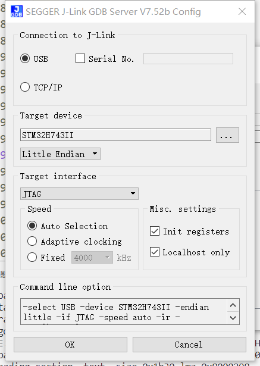

启动：

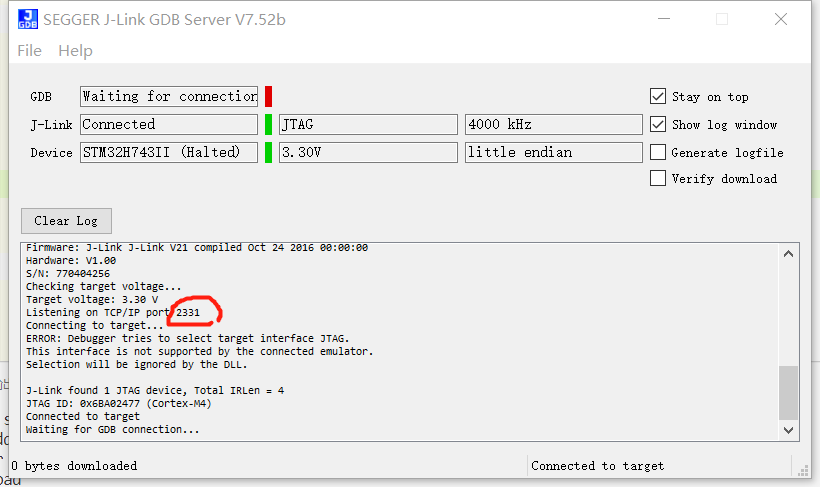

可以看到本地端口为**2331**，这个一会会用到；

然后就可以把这个窗口最小化了；

### 2、GDB调试

启动GDB程序：

```bash
arm-none-eabi-gdb.exe
```

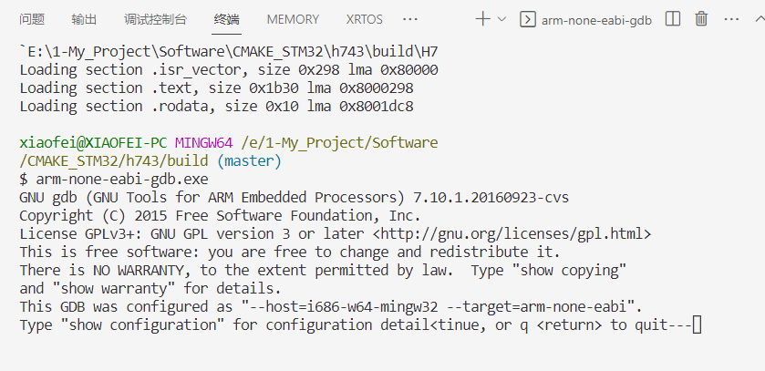

然后按enter自动进入调试模式；

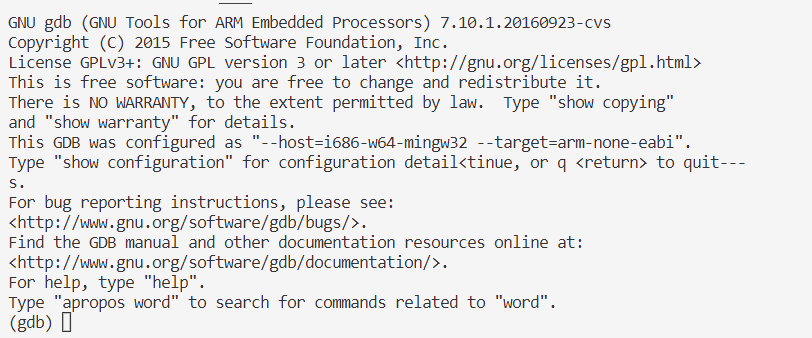

输入`file H743_demo.elf`加载调试文档：

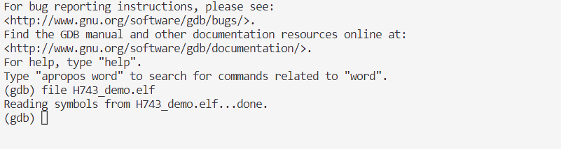

然后输入`target remote localhost:2331`，连接gdb server，连接成功后，会在Jlink GDB server中显示对应的状态，如下所示：

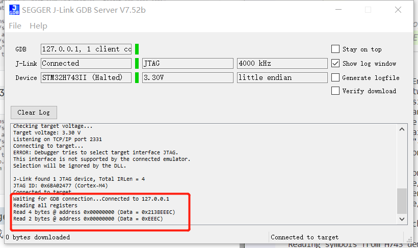

输入`monitor reset`来复位MCU，从而让MCU处于确定的状态：

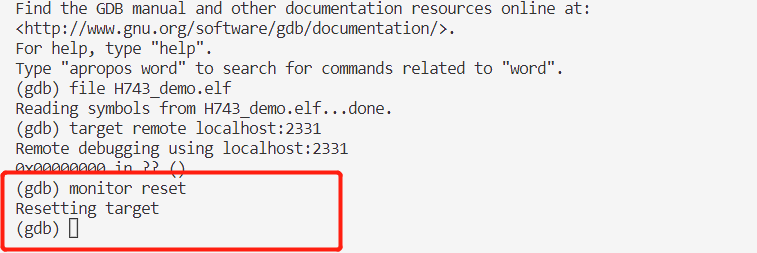

输入`load`往MCU中加载调试文档（是加载进flash,而不是ram），也就是常见的烧录过程：

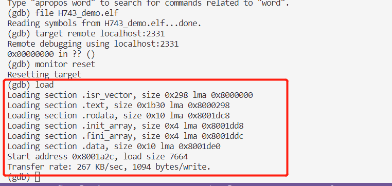

输入`break main`设置main断点，让MCU执行到main中停止：

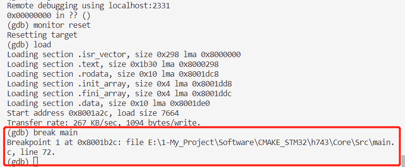

输入`c`持续运行直至运行到断点处：

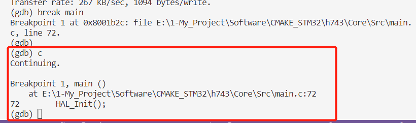

> **HAL_Init**();是main函数的第一行代码，停在这里；

再次输入`c`会继续运行；

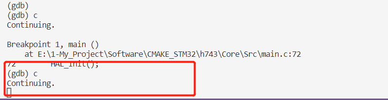

> 若要打断持续运行的状态，只需要按下`Ctrl+c`即可；

### 3、需要注意的地方

每次程序重新编译都要执行一次`load`以加载新的elf文档；

如果不使用命令行，而是使用VSCODE中的调试功能，则也需要在程序更新的时候重新`load`一次；

## 二、常用命令

### 1、p(打印)

> p+变量名：打印变量值：

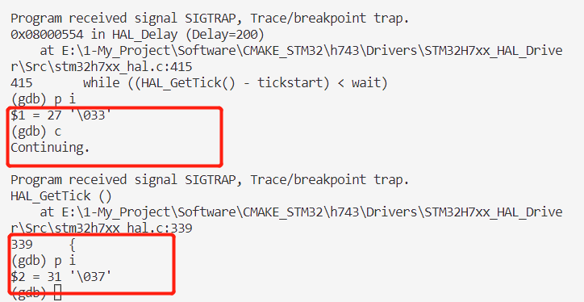

### 2、s(单步运行)

> s：单步运行；

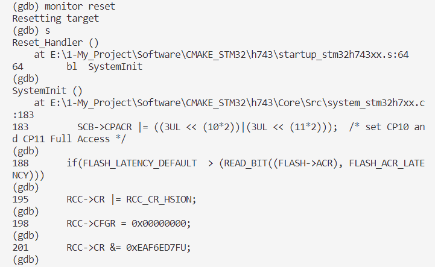

> 并且可以用 `breakpoint+行号`进行断点设置；

### 3、l(列出)

> 列出当前位置前后共5行程序；

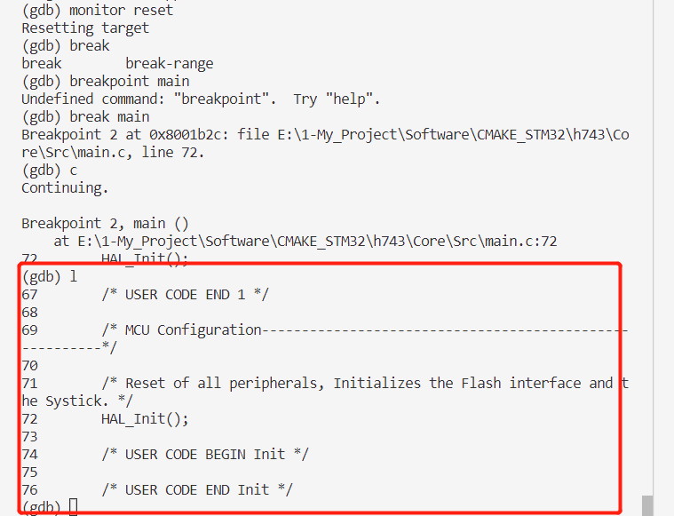

### 4、watch(变量监视)

Watchpoints 是用来告诉 **GDB** 停止执行某个程序的标记。Watchpoints 与数据相关联：放置监视点需要指定一个表达式来描述变量、多个变量或内存地址。

为数据 **change** (写) **放置**一个观察点：

```plaintext
(gdb) watch expression
```

使用描述您要监视的表达式替换 *expression*；对于变量，*expression* 等于变量的名称。

为数据 **access** (读) **放置**一个观察点：

```plaintext
(gdb) rwatch expression
```

要针对 **任何** 数据访问 **放置** 监视点（读取和写入）：

```plaintext
(gdb) awatch expression
```

**检查**所有观察点和断点的状态：

```plaintext
(gdb) info br
```

**删除**一个监视点：

```plaintext
(gdb) delete num
```

将 *num* 选项替换为 `info br` 命令报告的编号；

### 其他

可以参考这个链接：[https://blog.csdn.net/zhuwade/article/details/122473098；](https://blog.csdn.net/zhuwade/article/details/122473098；)

等我用到了，我再一个一个写；

## 三、使用VSCode进行辅助调试

参考：[https://www.fan-pengfei.top/2023/02/27/%E5%9F%BA%E4%BA%8ESTM32%E7%9A%84CMAKE%E6%A8%A1%E6%9D%BF/#more](https://www.fan-pengfei.top/2023/02/27/%E5%9F%BA%E4%BA%8ESTM32%E7%9A%84CMAKE%E6%A8%A1%E6%9D%BF/#more)
