> 这是一篇如何将LVGL移植到Arduino的教程(基于芯片ESP32 Pico D4)；

## 软件版本

**这次实验使用的lvgl版本是8.1.1，要先配置好tft_espi，确保显示正常；如果要使用触摸屏设备，在移植之前要确保能获取到触摸数据；**

## 工程配置

### 库安装

添加lvgl库 ，最好也添加lv_examples库，自带的例子虽然内容完全一样，但是并不能直接使用；

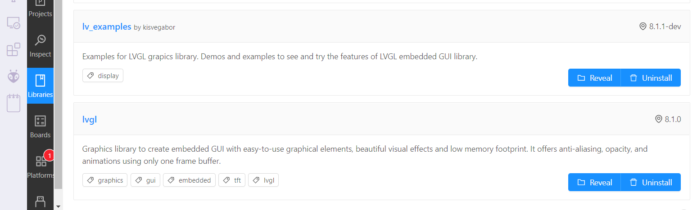

**库安装**

然后复制为lv_conf_template.h为lv_conf.h：

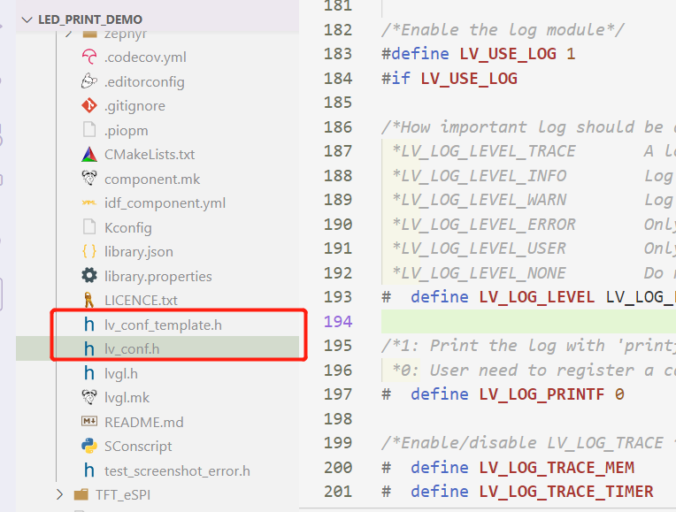

**lv_conf.h创建**

然后复制为lv_demo_conf_template.h为lv_demo_conf.h：

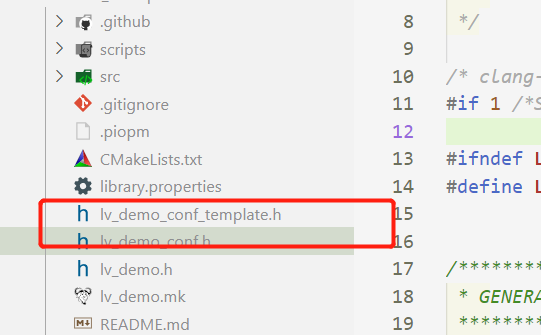

**lv_demo_conf.h创建**

### 配置文件

#### lv_conf.h

修改这几个地方；

启动lv_conf.h：

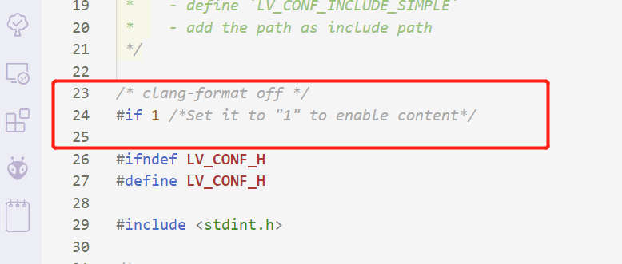
**启动lv_conf**

设置色深，一般都是16：

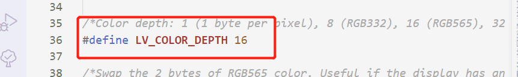
**设置色深**

启动自定义时钟，不设置的话只会显示第一帧不动：

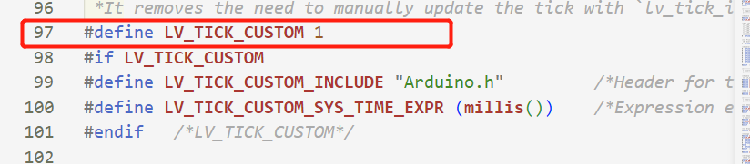
**启动自定义时钟**

 LV_DPI_DEF 注意这里，虽然LVGL的作者说这个没这么重要，但他会严重影响到LVGL的动画效果，你应该进行DPI的手动计算，例如240x280分辨率1.69英寸的屏幕，那么 DPI为：

LV\_DPI\_DEF =\frac{\sqrt{240*280} }{1.69} ≈ 153
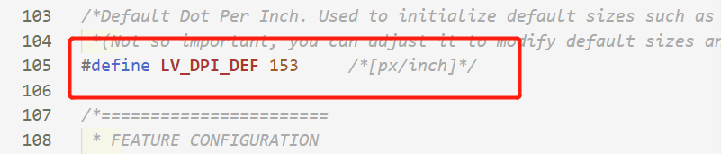

**LV_DPI_DEF配置**

也可以使能日志打印：

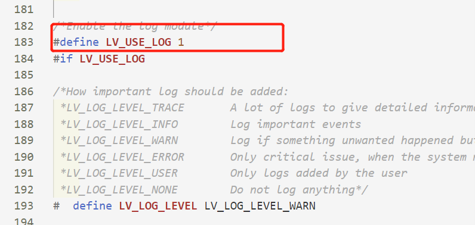

**使能日志打印**

#### lv_demo_conf.h

修改这几个地方；

启动lv_demo_conf.h：

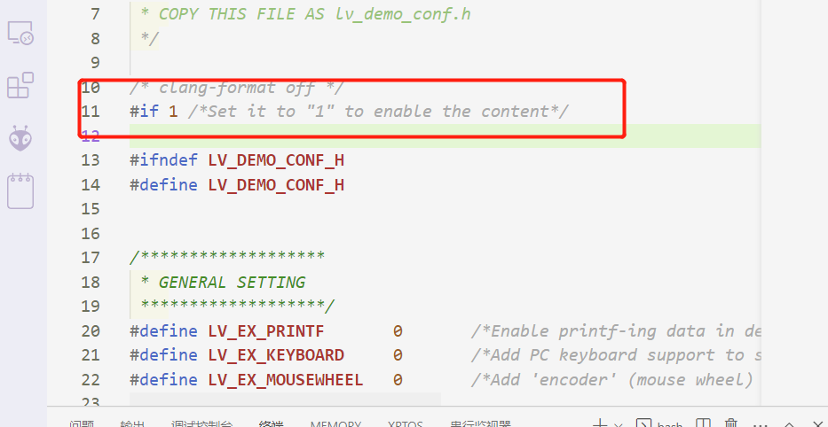

**启动Demo**

配置要运行的Demo：

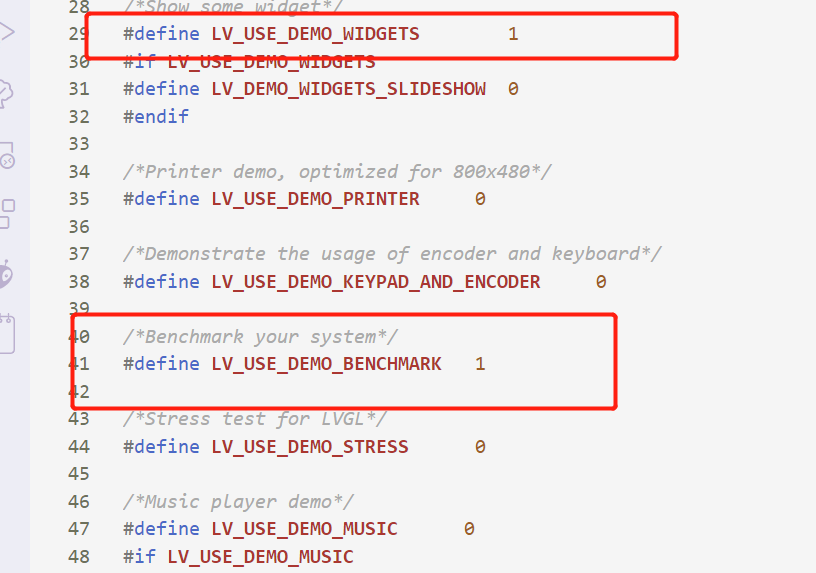
**Demo选择**

## 自定义显示接口和外部输入接口

### 文件添加

在src文件夹下添加以下两个文件：

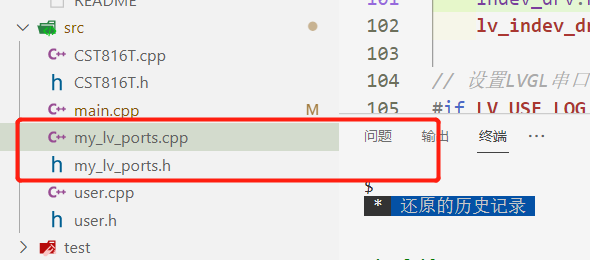
**自定义接口**

### 代码内容

`my_lv_ports.cpp`

```c
#include "my_lv_ports.h"
#include "CST816T.h"
// TFT_eSPI tft = TFT_eSPI(screenWidth, screenHeight); /* TFT instance */
TFT_eSPI tft = TFT_eSPI();     /* TFT instance */
CST816T touch(19, 21, -1, 22); // sda, scl, rst, irq

// /*Read the touchpad*/
void my_touchpad_read(lv_indev_drv_t *indev_driver, lv_indev_data_t *data)
{
    bool FingerNum = 0;
    uint8_t gesture;
    uint16_t touchX, touchY;
    FingerNum = touch.getTouch(&touchX, &touchY, &gesture);
    if (FingerNum)
    {
        data->state = LV_INDEV_STATE_REL;
        data->point.x = touchX;
        data->point.y = touchY;
#if LV_USE_LOG != 0
        Serial.printf("Touch: x=%d y=%d mode=%d\r\n", touchX, touchY, gesture);
#endif
        FingerNum = 0;
    }
    else
    {
        data->state = LV_INDEV_STATE_PR;
    }
}
/* Display flushing */
void my_disp_flush(lv_disp_drv_t *disp, const lv_area_t *area,
                   lv_color_t *color_p)
{
    uint32_t w = (area->x2 - area->x1 + 1);
    uint32_t h = (area->y2 - area->y1 + 1);

    tft.setSwapBytes(true);
    // tft.pushImageDMA(area->x1, area->y1, w, h, (uint16_t *)&color_p->full);
    tft.pushImage(area->x1, area->y1, w, h, (uint16_t *)&color_p->full);
    // tft.startWrite();
    // tft.setAddrWindow( area->x1, area->y1, w, h );
    // tft.pushColors( ( uint16_t * )&color_p->full, w * h, true );
    // tft.endWrite();

    lv_disp_flush_ready(disp);
}

#if LV_USE_LOG != 0
void my_print(const char *buf)
{
    Serial.printf("%s \r\n", buf);
}
#endif

void my_disp_init(void)
{
    // 绘图缓冲初始化
    //   static lv_disp_draw_buf_t draw_buf;
    //   static lv_color_t buf[screenWidth * 10];
    //   lv_disp_draw_buf_init(&draw_buf, buf, NULL, screenWidth * 10);

    static lv_disp_draw_buf_t draw_buf;
    static lv_color_t buf_2_1[screenWidth * 40]; /*A buffer for 10 rows*/
    static lv_color_t buf_2_2[screenWidth * 40]; /*An other buffer for 10
    rows*/
    lv_disp_draw_buf_init(&draw_buf, buf_2_1, buf_2_2,
                          screenWidth * 30); /*Initialize
                          the display buffer*/

    // TFT驱动初始化
    tft.begin(); /* TFT init */
    // tft.initDMA();
    tft.setRotation(0); /* Landscape orientation, flipped */

    // 设置LVGL显示设备
    static lv_disp_drv_t disp_drv;
    lv_disp_drv_init(&disp_drv);
    /*Change the following line to your display resolution*/
    disp_drv.hor_res = screenWidth;
    disp_drv.ver_res = screenHeight;
    disp_drv.flush_cb = my_disp_flush;
    disp_drv.draw_buf = &draw_buf;
    lv_disp_drv_register(&disp_drv);
    touch.begin();
    // 设置LVGL输入设备（电阻屏）
    static lv_indev_drv_t indev_drv;
    lv_indev_drv_init(&indev_drv);
    indev_drv.type = LV_INDEV_TYPE_POINTER;
    indev_drv.read_cb = my_touchpad_read;
    lv_indev_drv_register(&indev_drv);

// 设置LVGL串口输出设备（调试用）
#if LV_USE_LOG != 0
    lv_log_register_print_cb(my_print);
#endif
}
```

`my_lv_ports.h`

```c
#ifndef _MY_LV_PORTS
#define _MY_LV_PORTS
#include
#include

/*Change to your screen resolution*/
const uint16_t screenWidth = 240;
const uint16_t screenHeight = 280;
void my_disp_init(void); // 挂载lvgl接口，设置buffer
#endif
```

## 测试LVGL

### benchmark测试

`main.cpp`

```c
#include
#include
#include
#include
#include
#include "user.h"
#include
#include "CST816T.h"
void setup()
{
    Serial.begin(115200);
    LCD_Light_Set(50);//LCD亮度设置
    lv_init();//初始化LVGL
    my_disp_init();//初始化显示接口
    // lv_demo_widgets();
    lv_demo_benchmark();
    // lv_demo_keypad_encoder();
    // an encoder lv_demo_music();
    // lv_demo_printer();
    // lv_demo_stress();
    Serial.println("Setup done");
}
void loop()
{
    lv_timer_handler(); /* let the GUI do its work */
    delay(1);
}
```

运行结果；

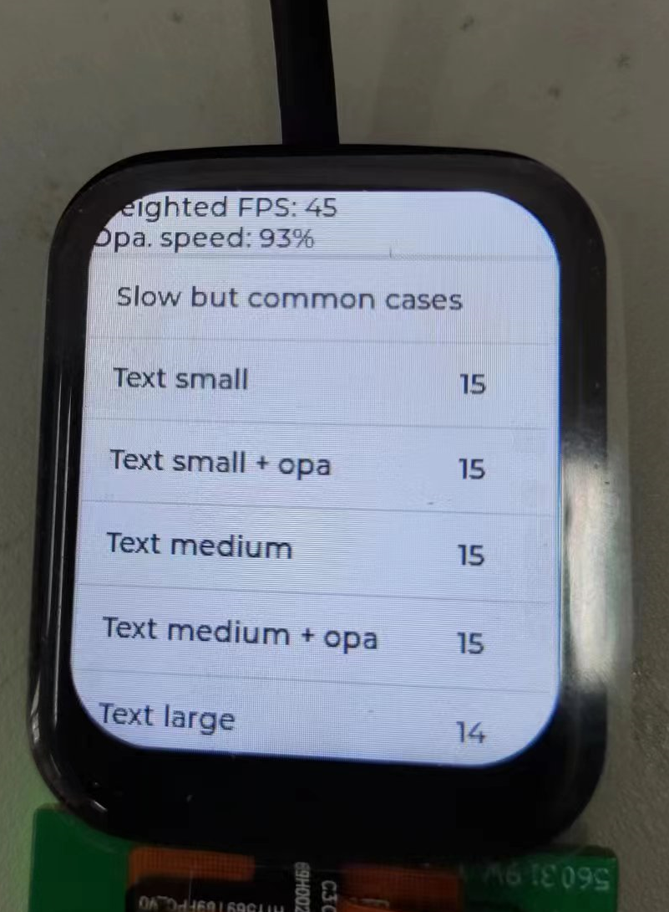

**运行结果**

> **可以看到LVGL正常运行；**
