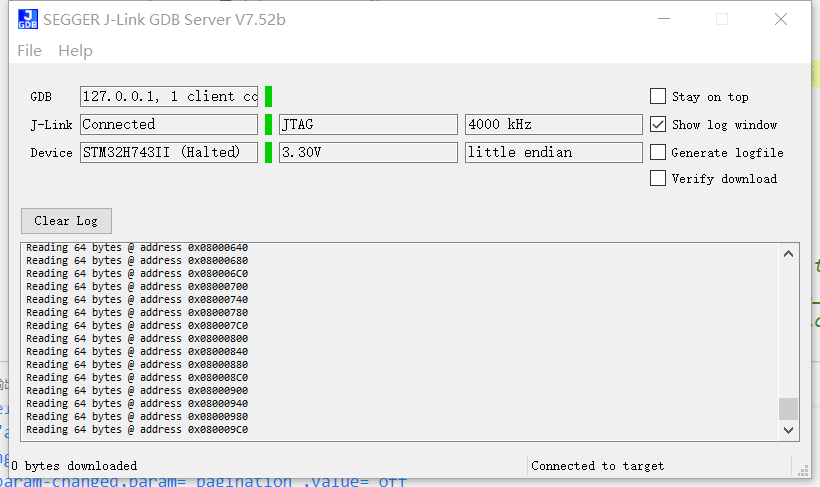
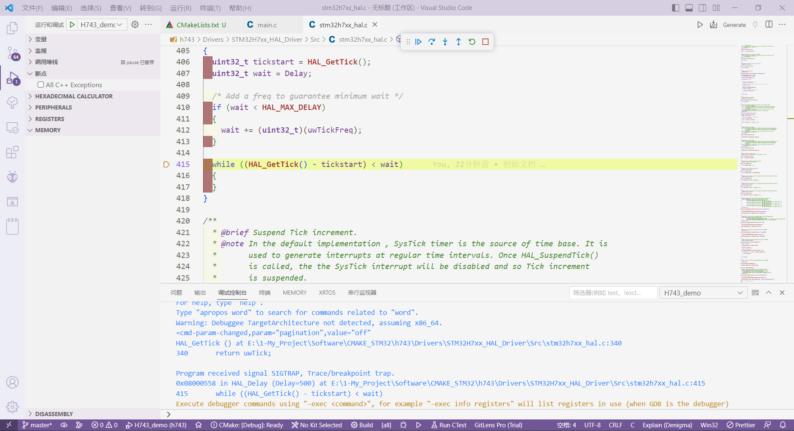

> 这是一个基于STM32单片机的模板；

示例中的单片机是**STM32H743IIT6**，调试器使用**JlinkOB**；

其中的各个参数可以参考使用**STM32CubeMX**生成的基于**makefile**的模板，且后续仍然可以使用**STM32CubeMX**进行底层代码的构建；

如果需要进行调试，可以先启动**J-Link GDB Server**，然后使用VSCode进行调试或者直接使用命令行进行调试；

```cmake
# CMAKE_SYSTEM_NAME: 即你目标机target所在的操作系统名称，比如ARM或者Linux你就需要写"Linux";
# 如果Windows平台你就写"Windows",如果你的嵌入式平台没有相关OS你即需要写成"Generic";
# 只有当CMAKE_SYSTEM_NAME这个变量被设置了，CMake才认为此时正在交叉编译;
# 它会额外设置一个变量CMAKE_CROSSCOMPILING为TRUE;
set(CMAKE_SYSTEM_NAME Generic)

# CMAKE_SYSTEM_NAME和CMAKE_SYSTEM_PROCESSOR是交叉编译的时候必须指定的两个参数;
# 如果在cmake命令行定义了CMAKE_SYSTEM_NAME,就必须也定义CMAKE_SYSTEM_PROCESSOR;
set(CMAKE_SYSTEM_PROCESSOR cortex-m7)

#cmake最低版本
cmake_minimum_required(VERSION 3.1.0)

#编译工具
set(CROSS_COMPILE_PREFIX arm-none-eabi)
# 顾名思义，即C语言编译器，这里可以将变量设置成完整路径或者文档名;
# 设置成完整路径有一个好处就是CMake会去这个路径下去寻找编译相关的其他工具;
# 比如linker,binutils等，如果你写的文档名带有arm-elf等等前缀;
# CMake会识别到并且去寻找相关的交叉编译器;
set(CMAKE_C_COMPILER ${CROSS_COMPILE_PREFIX}-gcc)
set(CMAKE_CXX_COMPILER ${CROSS_COMPILE_PREFIX}-g++)
set(CMAKE_ASM_COMPILER ${CROSS_COMPILE_PREFIX}-gcc)
set(CMAKE_OBJCOPY ${CROSS_COMPILE_PREFIX}-objcopy)
set(CMAKE_OBJDUMP ${CROSS_COMPILE_PREFIX}-objdump)
set(CMAKE_SIZE ${CROSS_COMPILE_PREFIX}-size)

# CMake中的命令find_program用于查找程序(program)
# 会将查找到的文档路径存在CMakeCache.txt中
find_program(ARM_SIZE_EXECUTABLE ${CROSS_COMPILE_PREFIX}-size)
find_program(ARM_GDB_EXECUTABLE ${CROSS_COMPILE_PREFIX}-gdb)
find_program(ARM_OBJCOPY_EXECUTABLE ${CROSS_COMPILE_PREFIX}-objcopy)
find_program(ARM_OBJDUMP_EXECUTABLE ${CROSS_COMPILE_PREFIX}-objdump)

set(CMAKE_TRY_COMPILE_TARGET_TYPE STATIC_LIBRARY)

# search for program/library/include in the build host directories
# 1、CMAKE_FIND_ROOT_PATH_MODE_PROGRAM: 对FIND_PROGRAM()起作用，
# 有三种取值，NEVER,ONLY,BOTH,
#   第一个表示不在你CMAKE_FIND_ROOT_PATH下进行查找，
#   第二个表示只在这个路径下查找，
#   第三个表示先查找这个路径，再查找全局路径，
# 对于这个变量来说，一般都是调用宿主机的程序，所以一般都设置成NEVER
#
# 2、CMAKE_FIND_ROOT_PATH_MODE_LIBRARY: 对FIND_LIBRARY()起作用，
# 表示在链接的时候的库的相关选项，因此这里需要设置成ONLY来保证我们的库是在交叉环境中找的.
#
# 3、CMAKE_FIND_ROOT_PATH_MODE_INCLUDE: 对FIND_PATH()和FIND_FILE()起作用，
# 一般来说也是ONLY,如果你想改变，一般也是在相关的FIND命令中增加option来改变局部设置
# 有NO_CMAKE_FIND_ROOT_PATH,ONLY_CMAKE_FIND_ROOT_PATH,BOTH_CMAKE_FIND_ROOT_PATH
set(CMAKE_FIND_ROOT_PATH_MODE_PROGRAM NEVER)
set(CMAKE_FIND_ROOT_PATH_MODE_LIBRARY ONLY)
set(CMAKE_FIND_ROOT_PATH_MODE_INCLUDE ONLY)
set(CMAKE_FIND_ROOT_PATH_MODE_PACKAGE ONLY)

#工程名称
# project命令用于指定cmake工程的名称
# 实际上，它还可以指定cmake工程的版本号（VERSION关键字）、
# 简短的描述（DESCRIPTION关键字）、
# 主页URL（HOMEPAGE_URL关键字）、
# 编译工程使用的语言（LANGUAGES关键字）。
project(H743_demo C CXX ASM)

set(target "${PROJECT_NAME}")
set(COMPILE_TOOLS  GCC)

# Target-specific flags
#型号
set(MCU_FAMILY STM32H743xx)
#布局文档
set(LINKER_SCRIPT ${CMAKE_CURRENT_SOURCE_DIR}/STM32H743IITx_FLASH.ld)
#内核相关
set(CPU "-mcpu=cortex-m7")
set(FPU "-mfpu=fpv5-d16")
set(FLOAT_ABI "-mfloat-abi=hard")

#宏定义
add_definitions(-DUSE_HAL_DRIVER -DSTM32H743xx)

# 构建Release或者Debug版本
if(CMAKE_BUILD_TYPE MATCHES Debug)
    set(DBG_FLAGS "-g3 -gdwarf-2 -O0")
elseif(CMAKE_BUILD_TYPE MATCHES Release)
    set(DBG_FLAGS "-O3")
endif()

##file语法,前一个参数是固定的 后面一个参数自己定义
##添加文档的时候注意 相对路径和绝对路径
file(GLOB_RECURSE DRIVE_SRC
    Drivers/STM32H7xx_HAL_Driver/Src/stm32h7xx_hal_cortex.c
    Drivers/STM32H7xx_HAL_Driver/Src/stm32h7xx_hal_rcc.c
    Drivers/STM32H7xx_HAL_Driver/Src/stm32h7xx_hal_rcc_ex.c
    Drivers/STM32H7xx_HAL_Driver/Src/stm32h7xx_hal_flash.c
    Drivers/STM32H7xx_HAL_Driver/Src/stm32h7xx_hal_flash_ex.c
    Drivers/STM32H7xx_HAL_Driver/Src/stm32h7xx_hal_gpio.c
    Drivers/STM32H7xx_HAL_Driver/Src/stm32h7xx_hal_hsem.c
    Drivers/STM32H7xx_HAL_Driver/Src/stm32h7xx_hal_dma.c
    Drivers/STM32H7xx_HAL_Driver/Src/stm32h7xx_hal_dma_ex.c
    Drivers/STM32H7xx_HAL_Driver/Src/stm32h7xx_hal_mdma.c
    Drivers/STM32H7xx_HAL_Driver/Src/stm32h7xx_hal_pwr.c
    Drivers/STM32H7xx_HAL_Driver/Src/stm32h7xx_hal_pwr_ex.c
    Drivers/STM32H7xx_HAL_Driver/Src/stm32h7xx_hal.c
    Drivers/STM32H7xx_HAL_Driver/Src/stm32h7xx_hal_i2c.c
    Drivers/STM32H7xx_HAL_Driver/Src/stm32h7xx_hal_i2c_ex.c
    Drivers/STM32H7xx_HAL_Driver/Src/stm32h7xx_hal_exti.c
    Drivers/STM32H7xx_HAL_Driver/Src/stm32h7xx_hal_tim.c
    Drivers/STM32H7xx_HAL_Driver/Src/stm32h7xx_hal_tim_ex.c
    Core/Src/system_stm32h7xx.c
    startup_stm32h743xx.s
)
file(GLOB_RECURSE USER_SRC
    Core/Src/main.c
    Core/Src/gpio.c
    Core/Src/stm32h7xx_it.c
    Core/Src/stm32h7xx_hal_msp.c
)
# 添加源文件
set(SOURCE_FILES  ${DRIVE_SRC} ${USER_SRC})
#添加头文件路径
include_directories(
    ${CMAKE_CURRENT_SOURCE_DIR}/Core/Inc
    ${CMAKE_CURRENT_SOURCE_DIR}/Drivers/STM32H7xx_HAL_Driver/Inc
    ${CMAKE_CURRENT_SOURCE_DIR}/Drivers/STM32H7xx_HAL_Driver/Inc/Legacy
    ${CMAKE_CURRENT_SOURCE_DIR}/Drivers/CMSIS/Device/ST/STM32H7xx/Include
    ${CMAKE_CURRENT_SOURCE_DIR}/Drivers/CMSIS/Include
)

#芯片特性
set(MCU_FLAGS "${CPU} -mthumb ${FPU} ${FLOAT_ABI}")
# compiler: language specific flags CFLAGS
set(CMAKE_C_FLAGS   "${MCU_FLAGS} -std=gnu99 -Wall -fdata-sections -ffunction-sections ${DBG_FLAGS} " CACHE INTERNAL "C compiler flags")
#CPP
set(CMAKE_CXX_FLAGS "${MCU_FLAGS} -fno-rtti -fno-exceptions -fno-builtin -Wall -fdata-sections -ffunction-sections ${DBG_FLAGS} " CACHE INTERNAL "Cxx compiler flags")
#ASFLAGS
set(CMAKE_ASM_FLAGS "${MCU_FLAGS} -x assembler-with-cpp ${DBG_FLAGS} " CACHE INTERNAL "ASM compiler flags")
#LDFLAGS -mcpu=cortex-m0plus -mthumb
set(CMAKE_EXE_LINKER_FLAGS "${MCU_FLAGS} --specs=nosys.specs -specs=nano.specs -T${LINKER_SCRIPT} -Wl,-Map=${PROJECT_NAME}.map,--cref -Wl,--gc-sections" CACHE INTERNAL "Exe linker flags")
#要链接的库 对应makefile的 LIBS
set(CMAKE_SHARED_LIBRARY_LINK_C_FLAGS "-lc -lm -lnosys" CACHE INTERNAL "Shared linker flags")

#先定义target 才可以添加define include
add_executable(${target}.elf ${SOURCE_FILES})

set(ELF_FILE ${PROJECT_BINARY_DIR}/${target}.elf)
set(HEX_FILE ${PROJECT_BINARY_DIR}/${target}.hex)
set(BIN_FILE ${PROJECT_BINARY_DIR}/${target}.bin)

add_custom_command(TARGET "${target}.elf" POST_BUILD
    COMMAND ${CMAKE_OBJCOPY} -Obinary ${ELF_FILE} ${BIN_FILE}
    COMMAND ${CMAKE_OBJCOPY} -Oihex  ${ELF_FILE} ${HEX_FILE}
    COMMENT "Building ${target}.bin and ${target}.hex"

    COMMAND ${CMAKE_COMMAND} -E copy ${HEX_FILE} "${CMAKE_CURRENT_BINARY_DIR}/${target}.hex"
    COMMAND ${CMAKE_COMMAND} -E copy ${BIN_FILE} "${CMAKE_CURRENT_BINARY_DIR}/${target}.bin"

    COMMAND ${CMAKE_SIZE} --format=berkeley ${target}.elf ${target}.hex
    COMMENT "Invoking: Cross ARM GNU Print Size"
)
```

使用方式：

```bash
mkdir build
cd build/
#cmake .. 	#在Linux平台下
cmake -G "MinGW Makefiles" .. #在windows平台下
make -j     #多线程编译
```

使用VSCode进行调试的`launch.json`文件如下所示：

```json
{
    "version": "0.2.0",
    "configurations": [
        {
            "name": "H743_demo",
            "type": "cppdbg",
            "request": "launch",
            "program": "${workspaceFolder}/build/H743_demo.elf",
            "args": [],
            "stopAtEntry": false,
            "cwd": "${workspaceFolder}",
            "environment": [],
            "externalConsole": false,
            "MIMode": "gdb",
            "miDebuggerPath": "D:\\Program Files (x86)\\GNU Tools ARM Embedded\\5.4 2016q3\\bin\\arm-none-eabi-gdb.exe",
            "miDebuggerServerAddress": "localhost:2331"
            "setupCommands": [
                {
                    "description": "为 gdb 启用整齐打印",
                    "text": "-enable-pretty-printing",
                    "ignoreFailures": true
                }
            ],
        }
    ]
}
```

最后成功进行调试：





> 若要使用`printf`或者`sprintf`函数，需要自己底层实现一些函数；

例如使用`printf`:

```c
#ifdef __GNUC__
#define PUTCHAR_PROTOTYPE int __io_putchar(int ch)
int _write(int fd, char *pBuffer, int size)
{
    HAL_UART_Transmit(&huart1, (uint8_t *)pBuffer, size, 0xFFFF);
    return size;
}
#else
#define PUTCHAR_PROTOTYPE int fputc(int ch, FILE *f)
PUTCHAR_PROTOTYPE
{
    HAL_UART_Transmit(&huart1, (uint8_t *)&ch, 1, 0xFFFF);
    return ch;
}
#endif
```
