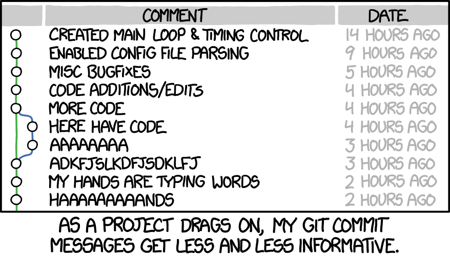

> 翻译的一篇文章；
>   **Commit messages matter. Here’s how to write them well.**
>   提交的备注信息很重要，这里将教给你如何写好它们.



## 简介：为什么好的提交信息很重要

如果你随机浏览任何一个 Git 存储库的日志，你可能会发现它的提交消息或多或少是一团糟。

例如，下面是我早期致力于 Spring 时的提交信息：

```shell
$ git log --oneline -5 --author cbeams --before "Fri Mar 26 2009"
e5f4b49 Re-adding ConfigurationPostProcessorTests after its brief removal in r814. @Ignore-ing the testCglibClassesAreLoadedJustInTimeForEnhancement() method as it turns out this was one of the culprits in the recent build breakage. The classloader hacking causes subtle downstream effects, breaking unrelated tests. The test method is still useful, but should only be run on a manual basis to ensure CGLIB is not prematurely classloaded, and should not be run as part of the automated build.
2db0f12 fixed two build-breaking issues: + reverted ClassMetadataReadingVisitor to revision 794 + eliminated ConfigurationPostProcessorTests until further investigation determines why it causes downstream tests to fail (such as the seemingly unrelated ClassPathXmlApplicationContextTests)
147709f Tweaks to package-info.java files
22b25e0 Consolidated Util and MutableAnnotationUtils classes into existing AsmUtils
7f96f57 polishing
```

啊哈，然后将其与来自同一存储库的这些最近的提交进行比较：

```shell
$ git log --oneline -5 --author pwebb --before "Sat Aug 30 2014"
5ba3db6 Fix failing CompositePropertySourceTests
84564a0 Rework @PropertySource early parsing logic
e142fd1 Add tests for ImportSelector meta-data
887815f Update docbook dependency and generate epub
ac8326d Polish mockito usage
```

你会觉得哪个更容易阅读一些呢？

> 前者的长度和形式各不相同；后者简洁一致。  前者是默认情况下发生的（未进行润色）；后者是有意进行书写的（进行了润色）。

虽然许多存储库的日志看起来更像前者；但也有例外， Linux 内核和 Git 本身就是很好的例子。查看 Spring Boot，或 Tim Pope 管理的任何存储库。

这些存储库的贡献者知道，精心设计的 Git 提交消息是向其他开发人员（以及他们未来的自己）传达有关更改的上下文的最佳方式。差异会告诉你代码发生了什么变化，但只有提交消息才能正确告诉你原因。 Peter Hutterer 很好地说明了这一点：

> 重新去理解一段代码的上下文关系是一种浪费；虽然我们不能完全避免它，但是我们的努力应该去尽可能地减少它。一个好的提交消息可以做到这一点，因此，提交消息表明了一个开发人员是否是一个好的合作者。

如果你没有考虑过什么是好的 Git 提交消息，可能是因为你没有花太多时间使用 `git log` 和相关工具。这里有一个恶性循环：因为提交历史是非结构化和不一致的，所以人们不会花太多时间使用或照顾它。而且因为它没有被使用或照顾，所以它仍然是非结构化和不一致的。

但是精心照料的日志是一件美丽而有用的东西。 `git blame`、`revert`、`rebase`、`log`、`shortlog`和其他子命令变得生动起来。审查其他人的提交和拉取请求成为一件值得做的事情，并且突然可以独立完成。了解为什么几个月或几年前发生的事情不仅可能而且有效。

一个项目的长期成功取决于（除其他外）它的可维护性，维护者没有比他的项目日志更强大的工具了。花时间学习如何正确维护一个日志是值得的。一开始可能很麻烦的事情很快就会变成习惯，并最终成为所有相关人员的骄傲和生产力的源泉。

在这篇文章中，我只讨论保持健康提交历史的最基本要素：如何编写单独的提交消息。还有其他一些重要的实践，比如提交压缩，我没有在这里讨论。也许我会在随后的帖子中这样做。

大多数编程语言都有关于什么构成惯用风格的既定约定，即命名、格式等。当然，这些约定会有所不同，但大多数开发人员都认为，选择一个并坚持它比每个人都做自己的事情时随之而来的混乱要好得多。

团队处理其提交日志的方法应该没有什么不同。为了创建有用的修订历史记录，团队应该首先就提交消息约定达成一致，该约定至少定义以下三件事：

**风格**：

标记语法、换行边距、语法、大写、标点符号。把这些事情拼写出来，消除猜测，让一切尽可能简单。最终结果将是一个非常一致的日志，它不仅阅读起来很愉快，而且确实会定期阅读。

**内容：**

提交消息的正文（如果有的话）应该包含什么样的信息？它不应该包含什么？

**元数据：**

应该如何引用问题跟踪 ID、拉取请求编号等？

幸运的是，对于什么是地道的 Git 提交消息，有一些完善的约定。事实上，其中许多都是以某些 Git 命令的方式假设的。你无需重新发明任何东西。只需遵循以下七个规则，你就可以像专业人士一样投入工作。

## Git 提交信息的七大规则：

> 请记住：这一切都已经说过了。

1、用空行将主题与正文分开；

2、将主题行限制为 50 个字符；

3、大写主题行；

4、不要以句号结束主题行；

5、在主题行中使用祈使语气；

6、将正文包裹在 72 个字符处；

7、使用主体来解释什么以及为什么与如何；

**例如：**

```shell
Summarize changes in around 50 characters or less

More detailed explanatory text, if necessary. Wrap it to about 72
characters or so. In some contexts, the first line is treated as the
subject of the commit and the rest of the text as the body. The
blank line separating the summary from the body is critical (unless
you omit the body entirely); various tools like `log`, `shortlog`
and `rebase` can get confused if you run the two together.

Explain the problem that this commit is solving. Focus on why you
are making this change as opposed to how (the code explains that).
Are there side effects or other unintuitive consequences of this
change? Here's the place to explain them.

Further paragraphs come after blank lines.

 - Bullet points are okay, too

 - Typically a hyphen or asterisk is used for the bullet, preceded
   by a single space, with blank lines in between, but conventions
   vary here

If you use an issue tracker, put references to them at the bottom,
like this:

Resolves: #123
See also: #456, #789
1. Separate subject from body with a blank line
```

### 用空行将主题与正文分开

> 虽然不是必需的，但最好以一个简短的（少于 50 个字符）行开始提交消息，总结更改，然后是一个空行，然后是更详尽的描述。提交消息中直到第一个空行的文本被视为提交标题，并且该标题在整个 Git 中使用。例如，Git-format-patch(1) 将提交转换为电子邮件，并在主题行中使用标题，在正文中使用提交的其余部分。

首先，并非每个提交都需要主题和主体。有时单行就可以了，尤其是当更改非常简单以至于不需要进一步的上下文时。例如：

```shell
Fix typo in introduction to user guide
```

无需多说；如果读者想知道拼写错误是什么，她可以简单地查看更改本身，即使用 `git show` 或 `git diff` 或 `git log -p`。
如果你在命令行提交这样的东西，很容易使用 `git commit` 的 `-m` 选项：

```shell
$ git commit -m “修复用户指南介绍中的拼写错误”
```

但是，当提交需要一些解释和上下文时，你需要编写一个正文。例如：

```shell
Derezz the master control program

MCP turned out to be evil and had become intent on world domination.
This commit throws Tron's disc into MCP (causing its deresolution)
and turns it back into a chess game.
```

使用 -m 选项编写带有正文的提交消息并不那么容易。你最好在适当的文本编辑器中编写消息。如果你还没有为在命令行中使用 Git 而设置的编辑器，请阅读 Pro Git 的这一部分。
无论如何，在浏览日志时将主题与正文分开是有好处的。这是完整的日志条目：

```shell
$ git log
commit 42e769bdf4894310333942ffc5a15151222a87be
Author: Kevin Flynn
Date:   Fri Jan 01 00:00:00 1982 -0200

 Derezz the master control program

 MCP turned out to be evil and had become intent on world domination.
 This commit throws Tron's disc into MCP (causing its deresolution)
 and turns it back into a chess game.
```

现在 `git log --oneline`，它只打印出主题行：

```shell
$ git log --oneline
42e769 Derezz the master control program
```

或者，`git shortlog`，它按用户分组提交，同样只显示简洁的主题行：

```shell
$ git shortlog
Kevin Flynn (1):
      Derezz the master control program

Alan Bradley (1):
      Introduce security program "Tron"

Ed Dillinger (3):
      Rename chess program to "MCP"
      Modify chess program
      Upgrade chess program

Walter Gibbs (1):
      Introduce protoype chess program
```

在 Git 中还有许多其他上下文，其中主题行和正文之间的区别开始出现——但如果没有中间的空行，它们都无法正常工作。

### 将主题行限制在 50 个字符以内

50 个字符不是硬性限制，只是一个经验法则。将主题行保持在这个长度可以确保它们的可读性，并迫使作者思考一下以最简洁的方式来解释正在发生的事情。

> 提示：如果你很难总结，你可能在一次提交中提交了太多更改，争取原子提交（一个单独更改的主题）。

GitHub 的 UI 完全了解这些约定。如果你超过 50 个字符的限制，它会警告你：


并将用省略号截断任何超过 72 个字符的主题行：


50个字符可能太短了，但最多不要超过72个字符。

### 大写主题行

这听起来很简单。所有主题行都以大写字母开头。
例如：

- Accelerate to 88 miles per hour

而不是：

- Accelerate to 88 miles per hour

### 不要以句号结束主题行

主题行中不需要尾随标点符号。此外，当你试图将它们控制在 50 个字符或更少时，空间非常宝贵。
例子：

- Open the pod bay doors

而不是：

- Open the pod bay doors.

### 在主题行中使用祈使语气

祈使语气就是“口头或书面上发出命令或指示”。几个例子：

- Clean your room

- Close the door

- Take out the trash

你现在正在阅读的七个规则中的每一个都是用祈使语气写的（“将正文包裹在 72 个字符处”，等等）。
祈使语气听起来有点粗鲁；这就是为什么我们不经常使用它。但它非常适合 Git 提交主题行。

原因之一是 Git 本身在代表你创建提交时就使用祈使语气。

例如，使用 `git merge` 时创建的默认消息是：

```shell
Merge branch 'myfeature'
```

当使用 `git revert` 时：

```shell
Revert "Add the thing with the stuff"

This reverts commit cc87791524aedd593cff5a74532befe7ab69ce9d.
```

或者在 GitHub 拉取请求上单击“合并”按钮时：

```shell
Merge pull request #123 from someuser/somebranch
```

因此，当你以祈使语气编写提交消息时，你就是在遵循 Git 自己的内置约定。例如：

- Refactor subsystem X for readability

- Update getting started documentation

- Remove deprecated methods

- Release version 1.0.0

以这种方式编写一开始可能有点尴尬。我们更习惯于以指示性语气说话，这都是关于报告事实的。这就是为什么提交消息通常最终会像这样阅读：

- Fixed bug with Y

- Changing behavior of X

有时提交消息被写成对其内容的描述：

- More fixes for broken stuff

- Sweet new API methods

为了消除任何混淆，这里有一个简单的规则，每次都正确。
格式正确的 Git 提交主题行应该始终能够完成以下句子：

- If applied, this commit will *your subject line here

例如：

- If applied, this commit will *refactor subsystem X for readability*

- If applied, this commit will *update getting started documentation*

- If applied, this commit will *remove deprecated methods*

- If applied, this commit will *release version 1.0.0*

- If applied, this commit will *merge pull request #123 from user/branch*

请注意这对其他非祈使语气形式不起作用：

- If applied, this commit will *fixed bug with Y*

- If applied, this commit will *changing behavior of X*

- If applied, this commit will *more fixes for broken stuff*

- If applied, this commit will *sweet new API methods*

> 记住：祈使语气的使用仅在主题行中很重要。你可以在编写正文时放宽此限制。

### 将正文包裹在72个字符处

Git 从不自动换行文本。当你编写提交消息的正文时，你必须注意它的右边距，并手动换行。

建议以 72 个字符执行此操作，以便 Git 有足够的空间来缩进文本，同时仍将所有内容总体保持在 80 个字符以下。

一个好的文本编辑器可以在这里提供帮助。很容易配置 Vim，例如，在你编写 Git 提交时将文本换行为 72 个字符。然而，传统上，IDE 在为提交消息中的文本换行提供智能支持方面一直很糟糕（尽管在最近的版本中，IntelliJ IDEA 终于在这方面做得更好）。

### 用主体部分来解释what、why vs. how

Bitcoin Core 的这个提交是一个很好的例子，它解释了修改的内容和原因：

```shell
commit eb0b56b19017ab5c16c745e6da39c53126924ed6
Author: Pieter Wuille

Date:   Fri Aug 1 22:57:55 2014 +0200

   Simplify serialize.h's exception handling

   Remove the 'state' and 'exceptmask' from serialize.h's stream
   implementations, as well as related methods.

   As exceptmask always included 'failbit', and setstate was always
   called with bits = failbit, all it did was immediately raise an
   exception. Get rid of those variables, and replace the setstate
   with direct exception throwing (which also removes some dead
   code).

   As a result, good() is never reached after a failure (there are
   only 2 calls, one of which is in tests), and can just be replaced
   by !eof().

   fail(), clear(n) and exceptions() are just never called. Delete
   them.
```

看看完整的差异，想想作者通过花时间在这里和现在提供这个上下文来节省同事和未来的提交者多少时间。如果他不这样做，它可能会永远丢失。

在大多数情况下，你可以省略有关如何进行更改的详细信息。在这方面，代码通常是不言自明的（如果代码太复杂以至于需要用更多文字来解释，那是代码注释的目的）。只需专注于弄清楚你最初进行更改的原因——更改之前的工作方式（以及其中的问题）、它们现在的工作方式以及你决定按照你的方式解决问题的原因。

未来感谢你的维护者可能就是你自己！

## Tips

**学会爱上命令行。抛弃IDE。**

出于与 Git 子命令一样多的原因，拥抱命令行是明智的。 Git 非常强大； IDE 也是如此，但各有不同的方式。我每天都使用一个 IDE (IntelliJ IDEA) 并广泛使用其他 IDE (Eclipse)，但我从未见过 Git 的 IDE 集成可以开始与命令行的易用性和强大功能相匹配（一旦你熟悉它）。

某些与 Git 相关的 IDE 功能非常宝贵，例如在删除文件时调用 `git rm`，以及在重命名文件时使用 `git`做正确的事情。当你开始尝试通过 IDE `commmit`， `merge`， `rebase`或进行复杂的历史分析时，一切都会崩溃。

当谈到使用 Git 的全部功能时，它一直都是指命令行。

请记住，无论你使用 Bash、Zsh 还是 Powershell，都有tab补全命令可以减轻你记住子命令和其他用法的痛苦。
