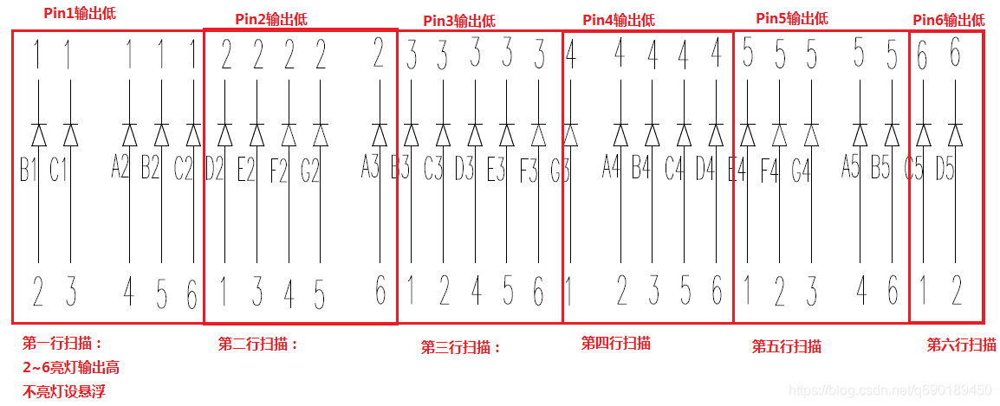

> 尽量用较少的IO口来驱动较多的LED灯；

当IO口数量较少，而又需要驱动较多的LED灯时，就需要想办法通过修改硬件或者软件的方案来进行；

硬件方案的话，就是用串转并芯片例如74HC595或者其他的数码管驱动芯片来控制，当然会增加硬件成本，如果只是用在个人项目中，小小的成本增加并没有什么，但是如果是用在量产项目中，小小的成本增加就会吃掉一大部分盈利；

所以尽量还是使用软件方案，并不需要什么74HC595芯片；

下面介绍的这种方法叫做查理复用：

> 查理复用（Charlieplex）是一种在驱动大量LED时有效地节约IO口的方法，理论上可以用N个IO驱动`N*(N-1)`个LED，也有接入二极管用来做按键检测的，理论上可实现用N个IO驱动`N*(N-1)`个按键；  因而7个脚用满理论上可管理是42个LED，极大节省了IO口的使用；

**但是对单片机的IO口有一个要求，也就是这种LED是由单片机I/O口直接驱动，I/O口要在工作在3态（高、低电平和高阻）；**

使用六个IO口驱动30个LED的原理图如下（第六行并未完整画出）：

> 可以在程序里面每次间隔1ms，扫描一行，总共扫描6行后（6ms），一帧完整就画面结束了，也是利用人眼的视觉暂留画面；
> 一定要记得，**每行扫描的时候，需要亮灯的高低电平点亮，不亮灯的IO口一定要设为悬浮（高阻模式）。**
