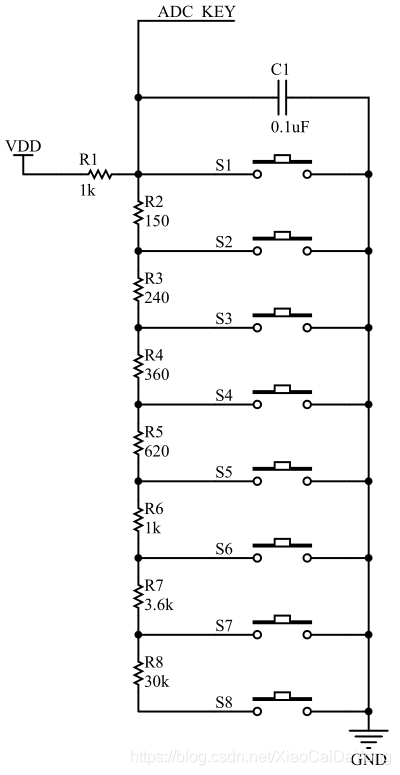
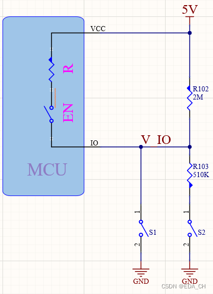
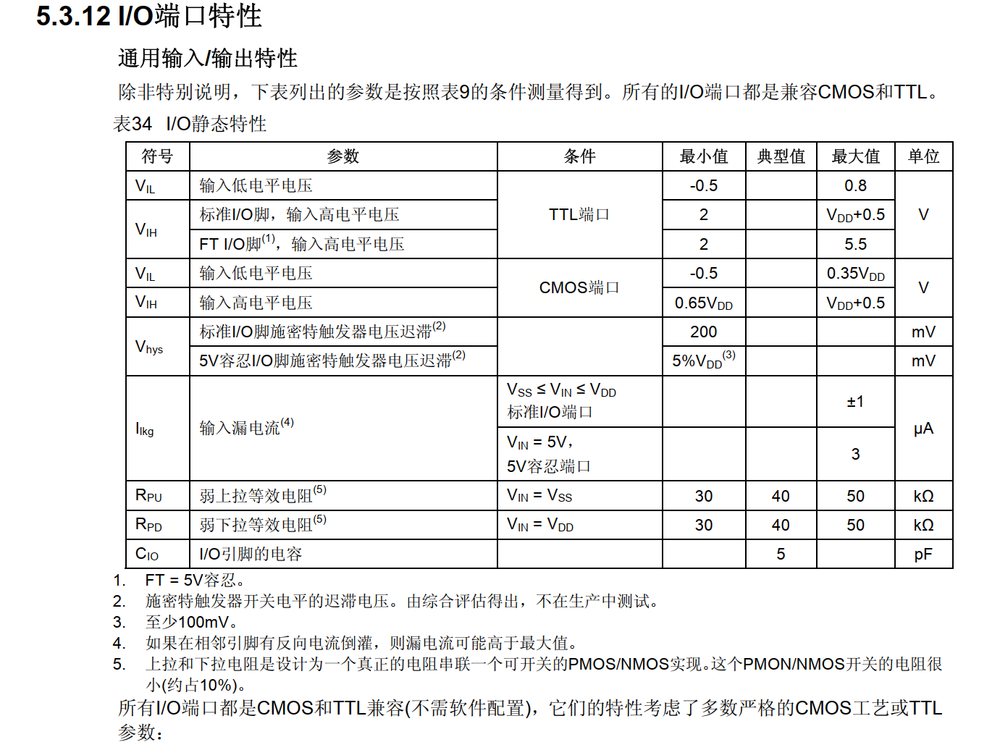

> ## 用单个IO口来检测两个按键的状态；

## 一、ADC方案



上面是原理图，这个方案很好理解，主要就是利用电阻分压原理来判断多个按键被按下的状态，如果ADC的位数足够多，可以判断的按键数也会很多；

因为原理很简单，在这里就不再多说；

## 二、非ADC方案

这个方案适用于无ADC引脚或者ADC引脚被其他外设占用的情况，只以单IO口检测两个按键的状态的方案为例；

### 原理图如下所示：



EN是单片机内部的上拉使能开关，S1和S2是待检测的按键；

通过查阅STM32F103C8T6数据手册可以得知：



内部的上拉电阻阻值等效为40K欧姆电阻，高低电平的范围也在数据手册中有给出：

当MCU供电为3.3V时候：

- IO口低电平电压范围：-0.5-0.8V；

- IO口高电平电压范围： 2.0-3.8V；

因此得到最开始的检测电路；但有两个注意事项：

- 这里特别要注意在使用该电路时，电路参数须满足MCU的IO口高低电平的电气特性要求；

- 电路如果需要具备两个按键同时按的功能要求，需自行调整电路，该电路参数不满足该要求；

### 电路分析如下：

- 当EN 闭合时：
S1 按下时， V_IO 接近0V，此时IO口为低电平。
S2 按下时， V_IO = 3.3V * R103 / (R+R103)
V_IO = 3.3V * 510K/ (510K+（40K//2M）) = 3.06V
此时IO口为高电平。

- 当EN 断开时：
S1 按下时， V_IO 接近0V，此时IO口为低电平。
S2 按下时， V_IO = 3.3V * R103 / (R+R103)
V_IO = 3.3V * 510K/ (510K+ 2M) = 0.67V
此时IO口为低电平。

MCU检测过程：

- EN闭合->如果IO口为低电平->此时判定为S1按下；

- EN断开->如果IO口为低电平->此时判定为S2按下（此时S1不能被按下）；

只有三种情况：

S1
S2

0
0

1
0

0
1

### 伪代码如下：

```c
EN=1;//使能上拉电阻
if(IO==0)//如果IO口检测为0，判定为S1被按下
{
    S1=1;
}
else//其他情况，S1未被按下
{
    S1=0;
}
EN=0;//取消使能上拉电阻
if(IO==0)//如果IO口检测为0，判定为S1或S2被按下
{
    if(S1==1)//如果S1被按下，则S2未被按下，否则S2被按下
    {
        S2=0;
    }
    else
    {
        S2=0;
    }
}
else//其他情况，S2未被按下
{
    S2=0;
}
```
