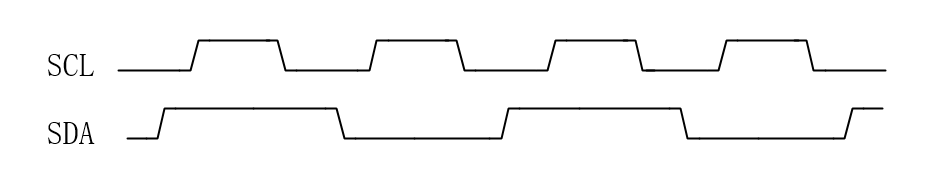
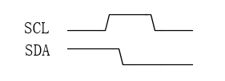
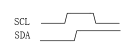
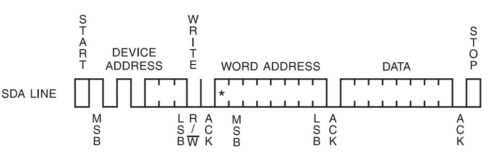
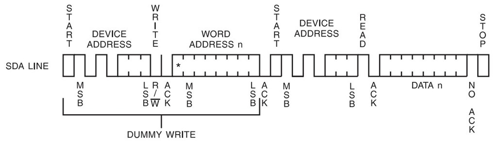
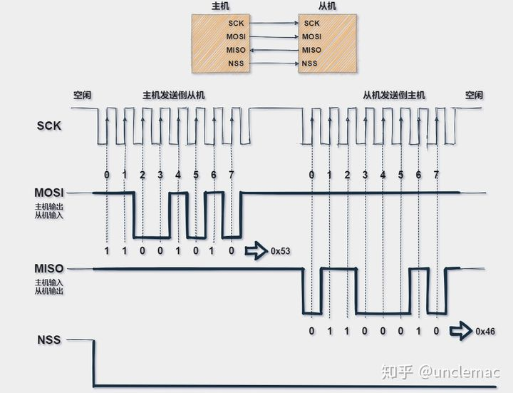
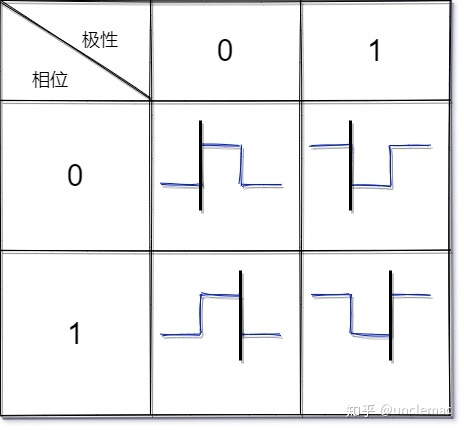
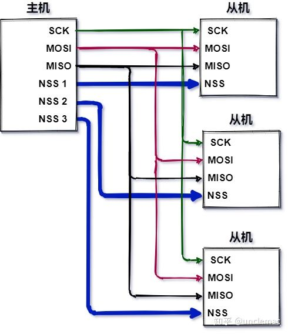
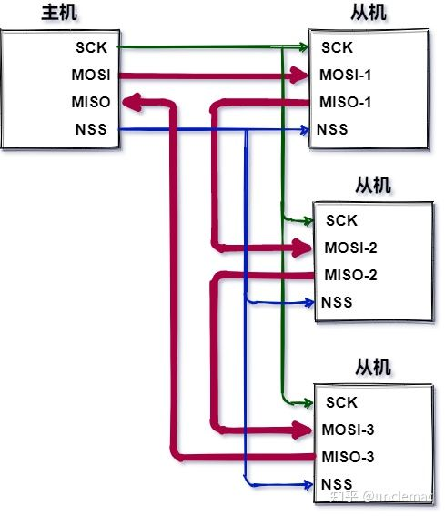
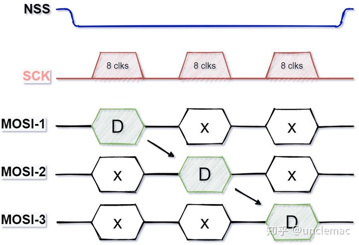

> 常用通讯协议(SPI、IIC、UART)；

## 一、USART和UART:

USART:通用同步异步收发器，USART是一个串行通信设备，可以灵活地与外部设备进行全双工数据交换。

UART: 通用异步收发器，异步串行通信口(UART)就是我们在嵌入式中常说的串口，它还是一种通用的数据通信议。

异步通讯时二者无区别，同步通讯时USART可以提供主动时钟。

均为全双工通信。

> 起始位：先发出一个逻辑”0”的信号，表示传输数据的开始。
> 数据位：传输N bits。
> 校验位(可选)：数据位加上这一位后，使得“1”的位数应为偶数(偶校验)或奇数(奇校验)，以此来校验数据传送的正确性。
> 如传输“A”(01000001)为例,”A”字符的8个bit位中有两个1。当为奇数校验时该位为1；当为偶数校验时该位为0。
> 停止位：它是一帧数据的结束标志。可以是1bit、1.5bit、2bit的空闲电平。
> 空闲位：没有数据传输时线路上的电平状态。为逻辑1。
> 传输方向：即数据是从高位(MSB)开始传输还是从低位(LSB)开始传输。比如传输“A”如果是MSB那么就是01000001，如果是LSB那么就是10000010
> 帧间隔：即传送数据的帧与帧之间的间隔大小，可以以位为计量也可以用时间(知道波特率那么位数和时间可以换算)。比如传送”A”完后，这为一帧数据，再传”B”，那么A与B之间的间隔即为帧间隔。
> 波特率定义：有效数据信号调制载波的速率，每秒传输1或0的个数；
> 例如：串口传输速率为9600bps，每秒可传输多少字节？
> 起始位：1    数据位：8
> 停止位：1    校验位：0
> 传输1字节数据，需要传输10bit，因此：
> 9600 ÷ 10 = **960Byte**

## 二、IIC通讯协议：

IIC协议为半双工协议。

全双工指在发送数据的同时也能够接收数据；

半双工就是指一个时间段内只有一个动作发生；

数据有效传输在scl信号的高电平期间，sda数据线保持稳定，在scl为低电平时允许sda数据线变化。

起始条件在scl为高电平期间，sda出现下降沿，则为起始信号。

结束条件在scl为高电平期间，sda出现上升沿，则为结束信号。

> 注意：注意起始和终止信号都是由主机发出的，总线在起始条件之后，视为忙状态，在停止条件之后被视为空闲状态。
> 应答（ACK，Acknowledgement）。即确认字符，在数据通信中，接收站发给发送站的一种传输类控制字符。主机每向从机发送完一个字节的数据，主机总是需要等待从机给出一个应答信号，来确认从机是否成功接收到了数据，从机应答主机所需要的时钟也是由主机提供的，应答出现在每一次主机完成8个数据位传输后紧跟着的时钟周期，低电平0表示应答，1表示非应答。，需要应答时，数据发出方将SDA总线设置为3态输入，由于IIC总线上有上拉电阻，因此此时总线默认高电平，若数据接收方正确接收到数据，则数据接收方将SDA总线拉低，以示正确应答。

IIC传输时时从MSB开始传输到LSB结束。MSB是Most Significant Bit的缩写，最高有效位。在二进制数中，MSB是最高加权位。与十进制数字中最左边的一位类似。通常，MSB位于二进制数的最左侧，LSB位于二进制数的最右侧。LSB，英文 least significant bit，中文义最低有效位。

写时序：

​    ID_Address, REG_Address, W_REG_Data

> 产生start位；
> 传送器件地址ID_Address，器件地址的最后一位为数据的传输方向位，R/W，低电平0表示主机往从机写数据（W），1表示主机从从机读数据（R）。ACK应答，应答是从机发送给主机的应答，这里不用管；
> 传送写入器件寄存器地址，即数据要写入的位置。同样ACK应答不用管；
> 传送要写入的数据。ACK应答不用管；
> 产生stop信号；

读时序：

​    {ID_Address + REG_Address} + {ID_Address + R_REG_Data}

> 产生start信号
> 传送器件地址（写ID_Address），ACK。
> 传送字地址（写REG_Address），ACK。
> 再次产生start信号
> 再传送一次器件地址，ACK。
> 读取一个字节的数据，读数据最后结束前无应答ACK信号。
> 产生stop信号。

## 三、SPI通讯协议

### 引脚定义：

**四根逻辑线：**

- **MISO**：`Master input slave output` 主机输入，从机输出（数据来自从机）；

- **MOSI**：`Master output slave input` 主机输出，从机输入（数据来自主机）；

- **SCLK** ：`Serial Clock` 串行时钟信号，由主机产生发送给从机；

- **SS**：`Slave Select` 片选信号，由主机发送，以控制与哪个从机通信，通常是低电平有效信号。

其他制造商可能会遵循其他命名规则，但是最终他们指的相同的含义。以下是一些常用术语；

- **MISO**也可以是`SIMO`，`DOUT`，`DO`，`SDO`或`SO`（在主机端）;

- **MOSI**也可以是`SOMI`，`DIN`，`DI`，`SDI`或`SI`（在主机端）;

- **NSS**也可以是`CE`，`CS`或`SSEL`;

- **SCLK**也可以是`SCK`;

### 数据传输：

数据的采集时机可能是**时钟信号**的**上升沿**（从低到高）或**下降沿**（从高到低）。

> 具体要看对SPI的配置；

整体的传输大概可以分为以下几个过程：

- 主机先将`NSS`信号拉低，这样保证开始接收数据；

- 当**接收端**检测到时钟的边沿信号时，它将立即读取**数据线**上的信号，这样就得到了一位数据（1`bit`）;  由于时钟是随数据一起发送的，因此指定**数据的传输速度并不重要**，尽管设备将具有可以运行的最高速度（稍后我们将讨论选择合适的时钟边沿和速度）。

- **主机**发送到**从机**时：主机产生相应的时钟信号，然后数据**一位一位**地将从`MOSI`信号线上进行发送到从机；

- **主机**接收**从机**数据：如果从机需要将数据发送回主机，则主机将继续生成预定数量的时钟信号，并且从机会将数据通过`MISO`信号线发送；

具体如下图所示：

> 注意，SPI是“全双工”（具有单独的发送和接收线路），因此可以在同一时间发送和接收数据，另外SPI的接收硬件可以是一个简单的移位寄存器。这比异步串行通信所需的完整UART要简单得多，并且更加便宜；

### 一些配置：

> ### 时钟频率
> SPI总线上的主机必须在通信开始时候配置并生成相应的时钟信号。在每个SPI时钟周期内，都会发生全双工数据传输。
> 主机在`MOSI`线上发送一位数据，从机读取它，而从机在`MISO`线上发送一位数据，主机读取它。
> 就算只进行单向的数据传输，也要保持这样的顺序。这就意味着无论接收任何数据，必须实际发送一些东西！在这种情况下，我们称其为虚拟数据；
> 从理论上讲，只要实际可行，时钟速率就可以是您想要的任何速率，当然这个速率受限于每个系统能提供多大的系统时钟频率，以及最大的SPI传输速率。
> ### 时钟极性 CKP/Clock Polarity
> 除了配置串行时钟速率（频率）外，SPI主设备还需要配置**时钟极性**。
> 根据硬件制造商的命名规则不同，时钟极性通常写为**CKP**或**CPOL**。时钟极性和相位共同决定读取数据的方式，比如信号上升沿读取数据还是信号下降沿读取数据；
> **CKP**可以配置为1或0。这意味着您可以根据需要将时钟的默认状态（IDLE）设置为高或低。极性反转可以通过简单的逻辑逆变器实现。您必须参考设备的数据手册才能正确设置CKP和CKE。
> `CKP = 0`：时钟空闲`IDLE`为低电平 `0`；
> `CKP = 1`：时钟空闲`IDLE`为高电平`1`；
> ### 时钟相位 CKE /Clock Phase (Edge)
> 除配置串行时钟速率和极性外，SPI主设备还应配置时钟相位（或边沿）。根据硬件制造商的不同，时钟相位通常写为**CKE**或**CPHA**；
> 顾名思义，时钟相位/边沿，也就是采集数据时是在时钟信号的具体相位或者边沿；
> `CKE = 0`：在时钟信号`SCK`的第一个跳变沿采样；
> `CKE = 1`：在时钟信号`SCK`的第二个跳变沿采样；
> ### 时钟配置总结
> 综上几种情况，下图总结了所有时钟配置组合，并突出显示了实际采样数据的时刻；
> 其中黑色线为采样数据的时刻；蓝色线为SCK时钟信号；

具体如下图所示；

### 多从机模式：

前面说到SPI总线必须有一个主机，可以有多个从机，那么具体连接到SPI总线的方法有以下两种：

#### 第一种方法：多NSS

- 通常，每个从机都需要一条单独的SS线。

- 如果要和特定的从机进行通讯，可以将相应的`NSS`信号线拉低，并保持其他`NSS`信号线的状态为高电平；如果同时将两个`NSS`信号线拉低，则可能会出现乱码，因为从机可能都试图在同一条`MISO`线上传输数据，最终导致接收数据乱码。

具体连接方式如下图所示；

#### 第二种方法：菊花链

在数字通信世界中，在设备信号（总线信号或中断信号）以串行的方式从一 个设备依次传到下一个设备，不断循环直到数据到达目标设备的方式被称为**菊花链**。

- 菊花链的最大缺点是因为是信号串行传输，所以一旦数据链路中的某设备发生故障的时候，它下面优先级较低的设备就不可能得到服务了；

- 另一方面，距离主机越远的从机，获得服务的优先级越低，所以需要安排好从机的优先级，并且设置总线检测器，如果某个从机超时，则对该从机进行短路，防止单个从机损坏造成整个链路崩溃的情况；

具体的连接如下图所示；

> 其中红线加粗为数据的流向；

所以最终的数据流向图可以表示为：

> SCK为时钟信号，8clks表示8个边沿信号；其中D为数据，X为无效数据；

所以不难发现，菊花链模式充分使用了SPI其移位寄存器的功能，整个链充当通信移位寄存器，每个从机在下一个时钟周期将输入数据复制到输出。

### 优缺点：

#### 优势：

使SPI作为串行通信接口脱颖而出的原因很多；

- 全双工串行通信；

- 高速数据传输速率。

- 简单的软件配置；

- 极其灵活的数据传输，不限于8位，它可以是任意大小的字；

- 非常简单的硬件结构。从站不需要唯一地址（与I2C不同）。从机使用主机时钟，不需要精密时钟振荡器/晶振（与UART不同）。不需要收发器（与CAN不同）。

#### 缺点：

- 没有硬件从机应答信号（主机可能在不知情的情况下无处发送）；

- 通常仅支持一个主设备；

- 需要更多的引脚（与I2C不同）；

- 没有定义硬件级别的错误检查协议；

- 与RS-232和CAN总线相比，只能支持非常短的距离；

> #### PS:IIC是MSB first ,UART是 LSB first，SPI是可配置的。
> 大小端问题描述的是字节之间的关系，而MSB、LSB描述的是bit位之间的关系。
