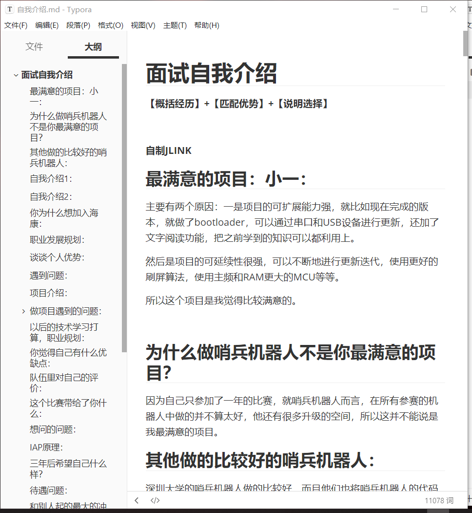
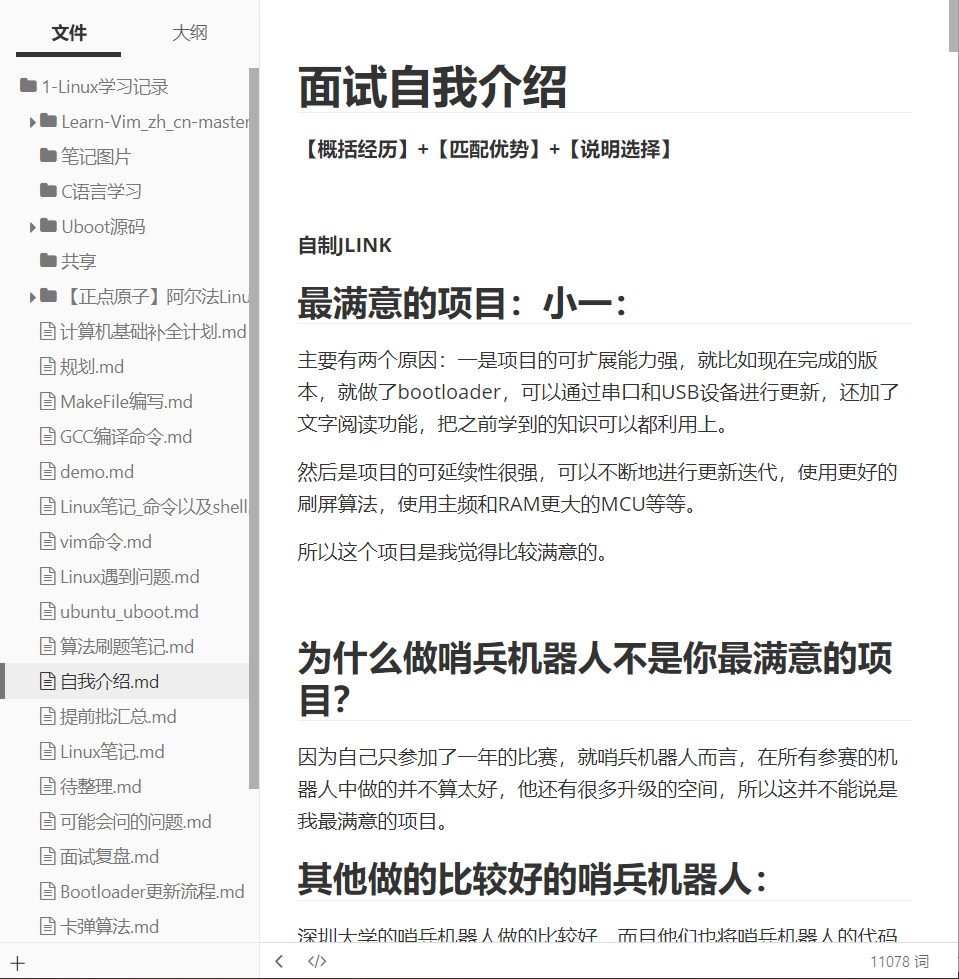
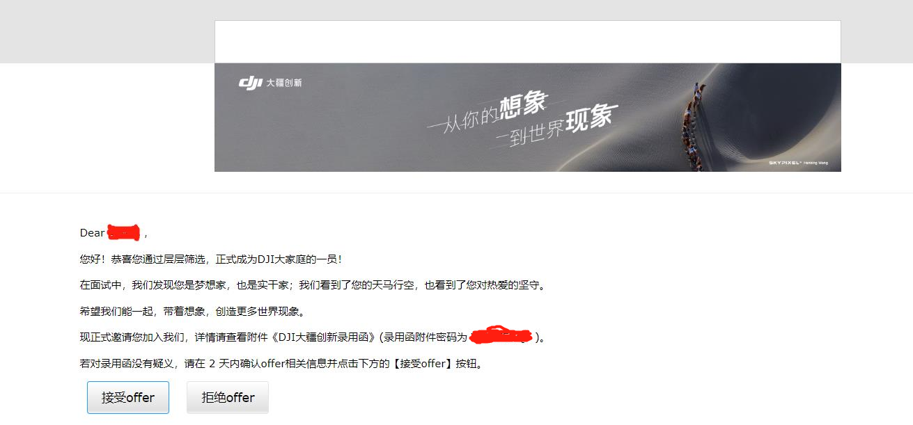

> 昨天收到了大疆的录用意向offer，很开心，从四月投递简历，到终面结束，再到昨天收到意向offer，自己花了很多的时间和精力去修改简历和准备面试，终于还是等到了；

## 关于DJI面试

> 收到意向offer的时候，我正在海康的三楼餐厅吃饭，看到是深圳的电话，我就猜到是大疆的HR打来的；

我很早就听说过大疆，那时候只是知道大疆是一家做无人机的公司，更多的就没有什么了解了；

大二开学，我报名参加了我们学校的RoboMaster战队，在队内总共呆了一年，主要是负责哨兵机器人的嵌入式开发；说来惭愧，我并没有为我们队伍做出过什么大的贡献，自己也没有做什么创新性的东西，充其量我的表现是中规中矩，大多数时候都是在补充自己的知识储备，不过正是通过这个比赛我才更近距离地接触到大疆，也认识了挺多学长学姐，这对我的影响很大；

在备赛过程中，我用过大疆的无刷电机，很强，功能很强，控制尤其方便，还勾起了我对无刷电机控制的兴趣，学了一点FOC，然后用开源的Simple FOC，做了一个简单的无刷电机驱动器，很有意思，在大疆的面试中，面试官问我：“你能不能说一个你用过的大疆的产品的一个缺点？”，我就提到了这件事，并说了一个我认为大疆的无刷电机所存在的缺点。

我只去过一次比赛现场，感受过那种赛场的氛围，很难忘的经历，在面试中，面试官问了我一个问题：

> “你对大疆印象最深的是什么？”
>   “我印象最深的就是是大疆的社会责任感，因为我去过比赛现场，所以我很感激大疆提供的这种难得的机会，对我这样的人来说，这是很难忘也很难得的机会；”

不知道面试官对我的回答是否满意，但这的确是我心里的想法；

我想，今天这个日子，几年或者更久的时间后，再回头来看，可能会说今天是一个十分重要的日子；

4月25日，我投出了我的简历；然后按部就班，面试面试还是面试，一共三轮面试，最后就是等offer；

在准备面试中，花了很多精力，学了好多东西，实时操作系统的知识还有C语言和ARM内核相关的知识，也把自己做过的项目，参加过的比赛都捋了好多遍，生怕面试官问到这方面的内容，自己却答不上来；

这是我第一次投简历和面试，之前听说找工作时永远不要将自己最想去的公司放在第一个，因为第一次总是没有经验，总会紧张。所以如果第一次就要投最想去的公司，那就要认真准备了；

准备面试的那几个星期我记了好多笔记，梳理了知识点，理通了自己做过的所有的项目还考虑了面试官可能问到的各种问题，记了几万字的笔记；

我还记得那个下午，我在自习室坐了一天，把FreeRTOS的相关知识从头到尾梳理了一遍；

**准备的越多，自己就越有底气；**

虽然面试中并没有问到很多自己准备的问题，但是准备的过程还是很大程度上减弱了自己的紧张；

虽然付出并不总是有收获的；

但是想到自己经常熬夜去解决一个又一个Bug，熬夜画一个又一个板子，自己乐在其中，享受做东西的快乐；

## 关于我的愿望

我QQ签名是：

> **立志成为一名嵌入式开发攻城狮！**

**是的，成为一名工程师是我一直以来的愿望；**

前些天我又看了一遍《三傻大闹宝莱坞》，每次看的感觉都不一样；

第一次看这部电影是在我六年级的时候，那个时候觉得做一名工程师好酷，好像什么都能做出来，好像能解决遇到的一切问题，还有着不错的薪资；

现在想来，梦想成为一名工程师的想法就是从那个时候开始的吧；

兰彻，聪明，幽默，还有很多奇葩的想法，这部电影，让我觉得，做一名工程师会是多么有意思的事情呀；

能用自己的知识解决遇到的各种问题，而且乐在其中；

**路一步步走，越走就离自己最初的想法越近；**

## 最后我想说

**我想，我会成为自己想成为的那个工程师，掌握很多技能，面对问题，自己总能想到办法；**

**我相信我会成为这样的人：聪明、乐观、幽默、不言放弃、坚信问题终会被解决；**

## 正式OFFER（2022年10月31号更新）

上周五中午接到电话，谈了薪水，晚上收到了正式OFFER，然后沟通了三方，尘埃落定；

说真的，大疆开的是真的高，福利也不错，我是非常满意了，所以就决定去了。

下面整理一下整个流程，也许可以帮助到后面的人：

事件
日期

投递简历
4月25日

性格测评
4月27日

第一次面试
5月3日

第二次面试
5月13日

第三次面试
5月20日

电话OC
7月22日

收到录用意向书
7月22日

谈薪电话
10月27日

收到正式OFFER
10月27日

沟通三方信息
10月28日
