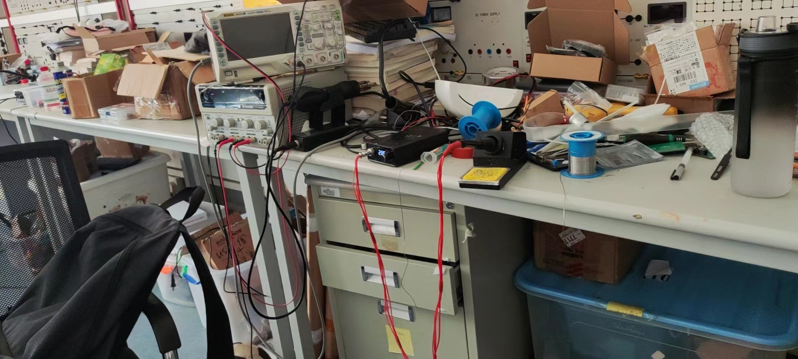
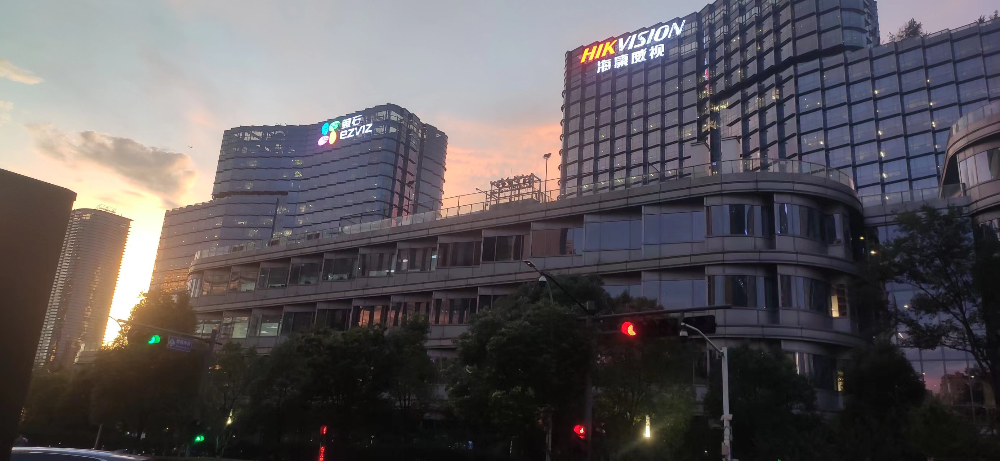
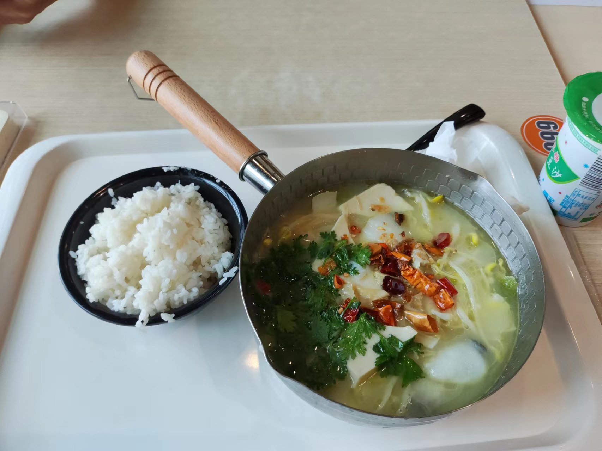

> 对于我来说，2022年是极为重要的一年；

## 关于读研

> 关键词：迷茫

在去年这个时候，我还在考虑读研的事情，我记得自己大三上学期所有科目成绩出来的那一天，我拿计算器算了一遍又一遍，最后得到一个心凉的结果：**即使我大三下学期的核心课程考试都是100分，我也够不到保研的名额**；算出来这个结果之后，说真的是心凉了一截；

虽然自己之前也大概估计着保研比较悬（每次考试都是考前突击，怎么可能稳保研），但是当自己真的算出来保研无望的那一刻，心里还是失落的；失落归失落，自己总还是要做出一个选择：考研或者工作；当然初期我根本没考虑工作的事情，一是对读研确实还有向往，二是我认识的同学或者学长他们绝大多数的选择都是考研；算是迷茫也算是随大流吧，我就打算考研；当然那个时候还比较早，才是一二月份，寒假在家那些天带着失落，自己也没开始复习，在家还是搞一点东西，在咸鱼接一些单子，自己搞一点东西做，在家也算开心；

开学之后回到学校，就真要开始准备复习了，自己开始也没买什么纸质资料，网上找了些英语数学的考研课程就开始复习了，前些天倒也算努力，还制定了一个简单的复习时间表，英语看的刘晓燕老师的视频课程，数学是看的李永乐老师的视频教程和习题册；准备了一两个月吧，那些天上课时候偷偷复习，晚上也经常自己去中楼的自习室复习；复习这么久，有进展没有嘞，说实话，没什么进展，说是考研复习，自己心里没什么劲头，也只是看同学他们都开始复习，自己跟风罢了；

复习时候，感觉很难受，可能也是自从高中之后自己再也没有像这样坐在那一坐一整天地复习，学来学去，进到自己脑袋的东西也不知道有多少；那时候为了复习还拒绝了很多事情，跟老师说我要考研，推掉本来要我做的项目，跟学姐说我要考研，推掉介绍给我的外快，跟父母说我要考研，让他们安心不要经常给我打电话，看起来自己是为考研做足了准备，貌似我就是要认真复习准备考研了；

在刚回到学校不久，班助学长他们组织了一个考研就业动员大会，从这里也能看出考研和工作的人数比例，我记得讲考研经验的有三四个人，而讲工作经验的只有一个人（这位学长应该是拿了TP-LINK SP或者更高档次的Offer），我还用手机的记事本记了很多考研经验，以备我后边用；

那我是什么时候改变想法了呢，我想是那天听的一个讲座，是毕业工作几年的学长们开的讲座，中间也讲到了工作和读研的抉择，最打动我的是一句话：**你应该考虑读研三年和工作三年哪一个对自己的帮助大，你不应该拿着你现在去跟读研三年之后的你比，而应该拿读研三年之后的你和工作三年之后的你比**；听了之后对我触动很大，我说，那就去试试找工作吧；我想，几年后，我再回来看今天，会发现今天将是改变我一生的日子（现在一年后来看，的确是这样）；

> 有一句话，很符合我那天的想法：
> “当你老了，回顾一生，就会发觉：什么时候出国读书、什么时候决定做第一份职业、何时选定了对象而恋爱、什么时候结婚，其实都是命运的巨变。只是当时站在三岔路口，眼见风云千樯，你作出抉择的那一日，在日记上，相当沉闷和平凡，当时还以为是生命中普通的一天。”

然后就放弃了考研，不知道算不算半途而废，因为自己都还没有走到半途；自己的这个打算对自己将来发展是利是弊，现在还未可知也；

至此，我的考研结束。

## 关于工作

> 关键词：期待

工作的念头出现的比较晚，就是在上面提到的那个讲座之后，自己才开始考虑找工作的事情；

最先当然是写简历，简历花了挺多时间写，不过也不是一天搞完的，我采取的方法是一天进步一点点，也就是一天写一部分，从个人信息、项目经历、个人荣誉一直写到专业技能，然后又润色润色，搞了差不多一个多星期才输出一份我自己比较满意的简历；

然后就是找合适的公司投递简历，那个时候还比较早，很多公司的提前批都还没开始，所以就先准备投个实习练练手，说起来也没有投几个，我记得就投了海康威视和OPPO这两个公司的实习，OPPO那个是一直没什么什么进展，前几天去看才发现我连简历筛选都没过，可能是跟JD不太匹配吧；至于海康威视，倒是一步步都正常进行，简历筛选过了，然后HR打电话问了我的一些基本情况，然后是技术面和HR面，当然也都顺利通过了，最后我也在杭州海康威视实习了整两个月的时间，虽然最后因为实习时间不够的缘故未能参加最后的转正答辩，但是我还是很感谢我在海康的那段实习经历，第一次让我接触到了实际的工作内容；

有一个比较神奇的地方，就是我后来拿到的大疆Offer的面试甚至比海康面试还要早一些，当我海康一面的时候，我就已经完成了大疆三面的流程在等最后结果了；

大疆是我很早就接触到的公司，我在大二参加了RoboMaster比赛，而这个比赛就是大疆举办的，所以我与大疆还是有一些小缘分的；大疆提前批很早，我记得是4月25那天就开放投递简历了，大疆的提前批其实更准确的说法应该是“RM专属通道”，是为曾经参加过RM比赛的同学们开通的一个投递通道，我刚好参加过一年这个比赛，所以就顺理成章地投递了简历，后来我才知道我竟然还是投递专属通道的前一百位同学中的一个，还收到了大疆寄给我的一份礼物；

大疆的面试流程走的很快，基本一周一个进度，所以在面试海康的时候我就已经完成了大疆的面试流程，面试大疆的面试经验对后边我面试海康起到了非常大的帮助；具体的时间表可以看一下我之前写的[面经](https://www.fan-pengfei.top/2022/10/31/DJI%E9%9D%A2%E7%BB%8F/#more)；

当我拿到海康实习的Offer后，我就决定去了，毕竟大疆的最后面试结果还没有出来，自己还要为后面的秋招准备，想着是有个实习经验，后面找工作会好一些，所以就去了杭州实习，其实实习时候自己还是比较迷茫的，对于自己到底要找什么样的工作，需要做一些什么样的准备都不太清楚，刷题刷了一些，面试经验也看了不少，但是又怀疑自己的学历到底够不够，硕士那么多，自己一个末流985本科找工作能找到吗，天天也是很焦虑，害怕自己找不到什么好的工作，怀疑自己放弃读研去找工作是不是正确的选择；焦虑归焦虑，日子还是一天天的过，看看书，做一点任务，刷刷题目，天天吃的也不少，可能也是海康餐厅的伙食不错；

转折点就在七月份的一天，我接到了大疆HR小姐姐打来的Offer Call，也收到了邮件发来的录用意向书；

我当时就想：**好哦，我的秋招结束了；**

知道自己拿到大疆Offer的那一刻，自己明显不那么焦虑了，当然学东西也还在学，但是更偏向自己兴趣而不是那些八股文了，因为在我看来，大疆的确是我比较好的工作去向了，不论是我面试的感受还是平常了解到的，大疆确实是我很喜欢的一家公司；

工作找到了，在海康又待了一个月，实习也结束了，又回到了学校；虽然拿到了录用意向书，但是又听说很多公司会有毁意向书的情况存在，又开始焦虑了，然后自己大四上学期又基本没有什么课程任务，就自己开始一天天摆弄自己的小玩意还有等待着最后的正式Offer，然后就在十月底的一天等到了，这样秋招才是正式结束了，悬着的心放下了，自己的秋招之旅也是有了一个满意的结果；

我对工作这件事感觉很陌生，自己上了快20年的学，终于也要到了工作的时候了，有期待也有不安；

但是日子还是一天天的过下去，一眼望到头的生活我不喜欢；

我希望自己成长，能成为自己小时候梦想的工程师那样：无所不能。

## 关于未来

> 关键词：无所不能

我前几天看到了一段话，感觉挺有道理：

> 生活不可能像你想象得那么好，但也不会像你想象得那么糟。我觉得人的脆弱和坚强都超乎自己的想象。有时，我可能脆弱得一句话就泪流满面，有时，也发现自己咬着牙走了很长的路。
> ——莫泊桑《一生》

越往前走越能发现自己的路变得清晰；回想自己刚上大学时候那迷茫的样子，再看自己现在关于未来的想法，路变得越来越清晰了；

沿着这条路走下去，我也能成为自己期望的那种人；

新的一年，我希望我的家人平安幸福；

新的一年，我希望自己能在梦想的路上越走越远；

**我想，我会成为自己想成为的那个工程师，掌握很多技能，面对问题，自己总能想到办法；**

**我相信我会成为这样的人：聪明、乐观、幽默、不言放弃、坚信问题终会被解决；**
