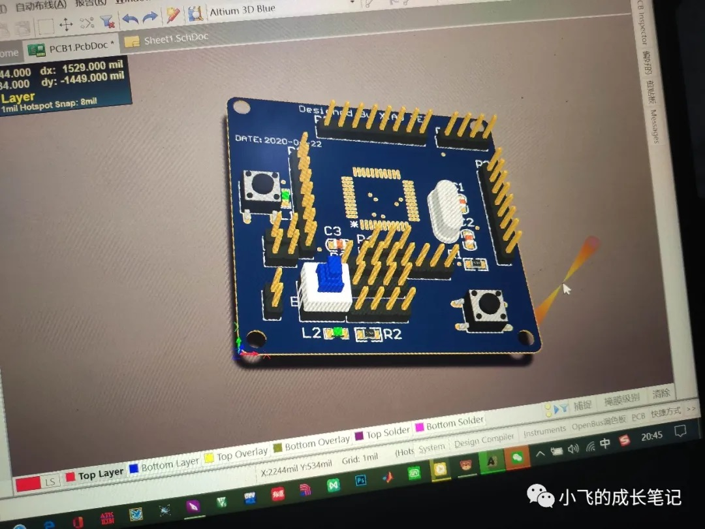
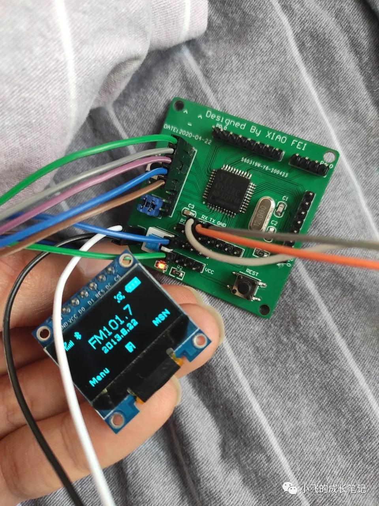
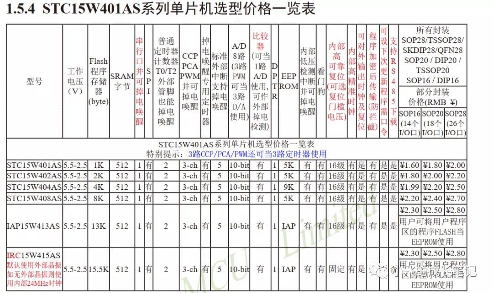
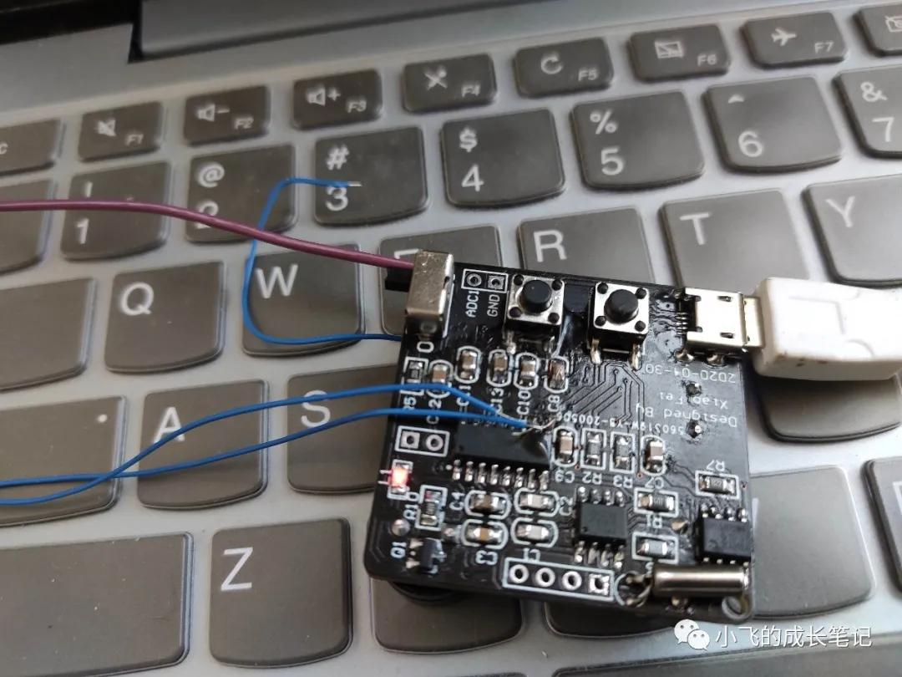
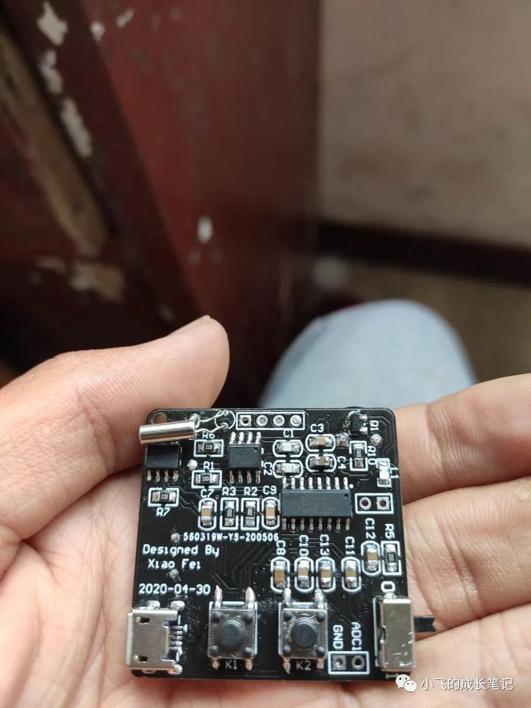
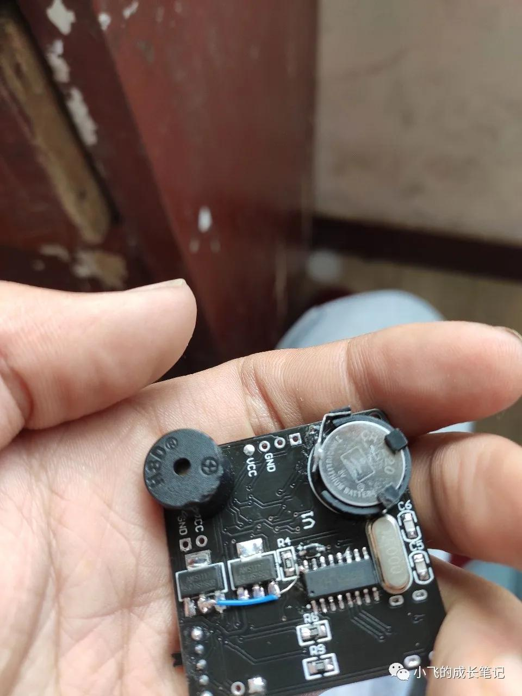
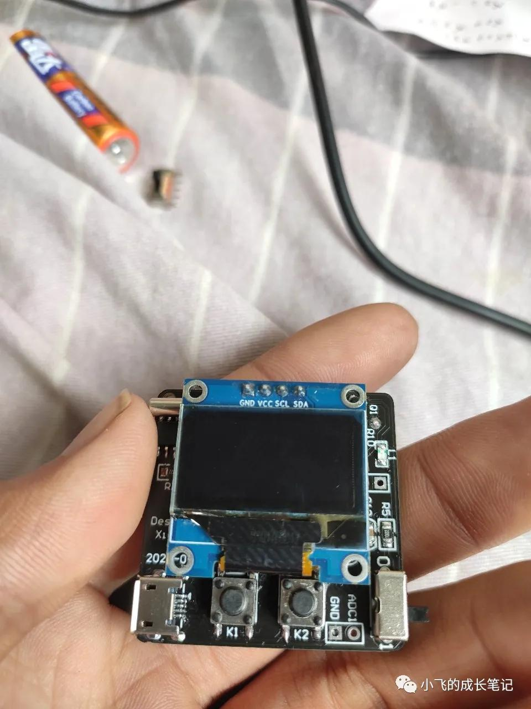
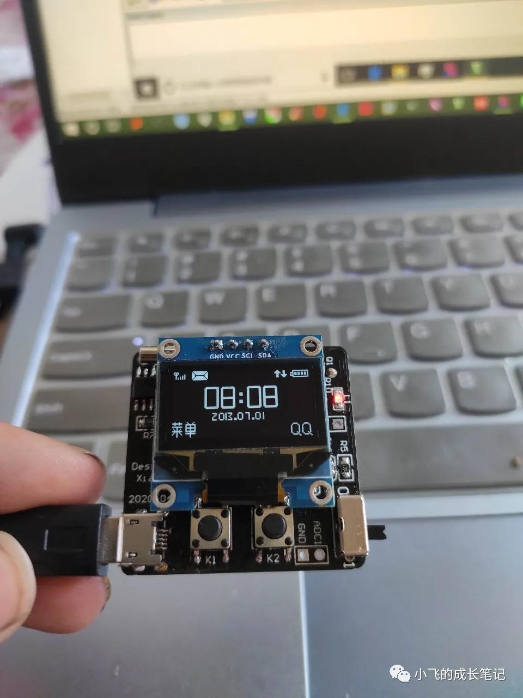

> 自从前几个月学了51单片机和stm32，我就一直想着做一个自己的作品，后来思来想去，就产生了做一个小型钟表的想法。既然是自己的作品，那么从设计电路板，到焊接电子元件，再到程序的编写，再到最后的调试和Debug，都应该是自己独立完成。想法有了，然后就开始动手制作。

因为之前在焊洞洞板的时候，发现精细的电路是很难用洞洞板焊接的，所以就开始在网上找资料学习画PCB电路板，刚开始是找的凡亿教育的视频来看，虽然讲的很好，但是好像不太适合我这种刚入门的小白，在我苦苦盯着视频研究了大半天却一脸懵之后，我最后决定还是自己摸索，不懂的，直接问度娘，不得不说，度娘真的帮了我好多。

然后又花了半天时间发现问题，解决问题，然后就突然什么都明白了，也理解了元件库，封装库，原理图和pcb文件之间的关系，也学会了自己画封装库和元件库，一切好像都是水到渠成。最后就又花了几天的时间绘制并打样了我的第一块电路板（不得不说，嘉立创的五元包邮的板子真的太香了）。





> 这个板子很简单，却为小一的诞生奠定了基础。

画了这个小核心板之后，就开始画小一了，因为需要先确定下所使用的芯片，所以在画板子之前，我开始选择所需要的芯片，最后决定主控芯片选择宏晶公司的stc15w408as，因为这个芯片小体积价格便宜却有着强大的功能，而且外围电路也极其简单。



考虑到我想要实现的功能，又选择了Ds1302时钟芯片，LM75a温度测量芯片，微型蜂鸣器，纽扣电池，以及实现程序下载的CH340G芯片。

画了很久才终于画出了pcb电路图，主要是布线和器件布局太麻烦，一动不动画了好几个下午，最后终于成功了，便把pcb文件发给嘉立创，几天后，元件和电路板几乎同时到了，让我很不开心的是，等我收到板子之后，才发现板子有很多的错误，比如开关选择的型号不对；电路板上丝印很不清晰，甚至都重合在一起，无法辨识；有些线还连接有错误，我很是沮丧，最后我只好用来练习焊接贴片元件，物尽其用。

然后就是修改原理图和pcb文件，然后把pcb文件又一次发个嘉立创，又过了几天，板子才到。我迫不及待的开始焊接，好难啊，即使我已经买了936焊台，但是因为我贴片元件焊接的经验实在是太少了，所以还是焊了好长的时间，最后终于焊好了，我在内心祈祷着，很怕电源一接通，就会短路，板子会烧掉。结果还好，电源指示灯成功点亮，然后就开始尝试下载程序，结果却是失败，最后又找了好久才发现问题所在。原因是我没有考虑到单片机下载程序时需要冷启动，最后又飞了好几根线，才终于下载成功。开心爆了！！！

然后又依次下载了一些测试程序，结果又发现了一些问题，比如走时不太准，纽扣电池掉电太快，又想了好久才解决这些问题。走时不准是因为我的手上有静电，会使走时受到干扰；纽扣电池掉电太快，是因为有一根线连错了，然后又飞了一根线，加了两个电容，然后终于可以了，可以实现所有的功能了。这些事情说着简单，其实真的很难，那些问题都太奇怪了，网上根本找不到资料，都是一点点试出来的，太难了。然后就是漫长的软件开发过程了，这可是比硬件更难的啊。







软件开发又花了好长的时间，写了好久，然后终于可以写好了，现在当然还是有一些bug，不过都是小问题，大概的已经OK了。程序加起来有好几千行，一个模块是一个C文件和H文件，模块化程序，可以让以后移植程序变得很方便。最后大概实现以下功能：

```bash
实时时钟（可以实现掉电不掉时）
温度测量（分辨率0.125℃，测量范围:-55℃～+125℃）
可设置闹钟（也可作为定时器，可设置的时间范 围:1s～24小时，到设定时间有蜂鸣器提醒）
秒表（最小精度1ms，可中途暂停，可清零）
电压表（范围:0～5V,精确度:10位精度AD转换）（改程序ing，因为有bug）
```





基本不可能有其他功能了，因为STC15W408AS只有8kflash,而现在的程序文件已经7.56k了，只能等以后换用更强大的芯片，才能有更多的功能了。演示视频我放在下面了，也算是比较成功吧，我还是超级满意的呀。

因为飞线很不美观，所以我打算升级小一，PCB电路图已经画好了，应该是不会再有前两版的那些错误了，而且加入了新的功能，比如可以用锂电池供电，给锂电池充电等功能。

哈哈，超开心，小一是我真正意义上的第一件作品，希望我以后会有更多的作品，小一会有更多的兄弟姐妹，也会升级小一，给他更强大的大脑，拥有更多的功能。

> 有兴趣的兄弟姐妹，可以跟我交流，我可以帮你们解决一些我力所能及的问题。
