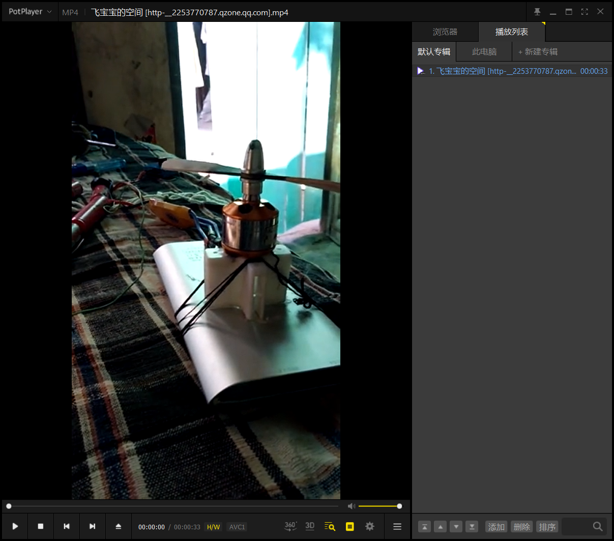
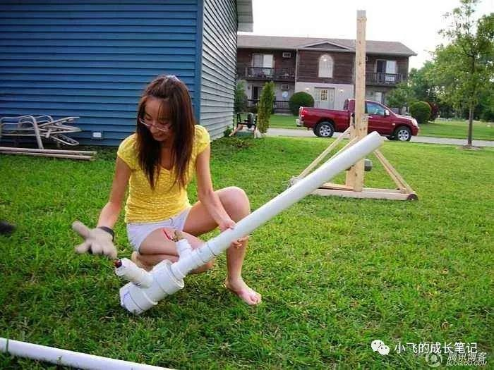
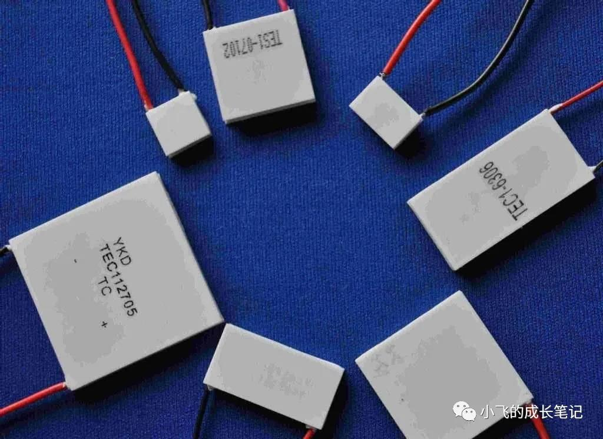

> 上大学后，第一次接触到单片机和电路设计，我便觉得这将是我一生所爱。

从小学到初中，我一直都算是一个爱折腾的小孩子，对什么都特别的有兴趣，拆过很多东西，电器，玩具，不计其数。那时候，什么也不懂，就自己折腾着玩。

记得有一段时间，自己很想有一架自己的遥控飞机，刚开始就觉得有翅膀，有电机，就能飞起来，甚至还用塑料片子和泡沫做了一架原型，最后当然失败了，然后又自己用手机在网上搜索，才明白原来做一个遥控飞机是那么的复杂，要有舵机，起落架，能产生升力的机翼，还要有无刷电机，遥控装置，这些对于当时的我来说都是遥不可及的东西，最后这个做飞机的事情也不了了之了。

到了初三的时候，用仅有的钱在淘宝上买了无刷电机和电调，但是却无论如何无法让电机转起来，一直不知道是什么原因，后来就上网上找资料，最后发现是缺少一个控制的东西，然后就在淘宝买了一个舵机测试仪，最后终于转起来了，（直到不久前，我才明白舵机控制仪的原理，是通过旋钮，来控制输出一定占空比的脉冲，然后当做信号驱动电机或者舵机，用来控制电机转速，或者说舵机转动的角度，前几天我已经用单片机输出脉冲成功驱动我买到的舵机。）当时真的是激动极了，而且那无刷电机的转速超过我玩过的任何一个电机。当时拍的视频，现在还能找到。

后来有一段时间又迷上了土豆炮，是偶然间在网上看见的，然后就开始自己制作，原理很简单，就是在密闭容器内放入可燃气体，然后用电火花将气体点燃即可。燃料燃烧，气体膨胀，就会将填充的土豆发射出去，威力挺大。第一次做就做成功了，土豆炮弹的威力让我很是满意。后来改进了好多的版本，有迷你版本的，是用打火机做的，特别小巧，用花露水做为燃料，可以发射牙签或者火柴，也能飞个好几米。也有比较大的，可以发射干电池，用杀虫剂喷雾作为燃料，威力很大，近距离甚至可以打碎数厘米的瓦片，就是发射速度比较慢，因为燃料和炮弹都是手工装填，直到现在这个问题我也没有找到解决办法。

这些东西都很有意思，我在不懂任何电路知识的时候，甚至自己做过一个三极管自激电路，可以用来产生震荡，然后驱动变压器，或者一个超短距离的无线输电，当时根本不懂为什么，只是按照网上的接线方法，找一些相似的元件，然后连接起来就可以了，成功当然会让我很开心，失败也不会让我很沮丧，只是觉得好玩罢了。可能实践有助于知识的掌握理解，前些天我学习三极管的知识的时候，很快就能理解三极管的原理和应用。

在初中的时候，因为是留级生，学习压力很小很小，然后就开始做了很多的小手枪，有用橡皮筋作为动力的，有用弹簧作为动力的，甚至还有一个用磁铁作为动力的。当时我的想法真的是天马行空，好多好多奇奇怪怪的想法。因为有时候会拆很多东西，不懂的就查资料，也学得了很多奇奇怪怪的知识，比如饮水机里的制冷片，对的，饮水机制冷的原理跟冰箱完全不同，饮水机用的是半导体制冷片，只要通电，就能一面发热，一面制冷，特别神奇。而且可以根据温差发电，这些我都验证过，真的是太神奇了。还有什么焦耳小偷，ZVS电路，斯特林发动机等等，可能我后来对电子一类的感兴趣就跟这有很大的关系吧，因为这些东西真的有趣。

因为爱折腾，也做过好多傻事，比如我知道502的味道，有点甜，知道花露水的味道，很上头；在有一次做水火箭的时候，压力过大，然后瓶盖被崩出来，正对着我的脑门来了一下，肿了好几天。胳膊被烧过好几次，汗毛烧了又长，长了又烧，可能也习惯了，头发也被烧过两次，还好最后都长回来了。

上了大学，学了自动化这个专业，好像跟我的兴趣挺符合的，又入了单片机这个坑，感觉很棒，兴趣能成为工作当然是很棒的一件事。

> 这是我的第一篇文章，以后，我会写一些我学习的过程，以及学习中的一些问题和思考，会一直写的，因为一直在学习。
