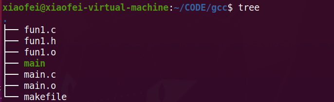

> 一个简单的Makefile，可以直接Copy使用；

### 一、用字符常量简化

> Makefile文件：

```bash
#定义常量
objects =main.o fun1.o #中间文件
cc=gcc    #编译器
prom=main #输出文件

prom: $(objects)
		$(cc) $(objects) -o $(prom)
main.o: main.c fun1.h
		$(cc) -c main.c -o main.o
		@echo 正在编译main文件 #前面加@避免重复输出信息
fun1.o: fun1.c fun1.h
		$(cc) -c fun1.c -o fun1.o
		@echo 正在编译其他文件
.PHONY: clean
clean:
		-rm $(prom) $(objects)
```

文件夹结构：



### 二、更简化的写法

> Makefile文件：

```bash
obj=main.o fun1.o
cc=gcc
prom=main
deps=fun1.h
$(prom):$(obj)
	$(cc) -o $(prom) $(obj)
%.o:%.c $(deps)
	$(cc) -c $< -o $@
```

> 在这里，我们用到了几个特殊的宏。首先是 `%.o:%.c`，这是一个模式规则，表示所有的 .o 目标都依赖于与它同名的 .c 文件（当然还有 deps 中列出的头文件）。再来就是命令部分的 `$<` 和 `$@`，其中 `$<` 代表的是依赖关系表中的第一项（如果我们想引用的是整个关系表，那么就应该使用 `$^`），具体到我们这里就是 %.c。
>   而 `$@` 代表的是当前语句的目标，即 %.o。这样一来，make 命令就会自动将所有的 .c 源文件编译成同名的 .o 文件。不用我们一项一项去指定了。整个代码自然简洁了许多。

**文件夹结构同上；**

### 三、自动添加源文件

> Makefile文件：

```bash
cc=gcc
prom=main
deps=$(shell find ./ -name "*.h")
src=$(shell find ./ -name "*.c")
obj=$(src:%.c=%.o)
$(prom):$(obj)
	$(cc) -o $(prom) $(obj)
$.o:%.c $(deps)
	$(cc) -c $ 其中，shell函数主要用于执行shell命令，具体到这里就是找出当前目录下所有的.c和.h文件。而`$(src:%.c=%.o)`则是一个字符替换函数，它会将src所有的.c字串替换成.o，实际上就等于列出了所有.c文件要编译的结果。有了这两个设定，无论我们今后在该工程加入多少.c和.h文件，Makefile都能自动将其纳入到工程中来。

**文件夹结构同上；**

### 四、多文件夹下的Makefile

> Makefile文件：

```makefile
#指定编译器
CC = gcc

#指定输出目标
TARGET= main.exe

#指定源文件路径
DIR_INC= ./Inc
DIR_SRC= ./Src
DIR_BIN= ./Bin
DIR_BULID= ./Build

SRC=$(wildcard $(DIR_SRC)/*.c)
OBJS=$(patsubst %.c,$(DIR_BULID)/%.o,$(notdir $(SRC)))

#给定编译标志位
FLAGS_C:= -Og
FLAGS_C+= -Wall #生成所有警告信息
#FLAGS_LD

#最终目标
$(DIR_BIN)/$(TARGET): $(OBJS)
 @# $@ 指代当前目标
 @# $ tree /f
D:.
│ Makefile
├─Bin
│      main.exe
├─Build
│      func.o
│      main.o
├─Inc
│      func.h
└─Src
       func.c
       main.c
```
