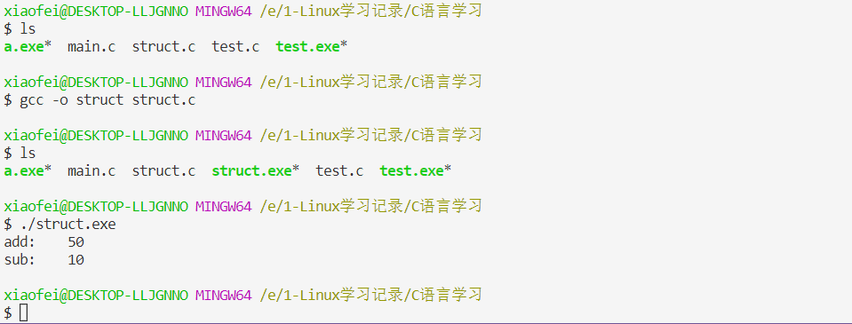

> 前些天看了一个RobMaster哨兵机器人的开源代码，里边用了C语言结构体定义函数指针，看得有点迷糊，所以自己查了一些相关的资料；

C语言结构体是由一系列具有相同类型或不同类型的数据构成的数据集合。所以，标准C中的结构体是不允许包含成员函数的，当然C++中的结构体对此进行了扩展。那么，我们在C语言的结构体中，只能通过定义函数指针的方式，用函数指针指向相应函数，以此达到调用函数的目的。

## 结构体定义：

```c
struct data_demo
{
  int result;
  int (*add)(int, int);
  int (*sub)(int, int);
};
```

## 完整例子：

```c
#include
struct data_demo
{
    int result;
    int (*add)(int, int);
    int (*sub)(int, int);
};
int add_demo(int i, int j)
{
    return i+j;
}
int sub_demo(int i, int j)
{
    return i-j;
}
int main(void)
{
    struct data_demo data =  {0, add_demo, sub_demo};
    // 也可以如下初始化结构体 完全等价
    /*
    struct data_demo data =
    {
        .result = 0,
        .add = add_demo,
        .sub = sub_demo
    };
    */
    data.result = data.add(20, 30);
    printf("add:\t%d\n", data.result);
    data.result = data.sub(30, 20);
    printf("sub:\t%d\n", data.result);
    return 0;
}
```

## 运行结果：



> **可以看到，使用`struct data_demo data =  {0, add_demo, sub_demo}`初始化结构体后，使用`data.add(int,int)`就可以调用`add_demo(int,int)`这个函数；优点是代码结构会比较清晰，之前写过Linux下的LCD驱动，感觉那个地方就这样用了。**
